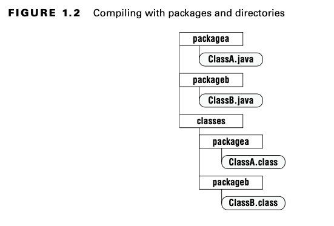

Java 17 sertifikası elde etme yolculuğunuzun başlangıcına hoş geldiniz. Bunun, okuduğunuz ilk Java programlama kitabı
olmadığını varsayıyoruz. Temel konulara değiniyor olsak da, bunu yalnızca sınav için gerekli olan tüm terminoloji ve
detaya sahip olduğunuzdan emin olmak için yapıyoruz. Daha önce hiç Java programı yazmadıysanız, Java 8 veya daha yüksek
bir sürüm hakkında bir giriş kitabı edinmenizi öneririz. Örnekler arasında Head First Java, 3. Baskı ve Beginning
Programming with Java for Dummies (For Dummies, 2021) bulunmaktadır. Sonrasında bu sertifika çalışma
kılavuzuna geri dönebilirsiniz.

Eski bir deyişte söylendiği gibi, koşmayı öğrenmeden önce yürümeyi öğrenmelisiniz. Aynı şekilde, karmaşık programlar
oluşturabilmeden önce Java'nın temellerini öğrenmelisiniz. Bu bölümde, Java paketlerinin, sınıflarının, değişkenlerinin
ve veri türlerinin temel bilgilerini ve sınav için bilmeniz gereken yönlerini sunuyoruz. Örneğin, Java'yı her gün
kullanıyor olabilirsiniz ancak 3dMap veya this adında bir değişken oluşturamayacağınızı bilmeyebilirsiniz. Sınav, bu
kuralların ardındaki prensipleri bilmenizi ve anlamanızı bekler. Bu bölümün çoğu bir tekrar niteliğinde olsa da,
pratikte sıkça karşınıza çıkmadığı için Java dilinde size yeni gelebilecek bazı unsurlar da olabilir.

# Environment'lar hakkında bilgi edinme

Java ortamı, bir dizi teknolojiyi anlamayı içerir. Aşağıdaki bölümlerde, bilmeniz gereken anahtar terimleri ve
kısaltmaları gözden geçireceğiz ve ardından sınava hazırlanmak için ihtiyaç duyduğunuz yazılımları ele alacağız.

## Javanın Major Component'leri

Java Development Kit (JDK), Java development yapmak için ihtiyacınız olan minimum yazılımı içerir. Anahtar komutlar
şunları içerir:

* javac : .java uzantılı source file'i .class byte code'una dönüştürür

* java : Programı çalıştırır

* jar : Dosyaları birlikte package haline getirir

* javadoc : Dökümantasyon oluşturur

javac programı, java komutunun çalıştırabileceği bytecode adı verilen özel bir formatta instructions (talimatlar)
üretir. Ardından java, kodu çalıştırmadan önce Java Sanal Makinesi'ni (JVM) başlatır. JVM, bytecode'unu bulunduğu gerçek
makinede nasıl çalıştıracağını bilir. JVM'i, belirli işletim sisteminiz ve donanımınız üzerinde .class dosyanızı nasıl
çalıştıracağını bilen sihirli bir kutu olarak düşünebilirsiniz.

JDK'nın ihtiyaç duyduğunuz minimum yazılımı içerdiğini söyledik. Birçok geliştirici, kod yazmayı ve çalıştırmayı
kolaylaştırmak için entegre bir geliştirme ortamı (IDE) kullanır. Sınava çalışırken bir IDE kullanmanızı önermesek de,
bu tür araçların varlığını bilmek faydalıdır. Yaygın Java IDE'leri arasında Eclipse, IntelliJ IDEA ve Visual Studio Code
bulunmaktadır.

## JRE nereye gitti?

Java 8 ve daha önceki sürümlerde, tam JDK yerine bir Java Runtime Environment (JRE) indirilebiliyordu. JRE, bir programı
çalıştırmak için kullanılan, ancak derleme yapamayan JDK'nın bir alt kümesiydi. Artık, bir Java programı çalıştırırken
tam JDK kullanılabiliyor. Alternatif olarak, geliştiriciler, JRE'de bulunması gereken gerekli bileşenleri içeren bir
executable dosya sağlayabilirler.

Bir program yazarken, geliştiricilerin ihtiyaç duyduğu ortak işlevsellik ve algoritmalar vardır. Neyse ki, bunların her
birini kendimiz yazmak zorunda değiliz. Java, kullanabileceğiniz geniş bir application programming interface (API)
paketine sahiptir. Örneğin, büyük bir String oluşturmak için StringBuilder sınıfı ve bir listeyi sıralamak için
Collections sınıfında bir method vardır. Bir program yazarken, görevinizin hangi kısımlarının mevcut API'lerle
gerçekleştirilebileceğini belirlemektir.

## JDK'yı İndirme

Oracle her altı ayda bir yeni bir Java sürümü yayınlar. Java 17, Eylül 2021'de piyasaya çıktı. Bu, sınava çalışmak için
JDK'yı indirdiğinizde Java 17'nin en son sürüm olmayacağı anlamına gelir. Ancak, bu bir Java 17 sınavı olduğu için Java
17 ile çalışmalısınız. Java'nın sonraki sürümleri ile kurallar ve davranışlar değişebilir. Farklı bir Java sürümüyle
çalıştığınız için bir soruyu yanlış yapmak istemezsiniz!

Oracle'ın JDK'sını, sınava kayıt olurken kullandığınız hesap ile Oracle'ın web sitesinden indirebilirsiniz. Oracle'ın
JDK'sının yanı sıra en popüler JDK'lardan biri OpenJDK'dır.

Java'nın birçok sürümünde varsayılan olarak kapalı olan ancak etkinleştirilebilen preview özellikleri bulunur. Preview
özellikleri sınavda yer almamaktadır. Bir özelliğin dile ne zaman eklendiğine dair karışıklığı önlemek için, preview'den
çıktığında "resmi olarak tanıtıldı" ifadesini kullanacağız.

| Java Version'unun kontrol edilmesi; |
|-------------------------------------|

Devam etmeden önce, doğru Java sürümünün path'inizde olduğundan emin olmanızı rica ediyoruz.

```
javac -version
java -version
```

Bu komutların her ikisi de sürüm numarası 17'yi içermelidir.

| Mac icin version degistirme |
|-----------------------------|

```
/usr/libexec/java_home -V
```

komutu çalıştırılır ve cihaz üzerinde ki tüm java jdk'ları görüntülenir

Default olacak java version'unu seçmek için;

```
export JAVA_HOME=`/usr/libexec/java_home -v 17.0.3`
```

Major bir version secmek için;

```
export JAVA_HOME=`/usr/libexec/java_home -v 17`
```

default olarak kullanılacak java version

```vim ~/.zshrc``` komutundan sonra dosyanın en altına ```export JAVA_HOME=`/usr/libexec/java_home -v 17``` eklenmelidir

# Class yapısını anlamak

Java programlarında, class'lar temel yapı taşlarıdır. Bir class tanımlarken, bu yapı taşının tüm parçalarını ve
özelliklerini açıklarsınız. İlerleyen bölümlerde interface'ler, records ve enums gibi diğer yapı taşlarını göreceksiniz.

Çoğu class'ı kullanmak için Object'ler oluşturmanız gerekir. Bir Object, bellekte bir class'ın runtime'da ki
instance'ıdır.

Bir Object genellikle bir class'ın tek bir representation'ınını represent (temsil) ettiğinden, bir örnek (instance)
olarak adlandırılır. Farklı class'ların çeşitli Object'leri, programınızın state'ini temsil eder. Bir referans, bir
Object'e işaret eden bir variable'dır.

Aşağıdaki bölümlerde, alanları (fields), yöntemleri (methods) ve yorumları (comments) inceleyeceğiz. Ayrıca, class'lar
ile dosyalar arasındaki ilişkiyi de keşfedeceğiz.

## Fields ve Methods

Java sınıflarının iki ana öğesi vardır: diğer dillerde genellikle işlevler (functions) veya prosedürler (procedures)
olarak adlandırılan yöntemler (methods) ve daha genel olarak değişkenler (variables) olarak bilinen alanlar (fields). Bu
ikisi bir arada, sınıfın üyeleri (members) olarak adlandırılır. Variable'lar, programın state'ini tutar ve methodlar bu
state üzerinde işlem yapar. Değişiklik önemliyse, bir variable bu değişikliği saklar. Sınıfların gerçekten yaptığı
budur. Programcının görevi, bu öğeleri bir araya getirip düzenleyerek ortaya çıkan kodun faydalı ve ideal olarak diğer
programcılar için anlaşılır olmasını sağlamaktır.

Yazabileceğiniz en basit Java sınıfı şuna benzer:

```
1 : public class Animal {
2 : }
```

Java, özel bir anlamı olan kelimeye anahtar kelime (keyword) der. Yukarıda ki kod kesitinde ```public class```kalın yazı
ile işaretlenmiştir. Kitap boyunca, kod kesitlerinin bazı kısımlarını vurgulamak için genellikle kalın yazı kullanırız.
1: satırda, diğer sınıfların bu sınıfı kullanmasına olanak tanıyan public anahtar kelimesi yer alır. class anahtar
kelimesi, bir class tanımladığınızı belirtir. Animal, sınıfın adını verir. Elbette, bu ilginç bir sınıf değil, bu yüzden
ilk alanımızı (field) ekleyelim.

```
1: public class Animal {
2:    String name;
3: }
```

2: satırda name adında bir variable tanımlıyoruz. Ayrıca, bu variable'ın türünü String olarak belirtiyoruz. String,
içine metin koyabileceğimiz bir değerdir, örneğin "this is a string". String ayrıca Java ile birlikte sağlanan bir
class'tır. Sonraki adımda methodlar ekleyebiliriz.

```
1: public class Animal {
2:      String name;
3:      public String getName() {
4:          return name;
5:      }
6:      public void setName(String newName) {
7:          name = newName;
8:      }
9: }
```

3 ve 5. satırlar arasında bir method tanımlıyoruz. Bir method, çağrılabilen bir operation'dır. Yine, public anahtar
kelimesi, bu methodun diğer sınıflardan çağrılabileceğini belirtmek için kullanılır. Ardından return türü gelir; bu
durumda, method bir String return etmektedir. 6 ve 8. satırlarda başka bir method var. Bu methodun void adında özel bir
return türü vardır. Void anahtar kelimesi, hiçbir değer döndürülmeyeceği anlamına gelir. Bu method, çağrıldığı methoddan
bilgi sağlanmasını gerektirir; bu bilgiye parametre denir. setName() methodu, newName adında bir parametreye sahiptir ve
bu parametre String türündedir. Bu, çağıranın bir String parametresi geçirmesi ve hiçbir şeyin döndürülmesini
beklememesi gerektiği anlamına gelir.

Method adı ve parametre türleri method signature olarak adlandırılır. Bu örnekte, method adını ve parametreleri
tanımlayabilir misiniz?

```
public int numberVisitors(int month) {
    return 10;
}
```

Methodun adı numberVisitors. month adında bir parametre var ve bu parametre int türündedir, yani bir sayısal türdür. Bu
nedenle, methodun imzası ```numberVisitors(int)``` şeklindedir.

## Comments (Yorumlar)

Kodun bir diğer yaygın parçası da comment olarak adlandırılır. Yorumlar çalıştırılabilir kod olmadığından birçok yere
yerleştirilebilir. Yorumlar, kodunuzu okumayı kolaylaştırabilir. Sınav yaratıcıları kodu daha zor okunur hale getirmeye
çalışsalar da, satır numaralarına dikkat çekmek için hâlâ yorumları kullanırlar. Kendi kodunuzda da yorumları
kullanmanızı umuyoruz. Java’da üç tür yorum vardır. İlki, single line comment olarak adlandırılır:

```// comment until end of line```

Single Line Comment, iki eğik çizgi ile başlar. Compiler, aynı satırda bu işaretten sonra yazdığınız her şeyi yok
sayar. Sonrasında multiple-line comment gelir:

```
/* Multiple
* line comment
*/
```

Multiple-line bir comment (aynı zamanda multiline comment olarak da bilinir), /* sembolünden başlayıp */ sembolüne kadar
her şeyi içerir. İnsanlar genellikle her satırın başına bir yıldız (*) koyarak multiple-line comment'leri daha okunaklı
hale getirir, ancak bu zorunlu değildir. Son olarak, Javadoc comment vardır:

```
/**
* Javadoc multiple-line comment
* @author Jeanne and Scott
*/
```

Bu comment, multiple-line comment'e benzer, ancak /** ile başlar. Bu özel sözdizimi, Javadoc aracına comment'i dikkate
alması gerektiğini söyler. Javadoc comment'leri, Javadoc aracının nasıl okuyacağını bildiği belirli bir yapıya sahiptir.
Muhtemelen sınavda bir Javadoc comment'i görmeyeceksiniz. Sadece başkalarının kullanması için programlar yazmaya
başladığınızda bunun var olduğunu hatırlayın.

## Classes and Source Files (Sınıflar ve kaynak dosyaları)

Çoğu zaman, her Java sınıfı kendi .java dosyasında tanımlanır. Bu bölümdeki tek top-level tür bir sınıftır. Top-Level
tür, bir source file'da bağımsız olarak tanımlanabilen bir data structure'dır (veri yapısıdır). Kitabın büyük bölümünde
top-level tür olarak sınıflarla çalışıyoruz, ancak 7. Bölüm, "Beyond Classes" de diğer top-level türleri ve nested
türleri tanıtıyoruz. Top-level bir sınıf genellikle public olur, yani herhangi bir kod onu çağırabilir. İlginç bir
şekilde, Java bu türün public olmasını zorunlu kılmaz. Örneğin, bu sınıf gayet uygundur:

```
1: class Animal {
2:    String name;
3: }
```

Aynı dosyaya iki tür bile koyabilirsiniz. Bunu yaptığınızda, dosyadaki en fazla bir top-level türün public olmasına izin
verilir. Bu, aşağıdakileri içeren bir dosyanın da uygun olduğu anlamına gelir:

```
1: public class Animal {
2:    private String name;
3: }
4: class Animal2 {}
```

Bir public türünüz varsa, dosya adıyla eşleşmesi gerekir. public class Animal2 bildirimi, Animal.java adlı bir dosyada
derlenmez. 5. Bölüm, “Methotlar”da, public dışında hangi erişim seçeneklerinin mevcut olduğunu tartışıyoruz.

## Writing a main() Method (main() Methodunun Yazılması)

Bir Java programı, main() methodu ile çalışmaya başlar. Bu bölümde, bir main() methodu oluşturmayı, bir parametre
geçirmeyi ve bir programı çalıştırmayı öğreneceksiniz. main() methodu, programın entry point'i (giriş noktası) olarak
adlandırılır, çünkü JVM yeni bir program çalıştırmaya başladığında baktığı başlangıç noktasıdır.

## Creating a main method (main methodun yaratılması)

main() methodu, JVM'nin kodumuzu çağırmasına olanak tanır. main() methoduna sahip en basit class şöyle görünür:

```
1: public class Zoo {
2:    public static void main(String[] args) {
3:        System.out.println("Hello World");
4:    }
5: }
```

Bu kod "Hello World" yazdırır. Bu kodu derlemek ve çalıştırmak için, Zoo.java adında bir dosyaya yazın ve aşağıdaki
komutları çalıştırın.

```
javac Zoo.java
java Zoo
```

Eğer "Hello World" yazdırıyorsa, başarılı oldunuz demektir. Eğer hata mesajları alıyorsanız, Java 17 JDK'nın yüklü
olduğunu, PATH'e eklendiğini ve örnekte herhangi bir yazım hatası yapmadığınızı kontrol edin.

Java kodunu javac komutuyla derlemek için dosyanın uzantısı .java olmalıdır. Dosyanın adı, public sınıfın adıyla
eşleşmelidir. Sonuç olarak, aynı isimde ancak .class dosya uzantısına sahip bir bytecode dosyası oluşur. Unutmayın ki
bytecode, JVM'nin çalıştırmayı bildiği talimatlardan oluşur. Zoo.class'ını çalıştırırken .class uzantısını atlamamız
gerektiğine dikkat edin.

Bir Java dosyasının ne içerdiği ve hangi sırayla içerdiği ile ilgili kurallar, şu ana kadar açıkladığımızdan daha
detaylıdır (bu konu hakkında daha fazla bilgi, bölümün ilerleyen kısımlarında verilecektir). Şimdilik işleri basit
tutmak için, bu kuralların bir subset'ini (alt kümesini) izliyoruz:

* Her dosya yalnızca bir public sınıf içerebilir.

* Dosya adı, büyük/küçük harf dahil olmak üzere class adıyla eşleşmeli ve .java uzantısına sahip olmalıdır.

* Java class'ı program için bir giriş noktasıysa, geçerli bir main() methodu içermelidir.

Öncelikle, main() methodunun imzasındaki kelimeleri birer birer gözden geçirelim. public anahtar kelimesi, bir access
modifier (erişim belirleyici) olarak adlandırılır. Bu methodun programdaki potansiyel çağrılara karşı açıklık seviyesini
bildirir. Doğal olarak, public, programın her yerinden tam erişim anlamına gelir. Access modifiers'lar hakkında daha
fazla bilgi edinmek için Bölüm 5'e göz atabilirsiniz.

Static anahtar kelimesi, bir methodu sınıfına bind eder (bağlar), böylece yalnızca sınıf adı ile çağrılabilir; örneğin,
Zoo.main() gibi. Java, main() methodunu çağırmak için bir Object oluşturmak zorunda değildir — bu, Object oluşturmaya
henüz başlamadığınız için iyi bir durumdur! Aslında, JVM bunu, daha doğrusu, kendisine verilen sınıf adını yüklerken
yapar.

Eğer bir main() methodu gerekli anahtar kelimelere sahip değilse, onu çalıştırmaya çalıştığınızda bir hata alırsınız.
Static anahtar kelimesini tekrar Bölüm 6, “Sınıf Tasarımı”nda göreceksiniz.

Void anahtar kelimesi, dönüş türünü temsil eder. Data döndürmeyen bir method, çağırana sessizce kontrolü geri verir.
Genel olarak, bir Object'in state'ini değiştiren methodlar için void kullanmak iyi bir uygulamadır. Bu anlamda, main()
methodu programın state'ini başlatıldıktan sona değiştirmiş olur. Dönüş türlerini de Bölüm 5'te inceleyeceğiz.

Son olarak, main() methodunun parametre listesinin, java.lang.String Object'lerinden oluşan bir array olarak temsil
edildiğine geliyoruz. Bu üç formatın herhangi biri ile birlikte geçerli bir değişken adı kullanabilirsiniz:

```
String[] args
String options[]
String... friends
```

Compiler bunların herhangi birini kabul eder. args değişken adı yaygındır çünkü bu listenin JVM başlatıldığında
okunan (argüman) değerleri içerdiğini gösterir. Karakterler [] köşeli parantezlerdir ve bir array'i temsil eder. Array,
aynı türden sabit boyutlu bir öğe listesidir. String... değişken argüman listeleri (varargs) olarak adlandırılır. Bu
bölümde String hakkında bilgi edineceksiniz. Array Bölüm 4, "Core API'ler" ve "varargs" ise Bölüm 5'te ele alınmaktadır.

| Optional Modifiers in main() methods (Main method içerisinde ki optional modifier'lar |
|---------------------------------------------------------------------------------------|

public ve static gibi çoğu modifiers main() methodları için gerekli olsa da, bazı optional modifiers'lara izin
verilir.

```public final static void main(final String[] args) {}```

Bu örnekte, her iki final modifier'i da optional'dır ve main() methodu bunlar olmadan da geçerli bir giriş
noktasıdır. Final methodların ve parametrelerin anlamını Bölüm 6'da ele alacağız.

## Passing Parameters to a Java Program (Java Programına Parametreler Geçirme)

Şimdi programımızın main() methoduna nasıl data göndereceğini görelim. İlk olarak, Zoo programını geçirilen ilk iki
argümanı yazdıracak şekilde değiştiriyoruz:

```
public static void main(String[] args) {
    System.out.println(args[0]); // argument 1
    System.out.println(args[1]); // argument 2
}
```

```args[0]``` kodu array'in ilk elemanına erişir. Bu doğru: Java'da array indeksleri 0 ile başlar. Çalıştırmak için şunu
yazın:

```
javac Zoo.java
java Zoo Bronx Zoo
```

Çıktı beklediğiniz gibidir:

```
Bronx
Zoo
```

Program, ilk iki "kelimeyi" argümanlar olarak doğru bir şekilde tanımlar. Argümanları ayırmak için boşluklar kullanılır.
Eğer bir argümanın içinde boşluklar istiyorsanız, bu örnekte olduğu gibi tırnak işareti ("") kullanmalısınız:

```
javac Zoo.java
java Zoo "San Diego" Zoo
```

Şimdi ouput'da bir boşluk var:

```
San Diego
Zoo
```

Son olarak, yeterince argüman iletmezseniz ne olur?

```
javac Zoo.java
java Zoo Zoo
```

```args[0]``` okunması sorunsuz geçer ve Zoo yazdırılır. Ardından Java panik yapar. İkinci bir argüman yok! Ne yapmalı?
Java, pozisyon 1'deki bu argümanla ne yapacağını bilmediğine dair bir exception yazdırır. (Exception'ları 11.
Bölüm'de, "Exception'lar ve Localization" da öğreneceksiniz.)

```
Zoo
Exception in thread "main" java.lang.ArrayIndexOutOfBoundsException:
Index 1 out of bounds for length 1
at Zoo.main(Zoo.java:4)
```

Gözden geçirmek gerekirse, JDK bir compiler içerir. Java sınıf dosyaları JVM üzerinde çalışır ve bu nedenle yalnızca
derlendikleri makine veya işletim sistemi ile sınırlı kalmadan, Java yüklü herhangi bir makinede çalıştırılabilir.

| Single-File Souce Code (Tek dosyalı kaynak kodu) |
|--------------------------------------------------|

Bir kod örneğini her denemek istediğinizde hem javac hem de java yazmaktan yorulduysanız, bir kısayol var. Bunun yerine;

```java Zoo.java Bronx Zoo```

## Understanding Package Declarations and Imports (Paket Bildirimlerini ve İçe Aktarımları Anlama)

Java, binlerce built-in sınıf ile birlikte gelir ve sizin gibi geliştiricilerden daha pek çok sınıf bulunmaktadır. Tüm
bu sınıflarla birlikte Java'nın onları organize etmenin bir yoluna ihtiyacı vardır. Bunu, bir dosya dolabına benzer bir
şekilde yönetir. Tüm belgelerinizi klasörlere koyarsınız. Java, sınıfları paketler içinde toplar. Bunlar, sınıflar için
mantıksal gruplamalardır.

Sizi bir dosya dolabının önüne koyup belirli bir belgeyi bulmanızı istemezdik. Bunun yerine, hangi klasöre bakmanız
gerektiğini söylerdik. Java da aynı şekilde çalışır. Kod bulmak için hangi paketlere bakması gerektiğini ona söylemeniz
gerekir.

Diyelim ki bu kodu derlemeye çalışıyorsunuz:

```
public class NumberPicker {
    public static void main(String[] args) {
        Random r = new Random(); // DOES NOT COMPILE
        System.out.println(r.nextInt(10));
    }
}
```

Java compiler'i size şöyle bir hata verir:

```
error: cannot find symbol
```

Bu hata, sınıf adında bir yazım hatası yaptığınız anlamına gelebilir. Kontrol ettiniz ve öyle olmadığını keşfettiniz. Bu
hatanın diğer bir nedeni ise gereken bir import statement'ini atlamaktır. Bir statement, bir talimattır ve import
statement'ları Java’ya hangi paketlerde sınıfları araması gerektiğini söyler. Random için Java’ya nerede bakacağını
söylemediğiniz için hiç bir fikri yoktur.

Import statement'i ile tekrar denediğinizde, kod derlenebilir hale gelir.

```
import java.util.Random; // import bize Random'u nerede bulacağımızı söyler
public class NumberPicker {
    public static void main(String[] args) {
        Random r = new Random();
        System.out.println(r.nextInt(10)); // a number 0-9
    }
}
```

Artık kod çalışıyor; 0 ile 9 arasında rastgele bir sayı yazdırıyor. Java, array'lerde olduğu gibi, saymaya 0'dan başlar.

## Packages

Önceki örnekte gördüğünüz gibi, Java sınıfları paketler içinde gruplandırılır. Import ifadesi, compiler'a bir sınıfı
bulmak için hangi pakete bakması gerektiğini söyler. Bu, bir mektubu göndermeye benzer. Mektubu 123 Main Street, Daire 9
adresine göndermek istediğinizi hayal edin. Postacı önce mektubu 123 Main Street'e getirir. Ardından postacı, daire
numarası 9 için posta kutusunu arar. Adres, Java'daki paket adı gibidir. Daire numarası, Java'daki sınıf adı gibidir.
Postacı, binadaki daire numaralarına sadece bakıyorsa, Java da yalnızca paketteki sınıf adlarını arar.

Paket adları, postada olduğu gibi hiyerarşiktir. Posta servisi, önce ülkenizi göz önünde bulundurarak en üst seviyeden
başlar. Siz de bir paket adını okumaya başlarken en baştan başlarsınız. Örneğin, bir paket adı java ile başlıyorsa, bu,
JDK ile birlikte geldiği anlamına gelir. Eğer başka bir şeyle başlıyorsa, muhtemelen web sitesi adını tersine çevirerek
nereden geldiğini gösterir. Örneğin, com.wiley.javabook, kodun wiley.com web sitesi veya kuruluşu ile ilişkili olduğunu
belirtir. Web sitesi adından sonra, istediğiniz her şeyi ekleyebilirsiniz. Örneğin, com.wiley.java.my.name da
wiley.com'dan gelmiştir. Java, daha ayrıntılı paketlere child package der. com.wiley.javabook paketi, com.wiley
paketinin bir child paketidir. Bunu daha uzun ve daha belirli olduğu için anlayabilirsiniz.

Sınavda bu kurala uymayan paket adları göreceksiniz. a.b.c gibi paket adlarıyla karşılaşırsanız şaşırmayın. Paket adları
için kural, çoğunlukla noktalar (.) ile ayrılmış harfler veya sayılardır. Teknik olarak, noktalar (.) arasında birkaç
başka karaktere de izin verilmektedir. Kendi sahip olmadığınız web sitelerinin paket adlarını da kullanabilirsiniz,
örneğin com.wiley, ancak kodunuzu okuyan insanlar kafa karışıklığı yaşayabilir! Kurallar, bu bölümde daha sonra
göreceğiniz değişken adlarıyla aynıdır. Sınav, geçersiz değişken adlarıyla sizi kandırmaya çalışabilir. Neyse ki,
geçersiz paket adları vererek sizi kandırmaya çalışmaz.

Aşağıdaki bölümlerde, wildcards'lar ile yapılan import'ları, import'lar ile ilgili ad çakışmalarını, kendi paketimizi
nasıl oluşturacağımızı ve sınavın kod formatlamasını nasıl gerçekleştirdiğini inceleyeceğiz.

## Wildcards

Aynı package'de ki sınıflar genellikle birlikte import edilir. Bir package'de ki tüm sınıfları import etmek için bir
kısayol kullanabilirsiniz.

```
import java.util.*; // diğer şeylerin yanı sıra java.util.Random'ı içe aktarır
public class NumberPicker {
    public static void main(String[] args) {
        Random r = new Random();
        System.out.println(r.nextInt(10));
    }
}
```

Bu örnekte, java.util.Random ve diğer birçok sınıfı içe aktardık. "*" bir wildcard (joker karakterdir) ve paketteki tüm
sınıfları eşleştirir. Java bunu derlediğinde, java.util paketindeki her sınıf bu programa açıktır. Import statement'i
child package'ları, field'ları veya methodları getirmez; yalnızca doğrudan paketin altında bulunan sınıfları içe
aktarır.

Diyelim ki java.util.concurrent.atomic paketindeki AtomicInteger sınıfını kullanmak istiyorsunuz (bu sınıfı 13. Bölüm
“Concurrency” de öğreniyorsunuz). Bu durumda hangi import statement veya statement'ları bunu destekler?

```
import java.util.*;
import java.util.concurrent.*;
import java.util.concurrent.atomic.*;
```

Sadece son import, sınıfın tanınmasına izin verir çünkü child package'ler ilk iki import ile dahil edilmez. Bu kadar
çok sınıfın dahil edilmesinin program çalıştırma süresini yavaşlatacağını düşünebilirsiniz, ancak bu doğru değildir.
Compiler, gerçekten neyin gerekli olduğunu belirler. Hangi yaklaşımı seçeceğiniz kişisel bir tercihtir. Kullanılan
sınıfları listelemek, kodun okunmasını kolaylaştırır, özellikle yeni programcılar için. Wildcard kullanmak, import
listesini kısaltabilir. Sınavda her iki yaklaşımı da göreceksiniz.

## Redundant Imports (Gereksiz import'lar)

Bir dakika bekle! Metin yazdırdığımız her seferde import etmeksizin System'e atıfta bulunduk ve Java bunu gayet iyi bir
şekilde buldu. Java dünyasında java.lang adında özel bir paket vardır. Bu paket, otomatik olarak import edildiği için
özeldir.

Bu paketi bir import statement'ın da yazabilirsiniz, ancak bunu yapmak zorunda değilsiniz. Aşağıdaki kodda, sizce kaç
tane import statement'i gereksiz?

```
1: import java.lang.System;
2: import java.lang.*;
3: import java.util.Random;
4: import java.util.*;
5: public class NumberPicker {
6:      public static void main(String[] args) {
7:      Random r = new Random();
8:      System.out.println(r.nextInt(10));
9:    }
10:}
```

Cevap, üç import'un gereksiz olduğudur. 1. ve 2. satırlar gereksizdir çünkü java.lang içindeki her şey otomatik
olarak import edilir. 4. satır da bu örnekte gereksizdir çünkü Random zaten java.util.Random'dan import edilmiştir.
Ancak 3. satır yoksa, java.util.* gereksiz olmaz çünkü Random'ı import etmeyi kapsar.

Redundancy'lerin bir başka case'i, import eden sınıfın bulunduğu aynı pakette olan bir sınıfı import etmektir. Java,
mevcut paketteki diğer sınıfları otomatik olarak arar. Import'lar için uç durumları anladığınızdan emin olmak için
bir örneğe daha bakalım. Bu örnekte, Files ve Paths ikisi de java.nio.file paketinde yer almaktadır. Sınavda daha önce
hiç görmediğiniz paketler kullanılabilir. Sorunun yanıtını vermek için o sınıfın hangi pakette olduğunu bilmeniz
gerekiyorsa, soru size bunu bildirecektir. Bu kodun derlenmesi için hangi import statement'larının işe yarayacağını
düşünüyorsunuz?

```
public class InputImports {
    public void read(Files files) {
        Paths.get("name");
    }
}
```

İki olası cevap vardır. Daha kısa olanı, her ikisini de aynı anda import etmek için bir wildcard kullanmaktır.

```import java.nio.file.*;```

Diğer yanıt ise her iki sınıfı da açıkça import etmektir.

```
import java.nio.file.Files;
import java.nio.file.Paths;
```

Şimdi işe yaramayan bazı import'ları ele alalım.

```
import java.nio.*; // İYİ DEĞİL - wildcard sadece matches, sınıf adları, “file.Files” değil
import java.nio.*.*; // İYİ DEĞİL - sadece bir wildcard olabilir ve sonunda olmalı
import java.nio.file.Paths.*; // İYİ DEĞİL - methodları import edemezsiniz, sadece class isimleri
```

## Naming Conflicts (İsimlendirme çakışmaları)

Paketlerin kullanılmasının nedenlerinden biri, sınıf adlarının Java genelinde unique (benzersiz) olmak zorunda
olmamasıdır. Bu, bazen birden fazla yerde bulunan bir sınıfı import etmek isteyeceğiniz anlamına gelir. Bunun yaygın bir
örneği Date sınıfıdır. Java, java.util.Date ve java.sql.Date implementasyonlarını sağlar. java.util.Date versiyonunu
istiyorsak hangi import statement'ini kullanabiliriz?

```
public class Conflicts {
    Date date;
    // some more code
}
```

```import java.util.*;``` ya da ```import java.util.Date;``` yazabilirsiniz. Zor durumlar, diğer import'lar mevcut
olduğunda ortaya çıkar.

```
import java.util.*;
import java.sql.*; // Date declaration'ının compile edilmemesine neden olur
```

Sınıf adı birden fazla pakette bulunduğunda, Java size bir compiler hatası verir. Örneğimizde çözüm, ihtiyacımız
olmayan import java.sql.* sınıfını kaldırmaktır. Ancak java.sql paketinde bir yığın başka sınıfa ihtiyacımız varsa ne
yapacağız?

```
import java.util.Date;
import java.sql.*;
```

Ah, şimdi çalışıyor! Eğer bir sınıf adını açıkça import ederseniz, bu wildcard'lardan gelen ifadeleri geçersiz
kılar. Java, "Programcı gerçekten java.util.Date sınıfını kullanmamı istiyor." diye düşünür.

Bir örnek daha. Java, öncelik için "ties" olduğunda ne yapar?

```
import java.util.Date;
import java.sql.Date;
```

Java, bu kodun geçersiz olduğunu tespit edecek kadar zekidir. Bir programcı olarak, her iki java.util.Date ve
java.sql.Date implementasyonunun da varsayılan olarak açıkça kullanılmasını talep ettiniz. İki varsayılan olamayacağı
için compile, import'ların belirsiz olduğunu size bildirir.

| Gerçekten aynı isimde iki sınıf kullanmamız gerekiyorsa? |
|----------------------------------------------------------|

Bazen gerçekten iki farklı paketten Date kullanmak istersiniz. Böyle bir durumda, import statement'ın da birini
seçebilir ve diğerinin fully qualified sınıf adını kullanabilirsiniz. Ya da her iki import statement'ını de bırakıp her
zaman fully qualified sınıf adını kullanabilirsiniz.

```
public class Conflicts {
    java.util.Date date;
    java.sql.Date sqlDate;
}
```

Şu ana kadar bu bölümde yazdığımız tüm kod varsayılan paket içinde. Bu, yalnızca geçici kodlar için kullanılması gereken
özel bir isimlendirilmemiş pakettir. Kodun varsayılan pakette olduğunu, paket adının olmadığı için anlayabilirsiniz.
Sınavda, kod listelerinde alan tasarrufu sağlamak için varsayılan paketin sıkça kullanıldığını göreceksiniz. Gerçek
hayatta, adlandırma çakışmalarını önlemek ve başkalarının kodunuzu yeniden kullanabilmesi için her zaman paketlerinizi
adlandırın.

Artık yeni bir paket oluşturma zamanı. Bilgisayarınızdaki dizin yapısı, paket adıyla ilişkilidir. Bu bölümde sadece
okuyun. Kodun nasıl derleneceği ve çalıştırılacağına bir sonraki bölümde değineceğiz. Diyelim ki bu iki sınıfımız var:

Package A:

```
package packagea;
public class ClassA {}
```

Package B:

```
package packageb;
import packagea.ClassA;
public class ClassB {
    public static void main(String[] args) {
        ClassA a;
        System.out.println("Got it");
    }
}
```

Bir Java programı çalıştırdığınızda, Java o paket adlarını nerede arayacağını bilir. Bu durumda, C:\temp'ten çalıştırmak
işe yarar çünkü hem packagea hem de packageb bunun altındadır.

## Compiling and Running Code with Packages (Paketlerle Kod Derleme ve Çalıştırma)

Java'yı derlemek ve örneklerinizi test etmek için komut satırını kullanarak öğrenmek çok daha kolaydır. Java syntax'ını
iyi öğrendikten sonra bir IDE'ye geçebilirsiniz. Ancak sınav için hedefiniz, dilin detaylarını bilmektir; IDE'nin
bunları gizlemesine izin vermemek. Bu örneği takip edin ve komut satırını nasıl kullanacağınızı öğrendiğinizden emin
olun.

İlk adım, önceki bölümdeki iki dosyayı oluşturmaktır. Table 1.1, beklenen fully qualified dosya adlarını ve sonraki
adımlar için dizine girme komutunu gösterir.


Şimdi kodu derleme zamanı. Neyse ki, bu işlem işletim sistemine bağlı olmaksızın aynıdır. Derlemek için şu komutu yazın:

```javac packagea/ClassA.java packageb/ClassB.java```

Bu komut çalışmazsa bir hata mesajı alırsınız. Dosyalarınızı sağlanan dosyalarla karşılaştırarak yazım hatalarını
dikkatlice kontrol edin. Komut çalışırsa, iki yeni dosya oluşturulacaktır: packagea/ClassA.class ve
packageb/ClassB.class

| Compiling With Wildcards (Wildcard'lar ile compile etme) |
|----------------------------------------------------------|

Bir dizindeki tüm Java dosyalarını dahil etmek istediğinizi belirtmek için yıldız (*) kullanabilirsiniz. Bu, bir pakette
birçok dosyanız olduğunda oldukça kullanışlıdır. Önceki javac komutunu şu şekilde yeniden yazabiliriz:

```javac packagea/*.java packageb/*.java```

Ancak, alt dizinleri dahil etmek için wildcard kullanamazsınız. Eğer javac *.java yazarsanız, paketlerdeki kodlar
dikkate alınmaz.

Artık kodunuz derlendiğine göre, aşağıdaki komutu yazarak çalıştırabilirsiniz:

```java packageb.ClassB```

Eğer çalışırsa, "Got it" yazdırıldığını göreceksiniz. ClassB yerine ClassB.class yazmadığımıza dikkat etmiş
olabilirsiniz. Daha önce de tartışıldığı gibi, bir programı çalıştırırken uzantıyı yazmazsınız. Figure 1.1, .class
dosyalarının dizin yapısında nerede oluşturulduğunu gösterir.


## Compiling to Another Directory (Başka Bir Dizine Derleme)

Varsayılan olarak, javac komutu compile edilmiş sınıfları kaynak kodla aynı dizine yerleştirir. Ayrıca sınıf dosyalarını
farklı bir dizine yerleştirme seçeneği de sunar. -d seçeneği, bu hedef dizini belirtir.

Eğer adımları takip ediyorsanız, önceki bölümde oluşturulan ClassA.class ve ClassB.class dosyalarını silin. Sizce bu
komut ClassA.class dosyasını nerede oluşturacak?

```javac -d classes packagea/ClassA.java packageb/ClassB.java```

Doğru cevap, classes/packagea/ClassA.class içinde olacaktır. Paket yapısı, belirtilen hedef dizin altında korunur.
Figure 1.2 bu yeni yapıyı göstermektedir.



Programı çalıştırmak için, Java'nın sınıfları nerede bulacağını bilmesi için classpath'i belirtirsiniz.
Kullanabileceğiniz üç seçenek vardır. Bu üç seçenek de aynı işlemi yapar:

```
java -cp classes packageb.ClassB
java -classpath classes packageb.ClassB
java --class-path classes packageb.ClassB
```

Table 1.2 ve Table 1.3, sınav için bilmeniz gereken seçenekleri gözden geçirir. Başka birçok seçenek de mevcuttur


## Creating a JAR File (JAR file'ı yaratma)

Bazı JAR dosyaları, İnternet'ten indirilenler veya bir ekip arkadaşınız tarafından oluşturulanlar gibi, başkaları
tarafından oluşturulmuştur. Alternatif olarak, bir JAR dosyasını kendiniz de oluşturabilirsiniz. Bunu yapmak için jar
komutunu kullanırsınız. En basit komutlar, geçerli dizindeki dosyaları içeren bir JAR oluşturur. Her seçenek için kısa
veya uzun formu kullanabilirsiniz.

```
jar -cvf myNewFile.jar .
jar --create --verbose --file myNewFile.jar .
```

Alternatif olarak, geçerli dizini kullanmak yerine bir dizin belirtebilirsiniz.

```
jar --create --verbose --file myClassA.jar -C packagea .
```

packagea klasörü içerisinde ki dosyaları jar haline getirir ve current directory'e jar'ı koyar

C seçeneğinin uzun biçimi yoktur. Table 1.4, bir JAR dosyası oluşturmak için jar komutunu kullanmanız gereken
seçenekleri listeler. Bölüm 12'de modüller için yine jar komutunu göreceksiniz.

## Compiling with JAR Files (JAR Dosyaları ile Derleme)

Önceki örnekteki classes dizini gibi, diğer dosyaların konumunu da classpath kullanarak açıkça belirtebilirsiniz. Bu
teknik, class dosyaları başka bir yerde veya özel JAR dosyalarında bulunduğunda yararlıdır. Bir Java arşiv dosyası (
JAR), genellikle Java class dosyalarından oluşan bir ZIP dosyasına benzer.

Windows'da bunu yazarsınız:

```java -cp ".;C:\temp\someOtherLocation;c:\temp\myJar.jar" myPackage.MyClass```

MacOS/Linux'ta bunu yazarsınız:

```java -cp ".:/tmp/someOtherLocation:/tmp/myJar.jar" myPackage.MyClass```

ya da;

```java -cp ".:/tmp/myClassA.jar" packageb.ClassB```

Nokta (.), current directory'i classpath'e dahil etmek istediğinizi belirtir. Komutun geri kalanı, someOtherLocation
konumunda VE myJar.jar içinde kayıp class dosyalarını (veya package'leri) aramasını söyler. Windows, classpath
bölümlerini ayırmak için noktalı virgül (;) kullanır; diğer işletim sistemleri ise iki nokta üst üste (:) kullanır.

Tıpkı compile ederken olduğu gibi, bir dizindeki tüm JAR'ları eşleştirmek için bir wildcard (*) kullanabilirsiniz. İşte
bir örnek:

```java -cp ".:/tmp/directoryWithJars\*" myPackage.MyClass```

Bu komut, directoryWithJars içinde bulunan tüm JAR'ları classpath'e ekleyecektir. directoryWithJars'ın bir alt dizininde
bulunan hiçbir JAR'ı classpath'e dahil etmez.


## Ordering Elements in a Class (Bir Sınıftaki Öğeleri Sıralama)

Artık bir sınıfın en yaygın bölümlerini gördüğünüze göre, bunları bir dosyaya yazarken doğru sıraya bir göz atalım.
Comment'ler kodun herhangi bir yerine yerleştirilebilir. Bunun dışında, Table 1.5'teki kuralları ezberlemeniz gerekiyor.


Bunu hatırlamanıza yardımcı olacak birkaç örneğe bakalım. İlk örnek, her bir öğeden birini içeriyor:

```
package structure; // package
import java.util.*; // import package'dan sonra gelmelidir
public class Meerkat { // sonra sınıf geliyor
    double weight; // fields ve methodlar her iki sırada da olabilir
    public double getWeight() {
        return weight; 
    }
    double height; // başka bir field - birlikte olmaları gerekmez
}
```

Buraya kadar her şey yolunda. Bu, aşina olmanız gereken yaygın bir modeldir. Peki ya buna ne dersin?

```
/* header */

package structure;

// class Meerkat

public class Meerkat { }
```

Hala iyi. Comment'leri her yere koyabiliriz, boş satırlar göz ardı edilir ve import'lar optional'dir. Bir sonraki
örnekte bir sorunumuz var:

```
import java.util.*;
package structure; // DOES NOT COMPILE
String name; // DOES NOT COMPILE
public class Meerkat { } // DOES NOT COMPILE
```

Burada iki sorun var. Birincisi, package ve import statement'larının yerlerinin değiştirilmiş olmasıdır. Her ikisi de
optional olmasına rağmen, package statement'i, varsa import statement'ından önce gelmelidir. Diğer bir sorun ise, bir
field'in bir sınıfın dışında tanımlanmasıdır. Bu kabul edilemez. Field'ler ve methodlar, bir sınıfın içinde olmalıdır.

Bunları anladınız mı? PIC (resim) kısaltmasını düşünün: (P)ackage, (I)mport ve (C)lass. Field'ler ve methodlar, yalnızca
bir sınıfın içinde olmaları gerektiği için daha kolay hatırlanır.

**Note :** Bu kitap boyunca, bir kod parçasında veya soruda iki tane public sınıf görürseniz, özel olarak aynı .java
dosyasında oldukları belirtilmediği sürece, farklı dosyalarda olduklarını varsayabilirsiniz.

Artık bir class nasıl oluşturulur ve düzenlenir biliyorsunuz. Daha sonraki bölümler, daha güçlü işlemlerle sınıflar
oluşturmayı gösterecektir.

# Creating Objects (Object oluşturma)

Programlarımız, yeni object'ler oluşturma yeteneğimiz olmasaydı, hiçbir işe yaramazdı. Bir object'in, bir class'ın
instance'i olduğunu unutmayın. Aşağıdaki bölümlerde, yapıcıları (constructors), Object alanlarını (object fields), örnek
başlatıcılarını (instance initializers) ve değerlerin (values) başlatılma sırasını inceleyeceğiz.

## Calling Constructors (Kurucuların çağırılması)

Bir class'ın instance'ini oluşturmak için tek yapmanız gereken class adından önce new yazmak ve ardından parantez
eklemektir. İşte bir örnek:

```Park p = new Park();```

Öncelikle oluşturacağınız type (Park) tanımlarsınız ve variable'a bir ad (p) verirsiniz. Bu, Java'ya object'e bir
referans depolamak için bir yer sağlar. Ardından, object'i gerçekten oluşturmak için new Park() yazarsınız.

Park(), parantezler tarafından takip edildiği için bir method gibi görünür. Buna yeni bir object oluşturan özel bir
method türü olan constructor denir. Şimdi kendi constructor'ımızı tanımlama zamanı:

```
public class Chick{
    public Chick(){
        System.out.println("in constructor");
    }
}
```

Constructor hakkında dikkat edilmesi gereken iki önemli nokta vardır: Constructor'ın adı class'ın adıyla eşleşir ve
return type'ı yoktur. Sınavda buna benzer bir method görebilirsiniz:

```
public class Chick {
    public void Chick() { } // BU BIR CONSTRUCTOR DEGILDIR
}
```

Bir methodun adı büyük harfle başlıyor ve bir return type'ı varsa, ona özel bir dikkat gösterin. Bu bir constructor
değildir çünkü bir return type'ı vardır. Bu, compile edilen ancak new Chick() yazdığınızda çağrılmayacak normal bir
methoddur. Bir constructor'ın amacı, field'ları initialize etmektir; ancak constructor'da her türlü kodu yazabilirsiniz.
Field'leri initialize etmenin bir başka yolu da, tanımlandıkları satırda doğrudan başlatmaktır. Bu örnek her iki
yaklaşımı da göstermektedir:

```
public class Chicken{
    int numEggs = 12; // satır da initialize 
    String name;

    public Chicken(){
        name = "Duke"; // constructor icerisinde initialize
    }
}
```

Çoğu sınıf için bir constructor yazmanıza gerek yoktur — compiler sizin için "hiçbir şey yapmayan" default bir
constructor sağlar. Ancak bazı durumlarda bir constructor tanımlamanız gerekir. Bu durumları 6. Bölüm'de ayrıntılı
olarak öğreneceksiniz.

Instance variable'ları doğrudan caller (çağıran) tarafından read ve write etmek mümkündür.

```
public class Swan{
    int numberEggs; // instance variable
    public static void main(String[] args){
        Swan mother = new Swan();
        mother.numberEggs = 1; // set variable
        System.out.println(mother.numberEggs); // read variable
    }
}
```

Bu durumda “Caller”, aynı sınıfta veya başka bir sınıfta olabilecek main() methodudur. Bu sınıf, numberEggs variable
değerini 1 olarak ayarlar ve ardından numberEggs değerini doğrudan okuyarak yazdırır. 5. Bölüm'de, Swan sınıfın
negatif bir yumurta sayısına ayarlanmasını önlemek için kapsüllemeyi (encapsulation) nasıl kullanacağınızı
öğreneceksiniz.

Hatta, yeni bir field'i başlatan bir satırda, daha önce başlatılmış field'lerin değerlerini bile okuyabilirsiniz:

```
1: public class Name {
2:      String first = "Theodore";
3:      String last = "Moose";
4:      String full = first + last;
5: }
```

2 ve 3. satırlar her ikisi de field'lara yazma işlemi yapar. 4. satır ise hem okuma hem de yazma işlemi yapar. Önce
first ve last field'lerini okur, ardından full field'ine yazar.

## Executing Instance Initializer Blocks (Instance Initialize Block'larını Yürütme)

Methodları öğrenirken süslü parantezleri ({}) gördünüz. Süslü parantezler arasındaki kod (bazen "parantezlerin içi"
olarak adlandırılır) bir kod bloğu olarak adlandırılır. Süslü parantez gördüğünüz her yer bir kod bloğudur.

Bazen kod blokları bir methodun içinde olur. Bu bloklar, method çağrıldığında çalıştırılır. Diğer zamanlarda, kod
blokları bir methodun dışında yer alır. Bunlara instance initializers denir. 6. Bölüm’de static initializer nasıl
kullanacağınızı öğreneceksiniz.

Aşağıdaki örnekte kaç tane blok görüyorsunuz? Kaç tane instance initializers görüyorsunuz?

```
1: public class Bird {
2:      public static void main(String[] args) {
3:          { System.out.println("Feathers"); }
4:      }
5:      { System.out.println("Snowy"); }
6: }
```

Bu örnekte dört kod bloğu vardır: bir sınıf tanımı, bir method bildirimi, bir inner block ve bir instance initializer.
Kod bloklarını saymak kolaydır: sadece süslü parantez çiftlerini sayarsınız. Eğer açık ({) ve kapalı (}) parantez sayısı
aynı değilse veya uygun sırada tanımlanmadılarsa, kod derlenmez. Örneğin, daha önce yazılmış bir açık parantez ({) yoksa
bir kapalı parantez (}) kullanamazsınız. Programlamada buna dengeli parantezler problemi (balanced parentheses problem)
denir ve iş görüşmelerinde sıkça karşılaşılan bir konudur.

Instance initializer'ları sayarken, bunların bir methodun içinde var olamayacağını unutmayın. 5. satır, süslü
parantezleri bir methodun dışında olduğundan bir instance initializer'dir. Öte yandan, 3. satır bir instance initializer
değildir; yalnızca main() methodu çalıştırıldığında çağrılır. 1 ve 6. satırlarda sınıf bildirimi oluşturan ek bir süslü
parantez seti bulunmaktadır.

## Following the Order of Initialization (Initialization Sırasını Takip Etme)

Birden fazla yerde field'leri initialize eden kod yazarken, başlatma sırasını takip etmeniz gerekir. Bu, bir sınıfın bir
instance'i oluşturulduğunda farklı methodların, constructor'ların veya blokların çağrılma sırasıdır. 6. Bölüm’de
başlatma sırasına bazı ek kurallar ekleyeceğiz. Bu arada şunu hatırlamanız gerekir:

* Field'lar ve instance initializer blokları dosyada göründükleri sırayla çalıştırılır.

* Constructor, tüm field'ler ve instance initializer blokları çalıştıktan sonra çalışır.

Örneğe bakalım;

```
1: public class Chick {
2:      private String name = "Fluffy";
3:      { System.out.println("setting field"); }
4:      public Chick() {
5:          name = "Tiny";
6:          System.out.println("setting constructor");
7:      }
8:      public static void main(String[] args) {
9:          Chick chick = new Chick();
10:         System.out.println(chick.name); } }
```

Bu örnek çalıştırıldığında şu çıktı alınır:

```
setting field
setting constructor
Tiny
```

Burada neler olduğuna bir bakalım. Java, yürütmeye main() methodundan başladığı için buradan başlıyoruz. 9. satırda
Chick constructor'ını çağırıyoruz. Java yeni bir object oluşturur. Öncelikle 2. satırda name değerini "Fluffy" olarak
başlatır. Sonra 3. satırdaki instance initializer'da bulunan println() statement'ini çalıştırır. Tüm field'ler ve
instance initializer'lar çalıştıktan sonra, Java constructor'a geri döner. 5. satırda name değerini "Tiny" olarak
değiştirir ve 6. satırda başka bir statement yazdırır. Bu noktada, constructor tamamlanmış olur ve yürütme 10. satırdaki
println() statement'ina geri döner.

Kod field'ları ve blokları için sıra önemlidir. Tanımlanmadan önce bir variable'a başvuramazsınız:

```
{ System.out.println(name); } // DOES NOT COMPILE
private String name = "Fluffy";
```

Sınavda initialization ile ilgili bir soru görmeyi beklemelisiniz. Bir tane daha deneyelim. Sizce bu kod ne yazdırır?

```
public class Egg {
    public Egg(){
        number = 5;
    }

    public static void main(String[] args){
        Egg egg = new Egg();
        System.out.println(egg.number);
    }

    private int number = 3;
    {number = 4;}
}
```

5 cevabını verdiyseniz, doğru bildiniz. Field'ler ve bloklar sırasıyla ilk olarak çalıştırılarak number değerini 3 ve
ardından 4 olarak ayarlar. Sonra constructor çalışarak number değerini 5 olarak ayarlar. 6. Bölüm’de initialization
sırasıyla ilgili daha fazla kural ve örnek göreceksiniz. Burada yalnızca basit programlar için initialization sırasını
takip etmenizi sağlayacak temel bilgileri ele alıyoruz.

# Understanding Data Types (Data Type'larını anlama)

Java uygulamaları iki tür data içerir: primitive types ve reference types. Bu bölümde, primitive type ve reference type
arasındaki farkları tartışacağız.

## Using Primitive Types (Primitive türlerin kullanımı)

Java’nın Java primitive types olarak adlandırılan sekiz built-in data type'ı vardır. Bu sekiz data type, Java
object'lerinin yapı taşlarını temsil eder; çünkü tüm Java object'leri, bu primitive data type'larının karmaşık bir
koleksiyonudur. Ancak, Java’da bir primitive bir object değildir ve bir object'i temsil etmez. Bir primitive, bellek
içinde bir sayı veya karakter gibi tek bir değerdir.

### The Primitive Types

Sınav, sekiz primitive veri türüne, bunların göreceli boyutlarına ve içlerinde nelerin saklanabileceğine iyi hakim
olduğunuzu varsayar. Table 1.6, Java primitive türlerini, bits cinsinden boyutlarını ve her birinin tuttuğu değer
aralığını gösterir.


Table 1.6'da çok fazla bilgi bulunmaktadır. Bazı kilit noktalara bakalım:

* Byte, short, int ve long türleri, decimal point'i olmayan integer değerleri için kullanılır.

* Her numeric type, daha küçük benzer type'dan iki kat daha fazla bits kullanır. Örneğin, short byte'ın iki katı kadar
  bits kullanır.

* Tüm numeric type'lar signed (işaretlidir) ve negatif bir aralığı kapsamak için bitlerinden birini ayırır. Örneğin,
  byte 0'dan 255'e (veya 1'den 256'ya) kadar bir aralığı kapsamak yerine aslında -128'den 127'ye kadar bir aralığı
  kapsar.

* Java’nın bir sayıyı float olarak algılaması için sayının sonuna f veya F harfi eklenmesi gerekir. f veya F olmadan,
  Java decimal (ondalıklı) bir değeri double olarak yorumlar.

* Java'nın bir sayıyı long olarak algılaması için sayının sonuna l veya L harfi eklenmesi gerekir. l veya L olmadan,
  Java çoğu senaryoda decimal point olmayan bir sayıyı int olarak yorumlar.

Bu türlerin tam boyutları hakkında soru sorulmayacaktır, ancak byte ve short gibi daha küçük türlerin boyutu hakkında
genel bir fikre sahip olmalısınız. Yeni Java geliştiricileri arasında sıkça sorulan bir soru, boolean türünün bit
boyutunun ne olduğudur. Cevap, bunun belirtilmediği ve kodun çalıştırıldığı JVM'ye bağlı olduğudur.

| Signed and Unsigned: short and char |
|-------------------------------------|

Sınav için, short ve char türlerinin yakından ilişkili olduğunu bilmelisiniz; her ikisi de aynı 16 bit uzunlukta
integral types olarak saklanır. Ana fark, short türünün signed (işaretli) olmasıdır, bu da değer aralığının pozitif ve
negatif integer'lar arasında splits edildiği anlamına gelir. Diğer yandan, char unsigned (işaretsizdir), yani aralığı
sadece pozitif değerlerden oluşur ve 0’ı içerir. Çoğunlukla, short ve char değerleri birbirine dönüştürülebilir, çünkü
temel veri boyutu aynıdır. Dönüştürme hakkında daha fazla bilgiyi 2. Bölüm olan "Operatörler"de öğreneceksiniz.

| Is String a Primitive? (String primitive midir?) |
|:-------------------------------------------------|

Hayır, değildir. Ancak, Java'nın String literal'leri ve operatörleri için built-in destek sağlaması nedeniyle String
sıklıkla dokuzuncu bir primitive veri türü olarak yanlış anlaşılır. 4. Bölüm’de String hakkında daha fazla bilgi
edineceksiniz, ancak şimdilik onun bir object olduğunu, primitive bir tür olmadığını unutmayın.

### Writing Literals (Literallerin yazılması)

Numeric primitives türleri hakkında bilmeniz gereken birkaç şey daha var. Kodda bir sayı yer aldığında, buna "literal"
denir. Varsayılan olarak, Java bir numeric literal'i bir int value olarak tanımlar. Aşağıdaki örnekte, belirtilen sayı
bir int içinde saklanabilecekten daha büyüktür. int için maksimum değeri ezberlemeniz beklenmez. Bu konu sınavda
çıkarsa, soru içinde belirtilecektir.

```long max = 3123456789; // DOES NOT COMPILE```

Java, sayının aralık dışında olduğunu belirtiyor. Ve bu doğru — bir int için aralık dışında. Ancak burada int
kullanmıyoruz. Çözüm, sayıya L karakterini eklemektir:

```long max = 3123456789L; // JAVA artık bunun bir LONG olduğunu biliyor```

Alternatif olarak, sayıya küçük harf "l" de ekleyebilirsiniz. Ancak lütfen büyük harf L kullanın. Küçük harf l, sayı 1
gibi görünebilir. Sayıları belirtmenin bir diğer yolu da “base (tabanı)” değiştirmektir. Saymayı öğrendiğinizde 0–9
arasındaki rakamları çalışmıştınız. Bu sayı sistemi, her rakam için 10 olası değer olduğundan base 10 olarak
adlandırılır. Aynı zamanda decimal number (ondalık sayı) sistemi olarak da bilinir. Java, rakamları birkaç farklı
formatta belirtmenize olanak tanır:

* Octal (0-7 rakamları), sayı prefix(ön ek) olarak 0 kullanır. Örneğin 017


* Hexadecimal (0–9 digits ve A–F/a–f harfleri), sayı ön eki olarak 0x veya 0X kullanır — örneğin, 0xFF, 0xff, 0XFf.
  Hexadecimal sistemde harflerin büyük/küçük harf duyarlılığı yoktur; dolayısıyla, bu örneklerin hepsi aynı değeri ifade
  eder. Hexadecimal sayı sisteminde sayılar 16 farklı sembolle temsil edilir. 0-9 arasında semboller 0 ile 9 arasında
  sayıları, A-F arasındaki harfler ise 10 ile 15 arasındaki sayıları temsil eder.


* Binary (0–1 rakamları), sayı ön eki olarak 0 ve ardından b veya B kullanır — örneğin, 0b10, 0B10.

"Sınavda sayı sistemleri arasında dönüşüm yapmanıza gerek olmayacak. Sayılara atanabilecek geçerli sabit değerleri
tanımanız gerekecek."

### Literals and the Underscore Character (Literaller ve Alt Çizgi Karakteri)

Numeric literaller hakkında bilmeniz gereken son şey, okunmalarını kolaylaştırmak için sayılarda alt çizgi
kullanabileceğinizdir:

```
int million1 = 1000000;
int million2 = 1_000_000;
```

Sıfırların birleşmemesi nedeniyle million2'yi okumayı tercih ederiz. Alt çizgileri bir literalin başına, sonuna, decimal
point'in hemen önüne veya hemen sonrasına koymak dışında herhangi bir yere ekleyebilirsiniz. Birden fazla alt çizgiyi
yan yana bile koyabilirsiniz, ancak bunu önermiyoruz.

Bazı örneklere bakalım;

```
double notAtStart = _1000.00; // DOES NOT COMPILE

double notAtEnd = 1000.00_; // DOES NOT COMPILE

double notByDecimal = 1000_.00; // DOES NOT COMPILE

double annoyingButLegal = 1_00_0.0_0; // Ugly, but compiles

double reallyUgly = 1__________2; // Also compiles
```

## Using Reference Types (Referans type'larını kullanma)

Bir reference type, bir object'i (bir sınıfın bir instance'ini) ifade eder. Değerlerini değişkenin tahsis edildiği
bellekte tutan primitive type'ların aksine, referanslar ifade ettikleri Object'in değerini tutmazlar. Bunun yerine,
referans bir Object'e points (işaret eder) ve object'in bulunduğu bellek adresini depolar; bu konsepte pointer denir.
Diğer dillerin aksine, Java fiziksel bellek adresinin ne olduğunu öğrenmenize izin vermez. Sadece referansı kullanarak
object'e erişebilirsiniz.

Şimdi referans türlerini declare eden ve initialize eden bazı örneklere göz atalım. Örneğin, String türünde bir referans
tanımladığımızı varsayalım:

```String greeting;```

greeting variable'i yalnızca bir String object'ini point (işaret) edebilecek bir referanstır. Bir referansa iki yoldan
biriyle değer atanır:

* Bir referans, aynı veya uyumlu türde başka bir Object'e atanabilir

* Bir referans, new anahtar kelimesi kullanılarak yeni bir Object'e atanabilir.

Örneğin, aşağıdaki statement (ifade) bu referansı yeni bir Object'e atar:

```greeting = new String("How are you");```

greeting referansı, yeni bir String object'ine, yani "How are you?"ya işaret eder. String Object'inin bir adı yoktur ve
yalnızca ilgili bir referans aracılığıyla erişilebilir.

## Distinguishing between Primitives and Reference Types (Primitives'ler ve Referans Türleri Arasında Ayrım Yapma)

Primitive type'lar ile reference type'lar arasında bilmeniz gereken birkaç önemli fark vardır. İlk olarak, tüm
primitive'lerin lowercase yazılmış tür adlarına sahip olduğunu fark edin. Java ile gelen tüm sınıflar ise büyük harfle
başlar. Bu zorunlu olmasa da, standart bir uygulamadır ve oluşturduğunuz sınıflar için de bu geleneği takip etmelisiniz.

Sonra, reference types, referansın null olmadığı varsayılarak methodları çağırmak için kullanılabilir. Primitive
type'ların üzerinde tanımlanmış methodları yoktur. Bu örnekte, bir reference type olduğu için reference üzerinde bir
method çağırabiliriz. length'in bir method olduğunu, sonrasında () olduğu için anlayabilirsiniz. Aşağıdaki kod
parçasının neden derlenmediğini anlayıp anlayamayacağınıza bakın:

```
4: String reference = "hello";
5: int len = reference.length();
6: int bad = len.length(); // DOES NOT COMPILE
```

Satır 6 anlamsızdır. len üzerinde methodlar yoktur çünkü o bir int primitive type'dır. Primitive type'ların methodları
yoktur. Unutmayın, bir String primitive type değildir, bu yüzden length() gibi methodları bir String referansı üzerinde
çağırabilirsiniz, tıpkı satır 5'te yaptığımız gibi.

Son olarak, reference type'lara null atanabilir, bu da onların şu anda bir object'e işaret etmedikleri anlamına gelir.
Primitive type'lara null atamaya çalışırsanız, compiler hatası alırsınız. Bu örnekte, value int türünde olduğu için
null'a işaret edemez:

```
int value = null; // DOES NOT COMPILE
String name = null;
```

Peki ya bir int değerini bilmediğinizde ve ona null atamak istediğinizde ne yapmalısınız? Bu durumda, int yerine bir
numeric wrapper class, örneğin "Integer" kullanmalısınız.

## Creating Wrapper Classes (Wrapper Sınıflar Oluşturma)

Her primitive type'ın, primitive'e karşılık gelen bir object türü olan bir wrapper class'ı vardır. Table 1.7 tüm wrapper
class'ların nasıl oluşturulacakları ile birlikte listeler.


Ayrıca bir String'i wrapper sınıfa dönüştüren bir valueOf() değişkeni de vardır.

Örneğin:

```
int primitive = Integer.parseInt("123);
Integer wrapper = Integer.valueOf("123");
```

İlk satır bir String'i bir int primitive'ine dönüştürür. İkincisi, bir String'i bir Integer wrapper sınıfına dönüştürür.

Table 1.7'deki tüm numeric class'lar, Number sınıfını extend eder, bu da onların hepsinin bazı yararlı yardımcı
methodlarla birlikte geldiği anlamına gelir: byteValue(), shortValue(), intValue(), longValue(), floatValue() ve
doubleValue(). Boolean ve Character wrapper class'ları ise sırasıyla booleanValue() ve charValue() methodlarına
sahiptir. Muhtemelen tahmin ettiğiniz gibi, bu methodlar bir wrapper instance'inin primitive değerini, istenen türde
döndürür.

```
Double apple = Double.valueOf("200.99");
System.out.println(apple.byteValue());
System.out.println(apple.intValue());
System.out.println(apple.doubleValue());
```

Bu helper methodlar, değerleri dönüştürmeye çalışırken precision (hassasiyet) kaybına yol açabilir. İlk örnekte, byte
türünde 200 değeri yoktur, bu yüzden -56'ya wrap edilir. İkinci örnekte ise değer truncated (kesilir) edilir, yani
decimal kısmındaki tüm sayılar atılır. 5. Bölümde, primitive ve wrapper değerlerle çalışmanın ne kadar kolay olduğunu
göstermek için autoboxing (otomatik kutulama) ve unboxing (kutudan çıkarma) işlemlerini uygulayacağız

Bazı wrapper sınıflar, sayılarla çalışmak için ek yardımcı methodlar içerir. Bunları ezbere bilmenize gerek yoktur;
size verilen herhangi bir methodun geçerli olduğunu varsayabilirsiniz. Örneğin, Integer sınıfında şu metodlar vardır:

```
max(int num1, int num2);
min(int num1, int num2);
sum(int num1, int num2);
```

## Defining Text Blocks (Text Bloklarını Tanımlama)

Daha önce “hello” değerine sahip basit bir String gördük. Ya daha karmaşık bir şeye sahip bir String'e sahip olmak
istiyorsak? Örneğin, bu değere sahip bir String'i nasıl oluşturacağımızı bulalım:

```
"Java Study Guide"
    by Scott & Jeanne
```

Bir String olarak bunu oluşturmak, henüz öğrenmediğiniz iki şey gerektirir. "\" sözdizimi, bir " karakteri istediğinizi
belirtmenizi sağlar, böylece String'i sonlandırmak yerine onu dahil edersiniz ve "\n" yeni bir satır istediğinizi
belirtir. Bu ikisi, ters eğik çizginin özel bir anlam sağladığı için kaçış karakterleri (escape characters) olarak
adlandırılır. Bu iki yeni beceriyle, şunu yazabiliriz:

```String eyeTest = "\"Java Study Guide\"\n by Scott & Jeanne";```

Bu işe yarasa da okunması zordur. Neyse ki, Java'da Multiline Stringler olarak da bilinen metin blokları
bulunmaktadır. Metin bloklarının eşdeğerini görmek için Figure 1.3'e bakın


Bir metin bloğu, üç çift tırnak işareti (""") ile başlar ve biter, ve içeriğin escape karakterleri kullanmasına gerek
kalmaz. Bunun okunması çok daha kolaydır. Türün hala String olduğuna dikkat edin. Bu, 4. Bölümde öğrendiğiniz String
methodlarının hem normal Stringler hem de metin blokları için çalıştığı anlamına gelir.

Şekilde incidental (rastlantısal) ve essential (gerekli) boşluk kelimelerine dikkat etmiş olabilirsiniz. Bu nedir?
Gerekli boşluk, Stringinizin bir parçasıdır ve sizin için önemlidir. Rastlantısal boşluk ise sadece kodun daha kolay
okunmasını sağlamak için oradadır. Kodunuzu yeniden biçimlendirebilir ve rastlantısal boşluk miktarını String değeriniz
üzerinde herhangi bir etki olmadan değiştirebilirsiniz.

Metin bloğunuzdaki en soldaki boşluk olmayan karakterin üzerine çizilmiş dikey bir çizgi hayal edin. Bu çizginin
solundaki her şey incidental (rastlantısal) boşluktur ve sağındaki her şey essential (gerekli) boşluktur. Bir örnek
deneyelim. Bu çıktı kaç satırdan oluşuyor ve her satırın başında kaç incidental ve essential boşluk karakteri var.

```
14: String pyramid = """
15:   *
16:  * *
17: * * *
18: """;
19: System.out.print(pyramid);
```

Çıktı dört satırdan oluşur. Satır 15–17 yıldızlara sahiptir. Satır 18'de ise hiç karakter olmayan bir satır vardır. Eğer
o boş satırın olmasını istemeseydik, kapanış üçlü """ işaretini 17. satırda koymamız gerekirdi. Burada rastlantısal
boşluk karakterleri yoktur. 18. satırdaki kapanış """ işaretleri en soldaki karakterlerdir, bu yüzden çizgi en sola
çizilmiştir. Satır 15, satır başında iki gerekli boşluk karakterine sahiptir ve satır 16'da bir tane vardır. Bu boşluk,
satır 18'i çizilen çizgiye uyacak şekilde doldurur.

Table 1.8, bazı özel biçimlendirme dizilerini gösterir ve bunların normal bir String ve bir metin bloğunda nasıl
çalıştığını karşılaştırır.


Birkaç örnek deneyelim. İlk olarak, bunun neden derlenmediğini görüyor musunuz?

```
String block = """doe"""; // DOES NOT COMPILE
```

Metin blokları, açılış """ işaretinden sonra bir satır boşluğu gerektirir, bu da bunu geçersiz kılar. Şimdi geçerli bir
metin bloğu deneyelim. Bu metin bloğunda kaç satır olduğunu düşünüyorsunuz?

```
String block = """
    doe \
    deer""";
```

Sadece bir. Çıktı "doe deer" olur çünkü "\" Java'ya deer'dan önce yeni bir satır eklememesi gerektiğini söyler. Başka
bir metin bloğundaki satır sayısını belirlemeyi deneyelim:

```
String block = """
    doe \n
    deer
    """;
```

Bu sefer dört satırımız var. Metin bloğunun kapanış """ işaretleri ayrı bir satırda olduğundan, metin bloğundaki
satırlar için üç satır artı açıkça belirtilmiş \n satırı bulunur. Bir tane daha deneyelim. Sizce bu ne çıktı verir?

```
String block = """
    "doe\"\"\"
    \"deer\"""
    """;
System.out.print("*"+ block + "*");
```

Cevap :

```
* "doe"""
"deer"""
*
```

Tüm \" ifadeleri " karakterini escape eder. doe ve deer satırlarında bir boşluk karakteri gerekli boşluk olarak yer
alır. Diğer tüm baştaki boşluklar rastlantısal boşluktur.

## Declaring Variables

Zaten bazı değişkenler gördünüz. Değişken, veriyi saklayan bir bellek parçasına verilen isimdir. Bir değişken
tanımladığınızda, değişkenin türünü belirtmeniz ve ona bir ad vermeniz gerekir. Bir değişkene değer vermeye, yani onu
başlatmaya değişkeni initialize etmek denir. Bir değişkeni initialize etmek için, değişken adını, ardından bir eşittir
işareti ve istenen değeri yazmanız yeterlidir. Bu örnek, bir değişkeni tek satırda tanımlama ve başlatmayı gösterir:

```String zooName = "The Best Zoo";```

Sonraki bölümlerde, değişkenlerin nasıl doğru bir şekilde tek veya multiple tanımlanacağına bakacağız.

### Identifying Identifiers (Tanımlayıcıların Belirlenmesi)

Muhtemelen Java'nın identifier adlarıyla ilgili kesin kurallara sahip olması sizi şaşırtmaz. Bir identifier, bir
variable'in, methodun, class'ın, interface'in veya package'in adıdır. Neyse ki, variable'lar için geçerli olan
identifier kuralları, adını özgürce verebileceğiniz diğer tüm türler için de geçerlidir. Yasal identifier'lar için
hatırlamanız gereken sadece dört kural vardır:

* Identifier'lar, bir harf, bir para birimi simgesi veya bir _ simgesi ile başlamalıdır. Para birimi simgeleri arasında
  dolar ($), yuan (¥), euro (€) gibi semboller bulunur

* Identifier'lar sayılar içerebilir, ancak sayılarla başlayamaz

* Tek bir alt çizgi _ identifier olarak kullanılamaz.

* Aynı adı Java'nın reserved word (ayrılmış kelimelerinden) biri olarak kullanamazsınız. Reserved word, Java'nın sizin
  kullanmanıza izin vermediği özel bir kelimedir. Unutmayın, Java büyük/küçük harf duyarlıdır, bu nedenle sadece
  büyük/küçük harf farkı olan anahtar kelimelerin versiyonlarını kullanabilirsiniz. Ancak, bunu yapmamanızı öneririm

Endişelenmeyin reserved word'lerin tam listesini ezberlemeniz gerekmeyecek. Sınav, sadece class ve for gibi yaygın
olarak kullanılanları soracaktır. Table 1.9, Java'daki tüm reserved word'leri listeler.


**Note :** "const ve goto ayrılmış kelimeler Java'da aslında kullanılmaz. Diğer programlama dillerinden gelen kişilerin
bunları yanlışlıkla kullanmamaları için ayrılmışlardır—ve teorik olarak, bir gün Java'nın bunları kullanmak istemesi
durumunda da ayrılmışlardır."

Başka kullanılamaz isimler de vardır. Örneğin, true, false ve null primitive değerlerdir, bu yüzden değişken adı olarak
kullanılamazlar. Ayrıca, 12. Bölüm'deki module gibi bağlamsal anahtar kelimeler de vardır. Bu kurallar üzerine sınavda
test edilmeye hazırlıklı olun. Aşağıdaki örnekler geçerlidir:

```
long okidentifier;
float $OK2Identifier;
boolean _alsoOK1d3ntifi3r;
char __SStillOkbutKnotsonice$;
```

Aşağıda ki örnekler geçersizdir:

```
int 3DPointClass; // identifiers number ile başlayamaz
byte hollywood@vine; // @ bir harf, rakam, $ yada _ değildir
String *$coffee; //  * bir harf, rakam, $ yada _ değildir
double public; // public reserved word olarak geçer
short _; // tek underscore'a izin verilmez
```

| camelCase and snake_case |
|--------------------------|

Identifier isimleriyle çılgınca şeyler yapabilirsiniz, ancak lütfen yapmayın. Java'nın kodun okunabilir ve tutarlı
olması için belirlediği bazı kurallar vardır. Örneğin, camel case her kelimenin ilk harfinin büyük yazıldığı bir
biçimdir. Method ve değişken adları genellikle ilk harfi küçük olacak şekilde camel case olarak yazılır; örneğin,
toUpper(). Class ve Interface adları ise ilk harfi büyük olacak şekilde camel case olarak yazılır; örneğin, ArrayList

Bir diğer stil snake case olarak adlandırılır. Bu stil, kelimeleri ayırmak için sadece bir alt çizgi (_) kullanır. Java
genellikle constant'lar ve enum değerleri için büyük harflerle snake case kullanır; örneğin, NUMBER_FLAGS

Sınav, identifier'lar ile ilgili soruları zorlaştırmak için her zaman bu kurallara uymayabilir. Buna karşılık, diğer
konularla ilgili sorular genellikle standart kurallara uyar.

### Declaring Multiple Variables (Birden fazla variable declare etme)

Aynı statement içinde birden fazla değişken de declare edebilir ve initialize edebilirsiniz. Aşağıdaki örnekte sizce kaç
değişken bildirilmiş ve başlatılmıştır?

```
void sandFence() {
    String s1, s2;
    String s3 = "yes", s4 = "no";
}
```

Dört String değişkeni declare edildi: s1, s2, s3, ve s4. Hepsi aynı türde oldukları sürece aynı satırda birçok değişken
tanımlayabilirsiniz. Ayrıca bu değişkenlerden herhangi birini veya hepsini satır içinde initialize edebilirsiniz. Önceki
örnekte, iki initialize edilmiş değişkenimiz var: s3 ve s4. Diğer iki değişken ise declare edilmiş ancak henüz
initialize edilmemiş durumda.

İşte işin zorlaştığı nokta burası. Zor olan şeylere dikkat edin! Sınav sizi yanıltmaya çalışacaktır. Tekrar, aşağıdaki
kodda kaç değişkenin tanımlandığını ve başlatıldığını düşünüyorsunuz?

```
void paintFence() {
    int i1, i2, i3 = 0;
}
```

Beklediğiniz gibi, üç değişken declare edildi: i1, i2, ve i3. Ancak, bu değerlerden yalnızca biri initialize edildi :
i3. Diğer ikisi ise declare edilmiş ancak henüz initialize edilmemiş durumda. İşte burada bir tuzak var. Virgülle
ayrılan her bir parçacık kendi içinde küçük bir declaration'dır. i3'ün initialize edilmesi yalnızca i3 için geçerlidir.
Aynı statement içinde olmalarına rağmen i1 veya i2 ile bir ilgisi yoktur. Bir sonraki bölümde göreceğiniz gibi, i1 veya
i2'yi initialize edilene kadar aslında kullanamazsınız.

Sınavın sizi yanıltmak için kullanabileceği başka bir yol, şu satır gibi kod göstermek olacaktır:

```ìnt num, String value; // DOES NOT COMPILE ```

Bu kod derlenmez çünkü aynı statement'da farklı type'lar da birden fazla değişken declare etmeye çalışır. Aynı
statement'da birden fazla değişken declare etmek için kısayol yalnızca aynı type'i paylaştıklarında legaldir.

Bunu anladığınızdan emin olmak için, aşağıdakilerden hangilerinin yasal declaration'lar olduğunu bulup bulamayacağınızı
bir kontrol edin:

```
4: boolean b1, b2;
5: String s1 = "1", s2;
6: double d1, double d2;
7: int i1; int i2;
8: int i3; i4;
```

4 ve 5. satırlar legaldir. Her biri iki değişken declare eder. 4. satır herhangi bir değişkeni initialize etmez, 5.
satır ise yalnızca birini initialize eder. 7. satır da legaldir. int iki kez görünse de, her biri ayrı bir statement'da
yer alır. Java'da noktalı virgül (;) statement'ları ayırır. Tesadüfen aynı satırda tamamen farklı iki statement bulunur

Satır 6 legal değildir. Java, aynı statement'da iki farklı tür declare etmenize izin vermez. Bir dakika! d1 ve d2
değişkenleri aynı türde. İkisi de double türünde. Bu doğru olsa da, yine de izin verilmez. Aynı statement'da birden
fazla değişken declare etmek istiyorsanız, bunlar aynı tür tanımlamasını paylaşmalı ve tekrarlamamalıdır.

```double d1,d2;```

Satır 8 legal değildir. Yine, aynı satırda tamamen farklı iki statement var. 8. satırdaki ikinci statement geçerli bir
declaration değildir çünkü türü atlanmıştır. Sınavda garip yerleştirilmiş bir noktalı virgül gördüğünüzde, kodun ayrı
satırlarda olduğunu varsayarak ve bu şekilde derlenip derlenmeyeceğini düşünerek hareket edin. Bu durumda, son iki satır
şu şekilde yeniden yazılabilir:

```
int i1;
int i2;
int i3;
i4;
```

Son satıra tek başına bakarak, declaration'ın geçersiz olduğunu kolayca görebilirsiniz. Evet, sınav gerçekten birden
fazla statement'i aynı satıra sıkıştırıyor — hem sizi yanıltmaya çalışmak için hem de ekranda daha fazla kod sığdırmak
için. Gerçek dünyada, lütfen her statement ve satırda yalnızca bir declaration yapmaya özen gösterin. Takım
arkadaşlarınız, okunabilir kodunuz için size teşekkür edecektir

# Initializing Variables (Değişkenlerin başlatılması)

Bir değişkeni kullanmadan önce, ona bir değer atamanız gerekir. Bazı değişken türleri bu değeri otomatik olarak alırken,
diğerleri programcının bunu belirtmesini gerektirir. Aşağıdaki bölümlerde, local, instance ve class değişkenlerinin
varsayılan değerleri arasındaki farkları inceleyeceğiz.

## Creating Local Variables (Local değişkenler oluşturma)

Local variable, bir constructor'da, methodda veya initializer block'da tanımlanan bir değişkendir. Basitlik açısından,
bu bölümde öncelikle methodlarda ki local variable'lara odaklanıyoruz, ancak diğerleri için de kurallar aynıdır

### Final Local Variables (Final local değişkenleri)

final keyword'u local variable'lara uygulanabilir ve diğer dillerde constantları declara etmeye eşdeğerdir. Şu örneği
düşünün:

```
5: final int y = 10;
6: int x = 20;
7: y = x + 10; // DOES NOT COMPILE
```

Her iki değişken de set edilmiştir, ancak y değişkeni final keyword'unu kullanır. Bu nedenle, 7. satır bir compiler
hatasına neden olur çünkü değeri değiştirilemez.

final modifier'i, local variable referanslarına da uygulanabilir. Aşağıdaki örnek, 4. Bölümde öğreneceğiniz bir int[]
array object'ini kullanır.

```
5: final int[] favoriteNumbers = new int[10];
6: favoriteNumbers[0] = 10;
7: favoriteNumbers[1] = 20;
8: favoriteNumbers = null; // DOES NOT COMPILE
```

Array'in içeriğini veya verisini değiştirebileceğimizi unutmayın. Compiler hatası, referans olan favoriteNumbers'ın
değerini değiştirmeye çalıştığımız 8. satıra kadar oluşmaz

### Uninitialized Local Variables (Başlatılmamış Local Değişkenler)

Local variable'ların default bir değeri yoktur ve kullanılmadan önce initialize edilmesi gerekir. Ayrıca, initialize
edilmemiş bir değeri okumaya çalışırsanız compiler bir hata bildirecektir. Örneğin, aşağıdaki kod bir compiler hatası
oluşturur:

```
4: public int notValid() {
5:     int y = 10;
6:     int x;
7:     int reply = x + y; // DOES NOT COMPILE
8:     return reply;
9: }
```

y değişkeni 10 olarak initialize edilmiştir. Buna karşılık, x expression'ı 7. satırda kullanılmadan önce initialize
edilmemiştir ve bu durum compiler hatası oluşturur. İşte başka bir örnek:

```
public int valid() {
    int y = 10;
    int x; // x burada declare ediliyor
    x = 3; // x burada initialize ediliyor
    int z; // z declare ediliyor fakat initialize edilmiyor, ya da kullanılmıyor
    int reply = x + y;
    return reply;
}
```

Bu örnekte, x farklı satırlarda declare edilmiş, initialize edilmiş ve kullanılmıştır. Ayrıca, z declare edilmiş ancak
hiç kullanılmamıştır, bu nedenle initialize edilmesi gerekmez. Compiler, daha karmaşık initialize işlemlerini de
tanıyacak kadar akıllıdır. Bu örnekte, iki farklı kod branche'i (dalı) bulunmaktadır:

```
public void findAnswer(boolean check) {
    int answer;
    int otherAnswer;
    int onlyOneBranch;
    if (check) {
        onlyOneBranch = 1;
        answer = 1;
    } else {
        answer = 2;
    }
    System.out.println(answer);
    System.out.println(onlyOneBranch); // DOES NOT COMPILE
}
```

answer değişkeni, if statement'inin her iki dalında da (if / else) initialize edildiğinden, compiler için tamamen
uygundur. check true ya da false olsun, answer değerinin kullanılmadan önce bir şeye set edileceğini bilir. otherAnswer
değişkeni initialize edilmemiştir ve kullanılmamıştır ve compiler yine de memnundur. Unutmayın, compiler yalnızca
initialize edilmemiş local variable'ları kullanmaya çalışırsanız endişelenir; hiç kullanmadığınız değişkenler için sorun
etmez.

onlyOneBranch değişkeni yalnızca check true olduğunda initialize edilir. Compiler, check'in false olma olasılığını
bilerek, initialize edilmemiş bir kod oluşabileceğini fark eder ve bir compiler hatası verir. if statement'i hakkında
daha fazla bilgiyi 3. Bölüm olan 'Karar Verme' bölümünde öğreneceksiniz.

**Note :** Sınavda, tek bir satırda declare edilmiş ancak initialize edilmemiş herhangi bir local variable'a karşı
dikkatli olun. Bu, sınavda 'Does not compile' cevabına yol açabilecek yaygın bir durumdur. Sınavda kullanılmadan önce
initialize edildiğinden emin olun

## Passing Constructor and Method Parameters (Constructor ve Method Parametrelerini Geçme)

Bir constructor'a veya methoda geçirilen değişkenler sırasıyla constructor parametreleri veya method parametreleri
olarak adlandırılır. Bu parametreler, pre-initialized local variable'lar gibidir. Constructor ve method parametrelerini
initializing kuralları aynıdır; bu yüzden, esas olarak method parametrelerine odaklanacağız. Önceki örnekte, check bir
method parametresidir

```public void findAnswer(boolean check) {}```

Aynı sınıftaki aşağıdaki checkAnswer() methoduna bir göz atın:

```
public void checkAnswer() {
    boolean value;
    findAnswer(value); // DOES NOT COMPILE
}
```

findAnswer() call'u, initialize edilmemiş bir variable kullanmaya çalıştığı için compile edilmez. checkAnswer()
methodunu çağıran kişi, variable'in initialize olup olmadığıyla ilgilenmelidir, ancak findAnswer() methodunun
içindeyken, local variable'in bir değere initialize edildiğini varsayabiliriz.

## Defining Instance and Class Variables (Instance ve Class Variable'larını tanımlama)

Local variable olmayan değişkenler, ya instance variable ya da class variable olarak tanımlanır. Bir instance variable'i
genellikle bir field olarak adlandırılır ve belirli bir object instance'in da tanımlanmış bir değerdir. Diyelim ki
Person adında bir sınıfımız var ve name adında, String türünde bir instance variable'imiz var. Sınıfın her instance'i,
Elysia veya Sarah gibi kendi name değerine sahip olur. İki instance'da name aynı değere sahip olabilir, ancak birinin
değerini değiştirmek diğerini etkilemez.

Öte yandan, bir class variable, sınıf seviyesinde tanımlanan ve sınıfın tüm instance'ları arasında paylaşılan bir
değişkendir. Sınıf dışındaki diğer sınıflara public erişime sahip olabilir ve kullanmak için bir instance gerektirmez.
Önceki Person örneğimizde, sınıf seviyesinde paylaşılan bir değişken, bugün hayvanat bahçesinde bulunan kişilerin
listesini represent (temsil) etmek için kullanılabilir. Bir variable'in class variable'i olduğunu, başında static
anahtar kelimesi bulunmasından anlayabilirsiniz. Bu konuya 5. Bölüm’de değineceğiz. Şimdilik, bir değişkenin static
anahtar kelimesi ile tanımlanmışsa class variable olduğunu bilmeniz yeterli.

Instance ve class variable'larının initialize edilmesi gerekmez. Bu değişkenleri declare ettiğimiz anda, default bir
değer atanır. Compiler hangi değerin kullanılacağını bilmez ve type için verebileceği en basit değeri ister: object'ler
için null, numeric türler için sıfır ve boolean türü için false. char türünün varsayılan değerini bilmenize gerek
yoktur; ancak merak ediyorsanız, bu değer \u0000 (NUL) olarak tanımlanır

## Inferring the Type with var (Türün "var" ile çıkarımı)

Local variable'ları declare ederken belirli koşullar altında "var" keyword'unu type yerine kullanma seçeneğiniz vardır.
Bu özelliği kullanmak için, primite veya referans type yerine sadece "var" yazmanız yeterlidir. İşte bir örnek:

```
public class Zoo {
    public void whatTypeAmI() {
        var name = "Hello";
        var size = 7;
    }
}
```

Bu özelliğin resmi adı, "local variable type inference" dır. Bunu parçalara ayıralım. İlk olarak "local variable"
geliyor. Bu, tam olarak göründüğü anlama gelir; bu özelliği yalnızca local variable'lar için kullanabilirsiniz. Sınavda
sizi, aşağıdaki gibi kodlarla kandırmaya çalışabilirler:

```
public class VarKeyword {
    var tricky = "Hello"; // DOES NOT COMPILE
}
```

Haklısınız! Local variable'lar ile instance variable'lar arasındaki farkı yeni öğrendik. tricky değişkeni bir
instance variable'dır. Local variable type inference'i, yalnızca local variable'lar da çalışır, instance variable'lar da
çalışmaz.

## Type Inference of var ("var" in tür çıkarımları)

Artık local variable kısmını anladığınıza göre, şimdi type inference'in ne anlama geldiğine geçme zamanı. İyi haber şu
ki, bu da tam olarak göründüğü gibi. "var" yazdığınızda, compiler'dan sizin için tipi belirlemesini istiyorsunuz
demektir. Compiler, declaration satırındaki koda bakarak type'i infer eder. İşte bir örneğe göz atın:

```
7: public void reassignment() {
8:      var number = 7;
9:      number = 4;
10:     number = "five"; // DOES NOT COMPILE
11: }
```

Satır 8 de, compiler bir int değişkeni istediğimizi belirler. 9. satırda, ona farklı bir int assing etmekte bir sorun
yaşamayız. 10. satırda ise Java bir sorunla karşılaşır. Bir String değeri bir int değişkenine assign etmesini istedik.
Bu izin verilen bir durum değildir. Bu, şu satırı yazmaya eşdeğerdir:

```int number = "five";```

**Note :** Eğer JavaScript gibi bir dil biliyorsanız, "var" ın runtime'da her türlü tipi alabilen bir değişken
anlamına geldiğini bekliyor olabilirsiniz. Ancak Java’da, "var" hala compile time'da belirlenen belirli bir türdür.
Runtime'da tipi değişmez.

Basitlik adına, "var" ı tartışırken bir variable declaration statement'inin tek bir satırda tamamlandığını varsayacağız.
Variable adı ile initialization value arasında bir satır boşluğu bırakabilirsiniz, aşağıdaki örnekte olduğu gibi:

```
7: public void breakingDeclaration() {
8:      var silly
9:      = 1;
10: }
```

Bu örnek geçerlidir ve compile edilir, ancak silly'nin declaration ve initialization'ının aynı satırda gerçekleştiğini
varsayarız.

### Examples with var (var ile örnekler)

Sınavın sizi bu konuda kandırmaması için birkaç senaryo daha gözden geçirelim! Sizce aşağıdakiler derlenir mi?

```
3: public void doesThisCompile(boolean check) {
4:      var question;
5:      question = 1;
6:      var answer;
7:      if (check) {
8:          answer = 2;
9:      } else {
10:         answer = 3;
11:     }
12:     System.out.println(answer);
13: }
```

Kod compile edilmez. Local variable type inference'i için, compiler yalnızca declaration içeren satıra bakar. Çünkü
question ve answer'ın tanımlandıkları satırlarda bir değer atanmadığı için, compiler bunlarla ne yapacağını bilmez. Bu
nedenle, hem 4. hem de 6. satırlar compile edilmez.

Bunu garip bulabilirsiniz çünkü if/else'in her iki dalı da bir değer atar. Ne yazık ki, bu değer declaration ile aynı
satırda değildir, bu yüzden "var" için geçerli sayılmaz. Bu davranışı, biraz önce local bir variable'i findAnswer()
methodumuzda dallanma ile başlattığımızda gördüğümüzle karşılaştırın

Şimdi, type'i belirlemek için kullanılan initial değerinin aynı statement'da yer alması gerektiğini biliyoruz. Peki, bu
iki statement'in neden derlenmediğini anlayabiliyor musunuz?

```
4: public void twoTypes() {
5:      int a, var b = 3; // DOES NOT COMPILE
6:      var n = null; // DOES NOT COMPILE
7: }
```

Satır 5 , "var" ı gerçek bir türle değiştirseniz bile çalışmaz. Tek bir satırda declare edilen tüm türler aynı türde
olmalı ve aynı declaration'da yer almalıdır.

```int a, int v = 3;``` şeklinde yazamayız.

```int a,v = 3;``` şeklinde yazılmalıdır

Satır 6 tek bir satırdır. Compiler'a null değerinin type infer'i isteniyor. Bu, herhangi bir referans türü olabilir.
Compiler'in yapabileceği tek seçim Object olacaktır. Ancak, bu muhtemelen kodun yazarı tarafından istenen şey değildir.
Java tasarımcıları, null için var'a izin vermemenin, niyeti tahmin etmek zorunda kalmaktan daha iyi olacağına karar
verdiler.

**Note :** Bir "var", bir tür olmadan null değerle initialize edilemezken, temel veri türünün bir referans türü olması
koşuluyla, declare edildikten sonra null bir değer atanabilir.

Başka bir örnek deneyelim. Bunun neden derlenmediğini anlıyor musunuz?

```
public int addition(var a, var b) { // DOES NOT COMPILE
    return a + b;
}
```

Bu örnekte, a ve b method parametreleridir. Bunlar local variable değildir. "var" ın constructor'lar, method
parametreleri veya instance variable'ları ile kullanıldığı durumlara dikkat edin. Bu yerlerde "var" kullanmak, dikkatli
olup olmadığınızı test etmek için iyi bir sınav numarasıdır. Unutmayın ki "var" yalnızca local variable type inference
için kullanılır!

Bilmeniz gereken bir son kural daha var: "var" bir reserved word değildir ve bir identifier olarak kullanılmasına izin
verilir. Ancak, bir reserved type name olarak kabul edilir. Reserved type name, class, interface veya enum gibi bir tür
tanımlamak için kullanılamaz. Bunun legal olduğunu düşünüyor musunuz?

```
package var;
public class Var {
    public void var() {
        var var = "var";
    }
    public void Var() {
        Var var = new Var();
    }
}
```

İnanın ya da inanmayın, bu kod compile edilir. Java büyük/küçük harfe duyarlıdır, bu yüzden Var sınıf adı olarak
herhangi bir çakışma oluşturmaz. Bir local variable'ı "var" olarak adlandırmak legaldir. Lütfen işinizde böyle kodlar
yazmayın! Ancak, neden çalıştığını anlamak, sınavın yaratıcılarının size zorlayıcı sorular sorması durumunda hazırlıklı
olmanıza yardımcı olacaktır.

| Real World Scenario (Gerçek dünya senaryosu) |
|----------------------------------------------|
| var in the Real World (Gerçek dünyada var)   |

var keyword'u, sınav yazarları için harikadır çünkü zorlayıcı kodlar yazmayı kolaylaştırır. Gerçek bir projede
çalışırken, kodun okunabilir olmasını istersiniz. Aşağıdaki gibi bir kod yazmaya başladığınızda, "var" kullanmayı
düşünme zamanı gelmiştir:

```PileOfPapersToFileInFilingCabinet pileOfPapersToFile = new PileOfPapersToFileInFilingCabinet();```

Herhangi bir bilgi kaybı olmadan bunu kısaltmanın nasıl bir gelişme olacağını görebilirsiniz:

```var pileOfPapersToFile = new PileOfPapersToFileInFilingCabinet();```

# Managing Variable Scope (Değişken kapsamını yönetme)

Local variable'ların bir kod bloğu içinde tanımlandığını öğrendiniz. Bu methoda scoped olan kaç variable görüyorsunuz?

```
public void eat(int piecesOfCheese) {
    int bitesOfCheese = 1;
}
```

Local scope için iki değişken vardır. bitesOfCheese değişkeni methodun içinde tanımlanmıştır. piecesOfCheese değişkeni
ise bir method parametresidir. Her iki değişken de define edildikleri yerin dışında kullanılamaz.

## Limiting Scope (Scope'un sınırlandırılması)

Local variable'lar hiçbir zaman tanımlandıkları methoddan daha geniş bir scope'a sahip olamaz. Ancak, daha küçük bir
scope'a sahip olabilirler. Bu örneği düşünün:

```
3: public void eatIfHungry(boolean hungry) {
4:      if (hungry) {
5:          int bitesOfCheese = 1;
6:      } // bitesOfCheese burada scope'un dışına çıkıyor
7:      System.out.println(bitesOfCheese); // DOES NOT COMPILE
8: }
```

hungry değişkeninin tüm method boyunca bir scope'u varken, bitesOfCheese değişkeninin daha dar bir scope'u vardır. if
statement'inin içinde declare edildiği için yalnızca burada kullanılabilir. Kodda bir dizi süslü parantez ({})
gördüğünüzde, yeni bir kod bloğuna girdiğiniz anlamına gelir. Her kod bloğunun kendi scope'u vardır. Birden fazla blok
olduğunda, içten dışa doğru eşleştirirsiniz. Bizim durumumuzda, if statement'inin bloğu 4. satırda başlar ve 6. satırda
sona erer. Methodun bloğu ise 3. satırda başlar ve 8. satırda sona erer.

bitesOfCheese, bir if statement'i bloğunda tanımlandığından, scope'u bu blok ile sınırlıdır. Compiler 7. satıra
geldiğinde, bitesOfCheese hakkında hiçbir şey bilmediğinden şikayet eder ve bir hata verir. Blokların başka bloklar
içerebileceğini unutmayın. Bu daha küçük iç bloklar, daha geniş kapsamlı bloklarda tanımlanan değişkenlere referans
verebilir, ancak tersi mümkün değildir. İşte bir örnek:

```
16: public void eatIfHungry(boolean hungry) {
17:     if (hungry) {
18:         int bitesOfCheese = 1;
19:         {
20:             var teenyBit = true;
21:             System.out.println(bitesOfCheese);
22:         }
23:     }
24:     System.out.println(teenyBit); // DOES NOT COMPILE
25: }
```

Satır 18'de tanımlanan değişkenin scope'u 23. satırdaki blok bitene kadar geçerlidir. 19 ile 22. satırlar arasındaki
daha küçük blokta kullanılması uygundur. 20. satırda tanımlanan değişkenin kapsamı 22. satırda sona erer. Bu değişkeni
daha sonra 24. satırda kullanmak ise mümkün değildir.

## Tracing Scope (Izleme scope'u)

Sınav, scope ile ilgili çeşitli sorularla sizi kandırmaya çalışacaktır. Muhtemelen, karmaşık bir şey hakkında gibi
görünen ve bir değişken scope dışı olduğu için compile edilmeyen bir soru göreceksiniz.

Bir tane deneyelim. if statement'ları veya while döngüleriyle henüz tanışmadıysanız endişelenmeyin. Scope'dan
bahsettiğimiz için kodun ne yaptığı önemli değil. Beş local variable'in her birinin hangi satırda scope'a girip
çıktığını bulup bulamayacağınıza bakın:

```
11: public void eatMore(boolean hungry, int amountOfFood) {
12:     int roomInBelly = 5;
13:     if (hungry) {
14:         var timeToEat = true;
15:         while (amountOfFood > 0) {
16:             int amountEaten = 2;
17:             roomInBelly = roomInBelly - amountEaten;
18:             amountOfFood = amountOfFood - amountEaten;
19:         }
20:     }
21:     System.out.println(amountOfFood);
22: }
```

Bu method compile edilir. Scope'u belirlemenin ilk adımı, kod bloklarını tanımlamaktır. Bu durumda üç blok vardır. Bunu,
üç dizi süslü parantez olduğundan anlayabilirsiniz. En içteki bloktan başlayarak, while döngüsünün bloğunun nerede
başladığını ve bittiğini görebiliriz. Bu süreci if statement'i bloğu ve method bloğu için tekrarlayarak devam edin.
Table 1.10, her bloğun başladığı ve bittiği satır numaralarını gösterir.


Blokların nerede olduğunu bildiğimize göre, her bir değişkenin scope'una bakabiliriz. hungry ve amountOfFood method
parametreleridir, bu yüzden tüm method boyunca kullanılabilir durumdadırlar. Yani scope'ları 11. satırdan 22. satıra
kadardır. roomInBelly değişkeni, 12. satırda declare edildiği için scope'a girer. Methodun geri kalanında scope'da kalır
ve 22. satırda scope'dan çıkar. timeToEat değişkeni, 14. satırda declare edildiği yerde scope'a girer ve if statement'
inin bittiği 20. satırda scope'dan çıkar. Son olarak, amountEaten değişkeni, 16. satırda declare edildiği yerde scope'a
girer ve while bloğunun bittiği 19. satırda scope'dan çıkar.

Bu beceriyi bolca pratik yaparak geliştirmek isteyeceksiniz! Blokları ve variable scope'unu tanımlamak, sınav için
içgüdüsel hale gelmelidir. İyi haber şu ki, üzerinde pratik yapabileceğiniz pek çok kod örneği var. Bu kitaptaki
herhangi bir konuya dair herhangi bir kod örneğine bakarak süslü parantezleri eşleştirebilirsiniz.

## Applying Scope to Classes (Sınıflara Scope Uygulama)

Bunların hepsi local variable'lar içindi. Neyse ki, instance variable'lar için kural daha kolaydır: tanımlandıkları anda
kullanılabilir hale gelirler ve Object'in kendisinin tüm ömrü boyunca scope'da kalırlar. Sınıf, yani static variable'lar
için kural ise daha da basittir: diğer değişken türlerinde olduğu gibi tanımlandıkları anda scope'a girerler.

Ancak, tüm programın ömrü boyunca scope'da kalırlar. Bu konuyu iyice pekiştirmek için bir örnek daha yapalım. Yine, dört
değişkenin türünü ve ne zaman scope'larına girip çıktıklarını bulmaya çalışın.

```
1: public class Mouse {
2:      final static int MAX_LENGTH = 5;
3:      int length; // default değeri 0
4:      public void grow(int inches) {
5:          if (length < MAX_LENGTH) {
6:              int newSize = length + inches;
7:              length = newSize;
8:          }
9:      }
10: }
```

Bu sınıfta, bir class variable MAX_LENGTH, bir instance variable length ve iki local variables inches ve newSize
var. MAX_LENGTH değişkeni, declare edilirken static keyword'une sahip olduğu için bir class variable'dır. Bu durumda,
MAX_LENGTH 2. satırda declare edildiği yerde scope'a girer ve program sona erene kadar scope'da kalır.

Ardından, length 3. satırda declare edilidiği yerde scope'a girer ve bu Mouse object'i var olduğu sürece scope'da kalır.
inches, 4. satırda declare edildiği yerde scope'a girer ve 9. satırdaki metodun sonunda scope'dan çıkar. newSize ise 6.
satırda declare edilidği yerde scope'a girer. if statement bloğu içinde tanımlandığı için, bu bloğun sona erdiği 8.
satırda scope'dan çıkar.

## Reviewing Scope (Scope'un gözden geçirilmesi)

Hepsini anladınız mı? Scope ile ilgili kuralları gözden geçirelim:

* Local variables: Declaration'dan bloğun sonuna kadar scope dahilindedir

* Method parametreleri: Methodun süresi boyunca scope dahilindedir

* Instance variables: Declaration'dan itibaren object garbage collection için uygun olana kadar scope'da dır

* Class variables: Declaration'dan program sona erene kadar scope dahilindedir

Garbage Collection'ın ne olduğundan emin değil misiniz? Rahatlayın: bu bölüm için bir sonraki ve son bölümümüz bu.

# Destroying Objects (Nesneleri yok etmek)

Object'lerimizle oynadığımıza göre, onları kaldırma zamanı geldi. Neyse ki, JVM bu işi sizin yerinize halleder. Java,
artık ihtiyaç duyulmayan Objectleri otomatik olarak bulmak için bir garbage collector sağlar.

Unutmayın, Java programınızda çalışan tek process sizin kodunuz değildir. Java kodu, uygulama kodunuzdan bağımsız birçok
işlemi içeren bir JVM içinde çalışır. Bunlardan en önemlilerinden biri, yerleşik bir garbage collector'dır.
Tüm Java Objectleri program belleğinizin yığınında (heap) saklanır. Heap, free store (serbest alan) olarak da
adlandırılır ve Java uygulamanıza ayrılmış büyük bir unused (kullanılmamış) bellek havuzunu temsil eder. Programınız
sürekli olarak Object' ler oluşturup bunları heap üzerinde bırakmaya devam ederse, sonunda belleği tükenecek ve
çökecektir.

Aman tanrım! Neyse ki, garbage collection bu sorunu çözer. Aşağıdaki bölümlerde garbage collection'a daha yakından
bakacağız.

## Understanding Garbage Collection (Çöp toplamayı anlama)

Garbage Collection, programınızda artık erişilemeyen object'leri silerek heap üzerindeki belleği otomatik olarak serbest
bırakma sürecini ifade eder. Garbage Collection için birçok farklı algoritma vardır, ancak sınav için bunları bilmenize
gerek yoktur. Bir geliştirici olarak, Garbage Collection'ın en ilginç kısmı, bir object'e ait belleğin ne zaman geri
kazanılabileceğini belirlemektir. Java ve diğer dillerde, Garbage Collection'ın uygun ifadesi, bir object'in artık
programda erişilemez hale gelmesi ve bu nedenle Garbage Collection için uygun duruma gelmesi anlamına gelir.

Bu, Garbage Collection'a uygun hale gelen bir object'in hemen Garbage Collection tarafından temizleneceği anlamına mı
geliyor? Kesinlikle hayır. Object'in ne zaman gerçekten silineceği sizin kontrolünüzde değildir, ancak sınavda her an
hangi Object'lerin Garbage Collection'a uygun olduğunu bilmeniz gerekecek.

Garbage Collection uygunluğunu bir paket gönderme gibi düşünebilirsiniz. Bir Objectyi alıp etiketli bir kutuya koyabilir
ve posta kutunuza bırakabilirsiniz. Bu, bir Object'i Garbage Collection'a uygun hale getirmeye benzer. Ancak, posta
görevlisinin paketi ne zaman alacağı sizin kontrolünüzde değildir.

Örneğin, bir posta tatili olabilir veya kötü bir hava durumu yaşanabilir. Hatta postaneyi arayıp hemen gelip almalarını
isteyebilirsiniz, ancak bunun ne zaman ve gerçekten olup olmayacağını garanti etmenin bir yolu yoktur. Umarız posta
kutunuz paketlerle dolmadan önce gelip alırlar!

Java, Garbage Collection'ı desteklemek için Garbage Collection'ın çalışmasını önerebileceğiniz built-in bir method
içerir:

```System.gc();```

Posta servisi gibi, Java da sizi görmezden gelmekte özgürdür. Bu methodun bir şey yapacağı garanti edilmez.

# Tracing Eligibility (Uygunluğun İzlenmesi)

JVM, bir object'nin garbage collection'a uygun olduğunu nasıl anlar? JVM, sabırla bekleyip her object'i izleyerek kodun
artık o belleğe ihtiyaç duymadığını belirler. Bir object, erişilemez hale gelene kadar heap üzerinde kalır. Bir object,
aşağıdaki iki durumdan biri gerçekleştiğinde artık erişilemez hale gelir:

* Object artık kendisine işaret eden herhangi bir referansa sahip değildir.

* Object'e yapılan tüm referanslar scope dışına çıkınca

| Objects vs. References |
|------------------------|

Bir referans ile onun işaret ettiği object'i karıştırmayın; bunlar iki farklı varlıktır. Referans, bir adı olan ve bir
object'in içeriğine erişmek için kullanılabilen bir variable'dır. Bir referans başka bir referansa atanabilir, bir
methoda aktarılabilir veya bir methoddan döndürülebilir. Tüm referanslar, türlerinden bağımsız olarak aynı boyuttadır.

Bir Object heap üzerinde bulunur ve bir adı yoktur. Bu nedenle, bir Object'e yalnızca bir referans aracılığıyla
erişebilirsiniz. Object'ler farklı şekil ve boyutlarda olabilir ve değişken miktarda bellek tüketirler. Bir Object başka
bir Object'e atanamaz ve bir methoda aktarılamaz veya bir methoddan döndürülemez. Garbage collected olan şey, referans
değil, Object'in kendisidir.


Bir referans ile Object arasındaki farkı anlamak, garbage collection, new operatörü ve Java dilinin birçok başka yönünü
anlamanıza büyük katkı sağlar. Aşağıdaki koda bakın ve her Object'in garbage collection için ne zaman uygun hale
geldiğini bulup bulamayacağınızı görün:

```
1: public class Scope {
2:      public static void main(String[] args) {
3:          String one, two;
4:          one = new String("a");
5:          two = new String("b");
6:          one = two;
7:          String three = one;
8:          one = null;
9: } }
```

Sınavda garbage collection ile ilgili bir soru sorulduğunda, olup biteni çizmenizi öneririz. Aklınızda tutmanız gereken
çok şey var ve hepsini hafızada tutmaya çalışırken basit bir hata yapmak kolaydır. Hadi bunu şimdi birlikte deneyelim.
Cidden. Bir kalem ve kağıt alın. Bekliyoruz.

Kağıdınız hazır mı? Tamam, başlayalım. 3. satıra one ve two yazın (yalnızca kelimeler — kutulara veya ok işaretlerine
gerek yok çünkü henüz Object'ler heap'e eklenmedi). 4. satırda, ilk Object'imiz var. İçinde "a" stringi olan bir kutu
çizin ve one kelimesinden bu kutuya bir ok çizin. 5. satır da aynı şekilde. Bu sefer içinde "b" stringi olan başka bir
kutu çizin ve two kelimesinden bu kutuya bir ok çizin. Bu noktada, çiziminiz Figure 1.4'e benzemeli.


Satır 6 da, one değişkeni "b"'yi işaret edecek şekilde değişiyor. one'dan olan oku ya silin ya da üzerini çizin ve one'
dan "b" ye yeni bir ok çizin. 7. satırda yeni bir variable var, bu yüzden three kelimesini yazın ve three'den "b" ye bir
ok çizin. three, şu anda one'ın işaret ettiği Object'i işaret eder, ilk başta işaret ettiği Object'i değil. İşte bu
yüzden çizim yapıyorsunuz. Böyle bir detayı unutmak kolaydır. Bu noktada çiziminiz Figure 1.5'e benzemeli.


Son olarak, satır 8 "a" variable'ini null olarak ayarladığından, one ile “b” arasındaki satırı silin. Şimdi,
Object'lerin garbage collection için ilk ne zaman uygun olduğunu bulmaya çalışıyorduk. 6. satırda, “a”yı işaret eden tek
oktan kurtulduk ve bu Object'i garbage collection için uygun hale getirdik. “b”, scope dışına çıkana kadar onu işaret
eden oklara sahiptir. Bu da “b” nin 9. satırdaki methodun sonuna kadar scope dışına çıkmayacağı anlamına gelir.

| Code Formatting on the Exam (Sınavda Kod Biçimlendirme) |
|---------------------------------------------------------|

Tüm sorular package declaration'ları ve import ifadelerini içermeyebilir. Package statement'larının veya importların
eksik olmasından endişe etmeyin, aksi belirtilmedikçe onları dikkate almanıza gerek yoktur. Aşağıdakiler, importları
kontrol etmeniz gerekmeyen yaygın durumlardır:

* Code class ismi ile başlıyorsa

* Code method declaration'i ile başlıyorsa

* Normalde bir sınıfın veya methodun içinde yer alması gereken bir kod parçasıyla başlayan kod varsa

* Satır numaraları 1'den başlamayan kod

Methodu olmayan kodlarla karşılaşabilirsiniz. Bu durumda, main() metodu ve class definition gibi gerekli altyapı
kodlarının doğru yazıldığını varsayın. Size gösterilen kod parçasının geçerli çevre koduna yerleştirildiğinde compile
edilip edilmeyeceği soruluyor. Son olarak, Java syntax'ında fazladan whitespace (boşluk karakterlerinin) önemli
olmadığını unutmayın. Sınav, sizi yanıltmak amacıyla farklı miktarda boşluk kullanabilir.

# Summary

Java, programın yürütmesine main() methodu ile başlar. Komut satırından çalışan bu methodun en yaygın imzası ```public
static void main(String[] args)``` 'dir. Argümanlar, class adı sonrası, örneğin ```java NameOfClass firstArgument```
şeklinde geçilir. Argümanlar, 0'dan başlayan indekslerle sıralanır.

```java Person.java "Peter" "Loe"```

Java kodu, package adı verilen klasörlere organize edilir. Diğer package'larda ki sınıflara referans vermek için import
statement'i kullanılır. Bir import statement'inin sonunda bulunan yıldız (*) işareti, o package içerisinde ki tüm
sınıfları import etmek istediğinizi belirtir. Ancak bu, o package'in içindeki alt paketleri içermez. java.lang package'i
özel bir package'dir, çünkü bu paket import edilmek zorunda değildir.

Bazı class element'leri için dosya içindeki sıralama önemlidir. Eğer varsa, önce package bildirimi gelir. Ardından,
varsa import statement'ları gelir. Sonra class declaration'i gelir. Class içinde, alanlar (fields) ve methodlar herhangi
bir sırayla bulunabilir.

Primitive type'lar, Java type'larının temel yapı taşlarıdır. Bunlar, referans tiplerine dönüştürülür. Referans
tipleri methodlara sahip olabilir ve null değeri atanabilir. Numeric literal'ler, alt çizgi (_) içerebilir, ancak bu alt
çizgiler değişmezin başında veya sonunda yer alamaz ve decimal point (.) ile bitişik olamaz. Wrapper sınıfları, referans
tipleridir ve her primitive tip için bir tane vardır. Metin blokları (text blocks), birden fazla satırda String
oluşturmayı sağlar ve """ sembolüyle kullanılır

Bir variable'i declare etmek, data type (veri tipini) belirtmek ve variable'a bir isim vermek anlamına gelir. Bir
class'da ki alanları (fields) temsil eden variable'lar, nesne örneği (object instantiation) oluşturulurken otomatik
olarak karşılık gelen 0, null veya false değerleriyle başlatılır. Local variable'lar ise kullanılmadan önce özel olarak
initialize edilmelidir. Identifier'lar, harfler, sayılar, para birimi sembolleri veya "_" içerebilir. Identifier'lar,
sayılarla başlayamaz. Local variable declaration'ları, gerçek data type'i yerine "var" keyword'unu kullanabilir. "Var"
kullanıldığında, type compile time'da bir kez belirlenir ve değişmez.

Scope, bir variable'in erişilebileceği kod bölümünü ifade eder. Java'da, scope'larına göre üç tür variable vardır:
instance variables, class variables ve local variables. Instance variable'ları, sınıfınızdaki static olmayan
field'lerdir. Class variable'ları, bir class içindeki static field'lerdir. Local variable'lar, bir constructor, method
veya initializer block içinde tanımlanır.

Constructor'lar Java object'leri oluşturur. Bir constructor, sınıf ismiyle aynı adı taşıyan ve return type içermeyen bir
methoddur. Bir object instance'i oluşturulduğunda, önce field'lar ve kod blokları initialize edilir. Ardından
constructor çalıştırılır. Son olarak, garbage collection, bir object bir daha asla kullanılmayacak hale geldiğinde
bellekten object'in kaldırılmasından sorumludur. Bir object, ona referans kalmadığında veya referansları tamamen scope
dışı (out of scope) olduğunda garbage collection için uygun hale gelir.