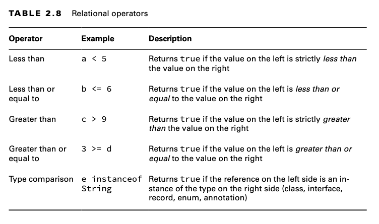

Önceki bölüm, variable'ların define edilmesi hakkında oldukça fazla şeyden bahsetti, peki bir variable oluşturulduktan
sonra onunla ne yapabilirsiniz? Bu bölüm, Operators (operatörleri) tanıtır ve existing variable'ları combine
(birleştirmek) etmeyi ve yeni değerler oluşturmak için nasıl kullanabileceğinizi gösterir. Operatörlerin, çeşitli
primitive veri türlerine nasıl uygulanacağını açıklarken, nesnelere uygulanabilecek operatörlerle de sizi tanıştırır.

# Understanding Java Operators (Java Operatorlerini Anlamak)

Eğlenceli kısımlara geçmeden önce biraz terminolojiye değinelim. Bir Java operatörü, bir grup variable'a, değere veya
literal'e — bunlara operand denir — uygulanabilen ve bir sonuç döndüren özel bir semboldür. Bu bölüm boyunca
kullanacağımız operand terimi, operatörün uygulandığı değer veya variable'i ifade eder. Figure 2.1, bir Java
operation'ının anatomisini göstermektedir.


Bir operation'ın çıktısına basitçe result denir. Figure 2.1 aslında ikinci bir operation içerir; burada Assignment
operatörü (=), result'u c variable'inda saklamak için kullanılır. Muhtemelen küçük yaşlardan beri toplama (+) ve
çıkarma (-) operatörlerini kullanıyorsunuzdur. Java, sınav için bilmeniz gereken birçok başka operatörü destekler.
Birçoğu size tanıdık gelebilir, ancak bazıları örneğin, compound (bileşik) assignment operatörleri sizin için yeni
olabilir.

## Types of Operators (Operator tipleri)

Java üç tür operatörü destekler: birincil (unary), ikili (binary) ve üçlü (ternary). Bu operatör türleri sırasıyla bir,
iki veya üç operand üzerinde uygulanabilir. Sınav için, belirli bir Java operatörü alt kümesini, bunların nasıl
uygulanacağını ve hangi sırayla uygulanmaları gerektiğini bilmeniz gerekir. Java operatörleri mutlaka soldan sağa doğru
değerlendirilmez. Aşağıdaki örnekte, belirli operatörler nedeniyle ikinci expression aslında sağdan sola doğru
değerlendirilir:

```
int cookies = 4;
double reward = 3 + 2 * --cookies;
System.out.print("Zoo animal receives: "+reward+" reward points");
```

Bu örnekte, önce cookies değerini 3'e düşürürsünüz, ardından ortaya çıkan değeri 2 ile çarpar ve son olarak 3 eklemiş
olursunuz. Sonuçta ortaya çıkan değer 9'dan 9.0'a otomatik olarak dönüştürülür ve reward değişkenine atanır. Son durumda
reward ve cookies değerleri sırasıyla 9.0 ve 3 olur. Aşağıdaki çıktı yazdırılır:

Zoo animal receives : 9.0 reward points.

Eğer bu işlemleri takip etmekte zorlandıysanız endişelenmeyin. Bu bölümün sonunda, bu tür sorunları çözmek sizin için
oldukça kolay hale gelecek.

## Operator Precedence (Operatör önceliği)

Bir kitap ya da gazete okurken, bazı yazılı diller soldan sağa doğru değerlendirilirken, bazıları sağdan sola doğru
değerlendirilir. Matematikte, belirli operatörler diğer operatörlerin önüne geçebilir ve önce değerlendirilir. Hangi
operatörlerin hangi sırayla değerlendirildiğini belirlemeye operator precedence denir. Bu anlamda, Java matematiğin
kurallarını daha yakından takip eder. Şu expression'ı göz önünde bulundurun:

```
var perimeter = 2 * height + 2 * length;
```

Bu statement'i compiler'in nasıl değerlendirdiğini göstermek için bazı optional parantezler ekleyelim:

```
var perimeter = ((2 * height) + (2 * length));
```

Multiplication (çarpma) operatörü (*) toplama operatöründen (+) daha yüksek bir önceliğe sahiptir, bu nedenle height ve
length değerleri toplama işlemi yapılmadan önce 2 ile çarpılır. Assingment operatörü (=) ise en düşük önceliğe sahiptir,
bu yüzden "perimeter" variable'ina atama işlemi en son gerçekleştirilir.

Parantezlerle geçersiz kılınmadıkça, Java operatörleri işlem sırasını takip eder ve bu sıralama, Table 2.1'de belirtilen
operatör önceliği sırasına göre azalan bir şekilde düzenlenir. Eğer iki operatör aynı öncelik seviyesine sahipse, Java,
tabloda işaretlenmeyen operatörler için çoğu durumda soldan sağa doğru değerlendirme garantisi verir.


Bu bölüm boyunca Table 2.1’i yanınızda bulundurmanızı öneririz. Sınav için, bu tablodaki öncelik sırasını ezberlemeniz
gerekecek. Ancak, shift operatörleri gibi bazı operatörler üzerinde sınav yapılmayacak, yine de bunların varlığından
haberdar olmanız önerilir.

| Note : |
|--------|

Arrow operatörü (->), bazen arrow function veya lambda operator olarak adlandırılır, iki operand arasında bir
ilişkiyi temsil eden bir binary operatördür. Bu bölümde arrow operator'ı ele almayacağız, ancak 3. Bölüm "Making
Decision" da switch ifadelerinde ve 8. Bölüm "Lambdas and Functional Interface" lerde lambda expression'ların da
kullanıldığını göreceksiniz.

# Applying Unary Operators (Unary operatörlerin uygulanması)

Tanım olarak, bir tekli operatör (unary operator), işlevini yerine getirebilmek için tam olarak bir operand veya
variable gerektirir. Table 2.2'de gösterildiği gibi, genellikle bir sayısal değişkeni bir artırmak veya bir boolean
değeri tersine çevirmek gibi basit işlemleri gerçekleştirirler.


Tablo 2.2 cast operatörünü içermesine rağmen, cast konusunu bu bölümün ilerleyen kısımlarındaki “Assigning Values”
bölümüne erteliyoruz, çünkü bu bölümde yaygın olarak kullanılmaktadır.

## Complement and Negation Operators (Tamamlama ve Olumsuzlama Operatörleri)

Bu bölümde birçok sayısal operatörle çalışacağımız için, önce boolean operatörünü ele alalım. Logical Complement
Operator (!) bir boolean expression'ının değerini tersine çevirir. Örneğin, eğer değer true ise, false olarak
dönüştürülür ve tersi de geçerlidir. Bunu göstermek için, aşağıdaki statement'ların çıktılarını karşılaştıralım:

```
boolean isAnimalAsleep = false;
System.out.print(isAnimalAsleep); // false

isAnimalAsleep = !isAnimalAsleep;
System.out.print(isAnimalAsleep); // true
```

Sınav için ayrıca bitwise complement operator (~) hakkında da bilgi sahibi olmanız gerekecek. Bu operatör, bir
sayıdaki tüm 0’ları ve 1’leri tersine çevirir. Yalnızca byte, short, char, int ve long gibi tam sayı veri türlerine
uygulanabilir. Bir örnek üzerinden gidelim. Basitlik olması açısından, yalnızca son dört biti (tüm 32 bit yerine)
göstereceğiz.

```
int value = 3;                      // Stored as 0011
int complement = ~value;            // Stored as 1100
System.out.println(value);          // 3
System.out.println(complement);     // -4
```

Sakin olun! Sınavda karmaşık bit aritmetiği yapmayı bilmenize gerek yok, yeter ki şu kuralı hatırlayın: Bir sayının
bitwise complement tamamlayıcısını bulmak için, sayıyı negatif -1 ile çarpın ve value'dan 1 çıkarın.

```
System.out.println(-1 * value -1); // -4
System.out.println(-1 * complement -1); // 3
```


Daha yaygın operatörlere geçersek, negation (negatiflik) operatörü (-) bir numeric expresion'ın işaretini tersine
çevirir, aşağıdaki statement'lar da olduğu gibi:

```
double zooTemperature = 1.21;
System.out.println(zooTemperature); // 1.21

zooTemperature = -zooTemperature;
System.out.println(zooTemperature); // -1.21

zooTemperature = -(-zooTemperature);
System.out.println(zooTemperature); // -1.21
```

Son örnekte, negatiflik operatörü (-) için parantezler () kullandığımıza dikkat edin; bu, negatifliği iki kez
uygulamamıza olanak sağladı. Eğer yerine -- yazsaydık, bu, azaltma operatörü olarak yorumlanır ve -2.21 olarak
yazdırılırdı. Azaltma operatörünü yakında daha fazla göreceksiniz.

Açıklamalara dayanarak, bazı operatörlerin, üzerinde işlem yaptıkları değişkenin veya expression'ın belirli bir türe
sahip olmasını gerektirdiği açık olabilir. Örneğin, bir negatiflik operatörü (-) boolean bir expression'a uygulanamaz,
aynı şekilde bir logical complement operator (!) sayısal bir expression'a uygulanamaz. Sınavda, bu tür işlemleri yapmaya
çalışan sorularda dikkatli olun, çünkü bu tür ifadeler kodun compile edilmemesine neden olur. Örneğin, aşağıdaki kod
satırlarının hiçbiri compile edilmeyecektir:

```
int pelican = !5; // DOES NOT COMPILE
boolean penguin = -true; // DOES NOT COMPILE
boolean peacock = !0; // DOES NOT COMPILE
```

İlk statement derlenmez çünkü Java'da sayısal bir değerin logical inversion (mantıksal tersini) alamazsınız. İkinci
statement derlenmez çünkü bir boolean değeri sayısal olarak negate (negatifleme) edemezsiniz; bunun yerine logical
inverse operator (mantıksal ters) operatörünü kullanmanız gerekir. Son olarak, son statement derlenmez çünkü sayısal bir
değerin logical complement'ini alamazsınız, ayrıca bir tam sayıyı bir boolean variable'ina atayamazsınız.

| Note : |
|--------|

Sınavda, boolean expressions'larla birlikte sayısal değerler (örneğin 0 veya 1) kullanan sorulara dikkat edin. Bazı
diğer programlama dillerinin aksine, Java'da 1 ve true arasında hiçbir ilişki yoktur, tıpkı 0 ile false arasında da
ilişki olmadığı gibi.

```
boolean isAdmin = 1; // COMPILE ERROR
```

## Increment and Decrement Operators (Artırma - Eksiltme operatörleri)

Artırma ve azaltma operatörleri, sırasıyla ++ ve --, sayısal değişkenlere uygulanabilir ve binary operatörlere kıyasla
yüksek bir önceliğe sahiptir. Diğer bir deyişle, genellikle bir expression'a ilk olarak uygulanırlar. Artırma ve azaltma
operatörleri özel bir dikkat gerektirir çünkü bu operatörlerin ilişkili olduğu değişkene eklenme sırası, bir
expression'ın nasıl işlendiğini etkileyebilir. Table 2.3, bu operatörlerin her birini listeler.


| Operator       | Örnek | Açıklama                                     |
|----------------|-------|----------------------------------------------|
| Pre-increment  | ++w   | Değeri 1 artırır ve yeni değeri döndürür     |
| Pre-decrement  | --x   | Değeri 1 azaltır ve yeni değeri döndürür     |
| Post-increment | y++   | Değeri 1 artırır ve orijinal değeri döndürür |
| Post-decrement | z--   | Değeri 1 azaltır ve orijinal değeri döndürür |

Aşağıdaki kod parçacığı bu ayrımı göstermektedir:

```
int parkAttendance = 0;
System.out.println(parkAttendance); // 0
System.out.println(++parkAttendance); // 1
System.out.println(parkAttendance); // 1
System.out.println(parkAttendance--); // 1
System.out.println(parkAttendance); // 0
```

İlk pre-increment operatörü, parkAttendance değerini günceller ve yeni değeri olan 1'i yazdırır.

```
System.out.println(++parkAttendance); // 1
```

Sonraki post-decrement operatörü de parkAttendance değerini günceller ancak azalma işlemi gerçekleşmeden önceki değeri
yazdırır.

```
System.out.println(parkAttendance--); // 1
```

| Note : |
|--------|

Sınav için, parkAttendance++ ve ++parkAttendance gibi expression'lar arasındaki farkı bilmeniz çok önemlidir. Artırma ve
azaltma operatörleri birden fazla soruda yer alacak ve hangi değerin döndüğüne dair yaşanacak bir karışıklık, sınavda
çok sayıda puan kaybetmenize neden olacaktır.

# Working with Binary Arithmetic Operators (Binary operatörler ile çalışmaya başlamak)

Şimdi, iki operand alan operatörlere, yani binary operatörlere geçiyoruz. Binary operatörler, Java dilindeki en yaygın
operatörlerdir. Değişkenler üzerinde matematiksel işlemler yapmak, logical expression'lar oluşturmak ve temel değişken
atamaları yapmak için kullanılabilirler. Binary operatörler, genellikle diğer Binary operatörlerle birlikte karmaşık
expression'larda birleştirilir; bu nedenle, Binary operatör içeren expression'ların değerlendirilmesinde operatör
önceliği çok önemlidir. Bu bölümde, Binary aritmetik operatörlerle başlıyoruz; diğer Binary operatörleri ise sonraki
bölümlerde ele alacağız.

## Arithmetic Operators

Aritmetik operatörler sayısal değerler üzerinde işlem yapan operatörlerdir. Bunlar Table 2.4'te gösterilmiştir.


Early mathematics'den tüm operatörleri, modulus haricinde, bilmeniz gerekir. Ancak, modulus'un ne olduğunu bilmiyorsanız
endişelenmeyin — yakında bunu da ele alacağız. Aritmetik operatörler, daha önce incelediğimiz unary operatörler ++ ve
--'yi de içerir. Table 2.1'de de fark etmiş olabileceğiniz gibi, çarpma, bölme ve modulus (*, /, %) operatörleri,
toplama ve çıkarma (+, -) operatörlerinden daha yüksek bir önceliğe sahiptir. Aşağıdaki expression'a bir göz atın:

```
int price = 2 * 5 + 3 * 4 - 8;
```

İlk olarak, 2 * 5 ve 3 * 4'ü değerlendirirsiniz, bu da expression'ı şuna indirger:

```
int price = 10 + 12 - 8;
```

Sonra, kalan terimleri soldan sağa doğru sırasıyla değerlendirirsiniz ve price değeri 14 olur. Sonucun neden 14 olduğunu
anladığınızdan emin olun, çünkü bu tür bir operatör önceliği sorusuyla sınavda karşılaşmanız olasıdır.

| Note : |
|--------|

Tüm aritmetik operatörler, boolean dışında her tür Java veri tipine uygulanabilir. Ayrıca, yalnızca toplama
operatörleri + ve +=, String değerlerine uygulanabilir ve bu da String concatenation'a (birleştirilmesine) yol açar. Bu
operatörleri ve String değerlerine nasıl uygulandıklarını, 4. Bölüm "Core API'ler"de daha ayrıntılı olarak
öğreneceksiniz.

### Adding Parentheses (Parantez Ekleme)

Unless overridden with parentheses (Parantezlerle geçersiz kılınmadıkça) ifadesini, operator precedence ile ilgili Table
2.1’i sunmadan önce söylediğimizi fark etmiş olabilirsiniz. Bunun nedeni, işlem sırasını açıkça değiştirebilmenizdir;
bunu, önce değerlendirilen bölümleri parantezle sararak yapabilirsiniz.

| Changing the Order of Operation (Changing the Order of Operation) |
|-------------------------------------------------------------------|

Önceki price örneğine geri dönelim. Aşağıdaki kod parçacığı aynı değerleri ve operatörleri aynı sırada içerir, ancak iki
parantez kümesi eklenmiştir:

```
int price = 2 * ((5 + 3) * 4 - 8);
```

Bu kez, aşağıdaki expression'i azaltan 5+3 toplama operatörünü değerlendirirsiniz

```
int price = 2 * (8 * 4 - 8);
```

Parantez içindeki ilk iki değeri çarparak bu expression'i daha da azaltabilirsiniz:

```
int price = 2 * (32 - 8);
```

Ardından, parantez dışındaki terimleri uygulamadan önce parantez içindeki değerleri çıkarırsınız:

```
int price = 2 * 24;
```

Son olarak, sonucu 2 ile çarparak fiyat için 48 değerini elde edersiniz. Parantezler sınavda sayısal değerler içeren
hemen hemen her soruda karşınıza çıkabilir, bu nedenle bunları gördüğünüzde işlem sırasını nasıl değiştirdiklerini
anladığınızdan emin olun. Profesyonel kariyerinizde işlem sırasından emin olmadığınız bir kodla karşılaştığınızda,
isteğe bağlı parantezler eklemekten çekinmeyin. Genellikle gerek olmasa da, özellikle ternary operatörleri ile
göreceğiniz gibi, okunabilirliği artırabilirler.

| Verifying Parentheses Syntax (Parantez Syntax'ini Doğrulama) |
|--------------------------------------------------------------|

Parantezlerle çalışırken, her zaman geçerli ve dengeli olduklarından emin olmanız gerekir. Aşağıdaki örnekleri göz
önünde bulundurun:

```
long pigeon = 1 + ((3 * 5) / 3; // DOES NOT COMPILE
int blueJay = (9 + 2) + 3)/(2*4; // DOES NOT COMPILE
```

İlk örnek compile edilmez çünkü parantezler dengelenmemiştir. Bir sol parantez var, ancak karşılık gelen bir sağ
parantez yoktur. İkinci örnek, eşit sayıda sol ve sağ parantez içeriyor, ancak parantezler düzgün bir şekilde
dengelenmemiştir. Soldan sağa okurken, yeni bir sağ parantez, önceki bir sol paranteze karşılık gelmelidir. Aynı
şekilde, tüm sol parantezler, expression sonlanmadan önce sağ parantezlerle kapanmalıdır.

Başkar bir örnek:

```
short robin = 3 + [(4*2)+4]; // DOES NOT COMPILE
```

Bu örnek compile edilmez çünkü Java, bazı diğer programlama dillerinin aksine, köşeli parantezleri, [], parantezlerin
yerine kullanılmasına izin vermez. Eğer köşeli parantezleri parantezlerle değiştirirseniz, son örnek gayet iyi bir
şekilde compile edilecektir.

## Division and Modulus Operators (Bölme ve modulus operatorleri)

Daha önce söylediğimiz gibi, modulus operatörü (%) size yeni bir kavram olabilir. Modulus operatörü, bazen kalan
operatörü olarak da adlandırılır ve iki sayı bölündüğünde kalan kısmı ifade eder. Örneğin, 9, 3'e tam olarak bölünür ve
hiç kalan yoktur; bu nedenle, 9 % 3'ün sonucu 0'dır. Öte yandan, 11, 3'e tam olarak bölünmez; bu nedenle, 11 % 3'ün
sonucu 2'dir.

Aşağıdaki örnekler bu farkı açıklamaktadır:

```
System.out.println(9/3); // 3
System.out.println(9%3); // 0

System.out.println(10/3); // 3
System.out.println(10%3); // 1

System.out.println(11/3); // 3
System.out.println(11%3); // 2

System.out.println(12/3); // 4
System.out.println(12%3); // 0
```

Görüldüğü gibi, bölme işleminin sonuçları yalnızca sol taraftaki değer 11'den 12'ye geçtiğinde artar. Buna karşılık,
modulus kalan değeri, sol taraftaki değer her artırıldığında birer birer artar ve sonunda sıfıra döner. Pozitif
bölünenler için, bir bölücü y verildiğinde, modulus işlemi 0 ile (y - 1) arasında bir değer üretir. Bu örnekte, sonuçlar
0, 1, 2 şeklindedir.

Aritmetik bölme ile modulus arasındaki farkı anlamaya dikkat edin. Tam sayı değerlerinde, bölme işlemi, işlemi sağlayan
en yakın tam sayının taban (floor) değerini verirken, modulus işlemi kalan değeri verir. Taban değeri ifadesini
duyarsanız, bu sadece decimal point'den sonraki kısmın olmadığı değeri ifade eder. Örneğin, 4.0, 4.5 ve 4.9999999
değerlerinin taban değeri 4'tür. Yuvarlamanın aksine (Bunu 4. Bölüm'de ele alacağız), decimal point'den sonra ne
olduğuna bakılmaksızın, sadece decimal point'den önceki değeri alırsınız.

| Note : |
|--------|

Java'da modulus işlemi pozitif integer'lar ile sınırlı değildir; negatif integer'lar ve floating-point sayılara da
uygulanabilir. Örneğin, divisor (bölücü) 5 ise, negatif bir sayının modülüs değeri -4 ile 0 arasında olacaktır. Ancak,
sınav için negatif bir tam sayının veya ondalıklı bir sayının modulusunu almayı bilmeniz gerekmiyor.

## Numeric Promotion (Sayısal yükseltme)

Şimdi aritmetik operatörlerin temelini anladığınıza göre, Java'nın başlangıçta size garip gelebilecek şeyler
yapabileceği için, primitive sayısal türlerin dönüşümünü (numeric promotion) konuşmak önemlidir. 1. Bölüm "Building
Blocks"da gösterdiğimiz gibi, her primitive sayısal türün bir bit length'i vardır. Sınav için bu türlerin tam
boyutlarını bilmeniz gerekmez, ancak hangisinin diğerlerinden daha büyük olduğunu bilmelisiniz. Örneğin, bir long'un,
bir int'ten daha fazla alan kapladığını, onun da bir short'tan daha fazla alan kapladığını bilmelisiniz.

Java'nın veri türlerine operatörler uygularken takip ettiği bazı kuralları ezberlemeniz gerekiyor:

| Numeric Promotion Rules (Sayısal tanıtım kuralları) |
|-----------------------------------------------------|

1 - Eğer iki değer farklı data type'ına sahipse, Java otomatik olarak bu değerlerden birini, iki veri türünden daha
büyük olana promote (yükseltir) eder.

2 - Eğer değerlerden biri tam sayı (integral), diğeri ondalıklı sayı (floating-point) ise, Java integral'in değerini
otomatik olarak floating-point değerinin data type'ına promote eder.

3 - Daha küçük veri türleri, yani byte, short ve char, bir Java binary aritmetik operatörüyle (bir değer yerine bir
değişkenle) kullanıldıklarında, her zaman önce int'e yükseltilir; bu, operandların hiçbiri int olmasa bile geçerlidir.

4 - Tüm promotion'lar gerçekleştikten ve operandlar aynı data type'ına sahip olduktan sonra, ortaya çıkan değer,
promote edilmiş operandların data type'ı ile aynı olacaktır.

Son iki kural, çoğu kişinin zorlandığı ve sınavda sizi yanıltma olasılığı en yüksek olan kurallardır. Üçüncü kural için,
unary operatörlerin bu kuraldan hariç tutulduğunu unutmayın. Örneğin, bir short değerine ++ uygulamak, yine bir short
değeriyle sonuçlanır.

Açıklayıcı olması amacıyla bazı örnekleri ele alalım:

* What is the data type of x * y?

* x * y 'nin data type'i nedir?

```
int x = 1;
long y = 33;
var z = x * y;
```

Bu durumda, ilk kuralı takip ederiz. Çünkü değerlerden biri int ve diğeri long türünde, ve long int'ten daha büyük
olduğu için, int değeri önce long'a promote edilir. Sonuçta z bir long değeri olur.

* What is the data type of x + y?

* x + y'nin data type'i nedir

```
double x = 39.21;
float y = 2.1;
var z = x + y;
```

Bu aslında bir yanıltıcı sorudur, çünkü ikinci satır compile edilmez! 1. Bölüm'den hatırlayacağınız gibi, floating-point
sabitleri, f ile sonlanmadıkça double olarak kabul edilir; örneğin, 2.1f gibi. Eğer y değeri doğru bir şekilde 2.1f
olarak ayarlanmış olsaydı, o zaman dönüşüm önceki örneğe benzer olurdu, her iki operand da double'a promote edilir ve
sonuçta z bir double değeri olurdu.

* What is the data type of x * y?

* x * y'nin data type'i nedir?

```
short x = 10;
short y = 3;
var z = x * y;
```

Son satırda, üçüncü kuralı uygulamamız gerekir: x ve y her ikisi de binary çarpma işlemi öncesinde int türüne
promote edilecek ve bu da int türünde bir çıktı üretecek. Eğer bu değeri bir short değişkeni z'ye atamaya çalışırsanız,
bu kod derlenmez. Sonuç olarak elde edilen çıktının short olmadığını dikkatle gözlemleyin, çünkü bu örneğe yaklaşan "
Assigning Values" bölümünde geri döneceğiz.


* What is the data type of w * x / y?

* w * x / y data type'i nedir?

```
short w = 14;
float x = 13;
double y = 30;
var z = w * x / y;
```

Bu durumda, tüm kuralları uygulamamız gerekir. İlk olarak, w yalnızca bir short olduğu ve aritmetik bir binary işlemde
kullanıldığı için otomatik olarak int'e promote edilecektir. Promote edilen w değeri, x ile çarpılabilmesi için otomatik
olarak float'a promote edilir. Ardından, w * x işleminin sonucu, y ile bölünebilmesi için otomatik olarak double'a
promote edilecek ve sonuçta double türünde bir değer elde edilecektir.

# Assign Values (Değerlerin atanması)

Assignment operatörlerinden kaynaklanan compile hataları sınavda genellikle gözden kaçırılır, bunun bir kısmı bu
hataların ne kadar ince olabileceğidir. Assignment operatörleriyle başarılı olabilmek için, compiler'in numeric
promotion'i nasıl işlediğini ve ne zaman type casting'e ihtiyaç duyulduğunu anlamada akıcı olmalısınız. Bu tür sorunları
tespit edebilmek, sınavı geçmek için kritik öneme sahiptir çünkü Assignment operatörleri, kod parçası içeren neredeyse
her soruda karşınıza çıkar.

## Assignment Operator (Atama operatörü)

Bir Assignment operatörü, operatörün sol tarafındaki değişkeni, denklemde sağdaki değerin sonucu ile değiştiren veya
atayan bir binary operatördür. Diğer çoğu Java operatöründen farklı olarak, atama operatörü sağdan sola doğru
değerlendirilir. En basit atama operatörü = atamasıdır, bunu zaten görmüşsünüzdür:

```
int herd = 1;
```

Bu statement, herd variable'ina 1 değerini atar. Java, önceki bölümde gördüğünüz gibi, daha küçük data type'larından
daha büyük data type'larına otomatik olarak promote yapacaktır, ancak casting yapmadan daha büyük data type'lardan
daha küçük data type'larına dönüştürmeye çalıştığınızı tespit ederse bir compiler hatası fırlatacaktır. Table 2.5,
sınavda bilmeniz gereken ilk asssigment operatörünü listeler. Bu bölümde daha sonra ek atama operatörlerini sunacağız.


## Casting values (Cast değerleri)

Buraya kadar kolay görünüyor, değil mi? Casting konusunu ele almadan Assignment operatörü hakkında ayrıntılı olarak
konuşamayız. Casting, bir veri tipinin açıkça başka bir veri tipi olarak yorumlandığı unary bir operation'dır. Daha
büyük veya widening (genişleyen) bir veri türüne dönüştürürken casting isteğe bağlıdır ve gereksizdir, ancak daha küçük
veya narrowing (daralan) bir veri türüne dönüştürürken gereklidir. Casting olmadan, daha büyük bir veri türünü daha
küçük bir veri türünün içine koymaya çalıştığınızda compiler bir hata üretecektir.

Casting, parantez içine alınmış veri türünü, cast etmek istediğiniz değerin soluna yerleştirerek gerçekleştirilir. İşte
bazı casting örnekleri:

```
int fur = (int)5;
int hair = (short) 2;
String type = (String) "Bird";
short tail = (short)(4 + 10);
long feathers = 10(long); // DOES NOT COMPILE
```

Casting ile değer arasındaki boşluklar isteğe bağlıdır. Sağ tarafta da parantez kullanmak yaygındır. Casting, bir unary
operation olduğu için, eğer 4 + 10 ifadesini parantez içinde yazmasaydık, sadece 4'e uygulanırdı. Son örnek compile
edilmez çünkü type, değerin sağ tarafında yer alıyor.

Bir yandan, compiler'in daha küçük veri türlerini otomatik olarak daha büyük olanlara dönüştürmesi kullanışlıdır. Diğer
yandan, bunun tersini yaptığında, dikkatli olup olmadığınızı görmek için mükemmel sınav soruları ortaya çıkar.
Hiçbirinin neden compile edilmediğini bulmaya çalışın.

```
float egg = 2.0 / 9; // DOES NOT COMPILE
int tadpole = (int)5 * 2L; // DOES NOT COMPILE
short frog = 3 - 2.0; // DOES NOT COMPILE
```


Bu örneklerin tamamı, daha büyük bir değeri daha küçük bir veri türüne koyma işlemine ilişkindir. Henüz tam olarak
anlamadıysanız endişelenmeyin; bunun gibi daha fazla örneği yakında ele alacağız.

Bu bölümde, casting (tür dönüşümü) esas olarak sayısal veri türlerini diğer veri türlerine dönüştürmekle ilgilidir.
Ancak, ilerleyen bölümlerde casting'in nesnelere ve referanslara da uygulanabileceğini göreceksiniz. Bu durumlarda ise
herhangi bir dönüşüm yapılmaz. Basitçe söylemek gerekirse, sayısal bir değeri casting yapmak veri türünü
değiştirebilirken, bir nesneyi casting yapmak yalnızca nesnenin referansını değiştirir, nesnenin kendisini değil.

## Reviewing Primitive Assignments (Primitive assignment'ların gözden geçirilmesi)

Aşağıdaki satırların her birinin neden compile edilmediğini bulmaya çalışın:

```
int fish = 1.0; // DOES NOT COMPILE
short bird = 1921222; // DOES NOT COMPILE
int mammal = 9f; // DOES NOT COMPILE
long reptile = 192_301_398_193_810_323; // DOES NOT COMPILE
```

İlk statement derlenmez çünkü bir double olan 1.0'ı bir integer değerine atamaya çalışıyorsunuz. Değer matematiksel bir
tamsayı olsa da, sonuna .0 ekleyerek compiler'a bunu bir double olarak değerlendirmesini söylüyorsunuz. İkinci statement
compile edilmez çünkü 1921222 sayısal değeri short veri türünün sınırlarının dışındadır ve compiler bunu fark eder.
Üçüncü statement compile edilmez çünkü sayının sonuna eklenen f, compiler'a sayıyı bir floating-point değeri olarak
değerlendirmesini söyler, ancak assignment bir int türüne yapılmaktadır. Son olarak, son statement derlenmez çünkü Java,
sayısal değeri int olarak değerlendirir ve bu değerin int'in sınırlarını aştığını fark eder. Bu literal değerinin long
olarak kabul edilebilmesi için bir L veya l eklenmesi gerekir.

## Applying Casting (Casting'in uygulanması)

Önceki üç örneği, sonuçları daha küçük bir veri türüne dönüştürerek düzeltebiliriz. Hatırlayın, bir primitive veriyi
daha büyük bir sayısal veri türünden daha küçük bir sayısal veri türüne veya floating-point bir sayıyı tam sayı
(integral) bir değere dönüştürürken casting yapmak zorunludur.

```
int fish = (int) 1.0; // Stored as 1
short bird = (short)1921222; // Stored as 20678
int mammal = (int)9f; // Stored as 9
```

Son örneğe casting uygulanmasına ne dersiniz?

```
long reptile = (long)192301398193810323; // DOES NOT COMPILE
```

Bu hala compile edilmez çünkü değer, compiler tarafından önce bir int olarak yorumlanır ve int'in sınırlarının
dışındadır. Aşağıdaki kod, casting yapmadan bu hatayı düzeltir:

```
long reptile = 192301398193810323L;
```

| Real World Scenario (Gerçek dünya senaryosu) |
|----------------------------------------------|
| Overflow and Underflow                       |

Aşağıda ki örnekteki expression'lar compile ediliyor, ancak bir cost (maliyeti) var.

```
int fish = (int) 1.0; // Stored as 1
short bird = (short)1921222; // Stored as 20678
int mammal = (int)9f; // Stored as 9
```

İkinci değer, 1.921.222, bir short olarak saklanamayacak kadar büyüktür, bu yüzden numeric overflow (sayısal taşma)
meydana gelir ve 20.678 olur. Overflow, bir sayının o kadar büyük olduğu durumdur ki, veri türü içinde saklanamaz, bu
yüzden sistem wrap around (dönüş yapar) ve en düşük negatif değere ulaşır, ardından oradan yukarı doğru saymaya başlar,
tıpkı modulus aritmetiği nasıl çalışıyorsa. Ayrıca, bir sayının veri türüne sığamayacak kadar düşük olduğu durumlara da
underflow denir, örneğin -200'ün bir byte alanına saklanması gibi. Bu konu sınavın kapsamı dışında olsa da, kendi
kodunuzda dikkat etmeniz gereken bir durumdur. Örneğin, aşağıdaki statement negatif bir sayı çıktısı verecektir:

```
System.out.print(2147483647+1); // -2147483648
```

2147483647, maksimum int değeri olduğundan, buna herhangi bir pozitif değer eklemek, sayının en küçük negatif sayıya
wrap edilmesine neden olacaktır.

Numeric Promotion bölümünden benzer bir örneğe geri dönelim.

```
short mouse = 10;
short hamster = 3;
short capybara = mouse * hamster; // DOES NOT COMPILE
```

Şimdiye kadar numeric promotion ve casting hakkında öğrendiklerinize dayanarak, bu statement'in son satırının neden
compile edilmeyeceğini anlıyor musunuz? Hatırlayabileceğiniz gibi, short değerler, herhangi bir aritmetik işlem
operatörü uygulandığında otomatik olarak int türüne promote ettirilir ve ortaya çıkan değer int türünde olur. Bir short
değişkenine int türünde bir değer atamaya çalışmak compiler hatasına yol açar, çünkü Java, daha büyük bir veri türünden
daha küçük birine dönüştürme yapmaya çalıştığınızı düşünür.

Bu expression'ı casting ile düzeltebiliriz, çünkü bazen compiler'in varsayılan davranışını override etmek
isteyebilirsiniz. Bu örnekte, 10 * 3 işleminin sonucunun 30 olduğunu biliyoruz ve bu değer kolayca bir short değişkenine
sığar, bu yüzden sonucu tekrar short türüne dönüştürmek için casting uygulayabiliriz.

```
short mouse = 10;
short hamster = 3;
short capybara = (short)(mouse * hamster);
```

Daha büyük bir değeri daha küçük bir veri türüne casting yaparak, compiler'a varsayılan davranışını görmezden gelmesini
söylersiniz. Diğer bir deyişle, compiler'a taşma (overflow) veya alt sınırdan sapma (underflow) olmaması için ek
adımlar attığınızı belirtmiş oluyorsunuz. Ayrıca, belirli bir uygulamanızda ve senaryonuzda overflow veya underflow
kabul edilebilir değerlerle sonuçlanabilir.

Son olarak, casting sadece assignment işleminde değil, bir expression'da herhangi bir yerde görünebilir. Örneğin, önceki
örneğin değiştirilmiş bir şekline bakalım:

```
short mouse = 10;
short hamster = 3;
short capybara = (short) mouse * hamster; // DOES NOT COMPILE
```

Peki, son satırda ne oluyor? Hatırlayın, casting'in unary bir işlem olduğunu söylemiştik. Bu, son satırdaki cast
işleminin yalnızca mouse'a uygulandığı anlamına gelir. Cast işlemi tamamlandığında, her iki operand da int türüne
yükseltilir çünkü binary çarpma operatörü (*) ile kullanılır, bu da sonucu int türüne dönüştürür ve compiler hatasına
neden olur. Peki, son satırı şu şekilde değiştirsek ne olur?

```
short capybara = 1 + (short)(mouse * hamster); // DOES NOT COMPILE
```

Bu örnekte, casting başarılı bir şekilde yapılır, ancak sonuç değeri otomatik olarak int türüne promote edilir çünkü
binary aritmetik operatörü (+) ile kullanılır

## Casting Values vs. Variables (Değerler ve Değişkenlerin Casting'i)

Üçüncü numeric promotional kuralımıza tekrar baktığımızda, compiler, veri türüne sığan sabit değerlerle çalışırken
casting işlemi gerektirmez. Şu örnekleri düşünün:

```
byte hat = 1;
byte gloves = 7 * 10;
short scarf = 5;
short boots = 2 + 1;
short boots = 2 + hat; // DOES NOT COMPILE
byte gloves = 7 * 100; // DOES NOT COMPILE
```

Son iki statement compile edilmez çünkü hat bir value değil, bir variable'dir ve her iki operand otomatik olarak int
türüne promote edilir. Sabit değerlerle çalışırken compiler, yazarın niyetini belirlemek için yeterli bilgiye sahipti.
Ancak, variable'lar ile çalışırken nasıl ilerlenmesi gerektiği konusunda bir belirsizlik ortaya çıkar ve bu nedenle
compiler bir hata raporlar. İkinci statement ise derlenmez çünkü 700, byte türü için overflow'a neden olur; byte'ın
maksimum değeri 127'dir.

## Compound Assignment Operators (Bileşik Atama Operatörleri)

Basit assignment operatörüne (=) ek olarak, Java birçok compound assignment operatörünü destekler. Sınav için, Table
2.6'daki compound operatörleri bilmeniz gerekir.


| Operator             | Örnek    | Açıklama                                                             |
|----------------------|----------|----------------------------------------------------------------------|
| Ekleme assignment'i  | a += 5   | Sağdaki değeri soldaki variable'a ekler ve toplamı variable'a atar   |
| Çıkarma assignment'i | b -= 0.2 | Sağdaki değeri soldaki variable'dan çıkarır ve farkı variable'a atar |
| Çarpma assignment    | c *= 100 | Sağdaki değeri soldaki variable'la çarpar ve çarpımı variable'a atar |
| Bölme assignment     | d /= 4   | Soldaki variable'i sağdaki değere böler ve bölümü variable'a atar    |

Compound operatörler aslında basit assignment operatörünün daha gelişmiş formlarıdır; statement'da sol ve sağ taraflara
uygulanan ve sonucu statement'in sol tarafındaki variable'da saklayan built-in bir aritmetik veya logical işlem
içerirler. Örneğin, camel ve giraffe'in declaration'ından sonraki aşağıdaki iki statement, bağımsız olarak
çalıştırıldığında eşdeğerdir:

```
int camel = 2, giraffe = 3;
camel = camel * giraffe;  // SIMPLE ASSIGNMENT OPERATOR
camel *= giraffe;         // COMPOUND ASSIGNMENT OPERATOR
```

Compound operatörün sol tarafı yalnızca önceden tanımlanmış bir variable'a uygulanabilir ve yeni bir variable tanımlamak
için kullanılamaz. Bu örnekte, eğer camel daha önce tanımlanmamış olsaydı, camel *= giraffe expression'i derlenmezdi.
Compound operatörler yalnızca kısayol sağlamakla kalmaz, aynı zamanda bir değeri açıkça cast etme zorunluluğundan da
kurtarabilir. Örneğin, aşağıdaki durumu düşünün. Son satırın neden compile edilmediğini anlayabilir misiniz?

```
long goat = 10;
int sheep = 5;
sheep = sheep * goat; // DOES NOT COMPILE
```

Önceki bölümden, son satırdaki sorunu fark edebilmelisiniz. Bir long değeri bir int değişkenine atamaya çalışıyoruz. Bu
son satır, açık bir (int) cast işlemi ile düzeltilebilir, ancak compound atama operatörünü kullanarak daha iyi bir çözüm
mümkündür:

```
long goat = 10;
int sheep = 5;
sheep *= goat;
```

Compound operatör önce sheep'i long türüne cast eder, iki long değeri çarpar ve ardından sonucu int türüne cast eder.
Önceki örnekte compiler'in bir hata bildirdiği durumun aksine, burada compiler sonucu, compound operatörün sol
tarafındaki değerin veri türüne otomatik olarak cast eder.

## Return Value of Assignment Operators (Assignment Operatörlerinin Dönüş Değeri)

Assisgnment operatörleri hakkında bilmeniz gereken son bir şey, bir assisgnment'ın sonucunun, assisgnment'ın değerine
eşit olan bir expression olmasıdır. Örneğin, aşağıdaki kod parçacığı, biraz garip görünse de, tamamen geçerlidir:

```
long wolf = 5;
long coyote = (wolf=3);
System.out.println(wolf); // 3
System.out.println(coyote); // 3
```


Buradaki anahtar nokta, (wolf=3) ifadesinin iki şey yapmasıdır. Birincisi, wolf variable'inin değerini 3 olarak ayarlar.
İkincisi, assignment'in sonucunu döndürür ki bu da yine 3’tür. Sınav hazırlayıcıları, assignment operatörünü (=) bir
expression'in ortasına yerleştirmeyi ve assignment'in değerini daha karmaşık bir expression'ın parçası olarak kullanmayı
severler. Örneğin, sınavda aşağıdaki gibi bir if statement'i görürseniz şaşırmayın:

```
boolean healthy = false;
if(healthy = true)
    System.out.print("Good!");
```

Bu, healthy'nin "true" olup olmadığını test ediyormuş gibi görünebilir, ancak aslında healthy'ye "true" bir değer
assign ediyor. Assignment'in sonucu, assignment'in değeridir ve bu durumda "true" olduğu için bu kod parçası Good!
yazdırır. Bunu, bir sonraki 'Equality Operators' bölümünde daha detaylı ele alacağız.

# Comparing Values (Değerlerin Karşılaştırılması)

Sonraki binary operatör seti, değerleri karşılaştırmaya dayanır. Bu operatörler, iki değerin aynı olup olmadığını
kontrol etmek, bir sayısal değerin başka bir değerden küçük mü yoksa büyük mü olduğunu kontrol etmek ve mantıksal
aritmetik yapmak için kullanılabilir. Muhtemelen, bu bölümdeki operatörlerin birçoğunu geliştirme deneyiminizde
kullanmışsınızdır.

## Equality Operators (Eşitlik operatörleri)

Java'da eşitlik belirlemek, 'two objects are the same (iki nesne aynı mı?)' ve 'two objects are equivalent (iki nesne
eşdeğer mi?)' arasında anlam farkı olduğundan basit bir iş olmayabilir. Ayrıca, numeric ve boolean primitive'ler için
böyle bir ayrım olmadığı gerçeği bu durumu daha da karmaşık hale getirir. Table 2.7, eşitlik operatörlerini listeler.
Eşittir operatörü (==) ve eşit değildir operatörü (!=) iki operandı karşılaştırır ve expression'ların veya değerlerin
eşit olup olmadığını belirleyen bir boolean değeri döndürür.


| Operator   | Örnek     | Primitives'lere uygulanması                                 | Object'lere uygulanması                                        |
|------------|-----------|-------------------------------------------------------------|----------------------------------------------------------------|
| Equality   | a == 10   | İki değer aynı değeri represent ediyorsa true döndürür      | İki değer aynı object'e <br/>referans veriyorsa true döndürür  |
| Inequality | b != 3.14 | İki değer farklı değerleri represent ediyorsa true döndürür | İki değer aynı object'e <br/>referans vermiyorsa true döndürür |

Equality operatörü numeric values, boolean value'ları ve Object'lere (String ve null dahil) uygulanabilir. Equality
operatörünü kullanırken, bu türleri karıştırmak mümkün değildir. Aşağıdaki her biri bir compiler hatasına yol açar:

```
boolean monkey = true == 3; // DOES NOT COMPILE
boolean ape = false != "Grape"; // DOES NOT COMPILE
boolean gorilla = 10.2 == "Koko"; // DOES NOT COMPILE
```

Sınavda Equality operatörü gördüğünüzde, data type'larına dikkat edin. Önceki bölümde de belirtildiği gibi, sınav
hazırlayıcıları genellikle assignment operatörleri ile Equality operatörlerini karıştırma alışkanlığına sahiptir

```
boolean bear = false;
boolean polar = (bear = true);
System.out.println(polar); // true
```

İlk bakışta, çıktının false olması gerektiğini düşünebilirsiniz ve expression (bear == true) olsaydı, true olurdu. Ancak
bu örnekte, expression true değerini bear değişkenine assingnment ediyor ve assignment operatörleri bölümünde gördüğünüz
gibi, assignment'in kendisi assignment'in değeriyle eşdeğerdir. Bu nedenle, polar da true değerini alır ve sonuç true
olur.


Object karşılaştırması için Equality operatörü, Object'lere işaret eden referanslara uygulanır, Object'lerin kendilerine
değil. İki referans ancak ve ancak aynı Object'e işaret ediyorsa veya her ikisi de null'a işaret ediyorsa eşittir. Hadi
birkaç örneğe bakalım:

```
var monday = new File("schedule.txt");
var tuesday = new File("schedule.txt");
var wednesday = tuesday;
System.out.println(monday == tuesday); // false
System.out.println(tuesday == wednesday); // true
```

Tüm variable'lar aynı dosya bilgisine işaret etse de, yalnızca iki referans, tuesday ve wednesday, == açısından eşittir
çünkü aynı nesneye işaret ederler.

| Note : |
|--------|

Bekleyin, File sınıfı nedir? Bu örnekte olduğu gibi, sınavda da File gibi aşina olmadığınız sınıf isimleriyle
karşılaşabilirsiniz. Çoğu zaman, bu sınıfların belirli detaylarını bilmeseniz bile, bu sınıflarla ilgili soruları
yanıtlayabilirsiniz. Önceki örnekte, monday ve tuesday'nin iki ayrı ve farklı nesne olduğunu, new anahtar kelimesi
kullanıldığı için anlayabilmelisiniz, bu nesnelerin data type'ları hakkında bilginiz olmasa bile.

Bazı dillerde, null değeri başka bir değerle karşılaştırmak her zaman false'dur, ancak Java'da durum böyle değildir.

```
System.out.print(null == null); // true
```

Bölüm 4 de, iki farklı Object'nin equivalent olmasının ne anlama geldiğini tanıtarak Object equality konusuna devam
edeceğiz. Ayrıca, String equality ele alacak ve bunun ne kadar karmaşık bir konu olabileceğini göstereceğiz.

## Relational Operators (İlişkisel Operatörler)

Şimdi iki expression'ı karşılaştıran ve bir boolean değeri döndüren Relational operatörlere geçiyoruz. Table 2.8, sınav
için bilmeniz gereken Relational operatörleri açıklamaktadır.



| Operator            | Örnek               | Açıklama                                                                                                                     |
|---------------------|---------------------|------------------------------------------------------------------------------------------------------------------------------|
| Küçükse             | a < 5               | Soldaki değer sağdaki değerden kesinlikle küçükse true döndürür                                                              |
| Küçük veya eşitse   | b <= 6              | Soldaki değer sağdaki değerden küçük veya eşitse true döndürür                                                               |
| Büyükse             | c > 9               | Soldaki değer sağdaki değerden kesinlikle büyükse true döndürür                                                              |
| Büyükse veya eşitse | 3 >= d              | Soldaki değer sağdaki değerden büyük veya eşitse true döndürür                                                               |
| Type karşılaştırma  | e instanceof String | Sol taraftaki referans sağ taraftaki türün (class, interface, record,enum,<br/> annotation) bir instance'i ise true döndürür | 

### Numeric Comparison Operators (Sayısal Karşılaştırma Operatörleri)

Table 2.8'deki ilk dört relational operatör yalnızca numeric değerlere uygulanır. Eğer iki sayısal operand aynı veri
türüne sahip değilse, daha küçük olan tür promote edilir, daha önce tartışıldığı gibi. Bu operatörlerin nasıl
çalıştığını görmek için örneklere bakalım:

```
int gibbonNumFeet = 2, wolfNumFeet = 4, ostrichNumFeet = 2;
System.out.println(gibbonNumFeet < wolfNumFeet);        // true
System.out.println(gibbonNumFeet <= wolfNumFeet);       // true
System.out.println(gibbonNumFeet >= ostrichNumFeet);    // true
System.out.println(gibbonNumFeet > ostrichNumFeet);     // false
```

Son örneğin false döndürdüğüne dikkat edin, çünkü gibbonNumFeet ve ostrichNumFeet aynı değere sahip olsa da,
gibbonNumFeet "kesinlikle" ostrichNumFeet'ten büyük değildir.

### instanceof Operator

Sınav için bilmeniz gereken son relational operatör instanceof operatörüdür, Table 2.8'de gösterilmiştir. Bu operatör,
rastgele bir Object'in belirli bir class'ın veya interface'in bir üyesi olup olmadığını runtime'da belirlemek için
kullanışlıdır.

Neden bir Object'in hangi class veya interface olduğunu bilmelisiniz? 6. Bölüm, 'Class Design'a girdiğimizde
açıklayacağımız gibi, Java çok biçimliliği (polimorphism'i) destekler. Şu an için bilmeniz gereken tek şey, Object'lerin
çeşitli referanslar kullanılarak aktarılabileceğidir. Örneğin, tüm sınıflar java.lang.Object sınıfından türetilir. Bu,
herhangi bir instance'in bir Object referansına assign edilebileceği anlamına gelir. Örneğin, aşağıdaki kod parçasında
kaç nesne oluşturulmuş ve kullanılmıştır?

```
Integer zooTime = Integer.valueOf(9);
Number num = zooTime;
Object obj = zooTime;
```


Bu örnekte, memory'de yalnızca bir Object oluşturulmuştur, ancak buna üç farklı referans vardır çünkü Integer hem Number
hem de Object'ten inherit edilir. Bu, bu referanslardan herhangi birine instanceof operatörünü üç farklı data type'ı ile
uygulayabileceğiniz ve her biri için true döndüreceği anlamına gelir.


Polymorphism'in genellikle devreye girdiği yer, birçok olası subclass'ı olan bir data type'ını alan bir method
oluşturduğunuzda olur. Örneğin, bir fonksiyonumuzun hayvanat bahçesini açıp zamanı yazdırdığını düşünün. Input olarak,
bir Number type'ını parametre olarak alıyor.

```
public void openZoo(Number time) {}
```

Şimdi, fonksiyonun çıktının sonuna O'clock eklemesini istiyoruz, eğer değer bir tam sayı türü ise, örneğin bir Integer;
aksi takdirde, sadece değeri yazdırır.

```
public void openZoo(Number time) {
    if (time instanceof Integer)
        System.out.print((Integer)time + " O'clock");
    else
        System.out.print(time);
}
```

Şimdi, hem Integer hem de diğer değerleri zekice işleyebilen bir methodumuz var. Bu örnekte Integer değerini cast
ettiğimize dikkat edin. Farklı türlerde olabilen Object'ler ile çalışırken, instanceof ile birlikte cast kullanmak
yaygındır çünkü cast, yalnızca daha spesifik sınıflarda bulunan field'lara erişim sağlar. Bir Object'den narrower
(daha dar) bir türe cast yapmadan önce instanceof operatörünü kullanmak iyi bir kodlama pratiği olarak kabul
edilir.

| Note : |
|--------|

Sınav için, instanceof'un class'lar ve interface'ler ile ne zaman kullanıldığına odaklanmanız yeterlidir. Diğer yüksek
seviyeli türlerle, örneğin record'lar, enum'lar ve annotation'lar ile de kullanılabilse de, bu yaygın bir durum değildir

### Invalid instanceof (Geçersiz instanceof)

Sınavın sizi yanıltmaya çalışabileceği bir alan, instanceof'ı uyumsuz türlerle kullanmaktır. Örneğin, Number bir String
değerini tutamaz, bu nedenle aşağıdaki durum bir compiler hatasına neden olur:

```
public void openZoo(Number time) {
    if(time instanceof String) // DOES NOT COMPILE
        System.out.print(time);
}
```

Eğer compiler bir variable'in belirli bir sınıfa cast edilemeyeceğini belirleyebilirse, bir hata bildirir.

### null and the instanceof operator (null ve instanceof operatörü)

Bir null variable'i üzerinde instanceof çağrısı yaparsanız ne olur? Sınav için bilmeniz gereken, null literal'i veya bir
null referansı üzerinde instanceof çağrısının her zaman false döndürdüğüdür.

```
System.out.print(null instanceof Object); // false

Object noObjectHere = null;
System.out.print(noObjectHere instanceof String); // false
```

Yukarıdaki örneklerin her ikisi de false yazdırır. Expression'ın sağ tarafının ne olduğu neredeyse önemli değildir.
'Neredeyse' diyoruz çünkü istisnalar vardır. Bu örnek compile edilmez, çünkü null instanceof operatörünün sağ tarafında
kullanılmıştır:

```
System.out.print(null instanceof null); // DOES NOT COMPILE
```

| Note : |
|--------|

instanceof operatörü hakkında öğrenilecek her şeyi öğrendiğinizi düşünebilirsiniz, ancak daha fazlası geliyor! 3.
Bölümde, Java 16'da resmi olarak eklenen instanceof operatörüyle pattern matching'i tanıtıyoruz. 7. Bölüm, 'Beyond
Classes' da, polymorphism'i çok daha ayrıntılı bir şekilde ele alıyor ve bu kuralların interface'lere nasıl
uygulanacağını gösteriyoruz.

## Logical Operators

Bilgisayar bilimi okuduysanız, logical operatörlerle daha önce karşılaşmış olabilirsiniz. Eğer karşılaşmadıysanız,
panik yapmanıza gerek yok — bu bölümde onları ayrıntılı bir şekilde ele alacağız.

Logical operatörler, (&), (|) ve (^), hem sayısal hem de boolean veri türlerine uygulanabilir; bunlar Table 2.9'da
listelenmiştir. Boolean veri türlerine uygulandıklarında, logical operatörler olarak adlandırılırlar. Alternatif
olarak, sayısal veri türlerine uygulandıklarında, sayıların bitlerini karşılaştıran bit düzeyinde karşılaştırmalar
gerçekleştirdikleri için bitwise operators olarak adlandırılırlar. Ancak sınav için, sayısal bitwise karşılaştırmalar
hakkında bir şey bilmenize gerek yok, bu eğitim kısmını diğer kitaplara bırakıyoruz.


a & b : Value, yalnızca her iki value da true ise true

c | d : Value'lardan en az biri true ise value true

e ^ f : value'nun true olması için value'lardan birinin true, diğerinin false olması gerekir

Figure 2.2'deki x ve y'nin boolean veri türleri olduğu varsayılan doğruluk tablolarına aşina olmalısınız.


İşte bu tabloyu hatırlamanıza yardımcı olacak bazı ipuçları:

* AND yalnızca her iki operand da true ise true

* Inclusive OR yalnızca her iki operand da false ise false

* Exclusive OR yalnızca operand'lar farklıysa true

Bazı örneklere bakalım:

```
boolean eyesClosed = true;
boolean breathingSlowly = true;

boolean resting = eyesClosed | breathingSlowly;
boolean asleep = eyesClosed & breathingSlowly;
boolean awake = eyesClosed ^ breathingSlowly;

System.out.println(resting);    // true
System.out.println(asleep);     // true
System.out.println(awake);      // false
```

Bunları kendiniz denemeli, eyesClosed ve breathingSlowly değerlerini değiştirmeli ve sonuçları incelemelisiniz.

## Conditional Operators (Koşullu Operatörler)

Table 2.10'da && ve || conditional operatörlerini sunuyoruz.


a && b : value yalnızca her iki value da true ise true. Sol taraf false ise, sağ taraf değerlendirilmez

c || d : Value'lardan en az biri true ise value true. Sol taraf true ise, sağ taraf değerlendirilmez.

Conditional operatörler, genellikle short-circuit (kısa devre) operatörleri olarak adlandırılır, logical operatörler ile
(& ve |) neredeyse aynıdır; ancak, expression'ın sol tarafı son sonucu belirleyebiliyorsa, expression'ın sağ tarafı hiç
değerlendirilmez. Örneğin, aşağıdaki ifadeyi düşünün:

```
int hour = 10;
boolean zooOpen = true || (hour < 4);
System.out.println(zooOpen); // true
```

Doğruluk tablolarına atıfta bulunursak, zooOpen variable'inin değeri yalnızca expression'ın her iki tarafı da false ise
false olabilir. Sol tarafın true olduğunu bildiğimiz için, sağ tarafı değerlendirmeye gerek yoktur, çünkü hour'un hiçbir
değeri bu kodun false yazdırmasını sağlamaz. Başka bir deyişle, hour -10 veya 892 olabilirdi; çıktı aynı olurdu. Farklı
hour değerleriyle kendiniz deneyin!

### Avoiding a NullPointerException (NullPointerException'dan Kaçınma)

Conditional operatörlerin daha yaygın olarak kullanıldığı bir örnek, bir işlem gerçekleştirmeden önce null nesnelerini
kontrol etmektir. Aşağıdaki örnekte, eğer duck null ise, program çalışma zamanında bir NullPointerException
fırlatacaktır

```
if  (duck!=null & duck.getAge()<5) { // Could throw a NullPointerException
    // Do something
}
```

Buradaki sorun, logical AND (&) operatörünün expression'ın her iki tarafını da değerlendirmesidir. İkinci bir if ifadesi
ekleyebiliriz, ancak kontrol etmemiz gereken çok fazla değişken varsa bu yönetilmesi zor bir hale gelebilir. Kolay
okunabilir bir çözüm, conditional AND (&&) operatörünü kullanmaktır:

```
if(duck!=null && duck.getAge()<5) {
    // Do something
}
```

Bu örnekte, eğer duck null ise, conditional operatör bir NullPointerException'ın fırlatılmasını engeller, çünkü
duck.getAge() < 5 ifadesinin değerlendirilmesine hiç ulaşılmaz.

### Checking for Unperformed Side Effects (Gerçekleştirilmemiş Side Effects'leri Kontrol Etme)

Sınavda short-circuit davranışına dikkat edin, çünkü sorular, expression'ın sağ tarafındaki bir değişkeni değiştirebilir
ve bu taraf asla ulaşılmayabilir. Buna unperformed side effect denir. Örneğin, aşağıdaki kodun çıktısı nedir?

```
int rabbit = 6;
boolean bunny = (rabbit >= 6) || (++rabbit <= 7);
System.out.println(rabbit);
```

Çünkü rabbit >=6 true, expression'ın sağ tarafındaki increment operator hiçbir zaman değerlendirilmez, bu nedenle çıktı
6 olur

# Making Decisions with the Ternary Operator (Ternary(üçlü) Operatör ile Karar Verme)

Sınav için aşina olmanız gereken son operatör, conditional operatör (? :), diğer adıyla ternary operatördür. Önemli olan
yanı, yalnızca üç operand alan tek operatör olmasıdır. Ternary operatörün syntax'i aşağıdaki gibidir

```
booleanExpression ? expression1 : expression2
```

İlk operand bir boolean expression'ı olmak zorundadır ve ikinci ve üçüncü operandlar, değer döndüren herhangi bir
expression olabilir. Ternary operation, aslında bir if ve else statement'ının combine edilmiş bir formudur ve bir değer
döndürür. if/else statement'larını 3. Bölümde çok daha ayrıntılı bir şekilde ele alıyoruz, bu yüzden şimdilik sadece
basit örnekler kullanıyoruz. Örneğin, bir owl (baykuş) için yemek miktarını hesaplayan aşağıdaki kod parçasını düşünün:

```
int owl = 5;
int food;
if(owl < 2) {
    food = 3;
} else {
    food = 4;
}
System.out.println(food); // 4
```

Önceki kod parçacığını aşağıdaki ternary operator kod parçacığı ile karşılaştırın:

```
int owl = 5;
int food = owl < 2 ? 3 : 4;
System.out.println(food); // 4
```

Bu iki kod parçası eşdeğerdir. Ternary operation'lar da expression'ların etrafına parantez eklemenin genellikle
okunabilirlik için faydalı olduğunu unutmayın, ancak bunu yapmak kesinlikle zorunlu değildir. Ancak, birden fazla
ternary operatör birlikte kullanıldığında özellikle faydalıdır. Aşağıdaki iki eşdeğer expression'ı düşünün:

```
int food1 = owl < 4 ? owl > 2 ? 3 : 4 : 5;

int food2 = (owl < 4 ? ((owl > 2) ? 3 : 4) : 5);
```

Her ne kadar eşdeğer olsalar da, ikinci statement çok daha okunabilir. Bununla birlikte, sınavda tek bir satırda birden
fazla ternary operatör kullanılabileceğini unutmamalısınız. Sınav için, ternary operation'lar da ikinci ve üçüncü
expression'ların aynı veri türüne sahip olmaları gerektiği gibi bir zorunluluk olmadığını bilmelisiniz, ancak bu durum
atama operatörü ile birleştirildiğinde önemli hale gelir. Aşağıdaki değişken declaration'ını takip eden iki expression'ı
karşılaştırın:

```
int stripes = 7;

System.out.print((stripes > 5) ? 21 : "Zebra");

int animal = (stripes < 9) ? 3 : "Horse"; // DOES NOT COMPILE
```

Her iki expression benzer boolean değerlerini değerlendirir ve bir int ve bir String döndürür, ancak yalnızca birinci
expression derlenebilir. System.out.print() expression'ların tamamen farklı türde olduğunu umursamaz, çünkü her ikisini
de Object değerlerine dönüştürebilir ve toString() methodunu çağırabilir. Öte yandan, compiler "Horse" ifadesinin yanlış
veri türüne sahip olduğunu ve bir int'e assign edilemeyeceğini bilir; bu nedenle, kodun compile edilmesine izin vermez.

| Ternary Expression and Unperformed Side Effects (Ternary Expression ve Gerçekleştirilmemiş Side Effect'ler |
|------------------------------------------------------------------------------------------------------------|

Conditional operatörlerde gördüğümüz gibi, bir Ternary expression, unperformed side effects içerebilir; çünkü sağ
taraftaki expression'lardan yalnızca biri runtime'da değerlendirilecektir. Bu ilkeyi aşağıdaki örnekle açıklayalım:

```
int sheep = 1;
int zzz = 1;
int sleep = zzz < 10 ? sheep++ : zzz++;
System.out.print(sheep + "," + zzz); // 2,1
```

Dikkat edin, sol taraftaki boolean expression doğru olduğu için yalnızca sheep artırıldı. Önceki örneği aşağıdaki
değişiklikle karşılaştırın:

```
int sheep = 1;
int zzz = 1;
int sleep = sheep>=10 ? sheep++ : zzz++;
System.out.print(sheep + "," + zzz); // 1,2
```

Şimdi, sol taraftaki boolean expression false değerlendirildiği için yalnızca zzz artırıldı. Bu şekilde, ternary bir
operatörde belirli bir expression kullanılmazsa değişikliklerin uygulanmayabileceğini görüyoruz. Sınav için, sağ
taraftaki expression'lardan birinde bir değişkenin değiştirildiği ternary expression'ları içeren sorulara karşı
dikkatli olun.

# Summary

Bu bölüm, unary, binary ve ternary operatörler için geniş bir yelpazede Java operatörü konularını ele aldı. Umarız bu
operatörlerin çoğu sizin için bir tekrar niteliğinde olmuştur. Eğer öyle değilse, onları detaylı bir şekilde çalışmanız
gerekiyor. Bu bölümde ele alınan tüm gerekli Java operatörlerini nasıl kullanacağınızı anlamanız ve operatör precedence
ile parantezlerin belirli bir expression'ın nasıl yorumlandığını nasıl etkilediğini bilmeniz önemlidir.

Sınavda, NIO.2 veya exception handling gibi bir konuyu test ediyor gibi görünen, ancak aslında belirli bir operatörün
yanlış kullanımı nedeniyle uygulamanın compile edilmemesine yol açan sorularla karşılaşmanız muhtemeldir. Sınavda
sayılarla ilgili bir operatör gördüğünüzde, her zaman uygun veri tiplerinin kullanıldığını ve gerektiğinde birbiriyle
uyumlu olduğunu kontrol edin. Operatörler sınav boyunca, neredeyse her kod örneğinde kullanıldığından, bu bölümü ne
kadar iyi anlarsanız, sınava o kadar hazırlıklı olursunuz.