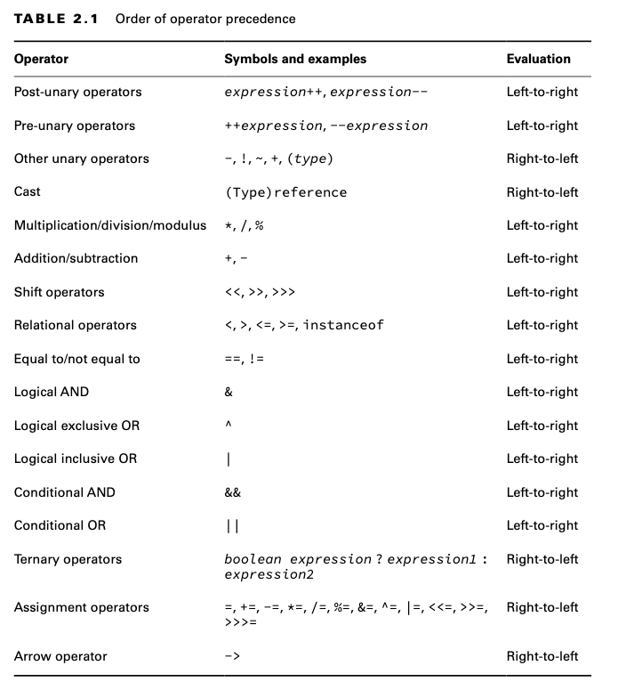
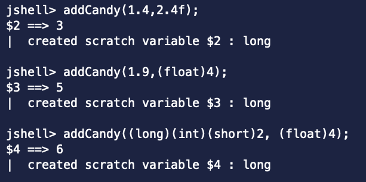
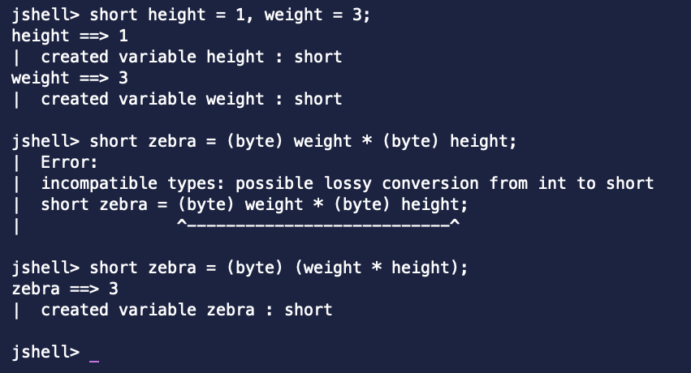
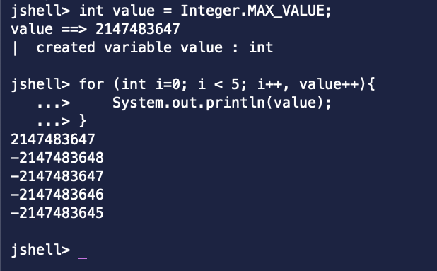

# Review Questions

1 - Which of the following Java operators can be used with boolean variables? (Choose all that apply.)

1 - Aşağıdaki Java operatörlerinden hangileri boolean değişkenlerle kullanılabilir? (Geçerli olanların tümünü seçin.)

```
A. ==
B. +
C. --
D. !
E. %
F. ~
G. Cast with (boolean)
```

**Cevap :** A, D, G. Seçenek A, equality operatörüdür ve primitive değerler ve object referansları üzerinde
kullanılabilir. Seçenek B ve C, her ikisi de arithmetic operatörlerdir ve boolean değerler üzerinde uygulanamaz. Seçenek
D, logical complement operator (mantıksal tamamlayıcı operatördür) ve yalnızca boolean değerlerle kullanılır. Seçenek E,
sadece numeric primitive type'larda kullanılabilen modulus operatörüdür. Seçenek F, sadece integer değerler üzerinde
uygulanabilen bitwise complement operator (bit düzeyinde tamamlayıcı operatördür). Son olarak, seçenek G doğrudur, çünkü
boolean bir variable type olduğu için boolean variable'ini cast edebilirsiniz

2 - What data type (or types) will allow the following code snippet to compile? (Choose all that apply.)

2 - Hangi data type'ı (veya type'ları) aşağıdaki kod parçacığının compile edilmesini sağlar? (Geçerli olan tümünü
seçin.)

```
byte apples = 5;
short oranges = 10;
_____ bananas = apples + oranges;
```

```
A. int
B. long
C. boolean
D. double
E. short
F. byte
```

**Cevap :** A, B, D. apples + oranges ifadesi otomatik olarak int type'ına promote ettirilir, bu nedenle int ve int
type'ına otomatik olarak promote ettirilebilen data type'ları çalışır. A, B ve D seçenekleri bu tür data type'larıdır.
Seçenek C çalışmaz çünkü boolean bir numeric data type değildir. Seçenekler E ve F, daha küçük bir data type'ına açık
bir cast yapılmadan çalışmaz

3 - What change, when applied independently, would allow the following code snippet to compile? (Choose all that apply)

3 - Bağımsız olarak uygulandığında aşağıdaki kod parçacığının compile edilmesini sağlayacak değişiklik nedir? (Geçerli
olan tümünü seçin.)

```
3: long ear = 10;
4: int hearing = 2 * ear;
```

```
A. No change; it compiles as is.
A. Değişiklik yok; olduğu gibi compile edilir.

B. Cast ear on line 4 to int.
B. Satır 4 deki ear'i int'e cast et

C. Change the data type of ear on line 3 to short.
C. Satır 3 deki ear'in data type'ini short olarak çevir 

D. Cast 2 * ear on line 4 to int.
D. Satır 4 deki 2 * ear'i int'e cast et

E. Change the data type of hearing on line 4 to short.
E. Satır 4 deki hearing'in data type'ini short olarak çevir 

F. Change the data type of hearing on line 4 to long.
F. Satır 4 deki hearing'in data type'ini long olarak çevir 
```

**Cevap :** B, C, D, F. Kod mevcut haliyle compile edilemez, bu nedenle A seçeneği doğru değildir. 2 * ear ifadesi
otomatik olarak long type'a promote ettirilir ve bu değer, int type'ında olan hearing değişkenine otomatik olarak
atanamaz. B, C ve D seçenekleri, long değerini int type'ına indirerek bu sorunu çözer. E seçeneği sorunu çözmez ve
aslında değeri daha küçük bir data type'ına yerleştirmeye çalışarak durumu daha da kötüleştirir. F seçeneği, assignment
type'ını long olacak şekilde artırarak sorunu çözer.

4 - What is the output of the following code snippet?

4 - Aşağıdaki kod parçacığının çıktısı nedir?

```
3: boolean canine = true, wolf = true;
4: int teeth = 20;
5: canine = (teeth != 10) ^ (wolf=false);
6: System.out.println(canine+", "+teeth+", "+wolf);
```

```
A. true, 20, true
B. true, 20, false
C. false, 10, true
D. false, 20, false
E. Satır 5 den dolayı code compile edilmez
F. Yukarıdakinlerden hiçbiri
```

**Cevap :** B. Kod herhangi bir sorun olmadan compile edilir, bu nedenle E seçeneği doğru değildir. Bu örnek 5.
satırdaki second assignment operator (ikinci atama operatörü) nedeniyle kafa karıştırıcı olabilir. (wolf=false)
expression'ı wolf değişkenine false değerini atar ve tüm expression için false değeri döner. teeth değişkeni 10'a eşit
olmadığından, sol taraf true döner; bu nedenle, tüm expression'ın exclusive OR (^) işlemi sonucunda canine değişkenine
true atanır. Çıktı, bu atamaları yansıtır ve teeth değişkeninde herhangi bir değişiklik olmaz. Bu nedenle, yalnızca B
seçeneği doğru cevaptır.

5 - Which of the following operators are ranked in increasing or the same order of precedence? Assume the + operator is
binary addition, not the unary form. (Choose all that apply.)

5 - Aşağıdaki operatörlerden hangileri artan veya aynı öncelik sırasına göre sıralanır? + operatörünün unary değil
binary toplama olduğunu varsayınız. (Geçerli olanların tümünü seçin.)

```
A. +, *, %, --
B. ++, (int), *
C. =, ==, !
D. (short), = , ! , *
E. *, /, %, +, ==
F. !, ||, &
G. ^, +, =, +=
```



**Cevap :** A, C. A ve C seçenekleri, artan veya aynı öncelik sırasındaki operatörleri göstermektedir. B ve E
seçenekleri ise azalan veya aynı öncelik sırasındaki operatörleri göstermektedir. D, F ve G seçenekleri ise ne artan ne
de azalan bir öncelik sırasına sahiptir. D seçeneğinde, assignment operatörü (=) iki unary operatör arasında yer almakta
ve çarpma operatörü (*) yanlış bir şekilde en yüksek öncelik sırasına konulmuştur. F seçeneğinde, mantıksal tamamlama
operatörü (!) en yüksek önceliğe sahiptir, bu yüzden en son sırada yer almalıdır. G seçeneğinde ise assignment
operatörleri en düşük öncelik sırasına sahiptir, bu nedenle son iki operatör en başta yer almalıdır.

6 - What is the output of the following program?

6 - Aşağıdaki programın çıktısı nedir?

```
1: public class CandyCounter {
2:      static long addCandy(double fruit, float vegetables) {
3:          return (int) fruit + vegetables;
4:      }
5:
6:      public static void main(String[] args) {
7:          System.out.print(addCandy(1.4, 2.4f) + ", ");
8:          System.out.print(addCandy(1.9, (float)4) + ", ");
9:          System.out.print(addCandy((long)(int)(short)2, (float)4)); } }
```

```
A. 4, 6, 6.0
B. 3, 5, 6
C. 3, 6, 6
D. 4, 5, 6
E. Satır 9 dan dolayı code compile edilmez
F. Yukarıdakinlerden hiçbiri
```

**Cevap :** F. Kod derlenmez çünkü 3. satırda bir compiler hatası vardır. (int) cast'i, fruit + vegetables
expression'ına değil, yalnızca fruit variable'ina uygulanır. Cast operator, addition (toplama) operatöründen daha yüksek
bir presedence'e sahip olduğu için fruit'e uygulanır, ancak expression vegetables variable'inin float olması nedeniyle
bir float'a promote eder. Sonuç, addCandy() methodu cast yapılmadığı sürece bir long olarak döndürülemez. Bu nedenle,
F seçeneği doğrudur. Eğer parantezler fruit + vegetables expression'ının etrafına eklenirse, çıktı 3, 5, 6 olur ve B
seçeneği doğru olur. Unutmayın, floating-point sayılar integral value'lara cast edildiğinde yuvarlama değil, kesme
(truncation) gerçekleşir.



7 - What is the output of the following code snippet?

7 - Aşağıdaki kod parçacığının çıktısı nedir?

```
int ph = 7, vis = 2;
boolean clear = vis > 1 & (vis < 9 || ph < 2);
boolean safe = (vis > 2) && (ph++ > 1);
boolean tasty = 7 <= --ph;
System.out.println(clear + "- " + safe + "- " + tasty);
```

```
A. true-true-true
B. true-true-false
C. true-false-true
D. true-false-false
E. false-true-true
F. false-true-false
G. false-false-true
H. false-false-false
```

**Cevap :** D. İlk boolean expression'ın da, vis 2 ve ph 7 olduğundan, bu expression true & (true || false)'a
değerlendirilir ve sonuç true olur. İkinci boolean expression'i koşullu operatörü kullanır ve (vis > 2) ifadesi false
olduğundan, sağ taraf değerlendirilmez ve ph 7 olarak kalır. Son atamada, ph 7'dir ve ön azaltma (pre-decrement)
operatörü önce uygulanır, bu da ifadeyi 7 <= 6'ya indirir ve false olarak bir atama ile sonuçlanır. Bu nedenlerle, D
seçeneği doğru cevaptır.

8 - What is the output of the following code snippet?

8 - Aşağıdaki kod parçacığının çıktısı nedir?

```
4: int pig = (short)4;
5: pig = pig++;
6: long goat = (int) 2; 
7: goat -= 1.0;
8: System.out.print(pig + " - " + goat);
```

```
A. 4 - 1
B. 4 - 2
C. 5 - 1
D. 5 - 2
E. Satır 7 den ötürü code compile edilmez
F. Yukarıdakinlerden hiçbiri
```

**Cevap :** A. Kod compile edilir ve sorunsuz bir şekilde çalışır, bu yüzden seçenek E yanlıştır. Satır 7, compound
operatör otomatik olarak type casting yaptığı için bir compiler hatası üretmez. Satır 5, pig değişkenini 1 artırır,
ancak post-increment operatörü kullandığı için orijinal değeri olan 4'ü döndürür. Pig değişkeni bu değeri alır ve
artırma işlemi geçersiz kılınır. Satır 7 sadece goat değişkeninin değerini 1 azaltır, bu da 4 - 1 çıktısını verir ve
böylece seçenek A doğru cevap olur.

9 - What are the unique outputs of the following code snippet? (Choose all that apply.)

9 - Aşağıdaki kod parçacığının benzersiz çıktıları nelerdir? (Geçerli olan tümünü seçin.)

```
int a = 2, b = 4, c = 2;
System.out.println(a > 2 ? --c : b++);
System.out.println(b = (a!=c ? a : b++));
System.out.println(a > b ? b < c ? b : 2 : 1);
```

```
A. 1
B. 2
C. 3
D. 4
E. 5
F. 6
G. Code compile edilmez
```

**Cevap :** A, D, E. Kod sorunsuz bir şekilde compile edilir, bu yüzden seçenek G yanlıştır. İlk expression'da, a > 2
false olduğundan b 5'e artırılır; ancak post-increment operatörü kullanıldığından, 4 yazdırılır ve bu da seçenek D'yi
doğru yapar. --c uygulanmamıştır, çünkü sağdaki expression'lardan yalnızca biri değerlendirilmiştir. İkinci
expression'da, a != c false çünkü c hiç değiştirilmedi. Önceki satır nedeniyle b 5'tir ve post-increment operatörü
kullanıldığından, b++ 5 döndürür. Sonuç, assignment operatörü ile b'ye atanır, böylece b'nin artırılmış değeri override
edilir ve 5 yazdırılır; bu da seçenek E'yi doğru yapar. Son expression'da, parantezler gerekli değildir; ancak
parantezlerin olmaması ternary expression'ları okumayı zorlaştırabilir. Önceki satırlardan a 2, b 5 ve c 2'dir. Bu
expression'i parantezlerle şu şekilde yeniden yazabiliriz: (2 > 5 ? (5 < 2 ? 5 : 2) : 1). İkinci ternary expression
hiçbir zaman değerlendirilmez, çünkü 2 > 5 false ve expression 1 döndürür; bu da seçenek A'yı doğru yapar.

10 - What are the unique outputs of the following code snippet? (Choose all that apply.)

10 - Aşağıdaki kod parçacığının benzersiz çıktıları nelerdir? (Geçerli olan tümünü seçin.)

```
short height = 1, weight = 3;
short zebra = (byte) weight * (byte) height; 
double ox = 1 + height * 2 + weight;
long giraffe = 1 + 9 % height + 1;
System.out.println(zebra);
System.out.println(ox);
System.out.println(giraffe);
```

```
A. 1
B. 2
C. 3
D. 4
E. 5
F. 6
G. Code compile edilemez.
```

**Cevap :** G. Kod, ikinci satırdaki bir hata nedeniyle compile edilmez. Hem height hem de weight byte olarak
cast edilmiş olsa da, multiplication (çarpma) operatörü bunları otomatik olarak int türüne promote eder, bu da bir int
değeri bir short değişkenine kaydetme girişimiyle sonuçlanır. Bu nedenle, kod derlenmez ve seçenek G tek doğru cevaptır.
Bu satır, tek compiler hatasını içermektedir.



11 - What is the output of the following code?

11 - Aşağıdaki kodun çıktısı nedir?

```
11: int sample1 = (2 * 4) % 3;
12: int sample2 = 3 * 2 % 3; 
13: int sample3 = 5 * (1 % 2);
14: System.out.println(sample1 + ", " + sample2 + ", " + sample3);
```

```
A. 0, 0, 5
B. 1, 2, 10
C. 2, 1, 5
D. 2, 0, 5
E. 3, 1, 10
F. 3, 2, 6
G. Bu code compile edilmez
```

**Cevap :** D. Öncelikle, * ve % aynı işlem önceliğine sahiptir, bu yüzden parantez olmadıkça expression soldan sağa
doğru değerlendirilir. İlk expression, 8 % 3 olarak değerlendirilir ve kalan 2 olur. İkinci expression, * ve % aynı
işlem önceliğine sahip olduğundan soldan sağa doğru değerlendirilir ve 6 % 3 olarak azaltılır, bu da 0 olur. Son
expression 5 * 1 olarak azaltılır ve sonuç 5 olur. Bu nedenle, 14. satırdaki çıktı 2, 0, 5'tir ve seçenek D doğru
cevaptır.

| Note |
|------|

1 2'ye bölüneyemeyeceği için remainder (kalan) 1 olur.

12 - The _________ operator increases a value and returns the original value, while the _______ operator decreases a
value and returns the new value.

```
A. post-increment, post-increment
B. pre-decrement, post-decrement
C. post-increment, post-decrement
D. post-increment, pre-decrement
E. pre-increment, pre-decrement
F. pre-increment, post-decrement
```

**Cevap :** D. pre-prefix, işlemin önce uygulandığını ve yeni değerin döndürüldüğünü belirtir; post-prefix ise işlemin
uygulanmasından önce orijinal değerin döndürüldüğünü belirtir. Ardından, artırma (increment) değeri artırırken,
azaltma (decrement) değeri düşürür. Bu nedenlerden dolayı, seçenek D doğru cevaptır.

13 - What is the output of the following code snippet?

13 - Aşağıdaki kod parçacığının çıktısı nedir?

```
boolean sunny = true, raining = false, sunday = true;
boolean goingToTheStore = sunny & raining ^ sunday;
boolean goingToTheZoo = sunday && !raining; 
boolean stayingHome = !(goingToTheStore && goingToTheZoo);
System.out.println(goingToTheStore + "-" + goingToTheZoo+ "-" +stayingHome);
```

```
A. true-false-false
B. false-true-false
C. true-true-true
D. false-true-true
E. false-false-false
F. true-true-false
G. None of the above
```

**Cevap :** F. İlk expression, & ve ^ operatörleri aynı önceliğe sahip olduğundan soldan sağa doğru değerlendirilir ve
false ^ sunday olarak azaltılır, bu da sunday true olduğu için true olur. İkinci expression, önce tersleme operatörü (!)
uygulanır ve expression sunday && true olarak azaltılır, bu da true olarak değerlendirilir. Son expression, her iki
değişken de true olduğundan !(true && true) olarak azaltılır ve bu da !true yani false olur. Bu nedenlerden dolayı,
seçenek F doğru cevaptır.

14 - Which of the following statements are correct? (Choose all that apply.)

14 - Aşağıdaki statement'lardan hangisi doğrudur? (Geçerli olan tümünü seçin.)

```
A. The return value of an assignment operation expression can be void.
A. Bir assignment operation expression'ın return type'ı void olabilir.

B. The inequality operator (!=) can be used to compare objects.
B. Eşitsizlik operatörü (!=) Object'leri karşılaştırmak için kullanılabilir.

C. The equality operator (==) can be used to compare a boolean value with a numeric value.
C. Eşitlik operatörü (==) boolean bir değeri numeric bir değerle karşılaştırmak için kullanılabilir.

D. During runtime, the & and | operators may cause only the left side of the expression to be evaluated.
D. Runtime sırasında & ve | operator'leri expression'ın yalnızca sol tarafının değerlendirilmesine neden olabilir.

E. The return value of an assignment operation expression is the value of the newly assigned variable.
E. Bir assignment operation'ı expression'ının return değeri, yeni assign edilen değişkenin değeridir.

F. In Java, 0 and false may be used interchangeably.
F. Java'da 0 ve false birbirinin yerine kullanılabilir.

G. The logical complement operator (!) cannot be used to flip numeric values.
G. Mantıksal tümleyen operatörü (!) numeric değerleri çevirmek için kullanılamaz.
```

**Cevap :** B, E, G. Bir expression'da assignment operation'ının return değeri, yeni assign edilen değişkenin değeriyle
aynıdır. Bu nedenle, seçenek A yanlıştır ve seçenek E doğrudur. Seçenek B doğrudur, çünkü eşitlik (==) ve
eşitsizlik (!=) operatörleri object'lerle kullanılabilir. Seçenek C yanlıştır, çünkü boolean ve numeric türler
karşılaştırılamaz. Örneğin, true == 3 demek compiler hatasına neden olur. Seçenek D yanlıştır, çünkü mantıksal
operatörler expression'ın her iki tarafını da değerlendirir. | operatörü her iki tarafın da değerlendirilmesine neden
olur. Seçenek F yanlıştır, çünkü Java, boolean değerler için sayıları kabul etmez. Son olarak, seçenek G doğrudur, çünkü
numeric değerleri tersine çevirmek veya negatif yapmak için mantıksal tamamlayıcı operatör (!) değil, tersleme
operatörü (-) kullanılmalıdır.

15 - Which operators take three operands or values? (Choose all that apply.)

15 - Hangi operatörler üç operand veya değer alır? (Geçerli olanları seçin.)

```
A. =
B. &&
C. *=
D. ? :
E. &
F. ++
G. /
```

**Cevap :** D. Üç değer alan tek operatör üçlü (ternary) operatördür, bu nedenle seçenek D tek doğru seçimdir. Seçenek
A, B, C, E ve G, tümü ikili (binary) operatörlerdir. Bu operatörler daha uzun expression'lar da bir arada
kullanılabilir, ancak her işlem yalnızca iki değeri aynı anda kullanır. Seçenek F ise bir unary (tekli) operatördür ve
yalnızca bir değer alır.

16 - How many lines of the following code contain compiler errors?

16 - Aşağıdaki kodun kaç satırı compiler hatası içerir?

```
int note = 1 * 2 + (long)3;
short melody = (byte)(double)(note *= 2);
double song = melody;
float symphony = (float)((song == 1_000f) ? song * 2L : song);
```

```
A. 0
B. 1
C. 2
D. 3
E. 4
```

**Cevap :** B. İlk satırda compiler hatası bulunmaktadır. Değer 3, long tipine cast edilmiştir. 1 * 2 expression'ı önce
int olarak değerlendirilir, ancak 3 ile toplandığında long tipine promote edilir. Bir long değerini bir int değişkenine
atamaya çalışmak, compiler hatasına neden olur. Diğer satırlarda ise daha küçük değerler, daha büyük veya aynı boyuttaki
data type'larında saklanmaktadır. 2. ve 4. satırlarda bunun için casting kullanılmıştır. Sadece bir satır derlenemediği
için B seçeneği doğrudur.

| Note : |
|--------|

Cast operatorü right to left çalışır

```
short melody = (byte) (double) (note *= 2);
```

note *= 2 once double'a ardından byte'a cast edilir.

17 - Given the following code snippet, what are the values of the variables after it is executed? (Choose all that
apply.)

17 - Aşağıdaki kod parçacığı göz önüne alındığında, çalıştırıldıktan sonra değişkenlerin değerleri ne olur? (Geçerli
olanların tümünü seçin.)

```
int ticketsTaken = 1;
int ticketsSold = 3;
ticketsSold += 1 + ticketsTaken++;
ticketsTaken *= 2;
ticketsSold += (long)1;
```

```
A. ticketsSold is 8.
B. ticketsTaken is 2.
C. ticketsSold is 6.
D. ticketsTaken is 6.
E. ticketsSold is 7.
F. ticketsTaken is 4.
G. Code compile edilmez
```

**Cevap :** C, F. ticketsTaken ve ticketsSold değişkenlerinin başlangıç değerleri sırasıyla 1 ve 3’tür. İlk compound
assignment işleminden sonra, ticketsTaken değeri 2’ye yükseltilir. ticketsSold değeri ise 3’ten 5’e çıkar; burada
post-increment operatörü kullanıldığı için, ticketsTaken++ expression'ının döndürdüğü değer 1’dir. Sonraki satırda,
ticketsTaken şu anda 2 değerine sahip olduğu için *=2 ile 4 olur. Son satırda, ticketsSold değeri 1 artarak 6 olur.
Sonuç olarak, değişkenlerin son değerleri: ticketsTaken: 4 ticketsSold: 6. Bu nedenle doğru cevaplar C ve F’dir. Ayrıca,
son satırda derleme hatası oluşmaz çünkü compound operatör, sağdaki operandı otomatik olarak uygun tipe casting yapar

18 - Which of the following can be used to change the order of operation in an expression? (Choose all that apply.)

18 - Bir expression'da işlem sırasını değiştirmek için aşağıdakilerden hangisi kullanılabilir? (Geçerli olan tümünü
seçin.)

```
A. [ ]
B. < >
C. ( )
D. \ /
E. { }
F. " "
```

**Cevap :** C. Bir expression'da işlem sırasını değiştirmek için yalnızca parantezler ( ) kullanılabilir, bu da C
seçeneğini doğru yapar. Diğer operatörler, örneğin [ ], < > ve { }, Java'da parantezler gibi kullanılamaz.

19 - What is the result of executing the following code snippet? (Choose all that apply.)

19 - Aşağıdaki kod parçacığının çalıştırılmasının sonucu nedir? (Geçerli olan her şeyi seçin.)

```
3: int start = 7;
4: int end = 4;
5: end += ++start;
6: start = (byte)(Byte.MAX_VALUE + 1);
```

```
A. start is 0.
B. start is -128.
C. start is 127.
D. end is 8.
E. end is 11.
F. end is 12.
G. Code compile edilmez
H. Compile edilir fakat runtime'da exception fırlatır
```

**Cevap :** B, F. Kod başarıyla compile edilir ve çalışır, bu nedenle G ve H seçenekleri yanlıştır. 5. satırda,
pre-increment operatörü önce çalıştırılır. Bu nedenle, start 8'e yükseltilir ve yeni değer expression'ın sağ tarafında
kullanılır. end değeri, 8 ile başlangıç değeri olan 4'ün toplanmasıyla hesaplanır ve end'in yeni değeri 12 olur. Bu, F
seçeneğini doğru yapar. 6. satırda, bir artırma işlemi (increment) ile byte veri tipinin maksimum değerini aşarız. Bu,
taşmaya (overflow) neden olur ve sonuç negatif bir sayı olur. Bu, B seçeneğini doğru yapar. Byte veri tipinin maksimum
değerini bilmiyor olsanız bile, kodun compile edilip çalıştığını ve start'ın negatif bir değere dönüşmesi gerektiğini
çıkarabilirsiniz.

| Overflow Örneği |
|-----------------|



20 - Which of the following statements about unary operators are true? (Choose all that apply.)

20 - Unary operatörlerle ilgili aşağıdaki statement'lardan hangileri true? (Geçerli olan tümünü seçin.)

A. Unary operators are always executed before any surrounding numeric binary or ternary operators.

A. Unary operatörler, her zaman çevreleyen numeric binary veya ternary operatörlerden önce çalıştırılır.

B. The - operator can be used to flip a boolean value.

B. Boolean bir değeri çevirmek için - operatörü kullanılabilir.

C. The pre-increment operator (++) returns the value of the variable before the increment is applied.

C. Pre-increment operatörü (++) artırma işlemi uygulanmadan önce ki değişkenin değerini döndürür.

D. The post-decrement operator (--) returns the value of the variable before the decrement is applied.

D. Post-decrement operatörü (--), azaltma işlemi uygulanmadan önce ki değişkenin değerini döndürür.

E. The ! operator cannot be used on numeric values.

E. ! operatörü sayısal değerler üzerinde kullanılamaz.

F. Yukarıdakinlerden hiçbiri

**Cevap :** A, D, E. Unary operatörler en yüksek önceliğe sahiptir, bu nedenle seçenek A doğrudur. Negation
operatörü (-) yalnızca sayısal değerler için kullanılırken, mantıksal tamamlayıcı operatörü (!) yalnızca boolean
(true/false) değerler için kullanılır. Bu nedenlerle, seçenek B yanlıştır ve seçenek E doğrudur. Son olarak, Pre
increment/decrement operatörleri değişkenin yeni değerini döndürürken, Post increment/decrement operatörleri orijinal
değeri döndürür. Bu nedenlerle, seçenek C yanlıştır ve seçenek D doğrudur.

| A seçeneğinin açıklaması |
|--------------------------|

Java'da işlemlerin sırasını belirleyen öncelik kurallarına göre:

* Unary operatörler (ör. +, -, ++, --, !) en yüksek önceliğe sahiptir.

* Ardından binary operatörler (ör. +, -, *, /) gelir.

* Ternary operatör (condition ? trueValue : falseValue) daha düşük bir önceliğe sahiptir.

21 - What is the result of executing the following code snippet?

21 - Aşağıdaki kod parçacığının çalıştırılmasının sonucu nedir?

```
int myFavoriteNumber = 8; 
int bird = ~myFavoriteNumber; 
int plane = -myFavoriteNumber; 
var superman = bird == plane ? 5 : 10; 10
System.out.println(bird + "," + plane + "," + --superman);
```

```
A. -7, -8 , 9
B. -7, -8, 10
C. -8, -8, 4
D.-8, -8, 5
E. -9,-8,9
F. -9,-8,10
G. Yukarıdakinlerden hiçbiri
```

**Cevap :** E. 8'in bitwise complementini bulmak için:

```
int myFavoriteNumber = 8; 
int bird = ~myFavoriteNumber; // (-1 * myFavoriteNumber -1);
```

Bu da bird değişkeninin -9 olmasını sağlar. Buna karşılık, plane -8 olur çünkü myFavoriteNumber değeri negatif hale
getirilmiştir. Bird ve plane farklı olduğundan, superman değişkenine 10 değeri atanır. Pre-decrement operatörü
superman'ı alır, 1 çıkarır ve yeni değeri döndürerek 9 olarak yazdırır. Bu nedenle, seçenek E doğrudur.