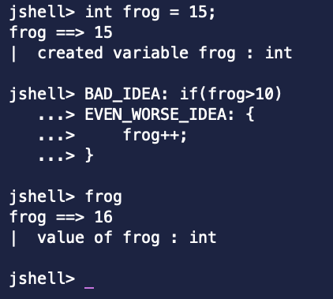

Birçok programlama dili gibi, Java da temelde variable'lar, operatörler ve mantıklı bir sırayla bir araya getirilmiş
statement'lardan oluşur. Son bölümde, variable'ların nasıl oluşturulup manipüle edileceğini ele almıştık. Ancak yazılım
geliştirmek, sadece variable'ları yönetmekten ibaret değildir; akıllı kararlar verebilen uygulamalar oluşturmakla
ilgilidir. Bu bölümde, dildeki çeşitli karar verme statement'larını sunacağız. Bu bilgi, kitap boyunca göreceğiniz
karmaşık fonksiyonlar ve sınıf yapılarını oluşturmanıza olanak sağlayacaktır.

# Creating Decision - Making Statements (Karar verme - Statement'ların Oluşturulması)

Java operatörleri, birçok complex expression oluşturmanıza olanak tanır, ancak program akışını kontrol etme şekilleri
sınırlıdır. Örneğin, bir method yalnızca belirli koşullar altında çalıştırılacaksa ve bu koşullar runtime'da
değerlendirilmesi gerekiyorsa, bunu nasıl yaparsınız? Örneğin, yağmurlu günlerde bir hayvanat bahçesi, ziyaretçilere
şemsiye getirmelerini hatırlatmalıdır; ya da karlı bir günde, hayvanat bahçesi kapanmak zorunda kalabilir. Yazılım
değişmez, ancak yazılımın behavior (davranışı), o an sağlanan inputlara bağlı olarak değişmelidir. Bu bölümde,
decision-making-statement (karar verme ifadelerini), if ve else komutlarını ve yeni pattern matching (desen eşleştirme)
özelliğini tartışacağız.

## Statements and Blocks

Hatırlayacağınız gibi, 1. Bölüm'de, bir Java statement'i, Java'da bir tamamlanmış execution birimidir ve noktalı
virgülle (;) sonlandırılır. Bu bölümde, çeşitli Java control flow statement (kontrol akışı ifadelerini) tanıtıyoruz.
Control flow statement'ları, decision-making (karar verme), looping (döngüleme) ve branching (dallanma) kullanarak
yürütme akışını kesintiye uğratır ve uygulamanın belirli kod bölümlerini seçici bir şekilde çalıştırmasına olanak tanır.

Bu statement'lar, tek bir expression veya bir Java kodu bloğu üzerinde de uygulanabilir. 1. Bölümde açıklandığı gibi,
Java'da bir kod bloğu, dengeli süslü parantezler ({}) arasında yer alan sıfır veya daha fazla statement'dan oluşan bir
grup olup, tek bir statement'in izin verildiği her yerde kullanılabilir. Örneğin, aşağıdaki iki kod parçası eşdeğerdir;
birincisi tek bir expression iken, ikincisi aynı statement'i içeren bir bloğu gösterir:

```
//single statement
patrons++;

//Statement inside a block
{
    patrons++;
}
```

Bir statement veya block, genellikle bir decision-making statement'inin hedefi olarak kullanılır. Örneğin, bu iki örneğe
decision-making statement'i olan if statement'ini ekleyebiliriz:

```
//Single statement
if (ticketsTaken > 1)
    patrons++;
    
//Statement inside a block
if (ticketsTaken > 1) {
    patrons++;
}
```

Yine, bu iki kod parçası eşdeğerdir. Sadece şunu unutmayın ki, bir decision-making statement'inin hedefi tek bir
statement veya bir statement bloğu olabilir. Bu bölümün geri kalanında, sınavda göreceğiniz konularda sizi daha iyi
hazırlamak için her iki formu da kullanacağız.

| Note : |
|--------|

Önceki iki örnek eşdeğer olsa da, stil açısından blokların kullanılması genellikle tercih edilir, hatta blok yalnızca
bir ifade statement içerse bile. İkinci formun avantajı, çevresindeki yapıyı değiştirmeden bloğa hızlı bir şekilde yeni
kod satırları ekleyebilmenizdir.

## The if Statement

Çoğu zaman, bir bloğun yalnızca belirli koşullar altında çalıştırılmasını isteriz. Figure 3.1'de gösterildiği gibi if
statement'i, uygulamamızın yalnızca bir boolean expression'ının runtime'da true olarak değerlendirildiği durumlarda
belirli bir kod bloğunu çalıştırmasına olanak tanıyarak bunu gerçekleştirir.


| Note : |
|--------|

Süslü parantezler, birden fazla statement'dan oluşan bloklar için gereklidir; ancak, tek bir statement için optional'dir

Örneğin, saat dilimini temsil eden ve 0 ile 23 arasında bir tamsayı değeri alan bir fonksiyonumuz olduğunu ve bu
fonksiyonun kullanıcıya bir mesaj görüntülediğini hayal edelim:

```
if(hourOfDay < 11)
    System.out.println("Good Morning");
```

Eğer günün saati 11’den küçükse, mesaj görüntülenecektir. Şimdi, her selamlama mesajı yazdırıldığında bir değeri,
morningGreetingCount'u artırmak istediğimizi varsayalım. if statement'ini iki kez yazabilirdik, ancak Java bize bir blok
kullanarak daha doğal bir yaklaşım sunar:

```
if(hourOfDay < 11) {
    System.out.println("Good Morning");
    morningGreetingCount++;
}
```

| Watch Indentation and Braces (Girin ve parantezleri izleyin) |
|--------------------------------------------------------------|

Sınav yazarlarının sizi zorlamak isteyebileceği bir alan, süslü parantez ({}) kullanılmayan if ifadeleridir. Örneğin, bu
biraz değiştirilmiş haliyle örneğimize bir göz atın:

```
if(hourOfDay < 11)
    System.out.println("Good Morning");
    morningGreetingCount++;
```

Indentation'a (girinti) dayanarak, morningGreetingCount variable'inin yalnızca hourOfDay 11'den küçükse artırılacağını
düşünebilirsiniz. Ancak, bu kod bunu yapmaz. Şart sağlanırsa yalnızca yazdırma ifadesi çalıştırılır, ancak artırma
işlemi her zaman gerçekleştirilir. Unutmayın, Java’da, diğer bazı programlama dillerinden farklı olarak, tab tuşları
yalnızca boşluk olarak kabul edilir ve execution'ın bir parçası olarak değerlendirilmez. Bir soruda bir control flow
statement (kontrol akışı ifadesi) gördüğünüzde, karşılaşabileceğiniz indentation'ları göz ardı ederek bloğun açık ve
kapalı süslü parantezlerini dikkatlice takip ettiğinizden emin olun.

## The else Statement

Örneğimizi biraz genişletelim. Eğer saat 11 veya daha geçse farklı bir mesaj görüntülemek istersek ne olur? Bunu
yalnızca elimizdeki araçlarla yapabilir miyiz? Tabii ki yapabiliriz!

```
if(hourOfDay < 11) {
    System.out.println("Good Morning");
}

if(hourOfDay >= 11) {
    System.out.println("Good Afternoon");
}
```

Bu durum biraz gereksiz görünüyor, çünkü hourOfDay üzerinde iki kez değerlendirme yapıyoruz. Neyse ki, Java bize daha
kullanışlı bir yaklaşım sunuyor: else statement'i. Figure 3.2'de gösterildiği gibi else, bu tür durumlarda işimizi
kolaylaştırır.


Örneğimize dönelim:

```
if(hourOfDay < 11) {
    System.out.println("Good Morning");
} else 
    System.out.println("Good Afternoon");
```

Artık kodumuz gerçekten iki olası seçenek arasında branch (dallanıyor) ve boolean değerlendirmesi yalnızca bir kez
yapılıyor. else statement'i, if statement'ı ile aynı şekilde bir statement veya statement bloğu alır. Benzer şekilde,
daha ayrıntılı bir örneğe ulaşmak için bir else bloğuna ek if statement'ları ekleyebiliriz:

```
if(hourOfDay < 11) {
    System.out.println("Good Morning");
} else if(hourOfDay < 15) {
    System.out.println("Good Afternoon");
} else {
    System.out.println("Good Evening");
}
```

| Verifying That the if Statement Evaluates to a Boolean Expression |
|-------------------------------------------------------------------|

```
int hourOfDay = 1;
if(hourOfDay) { // DOES NOT COMPILE
    ...
}
```

Bu statement, bazı diğer programlama ve betik dillerinde geçerli olabilir, ancak Java'da 0 ve 1 boolean değerler olarak
kabul edilmez.

## Shortening Code with Pattern Matching (Pattern Matching ile kod kısaltma)

Java 16, resmi olarak if statement'ları ve instanceof operatörü ile pattern matching'i tanıttı. Pattern matching,
yalnızca belirli kriterlere uyan bir kod bölümünü çalıştıran bir program akışı kontrol tekniğidir. Daha büyük program
kontrolü sağlamak için if statement'ları ile birlikte kullanılır.

| Note : |
|--------|

Eğer pattern matching sizin için yeni bir konuysa, bunu Java Pattern sınıfı veya regular expression (regex) ile
karıştırmamaya dikkat edin. Pattern matching, filtreleme için regular expression'ların kullanımını içerebilse de, bu iki
kavram birbirinden bağımsızdır.

Pattern matching, kodunuzdaki gereksiz tekrarları azaltmak için kullanabileceğiniz yeni bir araçtır. Gereksiz kod
(boilerplate code), bir kod bölümünde benzer şekilde tekrar tekrar kullanılan koddur. Java dilindeki birçok yeni
iyileştirme, boilerplate code'u azaltmaya odaklanmaktadır.

Bu aracın neden eklendiğini anlamak için, bir Number instance'ini alıp 5 ile karşılaştıran aşağıdaki kodu inceleyin.
Eğer Number veya Integer ile daha önce karşılaşmadıysanız, şimdilik Integer'ın Number sınıfından inherit edildiğini
bilmeniz yeterlidir. Bu kavramları bu kitapta sıkça göreceksiniz!

```
void compareIntegers(Number number)  {
    if(number instanceof Integer) {
        Integer data = (Integer)number;
        System.out.print(data.compareTo(5));
    }
}
```

Casting işlemi gereklidir çünkü compareTo() methodu Integer sınıfında tanımlanmıştır, ancak Number sınıfında
tanımlanmamıştır.

Java dünyasında, bir değişkenin belirli bir type'da olup olmadığını kontrol eden ve ardından hemen o türe cast eden kod
oldukça yaygındır. Bu o kadar yaygındır ki, Java'nın yazarları bunun için daha kısa bir syntax uygulamaya karar
verdiler:

```
void compareIntegers (Number number){
    if(number instanceof Integer data){
        System.out.println(data.compareTo(5));
    }
}
```

Bu örnekteki data değişkeni, pattern variable olarak adlandırılır. Dikkat edilmesi gereken nokta, bu kodun herhangi bir
olası ClassCastException'ı da önlemesidir, çünkü cast operation yalnızca instanceof operatörünün sonuç olarak true
döndürdüğü durumda gerçekleştirilir.

| Reassigning Pattern Variables (Pattern variable'ının tekrar assign edilmesi |
|-----------------------------------------------------------------------------|

Mümkün olsa da, bir pattern variable'ini reassign etmek kötü bir practice olarak kabul edilir, çünkü bunu yapmak neyin
scope dahilinde olup olmadığı konusunda belirsizliğe yol açabilir.

```
if(number instanceof Integer data) {
    data = 10;
}
```

Reassing, final modifier'i ile engellenebilir, ancak en iyisi, variable'a hiç reassign yapmamaktır.

```
if(number instanceof final Integer data) {
    data = 10; // DOES NOT COMPILE
}
```

## Pattern Variables and Expressions

Pattern matching, dataları filtrelemek için kullanılabilecek expression'ları içerir. Aşağıdaki örnek bunu sağlar:

```
void printIntegersGreaterThan5(Number number) {
    if(number instanceof Integer data && data.compareTo(5)>0)
        System.out.print(data);
}
```

Bir dizi filtre veya pattern uygulayarak if statement'inin yalnızca belirli koşullar altında çalıştırılmasını
sağlayabiliriz. Dikkat ederseniz, pattern variable'inin, declare edildiği satırda bir expression kullanıyoruz.

```
interface Shape { }
record Rectangle(double length, double width) implements Shape { }
record Circle(double radius) implements Shape { }
...
    public static double getPerimeter(Shape shape) throws IllegalArgumentException {
        if (shape instanceof Rectangle r) {
            return 2 * r.length() + 2 * r.width();
        } else if (shape instanceof Circle c) {
            return 2 * c.radius() * Math.PI;
        } else {
            throw new IllegalArgumentException("Unrecognized shape");
        }
    }
```

Her ne kadar interface,record ve implementasyon ile ilgili konulara gelmemiş olsak da yukarıda ki örnek Pattern
Variable'lara çok güzel bir örnektir.

## Subtypes

Pattern Variable'in türü, expression'da sol taraftaki variable'in bir subtype'ı olmalıdır. Ayrıca, type'ların ikiside
aynı olamaz. Ancak, bu kural geleneksel instanceof operatörü expression'ları için geçerli değildir. Aşağıdaki iki
instanceof operatörü kullanımını inceleyin:

```
Integer value = 123;
if(value instanceof Integer) {}         //TRADITIONAL instanceof EXPRESSION (geleneksel instanceof operatörü)
if(value instanceof Integer data) {}    // DOES NOT COMPILE
```

İkinci satır derlenirken, son satır derlenmez çünkü pattern-matching, pattern variable türü olan Integer'ın, Integer'ın
kesin bir subtype'ı olmasını gerektirir.

| Limitations of Subtype Enforcement (Subtype Yaptırımlarının Sınırlamaları) |
|----------------------------------------------------------------------------|

Compiler, class'lar ve interface'leri mixlediğimizde pattern matching typel'larını zorunlu kılma konusunda bazı
sınırlamalara sahiptir. Bu durum, 7. Bölüm "Beyond Classes" bölümünü okuduktan sonra daha mantıklı gelecektir. Örneğin,
Number gibi non-final bir sınıf ve List gibi bir interface verildiğinde, birbirleriyle ilişkili olmamalarına rağmen
aşağıdaki kod compile edilir:

```
Number value = 123;
if(value instanceof List) {}
if(value instanceof List data) {}
```

## Flow Scoping (Akış Kapsam Belirleme)

Compiler, pattern matching ile çalışırken flow scoping (akış kapsamını) uygular. Flow scoping, variable'in yalnızca
compiler'in type'ını kesin olarak belirleyebildiği durumlarda geçerli olduğu anlamına gelir. Flow scoping, instance,
class veya local scoping gibi kesin bir şekilde hiyerarşik değildir; bunun yerine, programın dallanması ve akışı temel
alınarak compiler tarafından belirlenir.

Bu bilgi ışığında, aşağıdaki kodun neden derlenmediğini görebiliyor musunuz?

```
void printIntegersOrNumbersGreaterThan5(Number number) {
    if(number instanceof Integer data || data.compareTo(5)>0)
        System.out.print(data);
}
```

Eğer input Integer sınıfından inherit edilmediyse, data variable'i undefined olur. Compiler, data'nın kesin olarak bir
Integer instance'i olduğunu garanti edemediği için data scope'da değildir ve bu nedenle kod compile edilmez.

Peki ya bu örnek?

```
void printIntegerTwice(Number number) {
    if (number instanceof Integer data)
        System.out.print(data.intValue());
    System.out.print(data.intValue()); // DOES NOT COMPILE
}
```

Eğer input Integer'dan inherit edilmediyse, data variable'i if statement'ından sonra artık scope da değildir. O zaman
pattern variable'inin yalnızca if statement'inin içinde scope da olduğunu düşünebilirsiniz, değil mi? Aslında, tam
olarak öyle değil! İşte compile edilen bir örneği inceleyelim:

```
void printOnlyIntegers(Number number) {
    if (!(number instanceof Integer data))
        return;
    System.out.print(data.intValue());
}
```

Bu kodun compile ediliyor olması sizi şaşırtabilir. Nasıl olur? Bu durumda, method input Integer'dan inherit edilmemişse
geri döner. Bu da, methodun son satırına ulaşıldığında, input'un mutlaka Integer'dan inherit edilmiş olması gerektiği
anlamına gelir. Bu nedenle, if statement'i sona erse bile data variable'i scope'da kalır.

| Flow Scoping and else Branches (Akış Scope'u ve Diğer Dallar) |
|---------------------------------------------------------------|

Eğer son kod örneği sizin kafanızı karıştırdıysa endişelenmeyin: yalnız değilsiniz! Bununla başa çıkmanın başka bir
yolu, aynı mantığı bir else statement'i kullanarak yeniden yazmaktır:

```
void printOnlyIntegers(Number number) {
    if (!(number instanceof Integer data))
        return;
    else
        System.out.print(data.intValue());
}
```

Bir adım daha ileri gidip if ve else branch'lerini, boolean expression'ını ters çevirerek değiştirebiliriz:

```
void printOnlyIntegers(Number number){
    if (number instanceof Integer data)
        System.out.println(data.intValue());
    else
        return;
}
```

Yeni kodumuz, orijinal kodumuzla eşdeğerdir ve compiler'ın data değişkeninin yalnızca number bir Integer olduğunda
scope'da olduğunu nasıl belirleyebildiğini daha iyi gösterir.

Flow scoping'in nasıl çalıştığını anladığınızdan emin olun. Özellikle, bir pattern variable'ini if statement'inin
dışında kullanmak mümkündür, ancak bu yalnızca compiler'in türünü kesin olarak belirleyebildiği durumlarda
geçerlidir.

# Applying switch Statements (Switch Statement'larının Uygulanması)

Eğer tek bir değer için birçok olası branches (dal) veya yolumuz varsa ne yaparız? Örneğin, haftanın gününe bağlı olarak
farklı bir mesaj yazdırmak isteyebiliriz. Bunu kesinlikle yedi if veya else statement'i ile gerçekleştirebiliriz, ancak
bu genellikle uzun, okunması zor ve bakımı pek eğlenceli olmayan kodlar oluşturur:

```
public void printDayOfWeek(int day) {
    if(day == 0)
        System.out.print("Sunday");
    else if(day == 1)
        System.out.print("Monday");
    else if(day == 2)
        System.out.print("Tuesday");
    else if(day == 3)
        System.out.print("Wednesday");
    ...
}
```

Neyse ki, Java ve birçok diğer programlama dili daha temiz bir yaklaşım sunar. Bu bölümde, program flow'unu kontrol
etmek için kullanılan switch statement'ini ve daha yeni bir özellik olan switch expression'ı ele alıyoruz.

## The switch Statement

Bir switch statement'i, Figure 3.3'te gösterildiği gibi, tek bir değerin değerlendirildiği ve flow'un ilk matching
branch - case statement olarak bilinir - yönlendirildiği karmaşık bir karar yapısıdır. Eğer değeri eşleşen bir case
ifadesi bulunmazsa, optional bir default statement çağrılır. Eğer böyle bir default seçeneği mevcut değilse, tüm switch
statement'i atlanır. Figure 3.3'te dikkat edin ki, case değerleri virgüller kullanılarak tek bir case statement'ında
combine edilebilir.


Switch statement'ları çoğu karar yapısından daha uzun olabileceğinden, sınavda geçersiz switch syntax'ı verilebilir. Bu,
dikkatli olup olmadığınızı test etmek için yapılabilir.

| Combining case Values (Case değerlerinin birleştirilmesi) |
|-----------------------------------------------------------|

Figure 3.3'te yeni bir şey fark ettiniz mi? Java 14 ile başlayarak, case değerleri artık combine edilebilir:

```
switch(animal) {
    case 1,2: System.out.print("Lion");
    case 3: System.out.print("Tiger");
}
```

Java 14'ten önce, eşdeğer kod aşağıdaki gibi olurdu:

```
switch(animal) {
    case 1: case 2: System.out.print("Lion");
    case 3: System.out.print("Tiger");
}
```

Birazdan göreceğiniz gibi, switch expression'ları boilerplate kodunu daha da azaltabilir!

Aşağıdaki switch statement'larının her birinin neden compile edilmediğini bulmaya çalışın:

```
int month = 5;

switch month { // DOES NOT COMPILE
    case 1: System.out.print("January");
}

switch(month) // DOES NOT COMPILE
    case 1: System.out.print("January");

switch(month) {
    case 1: 2: System.out.print("January"); // DOES NOT COMPILE
}
```

İlk switch statement'ı compile edilmez çünkü switch variable'inin etrafında parantezler eksiktir. İkinci statement
compile edilmez çünkü switch gövdesinin etrafında süslü parantezler eksiktir. Üçüncü statement derlenmez çünkü
combine edilmiş case statement'larını ayırmak için, iki nokta üst üste (:) değil, virgül (,) kullanılmalıdır.

Sınavda bilmeniz gereken son bir not: Bir switch statement'ı, herhangi bir case statement'i içermek zorunda değildir.
Örneğin, aşağıdaki statement tamamen geçerli bir switch statement'idir:

```
switch(month) {}
```

printDayOfWeek() methodumuzu tekrar ele alırsak, bunu if/else statement'ları yerine bir switch statement'ı kullanarak
yeniden yazabiliriz:

```
public void printDayOfWeek(int day) {
    switch(day) {
        case 0:
            System.out.print("Sunday");
            break;
        case 1:
            System.out.print("Monday");
            break;
        case 2:
            System.out.print("Tuesday");
            break;
        case 3:
            System.out.print("Wednesday");
            break;
        case 4:
            System.out.print("Thursday");
            break;
        case 5:
            System.out.print("Friday");
            break;
        case 6:
            System.out.print("Saturday");
            break;
        default:
            System.out.print("Invalid value");
            break;
} }
```

Basitlik adına, geçersiz bir değer olduğunda sadece bir mesaj yazdırıyoruz. Ancak, exception'lar hakkında bilgi
sahibiyseniz veya zaten "Exceptions and Localization" (Bölüm 11) okuduysanız, eğer eşleşen bir değer bulunmazsa
default branch'inde bir exception fırlatmak daha mantıklı olabilir.

## Exiting with break Statements (break Statement'ları ile Çıkış)

Önceki printDayOfWeek() uygulamamıza bakıldığında, her bir case ve default bölümünün sonunda bir break statement'ı
olduğunu görüyorsunuz. Bir break statement'ı, switch statement'ını sonlandırır ve flow control'u çevreleyen işleme geri
verir. Kısacası, bu statement switch statement'ını hemen sonlandırır. Break statement'ları optional'dir, ancak bunlar
olmadan, eşleşen bir case statement'i bulunduktan sonra tüm takip eden branch'ler çalıştırılır, ayrıca bulduğu herhangi
bir default statement'ı da dahil. Her branch'de break statement'ları olmadığında, case ve default statement'larının
sırası oldukça önemli hale gelir. Peki, printSeason(2) çağrıldığında aşağıdaki kod ne yazdırır?

```
public void printSeason(int month) {
    switch(month) {
        case 1, 2, 3: System.out.print("Winter");
        case 4, 5, 6: System.out.print("Spring");
        default: System.out.print("Unknown");
        case 7, 8, 9: System.out.print("Summer");
        case 10, 11, 12: System.out.print("Fall");
} }
```

Herşey print edilir;

```
WinterSpringUnknownSummerFall
```

İlk case statement'ı ile eşleşir ve bulundukları sırayla tüm branch'leri, default statement'ı dahil, çalıştırır. Her
case statement'ından sonra bir break statement'i kullanmak yaygındır, ancak kesinlikle zorunlu değildir.

month değişkeni olarak 7 gönderseydik:

```
SummerFall
```

yazdıralacaktı.

## Selecting switch Data Types (Switch Veri Türlerini Seçme)

Figure 3.3'te gösterildiği gibi, bir switch statement'ı, runtime'a kadar değerlendirilmeyen bir hedef değişkene
sahiptir. Bu hedefin türü, seçilen primitive veri türlerini (int, byte, short, char) ve bunlarla ilişkili wrapper
sınıflarını (Integer, Byte, Short, Character) içerebilir. Aşağıda, switch statement'i tarafından desteklenen tüm veri
türlerinin bir listesi bulunmaktadır:

* int and Integer

* byte and Byte

* short and Short

* char and Character

* String

* enum values

* var (eğer type önceki type'lardan birine resolve ediliyorsa)

Bu bölüm için, bir enum'un, haftanın günleri, aylar gibi constant bir değerler kümesini temsil ettiğini bilmeniz
yeterlidir. Enum'ları daha ayrıntılı olarak Bölüm 7'de ele alacağız, ayrıca nasıl variable'lar, methodlar ve
constructor'lar tanımlayabileceklerini de göstereceğiz.

| Note : |
|--------|

Dikkat edin ki, boolean, long, float ve double türleri, bunlarla ilişkili Boolean, Long, Float ve Double sınıfları da
dahil olmak üzere switch statement'larından hariç tutulmuştur. Bunun nedenleri çeşitlidir, örneğin boolean'ın çok küçük
bir değer aralığına sahip olması ve floating-point sayıların çok geniş bir değer aralığına sahip olması gibi. Ancak
sınav için, bunların switch statement'ların da kullanılmasına izin verilmediğini bilmeniz yeterlidir.

## Determining Acceptable Case Values (Kabul Edilebilir Case Değerlerinin Belirlenmesi)

Herhangi bir variable veya value bir case statement'ın da kullanılamaz. Öncelikle, her case statement'ında ki değerler,
switch değerinin data type'ı ile aynı türde compile-time constant'ı olmalıdır. Bu, yalnızca aynı data type'ına sahip
constant'lar, enum constant'ları veya final constant değişkenlerin kullanılabileceği anlamına gelir. Final constant ile,
değişkenin final modifier'i ile işaretlenmesi ve aynı expression'da bir constant değerle başlatılması gerektiğini
kastediyoruz. Örneğin, bir method çalıştırmayı gerektiren bir case statement değeri, o method her zaman aynı değeri
döndürse bile, kullanılamaz. Bu nedenlerden dolayı, aşağıdaki örnekte yalnızca ilk ve son case statement'ları compile
edilir:

```
final int getCookies() 
{ 
    return 4; 
}

void feedAnimals() {
    final int bananas = 1;
    int apples = 2;
    int numberOfAnimals = 3;
    final int cookies = getCookies();
    switch(numberOfAnimals) {
        case bananas:
        case apples: // DOES NOT COMPILE
        case getCookies(): // DOES NOT COMPILE
        case cookies : // DOES NOT COMPILE
        case 3 * 5 :
} }
```

Bananas değişkeni final olarak işaretlenmiştir ve değeri compile-time da bilinir, bu nedenle geçerlidir. apples
değişkeni ise, değeri bilinse bile final olarak işaretlenmediği için kullanılamaz. getCookies() ve cookies değerlerine
sahip sonraki iki case statement'i derlenmez, çünkü methodlar runtime'a kadar değerlendirilmez ve bu nedenle bir case
statement'ının değeri olarak kullanılamazlar, bir değer final bir değişkende saklansa bile. Son case statement'i olan
3 * 5 değeri compile edilir, çünkü expression'lar, değerleri compile-time'da çözülebiliyorsa, case değerleri olarak
kullanılabilir. Ayrıca, bu değerler, switch veri türüne açık bir cast olmadan sığabilmelidir. Bunu birazdan daha
ayrıntılı olarak ele alacağız. Son olarak, case statement'larının data type'ı, switch değişkeninin data type'ı ile
eşleşmelidir. Örneğin, switch statement'inin değişkeni int türündeyse, String türünde bir case statement'ına sahip
olamazsınız, çünkü type'lar karşılaştırılamaz.

## The switch Expression

printDayOfWeek() methodumuzun ikinci implementasyonu geliştirilmişti ancak hâlâ oldukça uzun. Dikkat edin, çok fazla
tekrarlayan kod ve birçok break statement'i vardı. Daha iyisini yapabilir miyiz? Evet, Java 14 ile resmi olarak eklenen
yeni switch expression'ları sayesinde! Bir switch expression, bir switch statement'inin çok daha kompakt bir formudur ve
bir değer döndürebilir. Figure 3.4'teki yeni syntax'ı bir göz atın.

Bir switch expression kompakt bir form olduğu için, Figure 3.4’te oldukça fazla şey oluyor! İlk olarak, artık bir switch
expression'ının sonucunu result adlı bir değişkene atayabiliyoruz. Bunun çalışabilmesi için tüm case ve default
dallarının, atamayla uyumlu bir veri türü döndürmesi gerekir. Switch expression iki tür dalı destekler: bir expression
ve bir block. Her birinin oluşturulması için farklı syntactical kuralları vardır. Bu konulara birazdan daha ayrıntılı
olarak değineceğiz.


Geleneksel bir switch statement'i gibi, bir switch expression sıfır veya birden fazla case branch'ının ve optional
bir default branch'ini destekler. Her ikisi de, case değerlerinin virgül kullanılarak tek bir case statement'ında
combine edilmesine olanak tanıyan yeni özelliği destekler. Ancak, geleneksel bir switch statement'ından farklı olarak,
switch expressions'ların da default branch'inin ne zaman gerekli olduğuna dair özel kurallar vardır.

| Note : |
|--------|

Hatırlayın, Bölüm 2 “Operators" da -> bir arrow operator olarak tanıtılmıştı. Arrow operatörü genellikle lambda
expression'larında kullanılır, ancak bir switch expression'ının da kullanıldığında, case branch'leri lambda değildir.

```
public void printDayOfWeek(int day) {
    var result = switch(day) {
        case 0 -> "Sunday";
        case 1 -> "Monday";
        case 2 -> "Tuesday";
        case 3 -> "Wednesday";
        case 4 -> "Thursday";
        case 5 -> "Friday";
        case 6 -> "Saturday";
        default -> "Invalid value";
    };
    System.out.print(result);
}
```

Bu kodu daha önce yazdığımız switch statement'ı ile karşılaştırın. Her ikisi de aynı görevi yerine getiriyor, ancak
birçok tekrarlayan kod kaldırılmış ve yalnızca en önemli behavior (davranışlar) bırakılmış. Dikkat edin, her switch
expression'ından sonra bir noktalı virgül (;) gereklidir. Örneğin, aşağıdaki kod compile edilmez. Kaç tane noktalı
virgül eksik?

```
var result = switch(bear) {
    case 30 -> "Grizzly"
    default -> "Panda"
}
```

Cevap üçtür. Her bir case veya default expression'i ile birlikte assignment'in kendisi de bir noktalı virgül (;)
gerektirir. Aşağıdaki kod bu sorunu düzeltir:

```
var result = switch(bear) {
    case 30 -> "Grizzly";
    default -> "Panda";
};
```

Figure 3.4'te gösterildiği gibi, case statement'ları virgüllerle ayrılmış birden fazla değer alabilir. Daha önceki
printSeason() methodumuzu bir switch expression kullanarak yeniden yazalım:

```
public void printSeason(int month) {
    switch(month) {
        case 1, 2, 3 -> System.out.print("Winter");
        case 4, 5, 6 -> System.out.print("Spring");
        case 7, 8, 9 -> System.out.print("Summer");
        case 10, 11, 12 -> System.out.print("Fall");
} }
```

printSeason(2) çağrıldığında, tek bir değer olan Winter yazdırılır. Bu sefer, yalnızca bir branch execute edildiği için
break statement'ları konusunda endişelenmemize gerek yok.

| Note : |
|--------|

Çoğu zaman, bir switch expression'i bir değer döndürür, ancak printSeason() methodu, return type'ı void olan bir örneği
gösterir. Dönüş türü void olduğu için, bir değişkene assign yapılamaz. Sınavda, bir değer döndüren bir switch
expression'ı ile karşılaşmanız daha olasıdır, bunun mümkün olduğunu bilmelisiniz.

Önceki switch data type'ları ve case değerleriyle ilgili tüm kurallar hala geçerlidir, ancak bazı yeni kurallarımız var.
Bu kurallar size yeni veya yield keyword'unu daha önce hiç görmediyseniz endişelenmeyin; bunları sonraki bölümlerde
tartışacağız.

1 - Bir switch expression'ının, exception fırlatmadığı tüm branch'leri, tutarlı bir data type döndürmelidir (eğer switch
expression'ı bir değer döndürüyor ise).

2 - Eğer switch expression'ı bir değer döndürüyor ise, expression olmayan her branch bir değer yield (sağlamalıdır).

3 - Tüm case'ler kapsanmadığı veya hiçbir değer döndürülmediği sürece default bir branch gereklidir.

Son kuralı birazdan ele alacağız, ancak dikkat edin ki printSeason() örneğimizde bir default branch'i bulunmamaktadır.
Çünkü switch expression bir değer döndürmüyor ve bir değişkene atanmıyor, bu nedenle tamamen optional'dir

| Note : |
|--------|

Java 17, switch expression'ların da pattern matching'i de destekler, ancak bu bir Preview özelliği olduğu için sınavda
yer almaz.

## Returning Consistent Data Types (Tutarlı Veri Türleri Döndürme)

Switch expression'ı kullanmanın ilk kuralı muhtemelen en basit olandır. Uyuşmayan veya random data type'ları
döndüremezsiniz. Örneğin, aşağıdaki kodun üç satırının neden compile edilmediğini görebiliyor musunuz?

```
int measurement = 10;
int size = switch(measurement) {
    case 5 -> 1;
    case 10 -> (short)2;
    default -> 5;
    case 20 -> "3"; // DOES NOT COMPILE
    case 40 -> 4L; // DOES NOT COMPILE
    case 50 -> null; // DOES NOT COMPILE
};
```

İkinci case expression'ının bir short döndürdüğüne dikkat edin, ancak bu, bir int'e implicity (örtük) olarak cast
edilebilir. Bu şekilde, değerlerin boyut açısından tutarlı olması gerekir, ancak hepsinin aynı data type'ı olması
gerekmez. Son üç case expression'ı compile edilmez çünkü her biri int değişkenine assign edilmeyen bir type döndürür.

## Applying a case Block (Bir case bloğunun uygulanması)

Bir switch expression'ı, case ve default branch'leri de hem bir expression hem de bir block destekler. Normal bir block
gibi, bir case bloğu da süslü parantezler ({}) ile çevrelenmiş bir yapıdır. Ayrıca, switch expression'ı bir değer
döndürüyorsa, içinde bir yield statement'ı da bulunur. Örneğin, aşağıdaki kodda case expression'ları ve blocklarının
karışımı kullanılmıştır:

```
int fish = 5;
int length = 12;
var name = switch(fish) {
    case 1 -> "Goldfish";
    case 2 -> {yield "Trout";}
    case 3 -> {
        if(length > 10) yield "Blobfish";
        else yield "Green";
    }
    default -> "Swordfish";
};
```

Yield keyword'u, bir switch expression'ının da return statement'ına eşdeğerdir ve switch expression'ı çevresindeki block
veya methoddan çıkmak isteyip istemediğiniz konusunda belirsizlikten kaçınmak için kullanılır. Switch expression'ları
için ikinci kuralımıza atıfta bulunarak, switch expression'ı bir değer döndürüyor ise yield statement'ları optional
değildir. Aşağıdaki satırların neden compile edilmediğini görebiliyor musunuz?

```
10: int fish = 5;
11: int length = 12;
12: var name = switch(fish) {
13:     case 1 -> "Goldfish";
14:     case 2 -> {} // DOES NOT COMPILE
15:     case 3 -> {
16:         if(length > 10) yield "Blobfish";
17:     } // DOES NOT COMPILE
18:     default -> "Swordfish";
19: };
```

Satır 14 compile edilmez çünkü yield kullanarak bir değer döndürmez. 17. satır da compile edilmez. Kod, length 10'dan
büyük olduğunda bir değer döndürürken, length 10'a eşit veya daha küçük olduğunda bir değer döndürmez. Length'in 12
olarak ayarlanmış olması önemli değildir; tüm branch'ler, case bloğu içinde bir değer sağlayıp (yield) döndürmek
zorundadır.

Yield kullanımına örnek olması açısından aynı işi yapan iki statement ve expression'ı karşılaştıralım;

* Switch Statement Örneği;

```
public enum Number {
    ONE, TWO, THREE, FOUR;
}

String message;
switch (number) {
    case ONE:
        message = "Got a 1";
        break;
    case TWO:
        message = "Got a 2";
        break;
    default:
        message = "More than 2";
}
```

* Switch Expression ve 'yield' kullanımı

```
String message = switch (number) {
    case ONE -> {
        yield "Got a 1";
    }
    case TWO -> {
        yield "Got a 2";
    }
    default -> {
        yield "More than 2";
    }
};
```

yield, 'number' değerine bağlı olarak switch expression'ın değerini ayarlar.

Ayrıca iki nokta üst üste delimiter'i ile yield kullanarak bir switch expression oluşturabiliriz:

```
String message = switch (number) {
    case ONE:
        yield "Got a 1";
    case TWO:
        yield "Got a 2";
    default:
        yield "More than 2";
};
```

Bu kod önceki bölümdekiyle aynı şekilde davranır. Ancak arrow operatörü daha nettir ve ayrıca yield (veya break)
statement'larını unutmaya daha az eğilimlidir. Aynı switch expression'ı içinde iki nokta üst üste ve arrow
delimiter'ların karıştıramayacağımıza dikkat etmeliyiz

Switch expression'i ve yield kullanmanın bir başka güzel özelliği de, case coverage'ları eksikse bir compiler hatası
görecek olmamızdır. Kontrol etmek için default case'imizi arrow operatörü ile switch expression'dan kaldıralım:

```
String message = switch (number) {
    case ONE -> {
        yield "Got a 1";
    }
    case TWO -> {
        yield "Got a 2";
    }
};
```

Yukarıdaki kod bize number ile ilgili bir hata verir: "switch expression tüm olası input değerlerini kapsamıyor"
Default durumu tekrar ekleyebilir veya özellikle number'ın olası değerlerinin geri kalanını kapsayabiliriz:

```
String message = switch (number) {
    case ONE -> {
        yield "Got a 1";
    }
    case TWO -> {
        yield "Got a 2";
    }
    case THREE, FOUR -> {
        yield "More than 2";
    }
};
```

| Watch Semicolons in switch Expressions (Switch Expression'larda ki Noktalı Virgüllere Dikkat Edin) |
|----------------------------------------------------------------------------------------------------|

Normal bir switch statement'ından farklı olarak, bir switch expression assignment operatörü ile kullanılabilir ve bu
durumda bir noktalı virgül (;) gerektirir. Ayrıca, case expression'ları için noktalı virgül zorunludur, ancak case
bloklarında kullanılamaz.

```
var name = switch(fish) {
    case 1 -> "Goldfish" // DOES NOT COMPILE (missing semicolon)
    case 2 -> {yield "Trout";}; // DOES NOT COMPILE (extra semicolon)
    ...
} // DOES NOT COMPILE (missing semicolon)
```

Biraz kafa karıştırıcı, değil mi? Bu, sınavda fark etmeyi öğrenmeniz gereken şeylerden biri.

## Covering All Possible Values (Olası Tüm Değerlerin Kapsanması)

Switch expression'ları ile ilgili son kural muhtemelen sınavda sizi en çok yanıltmaya çalışacakları kuraldır: Bir değer
döndüren bir switch expression'ı, tüm olası input değerlerini handle etmek zorundadır. Ve daha önce gördüğünüz gibi, bir
değer döndürmediğinde bu optional'dir

Bunu deneyelim. Aşağıdaki koda göre, canis 5 olduğunda type değişkeninin değeri nedir?

```
String type = switch(canis) { // DOES NOT COMPILE
    case 1 -> "dog";
    case 2 -> "wolf";
    case 3 -> "coyote";
};
```

5 (veya 4, -1, 0, vb.) için bir case branch'i bulunmadığından, switch expression null, boş bir string, undefined veya
başka bir şey mi döndürmeli? Java diline switch expression'ları eklenirken, yazarlar bu davranışın desteklenmeyeceğine
karar verdiler. Her switch expression, switch değişkeninin tüm olası değerlerini handle etmek zorundadır. Bir
geliştirici olarak, bunu ele almanın iki yolu vardır:

* Default branch eklemek

* Eğer switch expression bir enum değeri alıyorsa, her olası enum değeri için bir case branch eklemek

Pratikte, birinci çözüm en sık kullanılan methoddur. İkinci çözüm ise yalnızca bir enum alan switch expression'larına
uygulanır. Tüm olası int değerleri için case statement'ları yazmayı deneyebilirsiniz, ancak bunun işe yaramayacağına
eminiz. Sadece 256 olası değere sahip olan byte gibi daha küçük türler bile compiler tarafından izin verilmez.

Enum'lar için, ikinci çözüm, enum değerlerinin sayısı nispeten küçük olduğunda oldukça iyi çalışır. Örneğin, aşağıdaki
enum definition'ı ve methodu düşünün:

```
enum Season {WINTER, SPRING, SUMMER, FALL}

String getWeather(Season value) {
    return switch(value) {
        case WINTER -> "Cold";
        case SPRING -> "Rainy";
        case SUMMER -> "Hot";
        case FALL -> "Warm";
    };
}
```

Season'ın tüm olası permütasyonları ele alındığından, bu switch expression'ının da bir default branch gerekli değildir.
Ancak, tüm bilinen değerleri kapsasanız bile, optional olarak bir default dalı ekleyebilirsiniz.

| Tip : |
|-------|

Peki, üç değere sahip bir enum kullanıp daha sonra biri dördüncü bir değer eklerse ne olur? Default branch'i olmayan bu
enum'u kullanan herhangi bir switch expression'ı aniden derlenemez hale gelir. Eğer bu sıkça yapılırsa, düzeltmeniz
gereken çok fazla kod olabilir! Bu nedenle, enum değerlerini içerenler de dahil olmak üzere, her switch expression'ınına
bir default branch'i eklemeyi düşünün.

# Writing while Loops

Yazılım yazarken yaygın bir uygulama, aynı görevi belirli bir sayıda kez gerçekleştirmektir. Şimdiye kadar sunduğumuz
karar yapılarıyla bunu gerçekleştirebilirsiniz, ancak bu, özellikle aynı şeyi 100 kez veya daha fazla yapmanız
gerekiyorsa, oldukça uzun bir if veya else statement'ı zinciri olacaktır.

Burada devreye döngüler giriyor! Bir döngü, bir kod ifadesini ardışık olarak birden çok kez çalıştırabilen tekrarlayan
bir kontrol yapısıdır. Yeni değerler atanabilen değişkenler kullanılarak, statement'in her tekrarı farklı olabilir.
Aşağıdaki döngü tam olarak 10 kez çalışır:

```
int counter = 0;
while (counter < 10) {
    double price = counter * 10;
    System.out.println(price);
    counter++;
}
```

Bu kodu anlamazsanız panik yapmayın—bunu birazdan ele alacağız. Bu bölümde, while döngüsünü ve iki formunu tartışacağız.
Bir sonraki bölümde ise kökeni while döngülerine dayanan for döngülerine geçeceğiz.

## The while Statement

Java'daki en basit tekrarlayan kontrol yapısı, Figure 3.5'te açıklanan while statement'ıdır. Tüm tekrarlayan kontrol
yapıları gibi, bir boolean expression olarak implement edilen bir sonlanma koşuluna sahiptir ve bu ifade true olduğu
sürece devam eder.


Figure 3.5'te gösterildiği gibi, while loop'u bir boolean expression ve bir statement ya da statement'lar bloğundan
oluşması bakımından if statement'ina benzer. Execution sırasında, boolean expression döngünün her iteration'ınından önce
değerlendirilir ve değerlendirme false sonuç verirse loop'dan çıkılır.

Yemek yiyen bir fareyi modellemek için bir loop'un nasıl kullanılabileceğini görelim:

```
int roomInBelly = 5;
public void eatCheese(int bitesOfCheese) {
    while (bitesOfCheese > 0 && roomInBelly > 0) {
        bitesOfCheese--;
        roomInBelly--;
    }
    System.out.println(bitesOfCheese+" pieces of cheese left");
}
```

Bu method bir miktar yiyecek — bu durumda peynir — alır ve farenin midesinde yer kalmayana ya da yiyecek bitene kadar
devam eder. Loop'un her iteration'ının da, fare bir lokma yiyecek yer ve midesinde bir yer kaybeder. Bir compound
boolean statement kullanarak, while loop'unun her iki koşuldan biriyle sona ermesini sağlarsınız.

Unutulmaması gereken bir şey, bir while loop'unun boolean expression'ınının ilk değerlendirmesinden sonra sona
erebileceğidir. Örneğin, aşağıdaki örnekte Not full! kaç kez yazdırılır?

```
int full = 5;
while(full < 5) {
    System.out.println("Not full!");
    full++;
}
```

Cevap? Sıfır! Döngünün ilk iteration'ının da, koşul sağlanır ve döngü sona erer. Bu nedenle while döngüleri, genellikle
döngünün sıfır veya daha fazla kez çalıştırılmasının beklendiği durumlarda kullanılır. Basitçe söylemek gerekirse, döngü
gövdesi hiç çalışmayabilir ya da birçok kez çalışabilir.

## The do/while Statement

While döngüsünün alabileceği ikinci form, bir do/while döngüsü olarak adlandırılır. While döngüsü gibi, bir sonlanma
koşuluna ve bir statement'a ya da bir statement bloğuna sahip tekrarlayan bir kontrol yapısıdır. Bu, Figure 3.6'da
gösterilmektedir.


Ancak, bir while döngüsünden farklı olarak, bir do/while döngüsü, statement veya bloğun en az bir kez çalıştırılacağını
garanti eder. Örneğin, aşağıdaki statement'ların çıktısı nedir?

```
int lizard = 0;
do {
    lizard++;
} while(false);
    System.out.println(lizard); // 1
```

Java, önce statement bloğunu execute edecek ve ardından loop condition'i kontrol edecektir. Loop hemen sona erse de,
statement bloğu yine bir kez çalıştırılır ve program 1 yazdırır.

Başka bir örnek:

```
int i = 0;
    do {
      System.out.println(i);
      i++;
    }
    while (i < 5); 
```

```
0
1
2
3
4
```

çıktısını üretir;

Başka bir Örnek:

```
int y = 10;
do {
    System.out.println(y);
    y = y - 3;
} while (y > 0);
```

```
10
7
4
1
```

çıktısını üretir;

## Infinite loops (Sonsuz döngüler)

Herhangi bir tekrarlayan kontrol yapısı kullanırken farkında olmanız gereken en önemli şey, her zaman sonlanmalarını
sağlamaktır! Bir döngüyü sonlandırmamak, uygulamada birçok soruna yol açabilir; bunlar arasında overflow exception'lar,
memory leaks, yavaş performans ve hatta hatalı data bulunur. Hadi bir örneğe bakalım:

```
int pen = 2;
int pigs = 5;
while(pen < 10)
    pigs++;
```

Bu statement'da dikkat çekici bir sorun olduğunu fark etmiş olabilirsiniz: asla bitmeyecek. pen değişkeni hiç
değiştirilmez, bu yüzden (pen < 10) expression'ı her zaman true olarak değerlendirilir. Sonuç olarak, döngü asla bitmez
ve bu, genellikle infinite loop olarak adlandırılır. Infinite loop, runtime'da sonlanma koşulunun asla sağlanmadığı bir
döngüdür.

Herhangi bir döngü yazdığınızda, sonlanma koşulunun belirli bir koşul altında her zaman bir noktada karşılanıp
karşılanmayacağını kontrol etmelisiniz. Örneğin, iki execution arasında hiçbir değişkenin değişmediği bir döngü,
sonlanma koşulunun karşılanamayabileceğine işaret eder. Döngü değişkenleri her zaman belirli bir yönde ilerliyor
olmalıdır.

Başka bir deyişle, döngü koşulunun ya da koşulun bağımlı olduğu değişkenlerin her execution arasında değiştiğinden emin
olun. Ardından, sonlanma koşulunun tüm durumlarda bir şekilde karşılanacağına emin olun. Bu bölümün son kısmında
öğreneceğiniz gibi, bir döngü aynı zamanda başka koşullar altında da sona erebilir, örneğin bir break statement'i ile.

# Constructing for Loops

While ve do/while statement'ları oldukça güçlü olsa da, bazı görevler yazılım yazarken o kadar yaygındır ki, bu görevler
için özel döngü türleri oluşturulmuştur — örneğin, bir statement'i tam olarak 10 kez iterate etmek veya bir isimler
listesini iterate etmek. Şimdiye kadar gördüğünüz çeşitli while döngüleriyle bu görevleri kolayca yerine
getirebilirsiniz, ancak genellikle çok fazla tekrarlanan kod gerektirir. Aynı şeyi tek bir satır kodla yapabilen bir
döngü yapısı olsa ne harika olurdu!

En kullanışlı tekrarlama kontrol yapısını sunuyoruz: for döngüleri. İki tür for döngüsü vardır, ancak her ikisi de aynı
for keyword'unu kullanır. İlki "basic for loop" olarak adlandırılır ve ikincisi "enchanced for loop" olarak
adlandırılır. Netlik açısından, bu kitapta bunlara sırasıyla for döngüsü ve for-each döngüsü olarak atıfta bulunacağız.

## The for Loop

Basic bir for döngüsü, while döngülerindeki gibi aynı koşullu boolean expression'ınına ve statement veya statement
bloğuna sahiptir, ancak iki yeni bölüm içerir: bir initialization block ve bir update statement. Figure 3.7, bu
component'lerin nasıl düzenlendiğini göstermektedir.


1 - Initialization statement'i execute edilir

2 - booleanExpression true ise devam eder; değilse loop'dan çıkılır

3 - Body execute edilir

4 - updateStatement execute edilir

5 - Step 2'ye döner

Figure 3.7 ilk başta biraz kafa karıştırıcı ve neredeyse rastgele görünebilir, ancak component'lerin ve flow (akış) un
organizasyonu, aslında while döngüsünde birden fazla satırda yapılacak olan son derece güçlü statement'ları tek bir
satırda oluşturmamıza olanak tanır. Üç bölüm de birer noktalı virgülle ayrılmıştır. Ayrıca, initialization ve update
bölümleri, virgüllerle ayrılmış birden fazla statement içerebilir.

Bir for döngüsünün initialization bloğunda bildirilen değişkenlerin sınırlı bir scope'u vardır ve yalnızca for döngüsü
içinde erişilebilirler. Bir for döngüsünün initialization bloğunda bir değişkenin bildirildiği ve ardından döngü dışında
okunduğu herhangi bir sınav sorusuna dikkat edin. Örneğin, aşağıdaki kod derlenmez çünkü döngü değişkeni i, döngü
dışında referans alınmıştır:

```
for(int i=0; i < 10; i++)
    System.out.println("Value is: "+i);
System.out.println(i); // DOES NOT COMPILE
```

Alternatif olarak, for döngüsünden önce declare edilen ve initialization block'da bir değer atanan değişkenler, for
döngüsünün oluşturulmasından önce scope'ları olduğu için for döngüsü dışında kullanılabilir.

```
int i;
for(i=0; i < 10; i++)
    System.out.println("Value is: "+i);
System.out.println(i);
```

Sıfırdan başlayarak ilk beş sayıyı yazdıran bir örneğe göz atalım:

```
for(int i = 0; i < 5; i++) {
    System.out.print(i + " ");
}
```

Local variable "i" önce 0 olarak initialize edilir. i değişkeni yalnızca döngü süresi boyunca geçerlidir ve döngü
tamamlandığında döngü dışında kullanılmaz. Bir while döngüsü gibi, boolean koşulu her döngü iteration'ınından önce
değerlendirilir. Koşul doğru (true) döndüğü için döngü çalışır ve 0’ı bir boşlukla birlikte yazdırır. Ardından, döngü
update bölümünü çalıştırır ve bu durumda "i" değerini 1'e çıkarır. Döngü, boolean expression'ı ikinci kez değerlendirir
ve işlem birden fazla kez tekrarlanarak aşağıdaki çıktıyı verir:

```
0 1 2 3 4
```

Döngünün beşinci iteration'ının da, "i" değeri 4'e ulaşır ve 1 artırılarak 5 olur. Döngünün altıncı iteration'ının da,
boolean expression değerlendirilir ve (5 < 5) statement'i yanlış (false) döndüğü için döngü, statement bloğunu
çalıştırmadan sonlanır.

| Real World Scenario |
|---------------------|
| Why i in for Loops? |

Bir for döngüsü değişkenine genellikle i adı verilmesinin yaygın bir practice olduğunu fark edebilirsiniz. Java'dan çok
önce, programcılar i'yi artış değişkeninin kısaltması olarak kullanmaya başladılar ve bu uygulama günümüzde de devam
etmektedir, oysa birçok eski programlama dili artık bunu kullanmıyor! Double veya Triple loop'lar da, i zaten
kullanıldığında, sonraki harfler olan j ve k sıklıkla kullanılır.

## Printing Elements in Reverse (Elemanların tersden yazdırılması)

Diyelim ki önceki bölümde olduğu gibi sıfırdan başlayarak aynı ilk beş sayıyı yazdırmak istiyorsunuz, ancak bu sefer
tersten sıralamak istiyorsunuz. Hedef, 4 3 2 1 0 şeklinde yazdırmak. Bunu nasıl yapardınız? İlk implementation aşağıdaki
gibi görünebilir:

```
for (var counter = 5; counter > 0; counter--) {
    System.out.print(counter + " ");
}
```

Bu snippet beş farklı değer çıktısı verse de, ve ilk for döngüsü örneğimizi andırsa da, aynı beş değeri çıktı olarak
vermez. Bunun yerine, çıkan değerler şunlardır:

```
5 4 3 2 1
```

Durun, bu bizim istediğimiz şey değildi! Biz 4 3 2 1 0 istiyorduk. 5 ile başlıyor çünkü bu, ona assign edilen ilk
değerdir. Bunu, 4 ile başlayarak düzeltebiliriz:

```
for (var counter = 4; counter > 0; counter--) {
    System.out.print(counter + " ");
}
```

Şimdi ne yazdırıyor? Aşağıdakileri yazdırıyor:

```
4 3 2 1
```

Çok yaklaştık! Sorun, 0 yerine 1 ile bitmesi, çünkü değerin 0'dan büyük olmadığı anda çıkmasını söyledik. İlk
örneğimizdeki gibi 0'dan 4'e kadar yazdırmak istiyorsak, çıkış koşulunu şu şekilde güncellememiz gerekiyor:

```
for (var counter = 4; counter >= 0; counter--) {
    System.out.print(counter + " ");
}
```

Sonunda! Artık 4 3 2 1 0 yazdıran ve önceki bölümdeki for döngüsünün tersine uyan bir kodumuz var. Bunun yerine, bu
örnekte döngü bitiş koşulu olarak counter > -1 kullanabilirdik, ancak counter >= 0 genellikle daha okunabilir olur.

| Note : |
|--------|

Sınav için, forward ve backward okunan for döngülerini nasıl okuyacağınızı bilmeniz gerekecek. Sınavda bir for döngüsü
gördüğünüzde, döngü değişkenine ve işlemlere dikkat edin, özellikle eğer decrement operatör (--) kullanılıyorsa. 0'dan
başlayarak artış yapmak genellikle basit olsa da, azalma yapmak daha az sezgiseldir. Aslında, sınavda bir for döngüsünde
azalan operatör görürseniz, bunun döngü işlemleri hakkındaki bilginizi test etmeye çalıştıklarını varsaymalısınız.

## Working with for Loops (for loop'larıyla çalışmak)

Profesyonel yazılım geliştirme deneyiminizde karşılaşacağınız çoğu for döngüsü, önceki örneklere benzer şekilde iyi
tanımlanmış olacaktır, ancak sınavda karşılaşabileceğiniz bir dizi varyasyon ve edge cases vardır. Aşağıdaki beş
örnekle kendinizi tanıştırmalısınız; bunların varyasyonlarını sınavda görmeniz olasıdır. Açıklayıcı amaçlarla bazı
örnekleri ele alalım:

1 - Creating an Infinite Loop (Sonsuz döngü yaratmak)

```
for( ; ; )
    System.out.println("Hello World");
```

Bu for döngüsü, compile edilemeyecek gibi görünebilir, ancak aslında sorun olmadan compile edilecek ve çalışacaktır.
Gerçekten de aynı statement'i tekrar tekrar yazdıran sonsuz bir döngüdür. Bu örnek, for döngüsünün her bir
component'inin optional olduğuna dair gerçeği pekiştiriyor. Üç bölümün ayrılmasını sağlayan noktalı virgüllerin gerekli
olduğunu unutmayın, çünkü herhangi bir noktalı virgül olmadan for( ) derlenmeyecektir.

2 - Adding Multiple Terms to the for Statement (for Deyimine Birden Fazla Terim Ekleme)

```
int x = 0;
for(long y = 0, z = 4; x < 5 && y < 10; x++, y++) {
    System.out.print(y + " "); }
System.out.print(x + " ");
```

Bu kod, daha önce görmemiş olabileceğiniz üç for döngüsü varyasyonunu gösteriyor. İlk olarak, döngü başlamadan önce bir
değişken, bu örnekte olduğu gibi x, tanımlanabilir ve döngü tamamlandıktan sonra kullanılabilir. İkinci olarak,
initialization block'unuz, boolean expression ve update statement'larınız, birbirini referans alıp almadığı belli
olmayan ekstra değişkenler içerebilir. Örneğin, z initialization block'da tanımlanır ve asla kullanılmaz. Son olarak,
update statement'i birden fazla değişkeni değiştirebilir. Bu kod çalıştırıldığında aşağıdaki çıktıyı verecektir:

```
0 1 2 3 4 5
```

Burada '0 1 2 3 4' y değişkeni tarafından yazdırılır, döngü bittikten sonra x değeri 5 olarak yazdırılır

3 - Redeclaring a Variable in the Initialization Block (Initialization Block'da Bir Değişkeni Yeniden Bildirme)

```
int x = 0;
    for(int x = 4; x < 5; x++) // DOES NOT COMPILE
System.out.print(x + " ");
```

Bu örnek, önceki örneğe benziyor, ancak Initialization Block nedeniyle derlenmez. Fark, x'in döngüden önce zaten
tanımlanmış olmasına rağmen Initialization bloğunda tekrar edilmesidir; bu da compiler'in, birden fazla değişken
tanımlaması nedeniyle durmasına yol açar. Bu döngüyü, for döngüsünden x'in declaration'nını kaldırarak şu şekilde
düzeltebiliriz:

```
int x = 0;
for(x = 0; x < 5; x++)
    System.out.print(x + " ");
```

Bu varyasyonu şimdi compile edilecek, çünkü initialization block sadece x'e bir değer atar ve onu declare etmez.

4 - Using Incompatible Data Types in the Initialization Block (Initialization Bloğunda Uyumsuz Data Type Kullanılması

```
int x = 0;
for(long y = 0, int z = 4; x < 5; x++) // DOES NOT COMPILE
    System.out.print(y + " ");
```

Üçüncü örnek gibi, bu kod da compile edilmeyecek, ancak bu sefer farklı bir nedenle. Initialization block'da ki
variable'ların hepsinin aynı type'da olması gerekir. Çoklu terimler örneğinde, y ve z her ikisi de long türündeydi, bu
nedenle kod sorunsuz bir şekilde compile edildi; ancak bu örnekte, farklı type'lara sahip oldukları için kod compile
edilmeyecek.

5 - Using Loop Variables Outside the Loop (Loop Variable'larını Loop Dışında Kullanma)

```
for(long y = 0, x = 4; x < 5 && y < 10; x++, y++)
    System.out.print(y + " ");
System.out.print(x); // DOES NOT COMPILE
```

Bu konuyu bu bölümün başında zaten ele aldık, ancak sınavı geçmek için bu kadar önemli olduğu için burada tekrar
tartışıyoruz. Dikkat ederseniz, x döngünün Initialization block'un da tanımlanmış ve ardından döngü tamamlandıktan sonra
kullanılmıştır. Ancak, x sadece döngü için scope'da olduğundan, onu döngü dışında kullanmak bir compiler hatasına neden
olacaktır.

| Modifying Loop Variables (Döngü Değişkenlerini Değiştirme) |
|------------------------------------------------------------|

Genel bir kural olarak, aşağıdaki örneklerde olduğu gibi, sonucun öngörülemezliği nedeniyle döngü değişkenlerini
değiştirmek kötü bir kodlama practice'ı olarak kabul edilir:

```
for(int i=0; i<10; i++)
    i = 0;
for(int j=1; j<10; j++)
    j++;
```

Ayrıca diğer insanların takip etmesi için kodu zorlaştırma eğilimindedir.

## The for-each Loop

For-each loop, Figure 3.8'de gösterildiği gibi, Array'ler ve çeşitli Collections Framework sınıfları üzerinde iterate
yapmak için tasarlanmış özel bir yapıdır.


For-each loop declaration'ı, bir initialization bölümü ve iteration yapılacak bir nesneden oluşur. For-each döngüsünün
sağ tarafı aşağıdakilerden biri olmalıdır:

* A built-in Java array

* java.lang.Iterable interface'ini implement eden bir Object

Implements teriminin ne anlama geldiğini Bölüm 7'de ele alıyoruz, ancak şimdilik bilmeniz gereken, sağ tarafın bir
array veya bir List ya da Set gibi öğelerden oluşan bir koleksiyon olması gerektiğidir. Sınav için, bunun tüm
Collections Framework sınıflarını veya Interface'lerini içermediğini, yalnızca Collection interface'ini implement eden
veya extend edenleri kapsadığını bilmelisiniz. Örneğin, Map bir for-each döngüsünde desteklenmez, ancak Map, Collection
instance'larını döndüren methodlar içerir.

For-each loop'unun sol tarafı, statement'ın sağ tarafındaki Array veya Collection'ın type'ı ile uyumlu bir değişken
instance'inin declaration'ınını içermelidir. Döngünün her iteration'ının da, statement'ın sol tarafındaki adlandırılmış
değişkene, sağ taraftaki Array veya Collection'dan yeni bir değer atanır. Aşağıdaki iki methodu karşılaştırın; biri
geleneksel bir for loop kullanarak, diğeri ise bir for-each loop'u kullanarak bir Array'in değerlerini yazdırır:

```
public void printNames(String[] names) {
    for(int counter=0; counter<names.length; counter++)
        System.out.println(names[counter]);
}
public void printNames(String[] names) {
    for(var name : names)
        System.out.println(name);
}
```

For-each loop'u çok daha kısa, değil mi? Artık oluşturulması, artırılması ve izlenmesi gereken bir sayaç değişkenimiz
yok. Bir for loop'unu bir while loop'u yerine kullanmak gibi, for-each loop'ları da boilerplate kodu azaltmak, kodun
okunmasını/yazılmasını kolaylaştırmak ve dikkatinizi kodunuzun gerçekten önemli olan kısımlarına odaklamanızı sağlamak
için tasarlanmıştır. Ayrıca, Iterable interface'ini implement ettiği için bir List üzerinde de bir for-each loop'u
kullanabiliriz.

```
public void printNames(List<String> names) {
    for(var name : names)
        System.out.println(name);
}
```

Genel türleri (Generics) ayrıntılı olarak Bölüm 9, “Collections and Generics” başlığında ele alıyoruz. Bu bölüm
için, yalnızca şunu bilmeniz yeterli: Her iteration'da, bir for-each loop'u, genel type argümanıyla aynı type'a sahip
bir değişken assign eder. Bu durumda, name değişkeni String türündedir. Buraya kadar her şey yolunda. Peki ya aşağıdaki
örnekler?

```
String birds = "Jay";
    for(String bird : birds) // DOES NOT COMPILE
        System.out.print(bird + " ");
        
        
String[] sloths = new String[3];
    for(int sloth : sloths) // DOES NOT COMPILE 
        System.out.print(sloth + " ");
```

İlk for-each döngüsü compile edilmez çünkü statement'ın sağ tarafında String kullanılamaz. Bir String karakterlerin bir
listesini represent edebilse de, aslında bir array olması ya da Iterable interface'ini implemente etmesi gerekir.

İkinci örnek de compile edilmez çünkü statement'ın sol tarafındaki loop type int olup, beklenen String türüyle
eşleşmemektedir.

# Controlling Flow with Branching (Branching ile Flow'u Kontrol Etme)

Bu bölümde ele alacağımız son kontrol akışı yapıları, branching statement'larıdır. Şimdiye kadar, yalnızca boolean
expression false olarak değerlendirildiğinde sona eren single loop'lar ile ilgileniyorduk. Şimdi, loop'ların nasıl sona
erebileceğini veya dallanabileceğini gösteriyoruz ve runtime sırasında izlenen yolun, önceki örneklerdeki kadar basit
olmadığını göreceksiniz.

## Nested Loops (İç içe döngüler)

Branching statement'larına geçmeden önce, nested loop kavramını tanıtmamız gerekiyor. Nested bir loop, içinde başka bir
loop barındıran bir loop olarak adlandırılır; bu, while, do/while, for ve for-each loop'larını içerir. Örneğin,
aşağıdaki kodu ele alın; bu kod, üyeleri olarak başka array'lar içeren iki boyutlu bir array üzerinde iteration yapar.
Multidimensional Array'leri ayrıntılı olarak Bölüm 4, "Core API'lar" başlığında ele alıyoruz, ancak şimdilik iki boyutlu
bir array'in şu şekilde tanımlanabileceğini varsayalım:

```
int[][] myComplexArray = {{5,2,1,3},{3,9,8,9},{5,7,12,7}};

for(int[] mySimpleArray : myComplexArray) {
    for(int i=0; i<mySimpleArray.length; i++) {
        System.out.print(mySimpleArray[i]+"\t");
    }
    System.out.println();
}
```

Dikkat edin, bu örnekte kasıtlı olarak bir for loop'u ve bir for-each loop'u karıştırıyoruz. Outer loop toplamda üç kez
çalışacaktır. Outer loop her çalıştığında, inner loop dört kez çalışır. Bu kodu çalıştırdığımızda, aşağıdaki çıktıyı
görüyoruz:

```
5   2   1   3
3   9   8   9
5   7   12  7
```

for-each loop'u ile kodu yazmaya çalışalım:

```
int[][] myComplexArray = {{5,2,1,3},{3,9,8,9},{5,7,12,7}};

for (int[] subArray : myComplexArray) {
    for (int i: subArray){
        System.out.print(i + "\t");
    }
    System.out.println();
}
```

çıktısı;

```
5   2   1   3
3   9   8   9
5   7   12  7
```

Nested loop'lar, aşağıdaki örnekte gösterildiği gibi while ve do/while loop'ları içerebilir. Bu kodun ne tür bir çıktı
vereceğini belirleyip belirleyemeyeceğinizi görün:

```
int hungryHippopotamus = 8;
while(hungryHippopotamus > 0) {
    do {
        hungryHippopotamus -= 2;
    } while (hungryHippopotamus>5);
    hungryHippopotamus--;
    System.out.print(hungryHippopotamus+", ");
}
```

Bu loop ilk kez çalıştığında, inner loop hungryHippopotamus değeri 4 olana kadar tekrar eder. Daha sonra bu değer 3'e
düşürülür ve outer loop'un ilk iteration'ının sonunda çıktı olarak 3 elde edilir. Outer Loop'un ikinci iteration'ının
da, inner do/while döngüsü, hungryHippopotamus zaten 5'ten büyük olmadığı halde bir kez çalıştırılır. Hatırlarsanız,
do/while statement'ları body'sini en az bir kez çalıştırır. Bu, değeri 1'e düşürür ve ardından outer loop'da ki azaltma
operatörüyle 0'a indirilir. Değer 0'a ulaştığında, outer loop sona erer. Sonuç olarak kod şu çıktıyı verir:

```
3, 0,
```

Bu bölümün geri kalanındaki örnekler birçok nested loop içerir. Sınavda da nested loop'larla karşılaşacaksınız, bu
yüzden onlarla ne kadar çok pratik yaparsanız, o kadar hazırlıklı olursunuz.

## Adding Optional Labels (Optional etiketler ekleme)

If statement'ları, switch statement'ları ve loop'lar sunulurken kasıtlı olarak atladığımız bir şey, bunların hepsinin
optional label'lara sahip olabilmesidir. Bir label, bir statement'in başına yerleştirilen ve uygulama akışının ona
atlamasını veya ondan çıkmasını sağlayan optional bir pointer'dır. Bu, bir iki nokta üst üste (:) ile takip edilen tek
bir identifier'dir. Örneğin, önceki örneklerden birine optional label'lar ekleyebiliriz:

```
int[][] myComplexArray = {{5,2,1,3},{3,9,8,9},{5,7,12,7}};

OUTER_LOOP: for(int[] mySimpleArray : myComplexArray) {
    INNER_LOOP: for(int i=0; i<mySimpleArray.length; i++) {
        System.out.print(mySimpleArray[i]+"\t");
    }
    System.out.println();
}
```

for each loop yazım şekli:

```
int[][] myComplexArray = {{5,2,1,3},{3,9,8,9},{5,7,12,7}};

OUTER_LOOP : for(int[] subArray : myComplexArray){
    INNER_LOOP : for(int i : subArray){
        System.out.print(i + "\t");
    }
    System.out.println();
}
```

Label'lar, formatting kuralları açısından identifier'lar ile aynı kurallara uyar. Okunabilirlik için genellikle
kelimeler arasında alt çizgi kullanılarak snake_case biçiminde büyük harflerle ifade edilirler. Yalnızca tek bir
loop'la çalışırken, etiketler herhangi bir değer katmaz; ancak bir sonraki bölümde öğreneceğiniz gibi, nested yapılar
içinde son derece kullanışlıdırlar.

| Note : |
|--------|

Bu konu sınavda yer almasa da, control ve block statement'larına optional label'lar eklemek mümkündür. Örneğin,
aşağıdaki gibi bir yapı compiler tarafından izin verilir, ancak son derece nadirdir:

```
int frog = 15;
BAD_IDEA: if(frog>10)
EVEN_WORSE_IDEA: {
    frog++;
}
```



## The break Statement

Switch statement'ları ile çalışırken gördüğünüz gibi, bir break statement'ı kontrol akışını kapsayan statement'a
aktarır. Aynı durum, bir break statement'ının while, do/while veya for döngüsü içinde yer alması durumunda da
geçerlidir; bu, döngüyü erken sonlandırır. Figure 3.9'da gösterildiği gibi.


Figure 3.9'da, break statement'ının optional bir label parametresi alabileceğine dikkat edin. Label parametresi
olmadan, break statement'ı şu anda çalıştırılmakta olan en yakın inner loop'u sonlandırır. Optional label parametresi,
daha higher-level bir outer loop'dan çıkmamıza olanak tanır. Aşağıdaki örnekte, sıralanmamış bir two dimensional array
bir sayının ilk (x, y) array index position'ını arıyoruz:

```
int[][] list = {{1, 13}, {5, 2}, {2, 2}};

int searchValue = 2;
int positionX = -1;
int positionY = -1;

PARENT_LOOP:
for (int i = 0; i < list.length; i++) {
    for (int j = 0; j < list[i].length; j++ ){
        if(list[i][j] == searchValue){
            positionX = i;
            positionY = j;
            break PARENT_LOOP;
        }
    }
}

if(positionX == -1 || positionY == -1){
    System.out.println("Value " + searchValue + " not found" );
} else {
    System.out.println("Value " + searchValue + " found at: " + positionX + " " + positionY);
}
```

Çalıştırıldığında, bu kod aşağıdaki çıktıyı verecektir:

```
Value 2 found at: 1 1
```

Özellikle, break PARENT_LOOP statement'ına bir göz atın. Bu statement, eşleşen ilk değer bulunduğunda tüm loop
yapısından çıkacaktır. Şimdi, inner loop'un body'sini aşağıdaki ile değiştirdiğimizi hayal edin:

```
if(list[i][j]==searchValue) {
    positionX = i;
    positionY = j;
    break;
}
```

Bu değişiklik akışımızı nasıl etkiler ve çıktı değişir mi? İlk eşleşen değer bulunduğunda çıkmak yerine, program şimdi
yalnızca koşul karşılandığında inner loop'dan çıkacaktır. Başka bir deyişle, structure (yapı), değeri içeren son inner
loop'un ilk eşleşen değerini bulur ve aşağıdaki çıktıyı üretir:

```
Value 2 found at: 2,0
```

Son olarak, break'i tamamen kaldırırsak ne olur?

```
if(list[i][j]==searchValue) {
    positionX = i;
    positionY = j;
}
```

Bu durumda, kod, eşleşen değere sahip olan tüm structure (yapının) içindeki son değeri arar. Çıktı şu şekilde görünür:

```
Value 2 found at: 2,1
```

Bu örnekten, inner bir loop'da break statement'in da bir label kullanmanın veya break statement'ını hiç kullanmamanın,
loop yapısının oldukça farklı davranmasına neden olabileceğini görebilirsiniz.

## The continue Statement

Şimdi, gelişmiş loop kontrolüne ilişkin tartışmamızı, mevcut loop iteration'ınının execution'ınını sonlandıran bir
statement olan continue statement'ı ile genişletelim. Bu, Figure 3.10'da gösterilmiştir.


Continue statement'ının syntax'ının, break statement'ının syntax'ını yansıttığını fark edebilirsiniz. Aslında, bu
statement'lar nasıl kullanıldıkları açısından aynıdır, ancak farklı sonuçlar üretirler. Break statement'ı kontrolü
kapsayan statement'a aktarırken, continue statement'ı kontrolü loop'un devam edip etmeyeceğini belirleyen boolean
statement'ına aktarır. Başka bir deyişle, loop'un mevcut iteration'ınını sonlandırır. Ayrıca, break statement'ı gibi,
continue statement'ı da yürütülmekte olan en yakın inner loop'a uygulanır, ancak bu davranış optional label
statement'ları ile override edilebilir.

Bir örneğe bakalım. Dört ahırdaki ilk leoparı temizlemesi gereken, ancak tamamen 'b' ahırını atlaması gereken bir hayvan
bakıcımız olduğunu hayal edin.

```
CLEANING:
for (char stables = 'a'; stables <= 'd'; stables++) {
    for (int leopard = 1; leopard < 4; leopard++) {
        if (stables == 'b' || leopard == 2){
            continue CLEANING;
        }
        System.out.println("Cleaning: "+stables+","+leopard);
    }
}
```

Tanımlanan structure ile, loop ilk değer b olduğunda veya ikinci değer 2 olduğunda kontrolü parent loop'a geri
verecektir. Outer loop'un birinci, üçüncü ve dördüncü execution'larında, inner loop bir kez bir statement yazdırır ve
ardından leopar 2 olduğunda bir sonraki inner loop'dan çıkar. Outer loop'un ikinci execution'ının da, inner loop hemen
çıkar ve 'b' ile karşılaşıldığından hiçbir şey yazdırmaz. Aşağıdaki çıktı üretilir:

```
Cleaning: a,1
Cleaning: c,1
Cleaning: d,1
```

Şimdi, kontrolün outer loop yerine inner loop'a geri döndürülmesi için continue statement'ın da ki CLEANING label'ını
kaldırdığımızı hayal edin.

```
continue;
```

Bu, hayvan bakıcısının, 2 numaralı olarak etiketlenen ya da b ahırında bulunan leoparlar dışında tüm leoparları
temizlemesine karşılık gelir. Çıktı şu şekilde olur:

```
Cleaning: a,1
Cleaning: a,3
Cleaning: c,1
Cleaning: c,3
Cleaning: d,1
Cleaning: d,3
```

Son olarak, continue statement'ını ve ilgili if statement'ını tamamen kaldırarak tüm değerleri yazdıran bir structure'a
ulaşırız. Çıktı şu şekilde olur:

```
Cleaning: a,1
Cleaning: a,2
Cleaning: a,3
Cleaning: b,1
Cleaning: b,2
Cleaning: b,3
Cleaning: c,1
Cleaning: c,2
Cleaning: c,3
Cleaning: d,1
Cleaning: d,2
Cleaning: d,3
```

## The return Statement

Bu kitabın, programlamaya ilk adımınız olmaması gerektiğini göz önünde bulundurarak, umarız daha önce return
statement'ları içeren methodlarla karşılaşmışsınızdır. Yine de, bu methodları tasarlama ve oluşturma konusunda ayrıntılı
bilgiyi 5. Bölüm, ‘Methods’ kısmında ele alıyoruz.

Şu an için, methodlar oluşturmanın ve return statement'larını kullanmanın, label'lar ve break statement'ları kullanmaya
bir alternatif olarak nasıl kullanılabileceğini anlamış olmalısınız. Örneğin, önceki FindInMatrix sınıfımızın bu yeniden
yazımına bir göz atalım:

```
private static int[] searchForValue(int[][] list, int searchValue) {
    for (int i = 0; i < list.length; i++) {
        for (int j = 0; j < list[i].length; j++) {
            if (list[i][j] == searchValue)
                return new int[]{i, j};
        }
    }
    return null;
}

public static void main(String[] args) {
    int[][] list = {{1, 13}, {5, 2}, {2, 2}};
    int searchValue = 2;
    int[] results = searchForValue(list, searchValue);

    if (results == null) {
        System.out.println("Value " + searchValue + " not found");
    } else {
        System.out.println("Value " + searchValue + " found at: " + "(" + results[0] + "," + results[1] + ")");
    }
}
```

Bu sınıf, daha önce break kullanarak gördüğümüz ilk FindInMatrix sınıfıyla işlevsel olarak aynıdır. Loop üzerinde daha
ince bir kontrol sağlamak için birden fazla break ve continue statement'a ihtiyaç duyuyorsanız, ilk sınıf muhtemelen
daha iyi bir seçim olacaktır. Bununla birlikte, label'lar ve break statement'ları olmadan yazılmış kodun okunması ve
hata ayıklanması çok daha kolaydır. Ayrıca, arama mantığını bağımsız bir fonksiyon haline getirmek, kodu daha yeniden
kullanılabilir hale getirir ve main() methodunu çok daha okunabilir kılar.

Sınav için her iki formu da bilmeniz gerekecek. Sadece şunu unutmayın: return statement'ları loop'lardan hızlıca çıkmak
için kullanılabilir ve özellikle inner loop'lar ile kullanıldığında, uygulamada daha okunabilir bir kod yazmanıza olanak
sağlar.

## Unreachable Code (Erişilmez kod)

Break, continue ve return statement'larının bir yönü, bu statement'lardan hemen sonra aynı block'da yer alan herhangi
bir kodun erişilemez olarak kabul edilmesidir ve bu kod compile edilmez. Örneğin, aşağıdaki kod parçacığı derlenemez:

```
int checkDate = 0;
while(checkDate<10) {
    checkDate++;
    if(checkDate>100) {
        break;
        checkDate++; // DOES NOT COMPILE
    }
}
```

Bu kod örneğinde, if statement'ının true olmasının mantıken mümkün olmamasına rağmen, compiler break statement'ından
hemen sonra statement'lar olduğunu fark eder ve 'unreachable code' nedeniyle compiler hatası verir. Aynı şey continue ve
return statement'ları için de geçerlidir, aşağıdaki iki örnekte olduğu gibi:

```
int minute = 1;
WATCH: while(minute>2) {
    if(minute++>2) {
        continue WATCH;
        System.out.print(minute); // DOES NOT COMPILE
    }
}

int hour = 2;
switch(hour) {
    case 1: return; hour++; // DOES NOT COMPILE
    case 2:
}
```

Unutmanız gereken bir şey, loop veya karar yapısının gerçekten kod satırına gelip gelmediğinin önemli olmadığıdır.
Örneğin, loop runtime'da sıfır ya da sonsuz kez çalışabilir. Çalıştırmadan bağımsız olarak, compiler, herhangi
bir unreachable code bulursa (bu durumda break, continue veya return statement'ından hemen sonraki statement'lar), hata
raporlayacaktır.

## Reviewing Branching (Branching'in Gözden Geçirilmesi)

Bu bölümü, Java'da label'lar, break ve continue statement'larının ne zaman kullanılabileceğini hatırlamanıza yardımcı
olacak olan Table 3.1 ile sonlandırıyoruz. Gösterim amaçlı olarak örneklerimizde bu statement'ları nested loop'lar da
kullansak da, bunlar tekli loop'lar içinde de kullanılabilir.


Son olarak, tüm sınav merkezlerinin sınav sırasında kullanılacak bir çeşit karalama kağıdı veya kuru silinebilir beyaz
tahta sunması gerektiğini unutmayın. Nested loop'lar ve branching statement'ları içeren karmaşık sorularla
karşılaşırsanız, bu sınav yardımcılarını kullanmanızı şiddetle tavsiye ederiz.

# Summary

Bu bölümde, Java'da akıllıca kararlar almayı nasıl yapacağınızı sunduk. if, else ve switch statement'ları gibi temel
karar verme yapıları ele alındı ve bunların, runtime'da sürecin yolunu nasıl değiştirmek için kullanılacağını
gösterdik. Ayrıca, boilerplate kodunu azaltmayı amaçlayan Java dilindeki yeni özellikler olan pattern matching ve switch
expression'ları da tanıtıldı.

Daha sonra, tekrar kontrol yapılarına geçtik ve while ve do/while loop'larını inceledik. Bu loop'ların, bir işlemin
birden fazla kez tekrarlanmasını nasıl sağlayacağını gösterdik ve ayrıca sonunda sonlanmalarını sağlamanın ne kadar
önemli olduğunu da vurguladık. Unutmayın ki bu yapıların çoğu, tamamlanabilmesi için belirli bir boolean expression'ının
değerlendirilmesini gerektirir.

Sonraki bölümde, son derece kullanışlı tekrar kontrol yapıları olan for ve for-each loop'larını inceledik. while veya
do/while loop'larına kıyasla daha karmaşık bir syntax'a sahip olsalar da, günlük kodlamada son derece faydalıdırlar
ve tek bir satırda karmaşık expression'lar oluşturmanıza olanak tanır. for-each loop'un da, açıkça bir boolean
expression yazmanıza gerek yoktur çünkü compiler sizin için bir tane oluşturur. Daha netlik sağlamak adına,
enchanced for loop'una for-each loop'u dedik, ancak syntactically (sözdizimsel) olarak ikisi de for keyword'u ile
yazılır.

Bu bölümü, gelişmiş kontrol seçeneklerini tartışarak ve akışın nasıl nested loop'lar, break, continue ve return
statement'ları ile geliştirilebileceğini inceleyerek sonlandırdık. Sınavda nested loop'lar kullanan sorulara, özellikle
label'lar ile birlikte olanlara dikkat edin ve bunların doğru bir şekilde kullanıldığından emin olun.

Bu bölüm özellikle önemlidir çünkü bu bölümün en az bir component'i, her sınav sorusunda örnek kodla birlikte yer
alacaktır. Sınavdaki birçok soru, yapıların doğru syntax kullanımına odaklanacaktır, çünkü bu soruların büyük bir
kısmı 'Compile edilemez' şeklinde sonuçlanacaktır. Tüm inceleme sorularını doğru bir şekilde cevaplayabilmeli veya
yanlış cevapladığınız soruları tamamen anlayabilmelisiniz, böylece sonraki bölümlere geçmeden önce bu konuları
pekiştirebilirsiniz.
