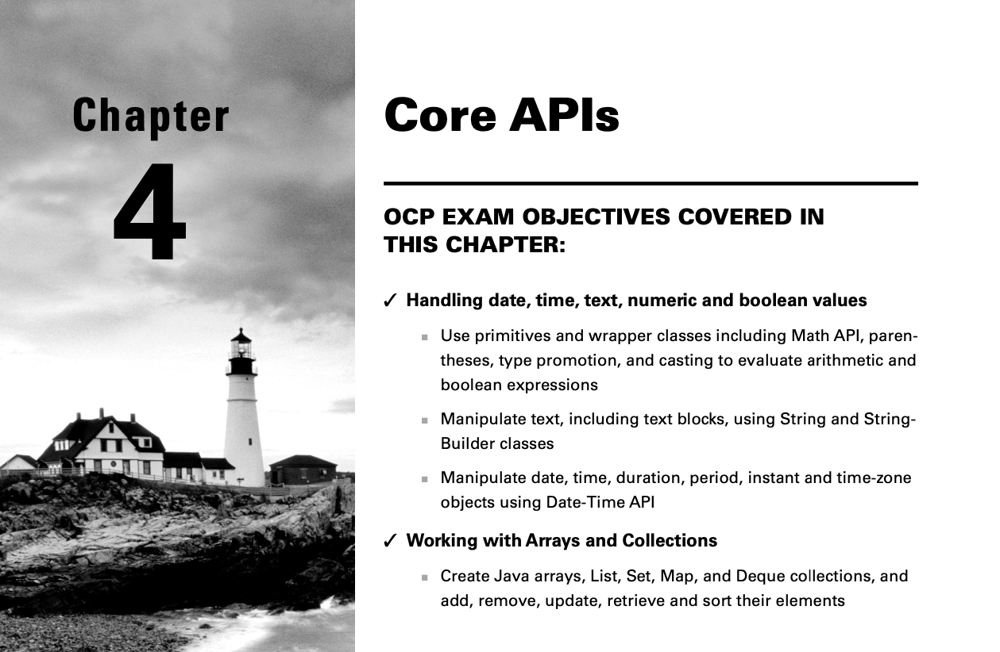

Bir Application Programming Interface (API) context'inde, bir interface, size işlevselliğe erişim sağlayan bir grup
class veya Java interface definition'larını ifade eder. Bu bölümde, Java'daki birçok core data structure'ını ve bunlara
erişmek için en yaygın kullanılan API'leri öğreniyorsunuz.

Örneğin, String ve StringBuilder, bunlara bağlı API'ler ile birlikte text verilerini oluşturmak ve manipule etmek için
kullanılır. Ardından diziler (arrays) ele alınır. Son olarak, math ve date/time API'lerini inceliyoruz.

# Creating and Manipulating Strings (String'ler Oluşturma ve Manipule etme)

String sınıfı, o kadar temel bir sınıftır ki, onsuz kod yazmak neredeyse imkânsızdır. Sonuçta, String sınıfını
kullanmadan bir main() methodu bile yazamazsınız. Bir string, temelde bir karakter dizisidir; işte bir örnek:

```
String name = "Fluffy";
```

1 nci Bölüm olan “Building Blocks” da öğrendiğiniz gibi, bu bir referans tipi örneğidir. Ayrıca referans tiplerinin new
anahtar kelimesi kullanılarak oluşturulduğunu da öğrenmiştiniz. Bir dakika, önceki örnekte bir şey eksik: içinde new
yok! Java’da, aşağıdaki iki kod parçası da bir String oluşturur:

```
String name = "Fluffy";
String name = new String("Fluffy");
```

Her iki örnek de "Fluffy" adlı String nesnesine point eden bir name reference variable'i oluşturur. Ancak, bu iki method
ince bir şekilde farklıdır; bunu bu bölümün ilerleyen kısımlarında göreceksiniz. Şimdilik, String sınıfının özel
olduğunu ve new ile instantiated edilmesine gerek olmadığını hatırlayın.

Ayrıca, metin blokları (text blocks) da bir String oluşturmanın başka bir yoludur. Gözden geçirecek olursak, bu metin
bloğu, önceki değişkenlerle aynıdır:

```
String name = """
              Fluffy""";
```

Bir String, bir karakter dizisi olduğundan, CharSequence interface'ini implement ettiğini duymak sizi muhtemelen
şaşırtmayacaktır. Bu interface, String ve StringBuilder dahil olmak üzere birkaç sınıfı temsil etmenin genel bir
yoludur. Interface'ler hakkında daha fazla bilgiyi 7. Bölüm olan “Beyond Classes” da öğreneceksiniz.

Bu bölümde, birleştirme (concatenation), yaygın yöntemler (common methods) ve method zincirlemesini (method chaining)
ele alıyoruz.

## Concatenating (Birleştirme)

İkinci Bölüm olan “Operators” da, sayıların nasıl toplandığını öğrenmiştiniz. 1 + 2 açıkça 3 eder. Peki ya "1" + "2"
nedir? "12"’dir, çünkü Java iki String nesnesini birleştirir. Bir String'i diğerinin önüne koyup birleştirme işlemine
string birleştirme (string concatenation) denir. Sınav hazırlayıcıları, + operatörünün aynı kod satırında iki farklı
şekilde kullanılabildiği için string birleştirmeyi sever. Bununla ilgili çok fazla kural yoktur, ancak bu kuralları iyi
bilmeniz gerekir:

1 - Eğer her iki operand da sayısal ise, + sayısal toplama anlamına gelir.

2 - Eğer operandlardan biri String ise, + birleştirme (concatenation) anlamına gelir.

3 - Expression soldan sağa doğru değerlendirilir.

Şimdi bazı örneklere bakalım;

```
System.out.println(1 + 2); // 3
System.out.println("a" + "b"); // ab
System.out.println("a" + "b" + 3); // ab3
System.out.println(1 + 2 + "c"); // 3c
System.out.println("c" + 1 + 2); // c12
System.out.println("c" + null); // cnull
```

İlk örnek, birinci kuralı kullanır. Her iki operand da sayıdır, bu yüzden normal toplama işlemi yapılır. İkinci örnek,
ikinci kuralda tanımlanan basit bir string birleştirmesidir. String için kullanılan tırnak işaretleri yalnızca kodda yer
alır; çıktıda yer almazlar. Üçüncü örnek, ikinci ve üçüncü kuralları birleştirir. Soldan başladığımız için Java, "a" +
"b" ifadesinin ne olduğunu çözer. Bunu zaten biliyorsunuz: "ab". Ardından Java, geriye kalan "ab" + 3 ifadesini inceler.
İkinci kural, bir operand String olduğu için birleştirme yapılması gerektiğini söyler.Dördüncü örnekte, üçüncü kural ile
başlarız, bu kural bize operandların sayısal olduğunu söyler, bu nedenle ilk kuralın verdiği cevap 3'tür.Ardından 3 +
"c" işlemi gelir, bu ikinci kuralı kullanarak "3c" sonucunu verir. Bir satırda tüm üç kuralın kullanıldığını fark
ettiniz mi? Beşinci örnek, üçüncü kuralın önemini gösterir. İlk olarak "c" + 1 işlemi yapılır, bu ikinci kuralı
kullanarak "c1" sonucunu verir. Ardından "c1" + 2 işlemi yapılır, bu da ikinci kuralı tekrar kullanarak "c12" sonucunu
verir.Son olarak, son örnek, null'ın birleştirildiğinde veya yazdırıldığında nasıl bir String olarak temsil edildiğini
gösterir ve "cnull" sonucunu alırız.

Sınav hileyi bir adım öteye taşıyarak sizi şöyle bir şeyle kandırmaya çalışacaktır:

```
int three = 3;
String four = "4";
System.out.println(1 + 2 + three + four);
```

Bunu gördüğünüzde, sadece yavaşça ilerleyin, üç kuralı hatırlayın ve değişken türlerini kontrol ettiğinizden emin olun.
Bu örnekte, üçüncü kural ile başlarız, bu kural bize 1 + 2 işlemini düşünmemizi söyler. İlk kural bize 3'ü verir.
Ardından 3 + three işlemi gelir. Çünkü three tipi int olduğundan, hala ilk kuralı kullanırız ve 6 sonucunu alırız.
Sonra, 6 + four işlemi yapılır. Çünkü four tipi String olduğundan, ikinci kurala geçeriz ve nihai cevap olarak "64"'ü
elde ederiz. Böyle sorularla karşılaştığınızda, sadece zaman ayırın ve türleri kontrol edin. Düzenli bir şekilde
ilerlemek işe yarar.

Bir şey daha bilmeniz gerekiyor, ancak bu kolay. Bu örnekte, sadece +='nin ne yaptığını hatırlamanız yeterli. Şunu
unutmayın, s += "2" ifadesi, s = s + "2" ile aynı anlama gelir.

```
4: var s = "1"; // s currently holds "1" 
5: s += "2"; // s currently holds "12" 
6: s += 3; // s currently holds "123" 
7: System.out.println(s); // 123
```

Satır 5'te, iki String'i "topluyoruz", bu da onları birleştirdiğimiz anlamına gelir. Satır 6, bir sayı ekleyerek sizi
yanıltmaya çalışır, ancak bu aslında s = s + 3 yazmışız gibi bir şeydir. Bir String ile "artı" yapmanın, her zaman
birleştirme (concatenation) kullanmak anlamına geldiğini biliyoruz.

Kuralları bir kez daha gözden geçirelim: İki sayı söz konusuysa sayısal toplama kullanın, aksi takdirde birleştirme (
concatenation) kullanın ve soldan sağa doğru değerlendirin. Bu üç kuralı ezberlediniz mi? Sınavdan önce bunları mutlaka
ezberleyin!

## Important String Methods (Önemli String methodları)

String sınıfının onlarca methodu vardır. Neyse ki, sınav için yalnızca birkaç tanesini bilmeniz gerekiyor. Sınav
hazırlayıcıları, geliştiricilerin gerçek dünyada kullandığı çoğu methodu seçer.

Tüm bu methodlar için, bir String'in bir karakter dizisi olduğunu ve Java'nın indexlemeye 0'dan başladığını hatırlamanız
gerekir. Figure 4.1, "animals" string'inin her bir karakterinin nasıl index'lendiğini gösterir.

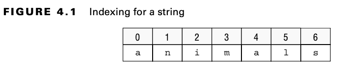

Ayrıca, bir String'in değiştirilemez (immutable) olduğunu bilmeniz gerekir. Bu, bir String üzerinde bir method
çağırdığınızda, referansın değerini değiştirmek yerine farklı bir String Object'i döndürüleceği anlamına gelir. Bu
bölümde immutable object'ler kullanacaksınız. 6. Bölüm: Class Design'nda, kendi immutable object'lerinizi nasıl
oluşturacağınızı öğreneceksiniz.

Şimdi String sınıfındaki birkaç methoda bakalım. Çoğu doğrudan anlaşılır, bu yüzden uzun uzun tartışmayacağız. Bu
methodları nasıl kullanacağınızı bilmeniz gerekiyor.

## Determining the Length (Uzunluğun Belirlenmesi)

length() methodu String'deki karakter sayısını döndürür. Method imzası aşağıdaki gibidir:

```
public int length()
```

Aşağıdaki kod length() fonksiyonunun nasıl kullanılacağını göstermektedir:

```
var name = "animals";
System.out.println(name.length()); // 7
```

Bekleyin. 7 mi çıktı? Az önce Java'nın sıfırdan başladığını söylemedik mi? Fark şudur ki, sıfırdan sayma sadece bir
liste içindeki index veya pozisyonları kullanırken gerçekleşir. Toplam boyutu veya uzunluğu belirlerken, Java normal
saymayı tekrar kullanır.

## Getting a Single Character (Tek Bir Karakter Alma)

charAt() methodu, belirli bir index'de hangi karakterin bulunduğunu öğrenmek için string üzerinde sorgulama yapmanıza
olanak tanır. Method imzası şu şekildedir:

```
public char charAt(int index)
```

Aşağıdaki kod charAt() fonksiyonunun nasıl kullanılacağını göstermektedir:

```
var name = "animals";
System.out.println(name.charAt(0)); // a
System.out.println(name.charAt(6)); // s
System.out.println(name.charAt(7)); // exception
```

Index'ler sıfırdan saymaya başladığı için, charAt(0) sequence'de ki “ilk” karakteri döndürür. Benzer şekilde, charAt(6)
sequence'de ki “yedinci” karakteri döndürür. Ancak, charAt(7) bir sorun yaratır. Bu, sequence'de ki “sekizinci”
karakteri istemektedir, fakat sequence'de yalnızca yedi karakter bulunmaktadır. Java’nın nasıl başa çıkacağını bilmediği
bir şey yanlış gittiğinde, bir exception) fırlatır. Bununla ilgili daha fazla bilgiyi 11. Bölüm olan “Exceptions and
Localization” da öğrenebilirsiniz.

```
java.lang.StringIndexOutOfBoundsException: String index out of range: 7
```

## Finding an Index (Index Bulma)

indexOf() methodu, bir string'de ki karakterlere bakar ve istenen değere uyan ilk index değerini bulur. Bu method, bir
karakter (char) veya bir bütün String’i input olarak alabilir. Ayrıca, belirtilen bir konumdan itibaren arama yapabilir.
Unutmayın ki bir char, bir int parametre türüne geçirilebilir. Sınavda, yalnızca ch olarak adlandırılmış parametrelere
bir char geçirildiğini göreceksiniz. Method imzaları şu şekildedir:

```
public int indexOf(int ch)

public int indexOf(int ch, int fromIndex)
public int indexOf(String str)
public int indexOf(String str, int fromIndex)
```

Aşağıdaki kod indexOf() fonksiyonunun nasıl kullanılacağını göstermektedir:

```
var name = "animals";
System.out.println(name.indexOf('a')); // 0
System.out.println(name.indexOf("al")); // 4
System.out.println(name.indexOf('a', 4)); // 4
System.out.println(name.indexOf("al", 5)); // -1
```

Index'ler 0'dan başladığı için, ilk 'a' bu konumda eşleşir. İkinci statement, daha spesifik bir string arar, bu yüzden
daha sonra bir eşleşme bulur. Üçüncü statement, Java'nın karakterlere 4. index'den önce bakmamasını söyler. Son
statement, eşleşmenin gerçekleştiği yerden sonra aramaya başladığı için hiçbir şey bulamaz. charAt() methodunun aksine,
indexOf() methodu bir eşleşme bulamazsa bir exception fırlatmaz; bunun yerine -1 döndürür. Index'ler 0'dan
başladığından, çağıran kişi -1'in geçerli bir index olamayacağını bilir. Bu, bir methodun çağıran kişiye bir eşleşme
bulunamadığını belirtmesi için yaygın bir değerdir.

## Getting a Substring (Substring Alma)

substring() methodu da bir string'de karakter arar. Bu method, string'in bir bölümünü döndürür. İlk parametre,
döndürülecek string'in başlanacağı index'i belirtir. Alışıldığı üzere, bu sıfır tabanlı bir index'dir. İkinci bir
optional parametre daha vardır; bu, durmak istediğiniz bitiş index'ini belirtir.

Dikkat edin, "dahil etmek" yerine "orada durmak" dedik. Bu, dizinin sonuna kadar devam etmek istiyorsanız endIndex
parametresinin dizinin sonundan bir fazlası olmasına izin verildiği anlamına gelir. Ancak bu durum gereksizdir, çünkü bu
durumda ikinci parametreyi tamamen çıkarabilirsiniz. Kendi kodunuzda, bu tür gereksizliklerden kaçınmak istersiniz. Yine
de, sınavda bu tür bir kullanım görürseniz şaşırmayın.

Method imzaları şu şekildedir:

```
public String substring(int beginIndex)
public String substring(int beginIndex, int endIndex)
```

substring methodları için index'leri biraz farklı düşünmek faydalı olur. Index'lerin, işaret ettikleri karakterin hemen
öncesinde olduğunu hayal edin. Figure 4.2 bunu görselleştirmenize yardımcı olur. Dikkat edin, 0 pointer'i character 0
olan karaktere işaret ederken, 1 pointer'i character 0 ile 1 arasındaki boşluğa işaret ediyor.String'de yedi karakter
vardır. Java sıfır tabanlı index'ler kullandığından, son karakterin index'i 6'dır. 7 pointer'i ise bu son character'in
hemen sonrasına işaret eder. Bu, endIndex'in, String'in sonundan bir fazlası olduğunda neden bir out-of-bounds
exception'ı vermediğini hatırlamanıza yardımcı olur.

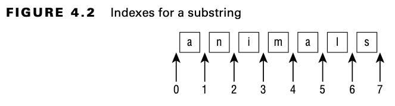

Aşağıdaki kod substring() fonksiyonunun nasıl kullanılacağını göstermektedir:

```
var name = "animals";
System.out.println(name.substring(3)); // mals
System.out.println(name.substring(name.indexOf('m'))); // mals
System.out.println(name.substring(3, 4)); // m
System.out.println(name.substring(3, 7)); // mals
```

substring() methodu, sınavdaki en karmaşık String methodudur. İlk örnek, index'de ki 3'ten başlayarak sonuna kadar olan
karakterleri almayı söyler ve bu da bize "mals" sonucunu verir. İkinci örnek de aynı şeyi yapar, ancak index'i sabit
olarak yazmak yerine indexOf() methodunu çağırarak index'i alır. Bu, kodlama yaparken yaygın bir uygulamadır çünkü
index'i önceden bilmeyebilirsiniz. Üçüncü örnek, index'de ki 3'ten başlayarak 4'teki karakteri dahil etmeden (ama onu
geçerek) karakterleri almayı söyler. Bu, aslında index 3'teki tek bir karakteri istediğimizi söylemenin karmaşık bir
yoludur. Sonuç olarak "m" elde edilir. Son örnek ise index'de ki 3'ten başlayarak 7'ye kadar olan karakterleri almayı
söyler. 7 index'i string'in sonuna eşit olduğundan, bu durum ilk örnekle aynıdır. Umarız bu çok kafa karıştırıcı
olmamıştır. Sonraki örnekler daha az belirgindir:

```
System.out.println(name.substring(3, 3)); // empty string
System.out.println(name.substring(3, 2)); // exception
System.out.println(name.substring(3, 8)); // exception
```

Bu setin ilk örneği boş bir string yazdırır. İstek, index'de ki 3'ten başlayarak 3'teki karaktere kadar olan
karakterlerdir. Başlangıç ve bitiş index'leri aynı olduğu için, arada hiçbir karakter yoktur. Bu setin ikinci örneği bir
exception fırlatır çünkü index'ler geriye doğru gidemez. Java, 3'ten başlarsa asla 2'ye ulaşamayacağını çok iyi bilir.
Üçüncü örnek, sekizinci karaktere kadar devam edilmesini söyler. Ancak sekizinci bir pozisyon yoktur, bu yüzden Java bir
exception fırlatır. Kabul edelim ki yedinci karakter de yok, ama en azından “end of string” görünmez konumu var.

substring() methodu oldukça karmaşık olduğu için bunu bir kez daha gözden geçirelim. Bu method, istenen index'den
başlayarak string'i döndürür. Eğer bir bitiş index'i istenirse, o index'e gelmeden önce durur. Aksi takdirde, string'in
sonuna kadar gider.

## Adjusting Case (Case ayarlama)

Vay canına. Bu zihinsel egzersizden sonra, tam olarak söyledikleri gibi davranan methodlar gerçekten hoş bir rahatlama
sağlıyor! Bu methodlar, verilerinizi dönüştürmeyi kolaylaştırır. Method imzaları şu şekildedir:

```
public String toLowerCase()
public String toUpperCase()
```

Aşağıdaki kod, bu methodları nasıl kullanacağınızı gösterir:

```
var name = "animals";
System.out.println(name.toUpperCase()); // ANIMALS
System.out.println("Abc123".toLowerCase()); // abc123
```

Bu methodlar, söyledikleri şeyi yaparlar. toUpperCase() methodu, döndürülen string'de ki tüm küçük harfleri büyük
harflere dönüştürür. toLowerCase() methodu ise, döndürülen string'de ki tüm büyük harfleri küçük harflere dönüştürür. Bu
methodlar, harfler dışında herhangi bir karakteri değiştirmez. Ayrıca, string'lerin değiştirilemez (immutable) olduğunu
unutmayın, bu yüzden orijinal string aynı kalır.

## Checking for Equality (Eşitliğin kontrolü)

equals() methodu, iki String object'inin tam olarak aynı karakterleri, aynı sırayla içerip içermediğini kontrol eder.
equalsIgnoreCase() methodu ise, iki String nesnesinin aynı karakterleri içerip içermediğini kontrol eder, ancak
harflerin büyük/küçük olmasına bakmaz (case insensitive olarak).

Method imzaları şu şekildedir:

```
public boolean equals(Object obj)
public boolean equalsIgnoreCase(String str)
```

equals() methodunun String yerine bir Object aldığını fark etmiş olabilirsiniz. Bunun nedeni, bu methodun tüm object'ler
için aynı olmasıdır. Eğer bir String dışında bir şey geçirirseniz, method sadece false döndürecektir. Buna karşılık,
equalsIgnoreCase() methodu yalnızca String nesnelerine uygulanır, bu yüzden parametre olarak daha spesifik bir tür
alabilir.

Java'da, String değerleri büyük/küçük harfe duyarlıdır. Yani, "abc" ve "ABC" farklı değerler olarak kabul edilir. Bunu
göz önünde bulundurarak, aşağıdaki kod bu methodları nasıl kullanabileceğinizi gösteriyor:

```
System.out.println("abc".equals("ABC")); // false
System.out.println("ABC".equals("ABC")); // true
System.out.println("abc".equalsIgnoreCase("ABC")); // true
```

Bu örnek oldukça sezgisel olmalıdır. İlk örnekte, değerler tam olarak aynı değildir. İkinci örnekte ise, değerler tam
olarak aynıdır. Üçüncü örnekte ise, sadece büyük/küçük harf farkı vardır, ancak bu sorun değil çünkü büyük/küçük harf
farkını göz ardı eden methodu çağırdık.

| Overriding toString(), equals(Object), and hashCode() |
|-------------------------------------------------------|

toString(), equals(Object) ve hashCode() methodlarını doğru şekilde ezberlemek, geçmişte Java sertifikasyon sınavlarının
bir parçasıydı. Bir Java geliştiricisi olarak, bu methodları ezberlerken her birinin temel kurallarını bilmek hala
önemlidir:

* toString(): toString() methodu, bir object'i yazdırmaya çalıştığınızda veya object'i bir String ile concatenate (
  birleştirdiğinizde) çağrılır. Genellikle, object'in instance field'larını kullanarak instance'in unique bir
  açıklamasını yazdıran bir versiyonla override edilir.

* equals(Object): equals(Object) methodu, object'leri karşılaştırmak için kullanılır; default implementasyon sadece ==
  operatörünü kullanır. equals(Object) methodunu, öğeleri eşitlik için karşılaştırmanın daha pratik bir yolunu
  istediğiniz her durumda, özellikle bu karşılaştırma birden fazla alanı kontrol etmeyi gerektiriyorsa, ezberlemeniz
  gerekir.

* hashCode(): equals(Object) methodunu her override ettiğiniz de, tutarlı olması için hashCode() methodunu da override
  etmeniz gerekir. Bu, iki object için, a.equals(b) true ise, o zaman a.hashCode() == b.hashCode()'nın da true olması
  gerektiği anlamına gelir. Eğer bunlar tutarlı değilse, bu, HashMap ve HashSet gibi hash tabanlı koleksiyonlarda
  geçersiz data'lara ve side effect'lere yol açabilir.

Tüm bu methodlar, Object sınıfında default bir implementasyona sahiptir, ancak bunları akıllıca kullanmak istiyorsanız,
bu methodları ezberlemeniz gerekir.

## Searching for Substrings (Substrings'leri arama)

Genellikle, bir substring'in büyük bir string'de bulunup bulunmadığını belirlemek için arama yapmanız gerekir.
startsWith() ve endsWith() methodları, sağlanan değerin string'in bir parçası ile eşleşip eşleşmediğine bakar.
contains() methodu ise o kadar seçici değildir; string'in herhangi bir yerinde eşleşmeleri arar. Method imzaları şu
şekildedir:

```
public boolean startsWith(String prefix)
public boolean endsWith(String suffix)
public boolean contains(CharSequence charSeq)
```

Aşağıdaki kodda bu methodların nasıl kullanılacağı gösterilmektedir:

```
System.out.println("abc".startsWith("a")); // true
System.out.println("abc".startsWith("A")); // false

System.out.println("abc".endsWith("c")); // true
System.out.println("abc".endsWith("a")); // false

System.out.println("abc".contains("b")); // true
System.out.println("abc".contains("B")); // false
```

Yine, burada şaşırtıcı bir şey yok. Java, sağlanan değerlere karşı büyük/küçük harf duyarlı bir kontrol yapmaktadır.
contains() methodunun, str.indexOf(otherString) != -1 yazmak zorunda kalmamanız için bir kolaylık methodu olduğunu
unutmayın.

## Replacing Values (Değerlerin Değiştirilmesi)

replace() methodu, string üzerinde basit bir arama ve replace işlemi yapar. Karakter parametreleri alan bir versiyonu
olduğu gibi, CharSequence parametreleri alan bir versiyonu da vardır. Method imzaları şu şekildedir:

```
public String replace(char oldChar, char newChar)
public String replace(CharSequence target, CharSequence replacement)
```

Aşağıdaki kodda bu methodların nasıl kullanılacağı gösterilmektedir:

```
System.out.println("abcabc".replace('a', 'A')); // AbcAbc
System.out.println("abcabc".replace("a", "A")); // AbcAbc
```

İlk örnek, ilk method imzasını kullanarak char parametreleri geçirir. İkinci örnek ise ikinci method imzasını kullanarak
String parametreleri geçirir.

CharSequence örneği;

```
String s1 = "GeeksforGeeks";
 
// orginal string
System.out.println(s1);
 
// Geeks'i GfG ile replace et
String replaceString = s1.replace("Geeks", "GfG ");
 
// New String
System.out.println(replaceString);
```

Çıktı olarak,

```
GeeksforGeeks
GfGforGfG
```

## Removing Whitespace (Boşlukların kaldırılması)

Bu methodlar, bir String'in başındaki ve/veya sonundaki boşlukları kaldırır. strip() ve trim() methodları, bir String'in
başından ve sonundan boşlukları kaldırır. Sınav açısından, boşluk karakterleri, boşluklar ile birlikte \t (sekme) ve
\n (yeni satır) karakterlerinden oluşur. \r (satır başı) gibi diğer karakterler de kesilenler arasında yer alır. strip()
methodu, trim() methodunun yaptığı her şeyi yapar, ancak Unicode desteği de sağlar.

| Note : |
|--------|

Sınav için Unicode hakkında bilgi sahibi olmanız gerekmiyor. Ancak farkı test etmek isterseniz, Unicode whitespace
karakterlerinden biri şu şekildedir:

```
char ch = '\u2000';
```

Ayrıca, stripLeading() methodu, String'in başındaki boşlukları kaldırır ve sonunu olduğu gibi bırakır. stripTrailing()
methodu ise tersini yapar. String'in sonundaki boşlukları kaldırır ve başını olduğu gibi bırakır. Method imzaları şu
şekildedir:

```
public String strip()
public String stripLeading()
public String stripTrailing()
public String trim()
```

Aşağıdaki kod, bu methodları nasıl kullanacağınızı gösterir:

```
System.out.println("abc".strip()); // abc
System.out.println("\t a b c\n".strip()); // a b c

String text = " abc\t ";
System.out.println(text.trim().length()); // 3
System.out.println(text.strip().length()); // 3
System.out.println(text.stripLeading().length()); // 5
System.out.println(text.stripTrailing().length());// 4
```

Öncelikle, \t bir tek karakterdir. Ters eğik çizgi, t karakterini escape edecek bir sekme (tab) temsil eder. İlk örnek,
başında veya sonunda boşluk karakteri olmadığı için orijinal string'i yazdırır. İkinci örnek, baştaki tab'ı, ardından
gelen boşlukları ve sondaki new line (yeni satırı) kaldırır. String'in ortasında bulunan boşlukları ise bırakır. Kalan
örnekler sadece kalan karakterlerin sayısını yazdırır. trim() ve strip() methodlarının, başındaki ve sonundaki
boşlukları kaldırdığı için aynı üç karakteri olan "abc"yi bıraktığını görebilirsiniz. stripLeading() methodu sadece
String'in başındaki bir boşluk karakterini kaldırır. Sonundaki sekme ve boşluğu bırakır. stripTrailing() methodu ise
sondaki bu iki karakteri kaldırır, ancak baştaki karakteri bırakır.

## Working with Indentation (Indentation ile çalışmak)

Java artık text block'ları desteklediği için, Indentation ile ilgili işlemleri yapan methodlara sahip olmak faydalıdır.
Bu ikisi biraz karmaşıktır, bu yüzden dikkatlice okuyun!

```
public String indent(int numberSpaces)
public String stripIndent()
```

indent() methodu, pozitif bir sayı gönderirseniz her satırın başına aynı sayıda boşluk ekler. Negatif bir sayı
gönderirseniz, satırın başından o kadar boşluk karakteri kaldırmaya çalışır. Sıfır gönderirseniz, indentation değişmez.

| Note : |
|--------|

Eğer indent() methodunu negatif bir sayıyla çağırır ve satırın başındaki mevcut boşluk karakterlerinden daha fazlasını
kaldırmaya çalışırsanız, Java bulabildiği tüm boşlukları kaldıracaktır.

Bu oldukça anlaşılır görünüyor. Ancak, indent() methodu aynı zamanda boşluk karakterlerini de normalize eder. Peki,
boşluk karakterlerini normalize etmek ne anlama gelir, diye soruyorsunuz? İlk olarak, eğer zaten varsa, string'in sonuna
bir satır sonu eklenir. İkinci olarak, herhangi bir satır sonu \n formatına dönüştürülür. İşletim sisteminizin \r\n
(Windows) veya \n (Mac/Unix) kullanıp kullanmamasına bakılmaksızın, Java sizin için bunu \n formatında standart hale
getirir.

stripIndent() methodu, bir String'in bir text block kullanılarak değil de birleştirme (concatenation) ile oluşturulmuşsa
faydalıdır. Bu method, tüm gereksiz boşluk karakterlerini kaldırır. Bu, tüm boşluk olmayan satırların sola kaydırıldığı
ve her satırdan aynı sayıda boşluk karakterinin kaldırıldığı, kalan ilk karakterin ise boşluk olmadığı anlamına gelir.
indent() gibi, \r\n \n'ye dönüştürülür. Ancak, stripIndent() methodu eksikse sonuna bir satır sonu eklemez.

Table 4.1, bunları hatırlamayı kolaylaştıracak bir referans sağlar.

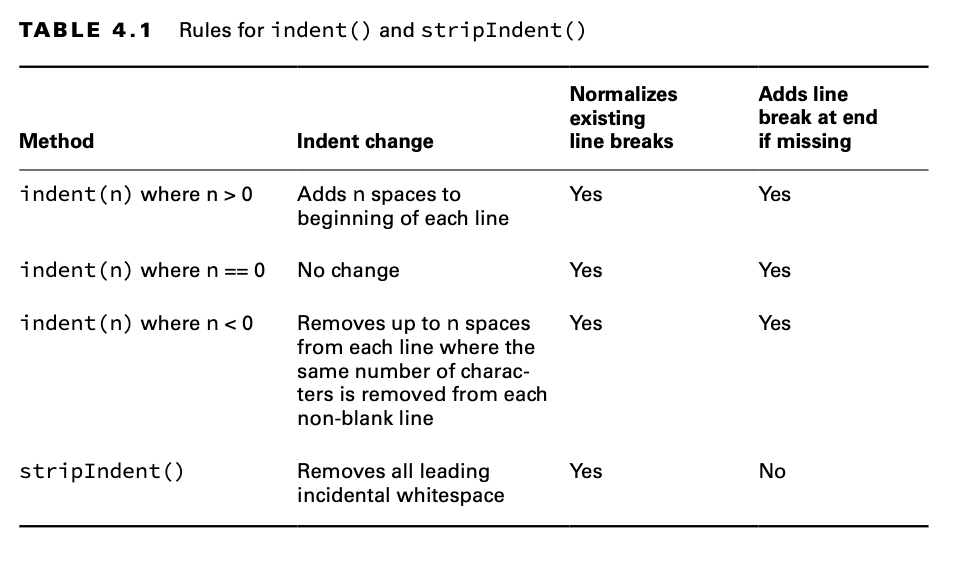

'indent(n) where n > 0' Her satırın başına n boşluk ekler.

'indent(n) where n == 0' Değişiklik yok

'indent(n) where n < 0' Her satırdan, her boş olmayan satırdan aynı sayıda karakterin kaldırılacağı şekilde, n boşluk
kaldırır.

'stripIndent()' Tüm baştaki gereksiz boşlukları kaldırır.

Aşağıdaki kod, bu methodları nasıl kullanacağınızı gösterir. Sonuçlar beklediğiniz gibi olmayabilir, endişelenmeyin. Her
birini açıklayacağız.

```
10: var block = """
11:             a
12:              b
13:             c""";
14: var concat = " a\n"
15:            + "  b\n"
16:            + " c";
17: System.out.println(block.length()); // 6
18: System.out.println(concat.length()); // 9 
19: System.out.println(block.indent(1).length()); // 10
20: System.out.println(concat.indent(-1).length()); // 7
21: System.out.println(concat.indent(-4).length()); // 6
22: System.out.println(concat.stripIndent().length()); // 6
```

Satırlar 10-16, sırasıyla bir text block ve normal bir String kullanarak benzer String'ler oluşturur. "Benzer" diyoruz
çünkü concat'ın her satırın başında bir boşluk karakteri varken, block'ta böyle bir boşluk yoktur.

Satır 17, block'taki altı karakteri sayar; bunlar üç harf, b'den önceki boşluk karakteri ve a ile b'nin sonundaki \n
karakteridir. Satır 18, concat'taki dokuz karakteri sayar; bunlar üç harf, a'dan önce bir boşluk, b'den önce iki boşluk,
c'den önce bir boşluk ve a ile b'nin sonundaki \n karakteridir. Kendi başınıza sayabilirsiniz. Hangi karakterlerin
sayıldığını anlamazsanız, bu daha da karışık hale gelecektir.

Satır 19'da, Java'dan block'taki her üç satıra birer boşluk eklemesini istiyoruz. Ancak çıktı, 3 yerine 4 karakter
eklediğimizi söylüyor, çünkü uzunluk 6'dan 10'a çıktı. Bu gizemli ek karakter, satır sonu normalizasyonundan
kaynaklanıyor. Çünkü text block'un sonunda bir satır sonu yok, bu yüzden indent() bir tane ekliyor!

Satır 20'de, concat'taki her üç satırdan bir boşluk karakteri kaldırıyoruz. Bu, yedi uzunluğunda bir sonuç verir.
Başlangıçta dokuz karakterimiz vardı, üç karakteri kaldırdık ve bir sonlandırılmış normalleşmiş yeni satır ekledik.

Satır 21'de, Java'dan aynı üç satırdan dört boşluk karakteri kaldırmasını istiyoruz. Ancak dört boşluk karakteri
olmadığı için Java elinden geleni yapar. a ve c'den önceki tek boşluk kaldırılır. b'den önceki her iki boşluk
kaldırılır. Buradaki altı uzunluğu mantıklı olmalıdır; çünkü satır 20'ye göre bir karakter daha kaldırdık.

Son olarak, satır 22 stripIndent() methodunu kullanır. Tüm satırlarda en az bir boşluk karakteri vardır. Ancak hepsinde
iki boşluk karakteri olmadığı için, method her satırdan sadece bir karakter kaldırır. stripIndent() yeni bir satır sonu
eklemediği için uzunluk altıdır ve bu, orijinal dokuzdan üç eksiktir.

## Translating Escapes (Escape'lerin çevirisi)

Karakterleri escape ederken, tek bir ters eğik çizgi (backslash) kullanırız. Örneğin, \t bir tab karakteridir. Eğer bu
davranışı istemiyorsak, ters eğik çizgiyi escape etmek için bir tane daha ters eğik çizgi ekleriz, böylece \t literal
bir string olur ve \t karakterini ifade eder. translateEscapes() methodu bu literalleri alır ve bunları karşılık gelen
escaped karaktere dönüştürür. Methodun imzası şu şekildedir:

```
public String translateEscapes()
```

Aşağıdaki kod, bu methodları nasıl kullanacağınızı gösterir:

```
var str = "1\\t2";
System.out.println(str); // 1\t2
System.out.println(str.translateEscapes()); // 1   2
```

İlk satır, ters eğik çizgi escape edildiği için literal string olan \t'yi yazdırır. İkinci satır, escape'i çevirdiğimiz
için gerçek bir sekme karakteri yazdırır. escape sequences'lerini string syntax'ına göre çevirir.

Başka bir örnek;

```
String s = "\"Welcome \" to \" tutorials \" point\"";
String res = s.translateEscapes();
System.out.println("The new string is: " + res);
```

çıktı olarak;

```
The new string is: "Welcome " to " tutorials " point"
```

Başka bir örnek;

```
String textBlock = """
            Hello\\sWord\\n!
            Hello Java\\s!""";

System.out.println(textBlock);
System.out.println("-------------------");
System.out.println(textBlock.translateEscapes());
```

çıktı olarak;

```
Hello\sWord\n!
Hello Java\s!
___________________
Hello Word
!
Hello Java !
```

## Checking for Empty or Blank Strings

Java, bir String'in uzunluğunun sıfır olup olmadığını veya yalnızca boşluk karakterleri içerip içermediğini kontrol
etmek için kolaylık sağlayan methodlar sunar. Method imzaları şu şekildedir:

```
public boolean isEmpty()
public boolean isBlank()
```

Aşağıdaki kodda bu methodların nasıl kullanılacağı gösterilmektedir:

```
System.out.println(" ".isEmpty()); // false
System.out.println("".isEmpty()); // true
System.out.println(" ".isBlank()); // true
System.out.println("".isBlank()); // true
```

İlk satır false yazdırır çünkü String boş değildir; içinde bir boşluk karakteri vardır. İkinci satır true yazdırır çünkü
bu sefer String'de hiçbir karakter yoktur. Son iki satır ise true yazdırır çünkü boşluk dışında başka hiçbir karakter
yoktur.

## Formatting Values (Değerleri Biçimlendirme)

String değerlerini formatlama flag'leri kullanarak biçimlendirmek için methodlar bulunmaktadır. Bu methodlardan ikisi,
formatlama string'ini bir parametre olarak alır, diğer bir tanesi ise bu değer için bir instance kullanır. Bir method,
Locale alır; bunu 11. Bölüm'de öğreneceksiniz.

Method parametreleri, birden fazla formatlama ve concatenation işlemi yerine, tek bir method çağrısında biçimlendirilmiş
bir String oluşturmak için kullanılır. Bu methodlar, çağrıldıkları instance'a bir referans döndürür, böylece işlemler
zincirleme olarak birleştirilebilir. Method imzaları şu şekildedir:

```
public static String format(String format, Object args...)
public static String format(Locale loc, String format, Object args...)
public String formatted(Object args...)
```

Aşağıdaki kodda bu methodların nasıl kullanılacağı gösterilmektedir:

```
var name = "Kate";
var orderId = 5;

System.out.println("Hello " + name + ", order " + orderId + " is ready");
System.out.println(String.format("Hello %s, order %d is ready", name, orderId));
System.out.println("Hello %s, order %d is ready".formatted(name,orderId));
System.out.printf("Hello %s, order %d is ready", name,orderId);
```

Son satırda ki örnek System.out içinde yer alan 'printf' methodu ile yapılmıştır

format() ve formatted() operation'larında, parametreler sırasıyla vararg'a sağlanan sırayla simgeler aracılığıyla
yerleştirilir ve biçimlendirilir. Table 4.2, sınav için bilmeniz gerekenleri listelemektedir.

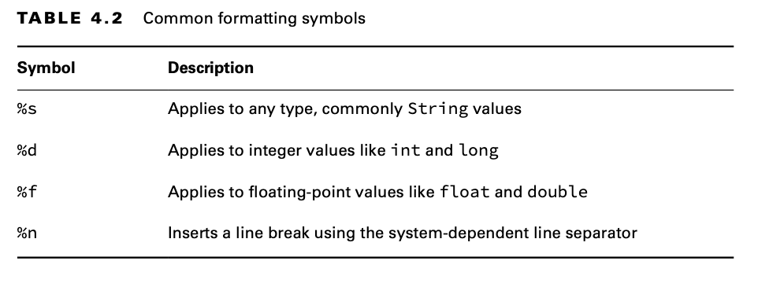

'%s' Genellikle String değerleri olmak üzere herhangi bir type için geçerlidir

'%d' int ve long gibi integer değerleri için geçerlidir

'%f' Float ve double gibi floating-point değerler için geçerlidir

'%n' Sisteme bağlı line break kullanarak bir satır sonu ekler

Aşağıdaki örnekte Table 4.2'deki dört sembolün tamamı kullanılmaktadır:

```
public static void main(String[] args) {
    var name = "Kate";
    var score = 90.25;
    var total = 100;

    System.out.println("%s:%n \tScore: %f out of %d".formatted(name,score,total));
}
```

Bu, aşağıdakileri yazdırır:

```
Kate:
 	Score: 90.250000 out of 100
```

Farklı data type'larını mixlemek, runtime'da exception'lara neden olabilir. Örneğin, aşağıdaki kod, bir integer
değeri beklenirken bir floating-point sayı kullanıldığı için bir exception fırlatır:

```
var str = "Food: %d tons".formatted(2.0); // IllegalFormatConversionException
```

| Using format() with Flags (Flag'ler ile format() kullanımı) |
|-------------------------------------------------------------|

Sembolleri desteklemenin yanı sıra, Java % ile sembol karakteri arasında isteğe bağlı flag'leri de destekler. Önceki
örnekte, floating-point sayı 90.250000 olarak yazdırılmıştı. Default olarak, %f decimal noktadan sonra tam olarak altı
basamak gösterir. Eğer sadece bir basamak göstermek isterseniz, %f yerine %.1f kullanabilirsiniz. format() methodu,
sayıları kısaltırken kesmek yerine yuvarlama işlemini kullanır. Örneğin, 90.250000, %.1f ile format() methoduna
geçirildiğinde 90.3 olarak gösterilir (90.2 değil).

format() methodu, iki ek özelliği de destekler. Decimal symbol'undan önce bir sayı kullanarak çıktının toplam uzunluğunu
belirtebilirsiniz. Default olarak, method empty space'leri blank spaces'ler ile doldurur. Ayrıca, empty space'leri
sıfırlarla doldurmak için decimal symbol'den önce bir sıfır koyabilirsiniz. Aşağıdaki örneklerde, biçimlendirilmiş
değerin başlangıcını ve sonunu göstermek için köşeli parantezler ([]), kullanılmıştır:

```
var pi = 3.14159265359;

System.out.format("[%f]",pi);     // [3.141593]

System.out.format("[%12.8f]",pi); // [  3.14159265] noktadan sonra 8 digit 12 karakter

System.out.format("[%012f]",pi);  // [00003.141593] 12f 12 digitlik bir alan yaratır default olarak 6 karekter 
                                                    yazdırılır '012f' ifadesinden dolayı baş taraf sıfırlarla doldurulur

System.out.format("[%12.2f]",pi); // [        3.14] noktadan sonra 2 digit 12 karakter

System.out.format("[%.3f]",pi);   // [3.142]        noktadan sonra 3 digit
```

format() methodu birçok başka sembol ve flag'i destekler. Ancak, sınav için burada bahsedilenlerin ötesinde başka bir
şeyi bilmeniz gerekmez.

## Method Chaining (Method Zincirleme)

Her şeyi bir araya getirmeye hazır mısınız? Aşağıda gösterildiği gibi, birden fazla methodu çağırmak yaygındır:

```
var start = "AniMaL     ";
var trimmed = start.trim(); // "AniMaL"
var lowerCase = trimmed.toLowerCase(); // "animal"
var result = lowerCase.replace('a','A'); // "AnimAl"
System.out.println(result);
```

Bu sadece bir dizi String methodu çağrısıdır. Her çağrıda döndürülen değer yeni bir değişkene atanır. Bu süreçte dört
String değeri oluşur ve sonuç olarak AnimAl yazdırılır. Ancak, sınavda, mümkün olduğunca fazla kodu küçük bir alana
sıkıştırma eğilimi vardır. Bu, method chaining adı verilen bir teknikle yapılır. İşte bir örnek:

```
String result = "AniMaL ".trim().toLowerCase().replace('a', 'A');
System.out.println(result);
```

Bu kod, önceki örnekle eşdeğerdir. Aynı zamanda dört String object'i oluşturur ve "AnimAl" çıktısını verir. Method
chaining kullanan bir kodu okurken, soldan başlar ve ilk methodu değerlendirirsiniz. Ardından, ilk methodun döndürdüğü
değer üzerinde bir sonraki methodu çağırırsınız. Noktalı virgüle kadar devam edin. Bu kodun sonucunun ne olacağını
düşünüyorsunuz?

```
5: String a = "abc";
6: String b = a.toUpperCase(); 
7: b = b.replace("B", "2").replace('C', '3');
8: System.out.println("a=" + a);
9: System.out.println("b=" + b);
```

Beşinci satırda, 'a' yı "abc" değerine işaret edecek şekilde ayarlıyoruz ve 'a' yı başka bir şeye yönlendirmiyoruz. 6.
ve 7. satırlardaki hiçbir kod 'a' yı değiştirmediği için, değeri "abc" olarak kalır.

Ancak, 'b' biraz daha karmaşıktır. 6. satırda, 'b' "ABC" değerine point eder, bu da basittir. 7. satırda ise method
zincirlemesi vardır.

İlk olarak, "ABC".replace("B", "2") çağrılır. Bu, "A2C" döndürür. Ardından, "A2C".replace('C', '3') çağrılır. Bu da
"A23" döndürür. Son olarak, b bu döndürülen String'e işaret edecek şekilde değişir. 9. satır çalıştırıldığında, 'b'
"A23" olacaktır.

## Java'da == ve equals() methodlarını kullanarak String karşılaştırma arasındaki fark

Java'da iki object'i karşılaştırmak için hem equals() methodu hem de == operatörü kullanılır. Java string equals()
methodu, iki string'i karşılaştırır ve her iki string'de ki tüm karakterler eşleşiyorsa true, aksi takdirde false
döndürür. == operatörü, aynı konuma işaret edip etmediklerine bakılmaksızın, bir heap içindeki object'lerin referansını
veya memory location'ı karşılaştırır. new operatörünü kullanarak bir object oluşturduğumuzda, bu object için yeni bir
memory location'ı oluşturacaktır, bu nedenle '==' bu case'de çalışmayacaktır.

Örnek:

```
String s1 = "HELLO";
String s2 = "HELLO";
String s3 =  new String("HELLO");

System.out.println(s1 == s2); // true
System.out.println(s1 == s3); // false
System.out.println(s1.equals(s2)); // true
System.out.println(s1.equals(s3)); // true
```

s1 ve s2 karşılaştırması için == operatörünü kullandığımızda, her ikisi de String constant pool'unda aynı adreslere
sahip olduğundan sonuç true.

## Java'da "==" ve .equals() Arasındaki Temel Farklar

Genel olarak, Java'da hem equals() hem de "==" operatörleri eşitliği kontrol etmek amacıyla object'leri karşılaştırmak
için kullanılır, ancak ikisi arasındaki bazı farklar şunlardır:

* equals() methodu ile == operatorü arasındaki temel fark, birinin bir method, diğerinin ise operator olmasıdır.

* Referans karşılaştırması (adres karşılaştırması) için == operatörünü ve content (içerik) karşılaştırması için
  equals() methodunu kullanabiliriz. Basit bir ifadeyle, == her iki object'in de aynı memory location'a işaret edip
  etmediğini kontrol ederken, equals() object'ler de ki değerlerin karşılaştırılmasını değerlendirir.

* Bir sınıf equals methodunu override ederse, varsayılan olarak bu methodu override eden en yakın parent class'ın
  equals(Object o) methodunu kullanır.

### Equality operator(==)

Boolean türü de dahil olmak üzere her primitive tür için eşitlik operatörlerini uygulayabiliriz. Object türleri için de
eşitlik operatörleri uygulayabiliriz.

```
// integer-type
System.out.println(10 == 20); // FALSE

// char-type
System.out.println('a' == 'b'); // FALSE

// char and double type
System.out.println('a' == 97.0); // TRUE

// boolean type
System.out.println(true == true); // TRUE
```

Object türleri için == uygularsak, argüman türleri arasında uyumluluk olmalıdır (child to parent veya parent to child
veya aynı tür). Aksi takdirde, compiler time hatası alırız.

```
Thread t = new Thread();
Object o = new Object();
String s = new String("GEEKS");

System.out.println(t == o); // FALSE
System.out.println(o == s); // FALSE

// Uncomment to see error 
System.out.println(t==s); // Exception - incomparable types : Thread and String
```

# Using the StringBuilder Class (StringBuilder Class'ının kullanılması)

Küçük bir program, çok sayıda String nesnesi oluşturabilir. Örneğin, bu kod parçası kaç object oluşturur sizce?

```
10: String alpha = "";
11: for(char current = 'a'; current <= 'z'; current++)
12:   alpha += current;
13: System.out.println(alpha);
```

Onuncu satırda boş String nesnesi oluşturulur ve ardından 12. satırda bir "a" eklenir. Ancak, String object'i
değiştirilemez (immutable) olduğu için, alpha'ya yeni bir String object'i atanır ve "" object'i garbage collection için
uygun hale gelir. Döngüde bir sonraki geçişte, alpha'ya yeni bir String object'i, "ab", atanır ve "a" nesnesi garbage
collection için uygun hale gelir. Bir sonraki iteration'da, alpha "abc" olarak atanır ve "ab" object'i garbage
collection için uygun hale gelir, ve bu şekilde devam eder.

Bu olaylar dizisi devam eder ve döngüde 26 iteration'dan sonra toplamda 27 object oluşturulur, bunların çoğu hemen
garbage collection için uygun hale gelir.

Bu çok verimsizdir. Neyse ki, Java'nın bir çözümü vardır. StringBuilder sınıfı, tüm o ara String değerlerini saklamadan
bir String oluşturur. String sınıfının aksine, StringBuilder mutable'dir (immutable değildir).

```
15: StringBuilder alpha = new StringBuilder();
16: for(char current = 'a'; current <= 'z'; current++)
17:     alpha.append(current);
18: System.out.println(alpha);
```

Satır 15 de, yeni bir StringBuilder object'i oluşturulur. 17. satırdaki append() çağrısı, her döngü geçişinde
StringBuilder object'ine bir karakter ekler ve current değerini alphanın sonuna ekler. Bu kod, her seferinde ara bir
String oluşturmadan aynı StringBuilderı tekrar kullanır. Eski kodlarda, StringBuffer referansları görebilirsiniz. Aynı
şekilde çalışır, ancak StringBuffer concurrency'i destekler, bu konuyu 13. Bölümde, "Concurrency" de öğreneceksiniz.
StringBuffer sınavda yer almaz. StringBuilder'dan daha yavaş çalışır, bu yüzden sadece StringBuilder kullanın.
Bu bölümde, bir StringBuilder oluşturmayı ve yaygın methodlarını kullanmayı inceleyeceğiz.

## Mutability and Chaining (Değiştirilebilirlik ve Zincirleme)

Önceki örnekten bunu fark etmiş olacağınızdan eminiz, ancak StringBuilder mutable'dir (immutable değildir). Aslında,
örnekte ona 27 farklı değer verdik (boş bir String artı alfabedeki her harfi ekleyerek). Sınavda, String ve
StringBuilder'ın değiştirilebilirliği (mutable) konusunda sizi kandırmaya çalışacaklardır.

Chaining, bunu daha da ilginç hale getirir. String method çağrılarını zincirlediğimizde, sonuç yeni bir String olurdu
ve cevabı içerirdi. Ancak, StringBuilder methodlarını zincirlemek bu şekilde çalışmaz. Bunun yerine, StringBuilder kendi
state'ini değiştirir ve kendisine bir referans döndürür. Bu durumu daha net hale getirecek bir örneğe bakalım:

```
4: StringBuilder sb = new StringBuilder("start");
5: sb.append("+middle");  // sb = "start+middle"
6: StringBuilder same = sb.append("+end"); // "start+middle+end"
```

Satır 5, sb'nin sonuna text ekler. Ayrıca, sb'ye bir referans döndürür, ancak bu referans görmezden gelinir. 6. satır da
sb'nin sonuna text ekler ve sb'ye bir referans döndürür. Bu sefer, referans 'same' de saklanır. Bu, sb ve same'in aynı
object'e işaret ettiği ve aynı değeri yazdıracağı anlamına gelir. Sınav, her satırda sadece bir method bulunarak kodu
her zaman okunabilir yapmayacaktır. Bu örnek ne yazdırır, sizce?

```
4: StringBuilder a = new StringBuilder("abc");
5: StringBuilder b = a.append("de"); //abcde
6: b = b.append("f").append("g"); //abcdefg
7: System.out.println("a=" + a);
8: System.out.println("b=" + b);
```

"abcdefg" yazdıracaklarını mı söylediniz? Güzel. Burada sadece bir StringBuilder object'i vardır. Bunu, new
StringBuilder() çağrısının yalnızca bir kez yapıldığını bildiğimiz için biliyoruz. 5. satırda, bu object'e başvurulan
iki değişken vardır ve object'in değeri "abcde"dir. 6. satırda, bu iki değişken hala aynı object'e başvuruyor ve bu
object artık "abcdefg" değerine sahiptir. Bu arada, b'ye geri atama yapmak hiçbir şey yapmaz. b zaten o StringBuilder
object'ine işaret ediyor.

## Creating a StringBuilder (StringBuilder Oluşturma)

Bir StringBuilder oluşturmanın üç yolu vardır:

```
StringBuilder sb1 = new StringBuilder();
StringBuilder sb2 = new StringBuilder("animal");
StringBuilder sb3 = new StringBuilder(10);
```

İlk örnek, içinde boş bir karakter dizisi bulunan bir StringBuilder oluşturulmasını ve sb1'in buna point etmesini
söyler. İkinci örnek, belirli bir değeri içeren bir StringBuilder oluşturulmasını ve sb2'nin buna point etmesini
söyler. İlk iki örnek, Java'ya implementation detail'larını yönetmesini söyler. Son örnek ise, Java'ya nihai değerin ne
kadar büyük olacağına dair bir fikrimiz olduğunu ve StringBuilder'ın belirli bir kapasiteyi, yani karakterler için
belirli bir slot sayısını ayırmasını istediğimizi belirtir.

StringBuilder'in 'int capacity' methodu ile örnek;

```
StringBuilder sb1 = new StringBuilder(10);
int capacity = sb1.capacity();

StringBuilder sb2 = new StringBuilder();
int capacityWithNew = sb2.capacity();

System.out.println(capacity);
System.out.println(capacityWithNew);
```

sb1 pointer'inin capacity'si 10 olarak set edilmiştir. 'new StringBuilder()' ile create edilenin ise capacity'si 16
olacaktır

## Important StringBuilder Methods (StringBuilder'in önemli methodları)

String'de olduğu gibi, StringBuilder sınıfındaki her bir methodu ele almayacağız. Bunlar sınavda görebileceklerinizdir.

### Using Common Methods (Ortak Methodların Kullanılması)

Bu dört method, String sınıfındakiyle tamamen aynı şekilde çalışır. Bu örneğin çıktısını tanımlayabildiğinizden emin
olun:

```
var sb = new StringBuilder("animals");
String sub = sb.substring(sb.indexOf("a"), sb.indexOf("al"));

int len = sb.length();
char ch = sb.charAt(6);

System.out.println(String.format("Sub : %s len : %d ch : %s",sub,len,ch));
```

code çıktı olarak;

```
Sub : anim len : 7 ch : s
```

Doğru cevap anim 7 s. indexOf() methodu sırasıyla 0 ve 4 değerlerini döndürür. substring() methodu, 0. index ile
başlayıp 4. index'den hemen önce biten String değerini döndürür. length() metodu, bir index değil, StringBuilder
içindeki karakter sayısını döndürdüğü için 7 sonucunu verir. Son olarak, charAt() metodu 6. index'de ki karakteri
döndürür. Burada 0'dan başlıyoruz çünkü index'lere atıfta bulunuyoruz. Eğer bu size tanıdık gelmiyorsa, String bölümüyle
ilgili kısmı tekrar okuyun. Dikkat edin, substring() bir StringBuilder değil, bir String döndürür. Bu yüzden sb
değişmez. substring() methodu, aslında StringBuilder'ın state'i ile ilgili bilgi veren bir methoddur.

### Appending Values (Değer Ekleme)

append() methodu, StringBuilder içinde açık ara en sık kullanılan methoddur. Aslında o kadar sık kullanılır ki, yorum
yapmadan doğrudan kullanmaya başladık. Neyse ki, bu method tam olarak göründüğü gibi çalışır: parametreyi
StringBuilder'a ekler ve mevcut StringBuilder'a bir referans döndürür. Method imzalarından biri şu şekildedir:

```
public StringBuilder append(String str)
```

Dikkat edin, bir method imzasından bahsettik. Ancak, benzer görünüme sahip, int, char gibi farklı veri türlerini
parametre olarak alan 10'dan fazla method imzası vardır. Tüm bu methodlar, aşağıdaki gibi kod yazabilmeniz için
sağlanmıştır:

```
var sb = new StringBuilder().append(1).append('c');
sb.append("-").append(true);
System.out.println(sb); // 1c-true
```

Güzel bir method chaining, değil mi? append() methodu doğrudan constructor'ın ardından çağrılır. Tüm bu method
imzalarına sahip olarak, parametrenizi önce bir Stringe dönüştürmek zorunda kalmadan doğrudan append() çağrısı
yapabilirsiniz.

### Inserting Data (Veri Ekleme)

insert() methodu, belirtilen index'de StringBuilder'a karakterler ekler ve mevcut StringBuilder'a bir referans döndürür.
Tıpkı append() gibi, farklı türler için birçok method imzası vardır. İşte bir örnek:

```
public StringBuilder insert(int offset, String str)
```

Bu örneklerdeki offset'e dikkat edin. Bu, istediğimiz parametreyi eklemek istediğimiz index'i ifade eder.

```
3: var sb = new StringBuilder("animals");
4: sb.insert(7, "-");      // sb = animals-
5: sb.insert(0, "-");      // sb = -animals-
6: sb.insert(4, "-");      // sb = -ani-mals-
7: System.out.println(sb); 
```

Satır 4, index 7'ye bir tire (-) eklenmesini söyler; bu, character sequence'inin sonuna denk gelir. 5. satır, index 0'a
bir tire eklenmesini söyler; bu ise sequence'in tam başlangıcıdır. Son olarak, 6. satır, index 4'ün hemen önüne bir tire
eklenmesini söyler.

Sınav hazırlayıcıları sizi bu konuda yanıltmaya çalışabilir. Karakterler eklenip çıkarıldıkça index'ler değişir. Böyle
işlemleri içeren bir soru gördüğünüzde, mevcut yazı araçlarını kullanarak olan biteni çizerek göstermek kafa
karışıklığını önlemenize yardımcı olacaktır.

### Deleting Contents

delete() methodu, insert() methodunun tam tersidir. Karakterleri sequence'den kaldırır ve mevcut StringBuilder'a bir
referans döndürür. deleteCharAt() methodu, yalnızca bir karakter silmek istediğinizde kullanışlıdır. Method imzaları şu
şekildedir:

```
public StringBuilder delete(int startIndex, int endIndex)
public StringBuilder deleteCharAt(int index)
```

Aşağıdaki kodda bu methodun nasıl kullanılacağı gösterilmektedir:

```
var sb = new StringBuilder("abcdef");
sb.delete(1, 3); // sb = adef
sb.deleteCharAt(5); // exception
```

Öncelikle, 1. index'den başlayıp 3. index'den hemen önce biten karakterleri siliyoruz. Bu işlem bize 'adef' değerini
verir. Daha sonra Java'dan, 5. pozisyondaki karakteri silmesini isteriz. Ancak, kalan değer yalnızca dört karakter
uzunluğundadır, bu nedenle bir StringIndexOutOfBoundsException exception'ı fırlatılır. delete() methodu, dizi index'leri
söz konusu olduğunda diğer bazı methodlara göre daha esnektir. Eğer StringBuilder'ın sonunu aşan bir ikinci parametre
belirlerseniz, Java bunu son olarak varsayar. Bu da şu kodun geçerli olduğu anlamına gelir:

```
var sb = new StringBuilder("abcdef");
sb.delete(1, 100); // sb = a
```

### Replacing Portions (Bölümlerin değiştirilmesi)

replace() methodu StringBuilder için, String için olduğundan farklı çalışır. Method imzası aşağıdaki gibidir:

```
public StringBuilder replace(int startIndex, int endIndex, String newString)
```

Aşağıdaki kodda bu methodun nasıl kullanılacağı gösterilmektedir:

```
var builder = new StringBuilder("pigeon dirty");
builder.replace(3, 6, "sty");
System.out.println(builder); // pigsty dirty
```

İlk olarak, Java, 3. index'den başlayıp 6. index'den hemen önce biten karakterleri siler. Bu işlem bize pig dirty
değerini verir. Ardından, Java o konumda sty değerini ekler. Bu örnekte, silinen ve eklenen karakter sayısı aynı olsa
da, bunun böyle olması gerektiği bir durum yoktur. Sizce bu ne yapar?

```
var builder = new StringBuilder("pigeon dirty");
builder.replace(3, 100, "");
System.out.println(builder);
```

"pig" yazdırır. Hatırlayın, method ilk olarak logical bir delete işlemi yapıyor. replace() methodu, ikinci parametre
olarak StringBuilder'ın sonunu aşan bir değer belirlemeye izin verir. Bu, yalnızca ilk üç karakterin kaldığı anlamına
gelir.

### Reversing (Tersine çevirme)

Bütün bunlardan sonra, şimdi güzel ve kolay bir method zamanı. reverse() methodu, tam olarak adının söylediği şeyi
yapar: sequence'de ki karakterleri tersine çevirir ve mevcut StringBuilder'a bir referans döndürür. Method imzası şu
şekildedir:

```
public StringBuilder reverse()
```

Aşağıdaki kodda bu methodun nasıl kullanılacağı gösterilmektedir:

```
var sb = new StringBuilder("ABC");
sb.reverse();
System.out.println(sb);
```

Beklendiği gibi, bu CBA yazdırır. Bu method o kadar ilginç değildir. Belki sınav hazırlayıcıları, index'ler için
hafızanıza güvenmek yerine değeri yazmanızı teşvik etmek amacıyla bunu dahil etmeyi seviyor olabilirler.

| Working with toString() (toString() ile çalışmak) |
|---------------------------------------------------|

Object sınıfı, birçok sınıfın custom implementation'larını sağladığı bir toString() methoduna sahiptir. StringBuilder
sınıfı da bunlardan biridir.

Aşağıdaki kodda bu methodun nasıl kullanılacağı gösterilmektedir:

```
var sb = new StringBuilder("ABC");
String s = sb.toString();
```

Genellikle, StringBuilder performans amacı ile internally olarak kullanılır, ancak nihai sonuç bir String olmalıdır.
Örneğin, belki başka bir methoda bir String bekleniyorsa, ona geçirilmesi gerekebilir.

# Understanding Equality (Eşitliği Anlamak)

Bölüm 2 de, sayıları karşılaştırmak için == nasıl kullanılacağını ve object referanslarının aynı object'e işaret
ettiğini öğrendiniz. Bu bölümde, iki object'in ne anlama geldiğini, yani birbirine equivalent (eşit) veya same (aynı)
olup olmadığını inceleyeceğiz. Ayrıca, String pool'unun equality üzerindeki etkisini de ele alacağız.

## Comparing equals() and ==

Object'ler ile birlikte == kullanan aşağıdaki kodu düşünün:

```
var one = new StringBuilder();
var two = new StringBuilder();
var three = one.append("a");
System.out.println(one == two); // false
System.out.println(one == three); // true
```

Bu örnek, primitive türlerle ilgili olmadığı için, referansların aynı object'e işaret edip etmediğine bakmamız
gerektiğini biliyoruz. one ve two değişkenleri, tamamen ayrı StringBuilder nesneleri olduğu için iki nesnemiz vardır. Bu
nedenle, ilk print ifadesi bize false verir. three değişkeni daha ilginçtir. StringBuilder methodlarının, chaining
yapmak için mevcut referansı döndürdüğünü hatırladınız mı? Bu, one ve three'nin aynı object'e işaret ettiği anlamına
gelir ve ikinci print ifadesi bize true verir.

Daha önce, equals() methodunun String object'leri için object equality yerine logical equality kullandığını görmüştünüz:

```
var x = "Hello World";
var z = " Hello World".trim();
System.out.println(x.equals(z)); // true
```

Bu, String sınıfının yazarları, String içindeki değerleri kontrol etmek için referansı değil, equals() adında bir
standart methodu uyguladıkları için çalışır. Eğer bir sınıfın equals() methodu yoksa, Java, referansların aynı object'e
işaret edip etmediğini belirler; bu da tam olarak == operatörünün yaptığı şeydir.

Merak ediyorsanız, StringBuilder'ın yazarları equals() methodunu implement etmemiştir. Eğer iki StringBuilder instance'i
üzerinde equals() çağırırsanız, referans eşitliğini kontrol eder. Bunun yerine eşitliği kontrol etmek için StringBuilder
üzerinde toString() çağırarak bir String alabilirsiniz. Son olarak, sınav sizi böyle bir soruyla yanıltmaya çalışabilir.
Kodun neden derlenmediğini tahmin edebilir misiniz?

```
var name = "a";
var builder = new StringBuilder("a");
System.out.println(name == builder); // DOES NOT COMPILE
```

Hatırlayın ki, == object referansı eşitliğini kontrol eder. Compiler, iki referansın tamamen farklı type'lar olduğunda
aynı object'e işaret edemeyeceğini anlamak için yeterince zekidir.

## The String Pool

Java'da string'ler her yerde bulunduğu için, çok fazla memory kullanırlar. Bazı production uygulamalarında, tüm
programda büyük miktarda memory kullanabilirler. Java, programda birçok string'in tekrarlandığını fark eder ve bu sorunu
yaygın olanları yeniden kullanarak çözer. String pool, aynı zamanda intern havuzu olarak da bilinir, Java Virtual
Machine'nde (JVM) tüm bu string'leri toplayan bir alandır.

String pool, programınızda yer alan literal values'ları ve constant'ları içerir. Örneğin, "name" bir literal olduğu için
String pool'una gider. Ancak, myObject.toString() methodu bir String döndürür ama bir literal değildir, bu yüzden String
pool'una gitmez. Şimdi, daha karmaşık ve kafa karıştırıcı bir senaryoya, String equality'e bakalım. Bu, kısmen JVM’nin
String literal'larını nasıl yeniden kullandığı nedeniyle karmaşıklaşır.

```
var x = "Hello World";
var y = "Hello World";
System.out.println(x == y);   // TRUE
```

Hatırlayın ki bir String değiştirilemez (immutable) ve literaller pool'a gider. JVM, memory'de yalnızca bir literal
oluşturur. x ve y değişkenleri her ikisi de aynı memory'de ki konuma işaret eder; bu yüzden statement true döndürür.
İşler daha da karmaşıklaşır. Şu kodu göz önünde bulundurun:

```
var x = "Hello World";
var z = " Hello World".trim();
System.out.println(x == z); // FALSE
```

Bu örnekte, aynı String literalinden iki tane yok. Her ne kadar x ve z aynı string'i değerlendiriyor olsa da, birisi
runtime'da hesaplanmaktadır. Compile-Time'da aynı olmadığı için yeni bir String nesnesi oluşturulur. Şimdi başka bir
örnek deneyelim. Burada ne çıktısı olduğunu düşünüyorsunuz?

```
var singleString = "hello world";
var concat = "hello ";
concat += "world";
System.out.println(singleString == concat); // false
```

Bu, false yazdırır. += çağırmak, bir methodu çağırmaya benzer ve yeni bir String sonucunu doğurur. Hatta bu durumu
zorlamak için yeni bir String oluşturabilirsiniz:

```
var x = "Hello World";
var y = new String("Hello World");
System.out.println(x == y); // false
```

İlki, string pool'unu normal şekilde kullanmayı söyler. İkincisi ise, "Hayır, JVM, gerçekten string pool'unu kullanmanı
istemiyorum. Lütfen yeni bir nesne oluştur, ne kadar verimsiz olursa olsun," der.

Ayrıca, tam tersini yapabilir ve Java'ya string pool'unu kullanmasını söyleyebilirsiniz. intern() methodu, eğer varsa
string pool'unda ki bir nesneyi kullanacaktır.

```
public String intern()
```

Eğer literal henüz string pool'unda değilse, Java bu sefer onu ekleyecektir.

```
var name = "Hello World";
var name2 = new String("Hello World").intern();
System.out.println(name == name2); // true
```

İlk olarak, Java'ya name için string pool'unu normal şekilde kullanmasını söylüyoruz. Ardından, name2 için Java'ya bir
yeni object oluşturmasını, ancak bunu intern etmesini ve yine de string pool'unu kullanmasını söylüyoruz. Çünkü her iki
değişken de string pool'unda ki aynı referansa işaret ettiği için, == operatörünü kullanabiliriz.

Bir tane daha deneyelim. Sence bunun çıktısı ne olur? Dikkatli ol. Bu biraz zor.

```
15: var first = "rat" + 1;
16: var second = "r" + "a" + "t" + "1";
17: var third = "r" + "a" + "t" + new String("1");
18: System.out.println(first == second); // true
19: System.out.println(first == second.intern()); //true
20: System.out.println(first == third); // false
21: System.out.println(first == third.intern()); //true
```

Satır 15 de, otomatik olarak string pool'una yerleştirilen bir compile time constant'i olan "rat1" var. 16. satırda ise
daha karmaşık bir ifade var, ancak bu da bir compile time constant'idir. Bu nedenle, first ve second aynı string
pool'unun referansını paylaşır. Bu da 18. ve 19. satırların true yazdırmasına neden olur. 19. satırda ki intern
çağrısından dolayı string pool'unda arama yapılır

Satır 17 de, bir String constructor var. Bu, artık bir compile time constant'ı olmadığını ve third'ün string
pool'unda bir referansa işaret etmediğini gösterir. Bu nedenle, 20. satırda false yazdırılır. 21. satırda, intern()
çağrısı string pool'unda arama yapar. Java, first'ün aynı String'e işaret ettiğini fark eder ve true yazdırır.

Programlar yazarken, bir String'in içinden başka bir String oluşturmak ya da intern() methodunu kullanmak istemezsiniz.
Ancak sınav için, her ikisinin de izin verildiğini ve nasıl davrandığını bilmeniz gerekir.

| Tip : |
|-------|

Unutmayın, kodunuzda intern() veya == kullanarak String nesnelerini karşılaştırmamalısınız. Bu methodlar ile yalnızca
sınavda karşılaşmanız gerekir.

# Understanding Arrays (Array'leri anlamak)

Şimdiye kadar, String ve StringBuilder sınıflarını bir "sequence of characters" olarak adlandırıyorduk. Bu doğru. Onlar,
bir character array'i kullanılarak implement edilmiştir. Bir array, heap üzerinde belirli sayıda öğe depolamak için
ayrılmış bir memory alanıdır. Bir String, karakterlerle özellikle çalışırken kullanmak isteyebileceğiniz bazı
methodlarla birlikte bir array olarak implement edilir. Bir StringBuilder, array object'i, tüm karakterleri depolayacak
yer kalmadığında yeni, daha büyük bir array object'i ile değiştirilerek implement edilir. Büyük bir fark, bir array'in
herhangi bir başka Java türü olabilmesidir. Eğer bir nedenden dolayı String kullanmak istemezsek, doğrudan bir char
array'i kullanabiliriz:

```
char[] letters;
```

Bu pek pratik olmazdı çünkü String'in bize sağladığı, örneğin "Java" yazma gibi tüm special properties'leri kaybederdik.
Unutmayın ki, letters bir referans değişkenidir ve bir primitive değildir. char türü ise bir primitive türdür. Ancak
char array'in içine giren type'dır, array'in type'ı değil. Array kendisi char[] türündedir. Parantezleri ([])
zihninizde "array" olarak okuyabilirsiniz.

Başka bir deyişle, bir array ordered (sıralı) bir list'dir. Aynı öğeyi birden çok kez içerebilir. Bu bölümde, primitive
type'lardan ve object'lerden oluşan bir array oluşturma, sorting, searching, değişken sayıda parametre (varargs) ve
multi-dimensional array'ler üzerine duracağız.

## Creating an Array of Primitives (Primitive'ler ile Array oluşturma)

Bir array oluşturmanın en yaygın yolu Figure 4.3'te gösterilmiştir. Array'in type'ını (int) ve boyutunu (3) belirtir.
Parantezler, bunun bir array olduğunu gösterir.

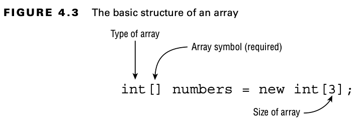

Bu formu kullanarak bir array oluşturduğunuzda, tüm öğeler o type için default değere ayarlanır. Bölüm 1'de
öğrendiğiniz gibi, bir int'in default değeri 0'dır. numbers bir referans değişkeni olduğundan, array nesnesine point
eder, bu da Figure 4.4'te gösterildiği gibidir. Gördüğünüz gibi, tüm öğelerin varsayılan değeri 0'dır. Ayrıca, array'in
index'leri 0'dan başlar ve tıpkı bir String'de olduğu gibi sıralanır.

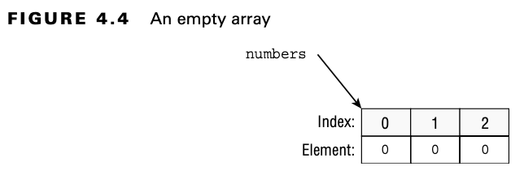

Bir array'i oluşturmanın başka bir yolu da, başlangıçta sahip olması gereken tüm öğeleri belirtmektir:

```
int[] moreNumbers = new int[] {42, 55, 99};
```

Bu örnekte, yine 3 elemanlı bir int array'i oluşturuyoruz. Bu sefer, default değerleri kullanmak yerine bu üç öğenin
initial value'larını belirtiyoruz. Figure 4.5, bu array'in nasıl göründüğünü gösterir.

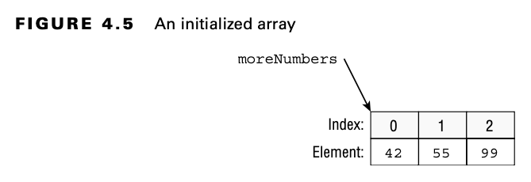

Java, bu expression'in gereksiz olduğunu kabul eder. Çünkü eşittir işaretinin sol tarafında array'in türünü
belirtiyorsunuz, bu nedenle Java zaten type'ı bilir. Ayrıca initial values'ları belirttiğiniz için, boyutunu da zaten
bilir. Kısa bir yol olarak, Java bunun yerine şunu yazmanıza izin verir:

```
int[] moreNumbers = {42, 55, 99};
```

Bu yaklaşıma anonymous array denir. Anonymous çünkü type'ı ve boyutu belirtmezsiniz. Son olarak, []'yi ismin öncesinde
veya sonrasında yazabilirsiniz ve boşluk eklemek optional'dir. Bu, aşağıdaki beş statement'ın da aynı şeyi yaptığı
anlamına gelir:

```
int[] numAnimals;
int [] numAnimals2;
int []numAnimals3;
int numAnimals4[];
int numAnimals5 [];
```

Çoğu insan birincisini kullanır. Ancak sınavda bunlardan herhangi biriyle karşılaşabilirsiniz, bu yüzden köşeli
parantezleri garip yerlerde görmeye alışın.

| Multiple "Arrays" in Declarations (Çoklu array'lerin declaration'ı) |
|---------------------------------------------------------------------|

Sizce aşağıdaki kod ne tür referans variable'ları oluşturur?

```
int[] ids, types;
```

Doğru yanıt int[] türünde iki değişkendir. Bu yeterince mantıklı görünüyor. Sonuçta, int a, b; iki int değişkeni
oluşturdu. Peki ya bu örnek?

```
int ids[], types;
```

Yaptığımız tek şey köşeli parantezleri hareket ettirmekti, ancak bu davranışı değiştirdi. Bu sefer bir int[] türünde bir
değişken ve bir int türünde bir değişken elde ediyoruz. Java bu kod satırını gördüğünde şöyle bir şey düşünüyor: “İki
int türünde değişken istiyorlar. İlki ids[] adında. Bu, ids adında bir int[]. İkincisi ise sadece types olarak
adlandırılmış. Köşeli parantez yok, bu yüzden normal bir integer.

Söylemeye gerek yok, böyle görünen kodlar yazmamalısınız. Ancak sınav için bunu anlamanız gerekiyor.

## Creating an Array with Reference Variables (Referans Değişkenleri ile Array Oluşturma)

Array'in türü olarak herhangi bir Java type'ını seçebilirsiniz. Bu, kendinizin oluşturduğu sınıfları da içerir. Şimdi,
String ile built-in bir türü inceleyelim:

```
String[] bugs = { "cricket", "beetle", "ladybug" };
String[] alias = bugs;

System.out.println(bugs.equals(alias)); // true
System.out.println(bugs.toString()); // [Ljava.lang.String;@160bc7c0
```

equals() methodunu çağırabiliriz çünkü array bir object'dir. Referans eşitliği nedeniyle true döner. Array'lerde ki
equals() methodu, array'in elemanlarına bakmaz. Unutmayın, bu int[] üzerinde de çalışır. int türü bir primitive
type'dır; int[] ise bir object'dir.

İkinci print ifadesi daha da ilginçtir. [Ljava.lang.String;@160bc7c0 nedir? Sınav için bunu bilmenize gerek yok, ancak
[L bunun bir array olduğunu, java.lang.String'in referans türü olduğunu ve 160bc7c0'ın ise hash kodu olduğunu gösterir.
Bu, bir referans olduğu için her çalıştırdığınızda farklı sayılar ve harfler alırsınız.

| Note : |
|--------|

Java, bir array'i güzel bir şekilde yazdıran bir method sağlar: Arrays.toString(bugs) [cricket, beetle, ladybug] olarak
yazdırır.

Figure 4.6'yı anladığınızdan emin olun. Array, String object'leri için alan tahsis etmez. Bunun yerine, object'lerin
gerçekten nerede saklandığına dair bir referans için alan tahsis eder.

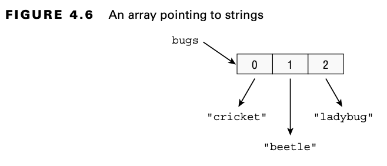

Kısa bir gözden geçirme olarak, bu array'in nereye işaret ettiği hakkında ne düşünüyorsunuz?

```
public class Names {
  String names[];
}
```

Bizi yakaladınız. Bu, 1. Bölümün bir gözden geçirmesiydi ve array'ler üzerine yaptığımız tartışma değildi. Cevap null.
Kod array'i hiç instantiate etmedi, bu yüzden sadece null'a point eden bir referans değişkenidir. Hadi bunu tekrar
deneyelim: Bu array neye işaret ediyor?

```
public class Names {
    String names[] = new String[2];
}
```

Bu bir array çünkü köşeli parantezleri var. Bildirimde belirtilen type olduğu için bir String array'i. Uzunluğu 2 olduğu
için iki elemanı vardır. Bu iki slot şu anda null, ancak bir String object'ine işaret etme potansiyeline sahiptir.

Önceki bölümde, daha büyük bir türü daha küçük bir türe zorlamak istediğinizde yaptığınız casting'i hatırlayın?
Array'ler de bunu yapabilirsiniz:

```
3: String[] strings = { "stringValue" };
4: Object[] objects = strings;
5: String[] againStrings = (String[]) objects;
6: againStrings[0] = new StringBuilder(); // DOES NOT COMPILE 
7: objects[0] = new StringBuilder(); // Careful! EXCEPTION
```

Satır 3, String type'ında bir array oluşturur. Satır 4, Object, String'den daha geniş bir type olduğu için bir cast
gerektirmez. Satır 5'te, daha spesifik bir type'a geçiş yaptığımız için bir cast gerekir. Satır 6 compile edilmez çünkü
String[] yalnızca String object'lerine izin verir ve StringBuilder bir String değildir.

Satır 7, işlerin ilginçleştiği yerdir. Compiler'in bakış açısından, bu gayet normaldir. Bir StringBuilder object'i
açıkça bir Object[] array'ine yerleştirilebilir. Sorun, aslında bir Object[] array'imiz olmamasıdır. Bir Object[]
değişkeniyle referans verilen bir String[] array'imiz vardır. Runtime'da, kod bir ArrayStoreException exception'ı
fırlatır. Bu exception'ın adını ezberlemeniz gerekmez, ancak kodun bir exception fırlatacağını bilmeniz gerekir.

## Using an Array (Array'leri kullanmak)

Artık bir array'i nasıl oluşturacağınızı bildiğinize göre, bir array'e erişmeyi deneyelim:

```
4: String[] mammals = {"monkey", "chimp", "donkey"};
5: System.out.println(mammals.length); // 3
6: System.out.println(mammals[0]); // monkey
7: System.out.println(mammals[1]); // chimp
8: System.out.println(mammals[2]); // donkey
```

Satır 4, array'i declare eder ve initialize eder. Satır 5, array'in kaç eleman tutabileceğini belirtir. Kalan kod
array'i yazdırır. Elemanların 0'dan başlayarak index'lendiğine dikkat edin. Bu, String ve StringBuilder'dan tanıdık
olmalıdır, çünkü onlar da saymaya 0'dan başlar. Bu sınıflar ayrıca uzunluğu, eleman sayısı olarak saymıştır. Uzunluk
method olmadığı için parantez yoktur. Sınavda aşağıdaki gibi compiler hatalarına dikkat edin!

```
4: String[] mammals = {"monkey", "chimp", "donkey"};
5: System.out.println(mammals.length()); // DOES NOT COMPILE
```

Length'in nasıl çalıştığını anladığınızdan emin olmak için, bunun ne yazdıracağını düşünüyorsunuz?

```
var birds = new String[6];
System.out.println(birds.length);
```

Cevap 6'dır. Array'in altı elemanı da null olsa da, yine de altı eleman vardır. Length özelliği array'in içeriğini
dikkate almaz; sadece kaç slotun tahsis edildiğini göz önünde bulundurur.

Bir array'den okuma veya yazma işlemi yaparken loop kullanmak çok yaygındır. Bu loop, her bir numbers elemanını mevcut
index'in beş fazlasına ayarlar:

```
5: var numbers = new int[10];
6: for (int i = 0; i < numbers.length; i++)
7:    numbers[i] = i + 5;
```

Satır 5, yalnızca 10 slotlu bir array başlatır. Satır 6, son derece yaygın bir pattern kullanan bir for döngüsüdür. 0.
index'den başlar, bu da array'in başladığı yerdir. Birer birer devam eder, ta ki array'in sonuna ulaşana kadar. Satır 7,
numbers dizisinin mevcut elemanını ayarlar.

Sınav, array'de olmayan elemanlara erişmeye çalışarak ne kadar dikkatli olduğunuzu test edecektir. Boyutu 10 olan
array'imiz için her birinin neden bir ArrayIndexOutOfBoundsException fırlattığını söyleyebilir misiniz?

```
numbers[10] = 3;

numbers[numbers.length] = 5;

for (int i = 0; i <= numbers.length; i++)
    numbers[i] = i + 5;
```

İlk örnek, indekslerin 0'dan başladığını bilip bilmediğinizi görmek istiyor. Array'imiz de 10 eleman olduğuna göre, bu
sadece numbers[0] ile numbers[9] arasındaki indekslerin geçerli olduğu anlamına gelir. İkinci örnek, 10'un geçersiz
olduğunu bildiğinizi varsayarak bunu length alanını kullanarak gizlemeye çalışır. Ancak, length her zaman geçerli
maksimum index'den bir fazla olur. Son olarak, for döngüsü yanlışlıkla < yerine <= kullanmaktadır, bu da onuncu öğeye
atıfta bulunmanın bir yoludur.

## Sorting

Java, bir array'i sıralamayı kolaylaştırmak için bir sort methodu sağlar — ya da daha doğrusu, bir array sıralama
methodu. Tıpkı StringBuilder'ın append() methoduna neredeyse her şeyi geçirebilmenizi sağladığı gibi, Arrays.sort()
methoduna da neredeyse her tür array'i geçirebilirsiniz.

Arrays sınıfı bir import gerektirir. Kullanabilmek için, sınıfınızda aşağıdaki iki statement'dan birine sahip
olmalısınız:

```
import java.util.*;  // import whole package including Arrays
import java.util.Arrays; // import just Arrays
```

Bir exception vardır, ancak bu sınavda sıkça karşınıza çıkmaz. Bir import belirtmek yerine, sınıfta her kullanıldığında
java.util.Arrays yazabilirsiniz. Unutmayın, size bir kod parçası gösterildiğinde, gerekli import'ların orada olduğunu
varsayabilirsiniz. İşte üç sayıyı sort eden basit bir örnek:

```
int[] numbers = { 6, 9, 1 };

Arrays.sort(numbers);

for (int i = 0; i < numbers.length; i++)
    System.out.print(numbers[i] + " ");
```

Sonuç beklediğiniz gibi 1 6 9 olur. Dikkat edin, array'de ki değerleri yazdırmak için bir loop kullandık. Array'i
doğrudan yazdırmak, [I@2bd9c3e7 gibi can sıkıcı bir hash value verir. Alternatif olarak, loop yerine
Arrays.toString(numbers) methodunu kullanabilirdik. Bu da [1, 6, 9] çıktısını verirdi.

Bunu String type'ları ile tekrar deneyelim:

```
String[] strings = { "10", "9", "100" };

Arrays.sort(strings);

for (String s : strings)
    System.out.print(s + " ");
```

Bu sefer sonuç beklediğiniz gibi olmayabilir. Bu kod 10 100 9 çıktısını verir. Sorun, String'lerin alfabetik sıraya göre
sıralanmasıdır ve 1, 9'dan önce gelir. (Rakamlar harflerden önce, büyük harfler ise küçük harflerden önce sıralanır.) 9.
Bölüm olan “Collections and Generics” te, bir karşılaştırıcı (comparator) kullanarak özel sorting düzenleri oluşturmayı
öğreneceksiniz.

Bu örnekte enchanced for döngüsünü fark ettiniz mi? Index'i kullanmadığımız için traditional for döngüsüne gerek yok.
Ancak bu, sınav hazırlayıcılarının traditional for döngüsünü kullanmasını engellemez, bu yüzden sizi hazır tutmak için
her ikisini de kullanacağız!

## Searching

Java, arama yapmak için de kullanışlı bir method sağlar, ancak yalnızca array zaten sorted edildiyse. Table 4.3, ikili
arama (binary search) için kuralları kapsar.

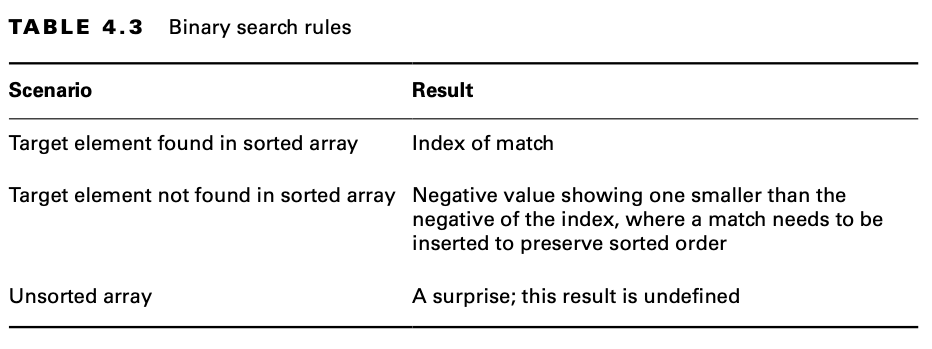

Bu kuralları bir örnekle deneyelim:

```
3: int[] numbers = {2,4,6,8};
4: System.out.println(Arrays.binarySearch(numbers, 2)); // 0
5: System.out.println(Arrays.binarySearch(numbers, 4)); // 1
6: System.out.println(Arrays.binarySearch(numbers, 1)); // -1
7: System.out.println(Arrays.binarySearch(numbers, 3)); // -2
8: System.out.println(Arrays.binarySearch(numbers, 9)); // -5
```

Satır 3'ün sıralı bir array olduğuna dikkat edin. Eğer sıralı olmasaydı, diğer kuralları uygulayamazdık. Satır 4, 2'nin
index'ini arar. Cevap, index 0'dır. Satır 5, 4'ün indeksini arar, bu da 1'dir. Satır 6, 1'in index'ini arar. 1 listede
bulunmasa da, arama sorted order'i korumak için 0. elemana eklenmesi gerektiğini belirleyebilir. 0 zaten array
index'leri için bir şey ifade ettiğinden, Java bize –1 cevabını vermek için 1 çıkarır. Satır 7 de benzer şekilde
çalışır. 3 listede bulunmasa da, sorted order'i korumak için 1. elemana eklenmesi gerekir. Tutarlılık için 1 çıkarır ve
negatif alırız, bu da –1 –1, yani –2 olur. Son olarak, satır 8 bize 9'un 4. index'e eklenmesi gerektiğini söyler. Yine
negatif alır ve 1 çıkarırız, bu da –4 –1, yani –5 olur.

Sizce bu örnekte ne oluyor?

```
5: int[] numbers = new int[] {3,2,1};
6: System.out.println(Arrays.binarySearch(numbers, 2)); // 1
7: System.out.println(Arrays.binarySearch(numbers, 3)); // -4
```

Dikkat edin, satır 5'te array sıralı değil. Bu, çıktının tanımlı olmayacağı anlamına gelir. Bu örneği test ederken,
satır 6 doğru bir şekilde 1 çıktısını verdi. Ancak, satır 7 yanlış bir cevap verdi. Sınav hazırlayıcıları sizden yanlış
değerlerin ne olduğunu bilmenizi beklemeyecek. Array'in sıralı olmadığını gördüğünüz anda, tahmin edilemez bir çıktı
hakkında bir cevap seçeneği arayın.

Sınavda, farklı senaryolarda binary search'ün ne döndürdüğünü bilmeniz gerekir. İlginç bir şekilde, "binary" kelimesinin
neden bu isimde geçtiğini bilmeniz gerekmez. Merak ediyorsanız, binary search bir array'i iki eşit parçaya böler (2'nin
binary olduğunu unutmayın) ve hedefin hangi yarıda olduğunu belirler. Bu işlem, yalnızca bir eleman kalana kadar
tekrarlanır.

## Comparing (Karşılaştırma)

Java, iki array'i karşılaştırarak hangisinin “smaller” olduğunu belirlemek için de methodlar sağlar. Önce compare()
methodunu ele alacağız, ardından mismatch() methoduna geçeceğiz. Bu methodlar, çeşitli parametreleri kabul edecek
şekilde overloaded edilmiştir.

### Using compare()

compare() methodunu çağırmadan önce bilmeniz gereken bir dizi kural vardır. Neyse ki, bunlar 9. Bölüm'de bir Comparator
yazarken bilmeniz gereken kurallarla aynıdır. Öncelikle, return value'nun ne anlama geldiğini öğrenmeniz gerekir. Tam
olarak hangi değerlerin döndüğünü bilmenize gerek yok, ancak aşağıdakileri bilmeniz önemlidir:

* Negatif bir sayı, ilk array'in ikinci array'den daha küçük olduğu anlamına gelir.

* 0'ın anlamı iki array'in eşitliğidir

* Pozitif bir sayı, ilk array'in ikinci array'den daha büyük olduğu anlamına gelir.

İşte bir örnek;

```
System.out.println(Arrays.compare(new int[] {1}, new int[] {2}));
```

Bu kod negatif bir sayı yazdırır (-1). 1'in 2'den küçük olduğunu anlamak oldukça sezgisel olmalı, bu da ilk array'in
daha küçük olduğu anlamına gelir. Şimdi tek bir değeri nasıl karşılaştıracağınızı öğrendiğinize göre, farklı uzunluktaki
array'lerin nasıl karşılaştırıldığına bakalım:

* Eğer her iki array de aynı uzunluğa sahipse ve her bir konumda aynı sırayla aynı değerlere sahipse, sıfır döndürülür.

```
int[] arr1 = { 1, 2, 3, 4 };
int[] arr2 = { 1, 2, 3, 4 };
System.out.println(Arrays.compare(arr1, arr2)); // 0
```

* Eğer tüm elemanlar aynıysa ancak ikinci array'in sonunda ekstra elemanlar varsa, negatif bir sayı döndürülür.

```
System.out.println(Arrays.compare(new int[] {1,2,3},new int[] {1,2,3,4,5,6})); // RETURN -3
```

* Eğer tüm elemanlar aynıysa ancak birinci array'in sonunda ekstra elemanlar varsa, pozitif bir sayı döndürülür.

```
System.out.println(Arrays.compare(new int[] {1,2,3,4,5,6},new int[] {1,2,3})); // RETURN 3
```

* İlk array'de farklı olan ilk eleman daha küçükse, negatif bir sayı döndürür.

```
System.out.println(Arrays.compare(new int[] {10,1,3},new int[] {10,20,3})); // RETURN -1
System.out.println(Arrays.compare(new int[] {9,1,3},new int[] {10,20,3})); // RETURN -1
```

* İlk array'de farklı olan ilk eleman daha büyükse, positive bir sayı döndürür.

```
System.out.println(Arrays.compare(new int[] {11,9,3},new int[] {10,9,3})); // RETURN 1
```

Bu örnekte, compare() methodunu kullanarak iki float array'ini lexicographical sıralarını değerlendirmek için
karşılaştıracağız.

```
float[] arr1={5.12f, 8.3f, 9.17f, 2.5f, 8.8f, 5.17f, 4.2f, 7.37f};
float[] arr2={7.12f, 9.3f, 6.17f, 7.5f, 5.8f, 7.17f, 3.2f, 6.37f};

System.out.println(Arrays.compare(arr1, arr2)); // -1
```

Son olarak, daha küçük ne anlama gelir? İşte burada ve 8. Bölüm “Lambdas and Functional Interfaces” de göreceğiniz
compareTo() methoduna da uygulanan bazı kurallar:

* null diğer tüm değerlerden daha küçüktür.

* Sayılar için normal sayısal sıra geçerlidir.

* String'ler için, biri diğerinin prefix'i ise daha küçüktür.

* String/characters için sayılar harflerden daha küçüktür.

* Strings/characters için büyük harf küçük harften daha küçüktür.

Table 4.4'te bu kuralların uygulamadaki örnekleri gösterilmektedir.

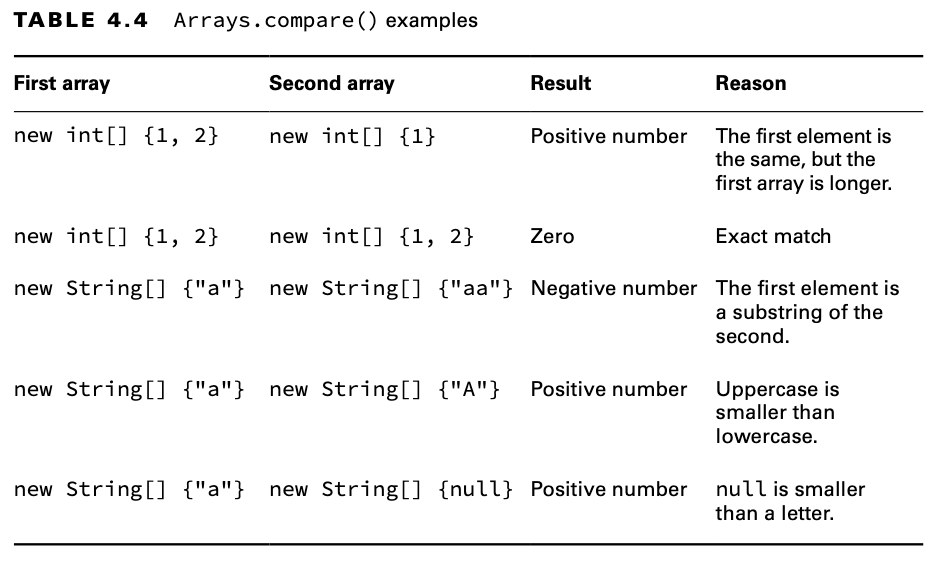

| Ilk Array          | İkinci Array        | Sonuç           | Sebep                                             |
|--------------------|---------------------|-----------------|---------------------------------------------------|
| new int[] {1, 2}   | new int[] {1}       | Positive number | İlk eleman aynıdır, ancak ilk array daha uzundur. |
| new int[] {1, 2}   | new int[] {1, 2}    | Zero            | Tam eşleşme                                       |
| new String[] {"a"} | new String[] {"aa"} | Negative number | İlk öğe, ikincinin bir substring'i.               |
| new String[] {"a"} | new String[] {"A"}  | Positive number | Uppercase, lowercase'den ufaktır                  |
| new String[] {"a"} | new String[] {null} | Positive number | null bir harften daha küçüktür.                   |

Son olarak, bu kod compile edilmez çünkü type'lar farklıdır. İki array'i karşılaştırırken, aynı array type'ına sahip
olmaları gerekir.

```
System.out.println(Arrays.compare(new int[] {1}, new String[] {"a"})); // DOES NOT COMPILE
```

### Using mismatch()

Artık compare() methoduna aşina olduğunuza göre, mismatch() hakkında bilgi edinme zamanı. Eğer array'ler eşitse,
mismatch() -1 döndürür. Aksi takdirde, array'lerin farklılaştığı ilk index'i döndürür. Peki ya bu çıktılar ne verir,
tahmin edebilir misiniz?

```
System.out.println(Arrays.mismatch(new int[] {1}, new int[] {1})) // RETURN -1;
System.out.println(Arrays.mismatch(new String[] {"a"}, new String[] {"A"})); // RETURN 0
System.out.println(Arrays.mismatch(new int[] {1, 2}, new int[] {1})); // RETURN 1
```

İlk örnekte, array'ler aynı olduğundan sonuç -1’dir. İkinci örnekte, 0. elemanlardaki girişler eşit değildir, bu yüzden
sonuç 0’dır. Üçüncü örnekte, 0. elemanlardaki girişler eşittir, bu yüzden aramaya devam ederiz. 1. index'de ki elemanlar
eşit değildir. Daha spesifik olarak, bir array'in 1. index'de bir elemanı varken, diğerinde yoktur. Bu nedenle sonuç
1’dir.

compare() ve mismatch() methodlarını anladığınızdan emin olmak için, Table 4.5’i inceleyin. Eğer değerlerin neden orada
olduğunu anlamıyorsanız, lütfen bu bölümü tekrar çalışın.

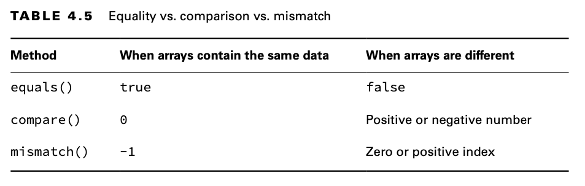

| Method     | Array'ler aynı verileri içerdiğinde | Array'ler farklı olduğunda     |
|------------|-------------------------------------|--------------------------------|
| equals()   | true                                | false                          |
| compare()  | 0                                   | Positive ya da negative number |
| mismatch() | -1                                  | 0 ya da positive index         |

## Using Methods with Varargs

Bir array'i kendiniz oluşturduğunda, şimdiye kadar gördüğümüze benzer bir şekilde görünür. Ancak bir array methodunuza
geçirildiğinde, başka bir şekilde de görünebilir. İşte bir main() methodu ile üç örnek:

```
public static void main(String[] args)
public static void main(String args[])
public static void main(String... args) // varargs
```

Üçüncü örnek, 1. Bölüm’de gördüğünüz varargs (variable arguments) adı verilen bir syntax kullanır. Varargs ile bir
methodu nasıl çağıracağınızı 5. Bölüm “Methods” da öğreneceksiniz. Şu anda bilmeniz gereken tek şey, varargs kullanarak
tanımlanan bir değişkeni, normal bir array'miş gibi kullanabileceğinizdir. Örneğin, args.length ve args[0] geçerli
ifadelerdir.

## Working with Multidimensional Arrays (Çok Boyutlu Array'ler ile Çalışma)

Array'ler object'lerdir ve elbette array component'leri de object olabilir. Bu iki gerçeği bir araya getirmek uzun
sürmez ve array'lerin diğer array'leri barındırıp barındıramayacağını merak edersiniz. Tabii ki, barındırabilirler.

### Creating a Multidimensional Array (Çok Boyutlu Array oluşturmak)

Multidimensional array'ler tanımlamak için birden fazla array seperator'u kullanmanız yeterlidir. Bunları, daha önce
olduğu gibi, tanımda type veya variable adıyla birlikte yerleştirebilirsiniz:

```
int[][] vars1; // 2D array
int vars2 [][]; // 2D array
int[] vars3[]; // 2D array
int[] vars4 [], space [][]; // a 2D AND a 3D array
```

İlk iki örnek şaşırtıcı değil; iki boyutlu (2D) bir array tanımlar. Üçüncü örnek de 2D bir array tanımlar. Bu stili
kullanmanın, kodunuzla okuyucuları kafa karışıklığına sürüklemek dışında iyi bir nedeni yoktur. Son örnek, aynı satırda
iki array tanımlar. Parantezleri toplarsak, vars4'ün bir 2D dizi, space'in ise bir 3D dizi olduğunu görürüz. Yine, bu
stili kullanmanın, kodunuzun okuyucularını kafa karışıklığına sürüklemek dışında bir nedeni yoktur. Ancak, sınav
hazırlayıcıları sizi kafanızı karıştırmaya çalışmaktan hoşlanır. Neyse ki, siz artık bu konuda hazırlıklısınız ve
onların sizi yanıltmasına izin vermeyeceksiniz!

Multidimensional array'in boyutunu, isterseniz declaration sırasında belirtebilirsiniz:

```
String [][] rectangle = new String[3][2];
```

Bu statement ile elde edilen result, üç eleman içeren ve her biri iki elemanlı bir array'e işaret eden bir "array
rectangle'ıdır". Adreslenebilir aralığı [0][0] ile [2][1] arasında düşünebilirsiniz, ancak bunu [0,0] veya [2,1] gibi
adres yapıları olarak düşünmeyin.

Şimdi bu değerlerden birini set ettiğimizi varsayalım:

```
rectangle[0][1] = "set";
```

Sonucu, Figure 4.7’de gösterildiği gibi görselleştirebilirsiniz. Bu array, birçok null değeri içerdiği için seyrek
şekilde doldurulmuştur. Yine de rectangle üç eleman içeren bir array'e işaret eder ve bu üç elemanın her biri iki
elemanlı bir array'e sahiptir. Bir String’e işaret eden tek değere giden yolu da takip edebilirsiniz. Üstteki array'de
index 0. dan başlarsınız. Daha sonra bir sonraki array'de 1. index'e geçersiniz.

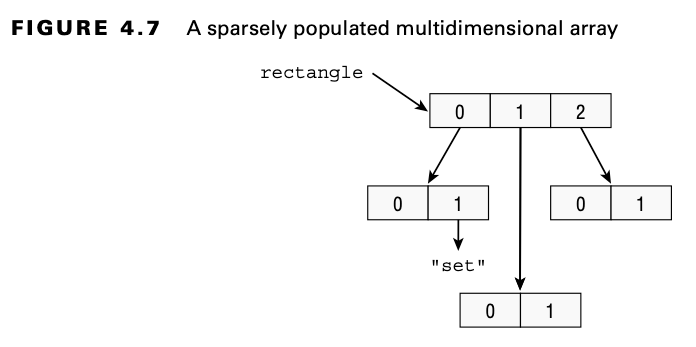

Bu array her ne kadar rectangle bir şekle sahip olsa da, bir array'in bu şekilde olması gerekmez. Şu örneği düşünün:

```
int[][] differentSizes = {{1, 4}, {3}, {9,8,7}};
```

Yine üç elemanlı bir array'e başlıyoruz. Ancak bu sefer, bir sonraki seviyedeki elemanların boyutları farklı. Birinin
uzunluğu 2, diğerinin 1, sonuncusunun ise 3. Figure 4.8’e bakınız. Bu kez array primitive türlerden oluştuğu için,
elemanlar array içinde gösterilmiş gibi görünür.

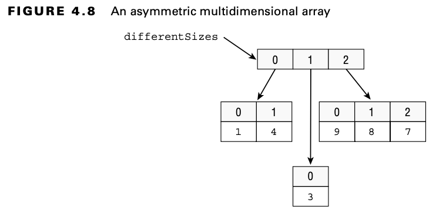

Asymmetric bir array oluşturmanın başka bir yolu, yalnızca array'in ilk boyutunu initialize etmek ve her bir array
component'inin boyutunu ayrı bir statement'da tanımlamaktır:

```
int [][] args = new int[4][];
args[0] = new int[5];
args[1] = new int[3];
args[2] = new int[3];
args[3] = new int[3];
```

Bu teknik, Java’da gerçekte ne elde ettiğinizi ortaya koyar: doğru şekilde yönetildiğinde multidimensional bir etki
sunan array'lerden oluşan array'ler

Başka bir örnek; multiDimensionalArray içindeki ilgili öğeleri hem declare ederek hem de initialize edebiliriz

```
int[][] multiDimensionalArray = new int[3][];
multiDimensionalArray[0] = new int[] {1,2};
multiDimensionalArray[1] = new int[] {3,4,5};
multiDimensionalArray[2] = new int[] {6,7,8,9};
```

Ayrıca, öğelerini initialize etmeden da basitçe declare edebiliriz:

```
int[][] multiDimensionalArray = new int[3][];
multiDimensionalArray[0] = new int[2];
multiDimensionalArray[1] = new int[3];
multiDimensionalArray[2] = new int[4];
```

Arrays.fill() methodu ile array'leri dolduralım;

```
int[][] multiDimensionalArray = new int[3][];
multiDimensionalArray[0] = new int[2];
multiDimensionalArray[1] = new int[3];
multiDimensionalArray[2] = new int[4];

for(int[] array : multiDimensionalArray){
    Arrays.fill(array,7);
}
```

output olarak;

```
[7, 7]
[7, 7, 7]
[7, 7, 7, 7]
```

üretir. multiDimensionalArray'imiz memory'de aşağıda ki şekilde gözükür;

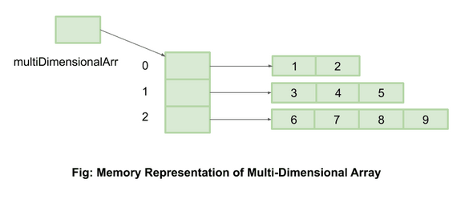

Açıkça, multiDimensionalArray[0] single-dimensional ve size'i 2 olan array'e referans tutuyor, multiDimensionalArray[1]
single-dimensional ve size'i 3 olan array'e referans tutuyor. multiDimensionalArray[2] single-dimensional ve size'i 4
olan array'e referans tutuyor

### Using a Multidimensional Array (Multidimensional Array'lerin kullanılması)

Multidimensional bir array'de ki en yaygın işlem, üzerinde loop kurmaktır. Bu örnek, bir 2D diziyi yazdırır:

```
int[][] twoD = new int[3][6];

for (int i = 0; i < twoD.length; i++) {
  for (int j = 0; j < twoD[i].length; j++) {
      System.out.println(twoD[i][j]);
  }
}
```

Burada iki loop var. İlki, index 'i' kullanarak twoD array'inin ilk subarray'i üzerinde geziniyor. İkincisi ise farklı
bir loop değişkeni olan 'j' kullanıyor. Bu değişkenlerin farklı isimlere sahip olması önemlidir, böylece loop'lar
karışmaz. Inner loop, second level array'de ki eleman sayısını kontrol eder. Inner loop, elemanı yazdırır. Inner loop
tamamlandığında, outer loop yeni bir satıra geçer ve sonraki eleman için aynı işlemi tekrar eder. Bu tüm işlem,
enchanced for loop'u ile daha kolay okunabilir hale gelir.

```
for(int[] inner : twoD) {
  for(int num : inner)
    System.out.print(num + " ");
}
```

# Calculating with Math APIs (Matematik API'leri ile Hesaplama)

Bilgisayarların sayıları hesaplamakta iyi oldukları sürpriz değildir. Java, hayatınızı kolaylaştıracak birçok methoda
sahip güçlü bir Math sınıfı ile birlikte gelir. Burada yalnızca sınavda karşınıza çıkması en olası birkaç yaygın methodu
ele alıyoruz. Kendi projelerinizi yaparken, size yardımcı olabilecek diğer method'ları görmek için Math Javadoc'ına göz
atın.

Matematiksel sorularda return type'lara özel dikkat edin. Bu, kandırmaca yapmak için mükemmel bir fırsattır!

## Finding the Minimum and Maximum (Minimum ve Maximum'u bulmak)

min() ve max() methodları, iki değeri karşılaştırır ve bunlardan birini döndürür. min() methodunun signature formları şu
şekildedir:

```
public static double min(double a, double b)
public static float min(float a, float b)
public static int min(int a, int b)
public static long min(long a, long b)
```

Dört overloaded method vardır, böylece her zaman aynı type'da bir API'ye sahip olursunuz. Her method, a veya b
değerlerinden hangisi daha küçükse onu döndürür. max() methodu da aynı şekilde çalışır, ancak daha büyük olan
değeri döndürür. Aşağıda bu methodların nasıl kullanılacağını gösteren bir örnek yer almaktadır:

```
int first = Math.max(3, 7); // 7
int second = Math.min(7, -9); // -9
```

İlk satır 7'yi döndürür çünkü o daha büyüktür. İkinci satır ise -9'u döndürür çünkü o daha küçüktür. Okuldan hatırlayın,
negatif değerler pozitif değerlerden küçüktür.

## Rounding Numbers

round() methodu, değerin decimal kısmını yok eder ve gerekliyse bir sonraki daha büyük sayıyı seçer. Eğer fractional
(kesirli) kısım .5 veya daha büyükse, yukarı yuvarlanır. round() methodunun signature formları şu şekildedir:

```
public static long round(double num)
public static int round(float num)
```

Yeterli alanın bulunmasını sağlamak için iki overloaded method vardır, böylece gerekirse rounded (yuvarlanmış) bir
double saklanabilir. Aşağıda bu methodun nasıl kullanılacağını gösteren bir örnek yer almaktadır:

```
long low = Math.round(123.45); // 123
long high = Math.round(123.50); // 124
int fromFloat = Math.round(123.45f); // 123
```

İlk satır 123 döndürür çünkü .45, yarımdan daha küçüktür. İkinci satır 124 döndürür çünkü kesirli kısım neredeyse
yarıdır. Son satırda ise açıkça belirtilmiş bir float, int döndüren method imzasını trigger eder.

## Determining the Ceiling and Floor (Tavan ve Tabanın Belirlenmesi)

ceil() methodu bir double değeri alır. Eğer bu değer bir tam sayı ise, aynı değeri döndürür. Eğer fractional (kesirli)
bir değeri varsa, bir sonraki tam sayıya yuvarlar. Buna karşılık, floor() methodu, decimal kısımdan sonrasını atar.

Method imzaları şu şekildedir:

```
public static double ceil(double num)
public static double floor(double num)
```

Aşağıda bu methodların nasıl kullanılacağını gösteren bir örnek bulunmaktadır:

```
double c = Math.ceil(3.14); // 4.0
double f = Math.floor(3.14); // 3.0
```

İlk satır 4.0 döndürür çünkü dört, bir sonraki integer'dır. İkinci satır ise 3.0 döndürür çünkü o, bir öncekinden daha
küçük olan integer'dır

## Calculating Exponents (Üsleri hesaplama)

pow() methodu exponent'leri handle eder. İlkokul matematik derslerinizden hatırlayacağınız gibi, 3² üçün karesi anlamına
gelir. Bu, 3 * 3 veya 9’dur. Fractional exponent'ler de (Kesirli üsler de) kullanılabilir. 16’nın .5’inci kuvveti,
16’nın karekökü anlamına gelir ve bu da 4’tür. (Endişelenmeyin, sınavda karekök almanız gerekmeyecek.)

Method imzası aşağıdaki gibidir:

```
public static double pow(double number, double exponent)
```

Aşağıda bu methodun nasıl kullanılacağı gösterilmektedir:

```
double squared = Math.pow(5, 2); // 25.0
```

Sonucun 25 yerine 25.0 olduğunu fark edin, çünkü bu bir double’dır. Yine, endişelenmeyin; sınav sizden karmaşık
matematik yapmanızı istemeyecek.

Başka bir örnek;

```
a = 2.5;
b = 6.9;
System.out.println(Math.pow(a, b)); // PRINT 556.9113382296638
```

Başka bir örnek;

```
double nan = Double.NaN;
double result = Math.pow(2, nan);
System.out.println(result); // PRINT NaN

result = Math.pow(1254, 0);
System.out.println(result); // PRINT 1.0

result = Math.pow(5, 1);
System.out.println(result); // PRINT 5.0
```

## Generating Random Numbers (Rastgele numaraların üretilmesi)

random() methodu, 0'a eşit veya daha büyük, 1'den küçük bir değer döndürür. Methodun imzası şu şekildedir:

```
public static double random()
```

Bu methodun nasıl kullanılacağını aşağıda görebilirsiniz:

```
double num = Math.random();

System.out.println(num); // PRINT 0.44876751681426585
```

Print comment'i içerisinde her zaman 0 ile 1 arasında random bir değer dönecek.

Bu bir rastgele sayı olduğu için sonucu önceden bilemeyiz. Ancak bazı sayıları eleyebiliriz. Örneğin, negatif olamaz
çünkü bu 0'dan küçüktür. 1.0 olamaz çünkü bu 1'den küçük değildir.

İşte belirli bir aralıkta rastgele bir sayı üretmenin formülü, burada min ve maks bizim alt ve üst sayı sınırımızdır:

```
int max = 100, min = 50;

System.out.println(min + (int)(Math.random() * ((max - min) + 1))); // RANDOM 90
System.out.println(min + (int)(Math.random() * ((max - min) + 1))); // RANDOM 100
System.out.println(min + (int)(Math.random() * ((max - min) + 1))); // RANDOM 56
```

50 - 100 aralığında random sayılar üretir.

| Note : |
|--------|

Sınavda olmasa da, genellikle random sayı üretmek için Random sınıfı kullanılır. Bu sınıf, farklı type'larda sayılar
üretmeyi sağlar.

# Working with Dates and Times (Tarih ve zaman ile çalışmak)

Java, tarih ve saatlerle çalışmak için çeşitli API'ler sunar. Ayrıca eski bir java.util.Date sınıfı da vardır, ancak bu
sınav kapsamında değildir. Modern tarih ve saat sınıflarıyla çalışmak için bir import ifadesine ihtiyacınız vardır. Bunu
kullanmak için programınıza şu import ifadesini ekleyin:

```
import java.time.*; // import time classes
```

| Day vs. Date |
|--------------|

Amerikan İngilizcesinde "date" kelimesi iki farklı kavramı ifade etmek için kullanılır. Bazen, bir olayın gerçekleştiği
ay/gün/yıl kombinasyonunu ifade eder, örneğin 1 Ocak 2000. Bazen de ayın gününü ifade eder, örneğin “Bugünün tarihi
6’sı.” Bu doğru, "day" (gün) ve "date" (tarih) kelimeleri genellikle eşanlamlı olarak kullanılır. Bu ayrımın daha net
olduğu bir yerde yaşıyorsanız, sınavda bu duruma dikkat edin.

Aşağıdaki bölümlerde, tarih ve saat oluşturma ve manipüle etme, zaman dilimleri ve yaz saati uygulaması dahil olmak
üzere konuları inceleyeceğiz.

## Creating Dates and Times

Gerçek dünyada, genellikle tarih ve zaman dilimlerinden bahsederken, diğer kişinin bizimle yakın bir yerde olduğunu
varsayarız. Örneğin, "Salı sabahı saat 11:00'de seni arayacağım" dersek, 11:00'in her ikimiz için de aynı anlama
geldiğini varsayarız. Ancak, eğer ben New York'ta yaşıyorsam ve sen Kaliforniya'da yaşıyorsan, daha spesifik olmamız
gerekir. Kaliforniya, New York'tan üç saat geridir çünkü bu eyaletler farklı zaman dilimlerinde yer alır. Bunun
yerine, "Salı sabahı saat 11:00 EST (Eastern Standard Time) da seni arayacağım" demeniz gerekir.

Tarih ve saatlerle çalışırken, ilk yapmanız gereken şey ne kadar bilgiye ihtiyacınız olduğunu belirlemektir. Sınavda
size dört seçenek sunulmaktadır:

* **LocalDate**, sadece bir date içerir — time ve time-zone yoktur. LocalDate için iyi bir örnek, bu yılki doğum
  gününüzdür. Doğum gününüz, hangi saatte olursa olsun, bir tam gün boyunca geçerlidir.

* **LocalTime**, sadece bir time içerir — date ve time-zone yoktur. LocalTime için iyi bir örnek, gece yarısıdır.
  Her gün aynı saatte gece yarısıdır.

* **LocalDateTime**, hem bir data hem de bir time içerir, ancak time-zone yoktur. LocalDateTime için iyi bir
  örnek, "Yılbaşı gecesi gece yarısı"dır. 2 Ocak'taki gece yarısı o kadar özel değildir, bu yüzden tarih nispeten
  önemsiz hale gelir ve gece yarısından bir saat sonrası da aynı şekilde özel değildir.

* **ZonedDateTime**, bir date, time ve time-zone içerir. ZonedDateTime için iyi bir örnek, "9:00 sabah EST’deki bir
  konferans görüşmesi"dir. Eğer Kaliforniya'da yaşıyorsanız, görüşme 6:00 sabah local time'ınız da olacağı için
  gerçekten erken kalkmanız gerekecek!

Tarih ve saat instance'larını bir static method kullanarak elde edersiniz:

```
System.out.println(LocalDate.now()); 
System.out.println(LocalTime.now()); 
System.out.println(LocalDateTime.now()); 
System.out.println(ZonedDateTime.now()); 
```

Dört sınıfın her birinde, geçerli tarih ve saati veren now() adında bir statik method bulunmaktadır. Çıktınız, kodu
çalıştırdığınız zamana ve nerede yaşadığınıza bağlı olarak değişecektir.

```
2024-11-28
16:07:26.638231
2024-11-28T16:07:26.638318
2024-11-28T16:07:26.638896+03:00[Europe/Istanbul]
```

Önemli olan, çıktıda yer alan bilginin türüdür. İlk satır sadece bir date içerir ve time bilgisi yoktur. İkinci satır
sadece bir time içerir ve date bilgisi yoktur. Time, hour, minutes, seconds ve fractional (kesirli) second'ları
gösterir. Üçüncü satır hem bir date hem de bir time içerir. LocalDateTime'ı bir String'e dönüştürürken, date ve
time'ı ayırmak için 'T' kullanılır. Son olarak, dördüncü satır time-zone offsetini ve time-zone'u ekler. Istanbul,
Greenwich Mean Time (Ortalama Zaman) ından (GMT) üç zaman dilimi uzaklıktadır.

```
021–10–25T09:13:07.769–05:00[America/New_York]
```

Greenwich Mean Time (GMT), Avrupa'da bir zaman dilimidir ve offsetler tartışıldığında sıfır zaman dilimi olarak
kullanılır. Ayrıca Coordinated Universal Time (UTC)'yi de duymuş olabilirsiniz; bu, bir zaman dilimi standardıdır.
UTC, İngilizce ve Fransızca isimler arasında bir uzlaşma olarak kısaltılmıştır. (Bu bir yazım hatası değildir. UTC,
aslında hiçbir dilde doğru bir kısaltma değildir!) UTC, GMT ile aynı sıfır zaman dilimini kullanır.

İlk olarak, bu anların zaman olarak ne kadar uzak olduğunu anlamaya çalışalım. Hindistan'ın tam bir saat değil, yarım
saatlik bir offsete sahip olduğunu fark edeceksiniz. Böyle bir problemi çözmek için, time'i timezone'dan çıkarırsınız.
Bu, zamanın GMT eşdeğerini elde etmenizi sağlar:

```
2022–06–20T06:50+05:30[Asia/Kolkata] // GMT 2022–06–20 01:20
2022–06–20T07:50-05:00[US/Eastern] // GMT 2022–06–20 12:50
```

```
06:50 - 05:30     // 01:20
07:50 - -05:00    // 12:50
```

Unutmayın ki negatif bir sayıyı çıkardığınızda ekleme yapmanız gerekir. GMT'ye dönüştürdükten sonra, U.S. Eastern
Time'ının Kolkata time'ından 11 buçuk saat geride olduğunu görebilirsiniz.

| Note : |
|--------|

Time zone offset farklı şekillerde listelenebilir: +02:00, GMT+2 ve UTC+2 hepsi aynı şeyi ifade eder. Sınavda
bunların herhangi birini görebilirsiniz.

Bunu hatırlamakta zorlanıyorsanız, zaman dilimlerinin birkaç bölge uzaklıkta olduğu bir örnek ezberlemeye çalışın ve
yönü hatırlayın. Amerika Birleşik Devletleri'nde, çoğu insan Doğu Kıyısı'nın Batı Kıyısı'ndan üç saat ileride olduğunu
bilir. Çoğu insan ayrıca Asya'nın Avrupa'dan ileride olduğunu bilir. Sadece hatırlamak için seçtiğiniz örnekte zaman
dilimi sıfırını geçmemeye özen gösterin. Hesaplama aynı şekilde çalışır, ancak hafızayı desteklemesi o kadar etkili
olmayabilir.

| Wait, I Don’t Live in the United States (Bekle, ben United States'de yaşamıyorum) |
|-----------------------------------------------------------------------------------|

Sınav, sınavı yapanların dünya çapında farklı yerlerde yaşadığını kabul eder ve size ABD tarih ve saat formatlarının
ayrıntılarıyla ilgili sorular sormaz. Bununla birlikte, örneklerimiz ABD tarih ve saat formatlarını kullanmaktadır ve
sınavdaki sorular da aynı şekilde olacaktır. Sadece ayın tarihten önce geldiğini unutmayın. Ayrıca, Java genellikle 24
saatlik bir saat dilimi kullanır, oysa Amerika Birleşik Devletleri 12 saatlik bir saat dilimi kullanır ve a.m./p.m.
ifadesiyle belirtir.

Şimdi mevcut tarih ve saati nasıl oluşturacağınızı bildiğinize göre, diğer specific tarih ve saatlere bakalım. Başlamak
için, sadece bir date oluşturacağız, time bilgisi olmayacak. Aşağıdaki her iki örnek de aynı tarihi oluşturur:

```
var date1 = LocalDate.of(2022, Month.JANUARY, 20);
var date2 = LocalDate.of(2022, 1, 20);
```

Her ikisi de yıl, ay ve günü geçirir. Kodun daha okunabilir olması için Month constant'larını kullanmak iyi bir yöntem
olsa da, doğrudan ayın int numarasını da geçirebilirsiniz. Gerçek hayatta tarihi yazıyormuş gibi ayın numarasını
kullanabilirsiniz. Method imzaları şu şekildedir:

```
public static LocalDate of(int year, int month, int dayOfMonth)
public static LocalDate of(int year, Month month, int dayOfMonth)
```

| Note : |
|--------|

Şimdiye kadar, Java'nın 0'dan başladığını sürekli olarak söyledik. Ancak aylar bir istisnadır. Yeni tarih ve saat
methodlarında, Java ayları 1'den başlayarak sayar, tıpkı bizim gibi insanlar gibi.

Bir time oluştururken, ne kadar ayrıntılı olmak istediğinize karar verebilirsiniz. Sadece saati ve dakikayı
belirtebilir veya saniye sayısını da ekleyebilirsiniz. Hatta çok hassas olmak isterseniz, nanosaneyi de dahil
edebilirsiniz. (Bir nanosaniye için, bir saniyenin milyarda biri denir, ancak muhtemelen bu kadar spesifik olmanıza
gerek olmayacaktır.)

```
var time1 = LocalTime.of(6, 15); // hour and minute
var time2 = LocalTime.of(6, 15, 30); // + seconds
var time3 = LocalTime.of(6, 15, 30, 200); // + nanoseconds
```

Bu üç time birbirinden farklıdır, ancak her biri bir dakika içinde yer alır. Method imzaları şu şekildedir:

```
public static LocalTime of(int hour, int minute)
public static LocalTime of(int hour, int minute, int second)
public static LocalTime of(int hour, int minute, int second, int nanos)
```

Dates ve Times'ı bir arada tek bir nesne olarak birleştirebilirsiniz:

```
var date1 = LocalDate.of(2022, Month.JANUARY, 20);
var time1 = LocalTime.of(6, 15);

var dateTime1 = LocalDateTime.of(2022, Month.JANUARY, 20, 6, 15, 30);
var dateTime2 = LocalDateTime.of(date1, time1);
```

İlk kod satırı, tüm bilgileri aynı satırda nasıl belirleyebileceğinizi gösterir. İkinci kod satırı ise, önce LocalDate
ve LocalTime nesnelerini ayrı ayrı oluşturup, ardından bunları birleştirerek bir LocalDateTime nesnesi oluşturmayı
gösterir. Birçok kombinasyon olduğu için birçok method imzası vardır. Aşağıdaki method imzaları, integer değerlerini
kullanır:

```
public static LocalDateTime of(int year, int month,int dayOfMonth, int hour, int minute)
public static LocalDateTime of(int year, int month,int dayOfMonth, int hour, int minute, int second)
public static LocalDateTime of(int year, int month,int dayOfMonth, int hour, int minute, int second, int nanos)
```

Diğerleri bir Month referansı alır:

```
public static LocalDateTime of(int year, Month month,int dayOfMonth, int hour, int minute)
public static LocalDateTime of(int year, Month month,int dayOfMonth, int hour, int minute, int second)
public static LocalDateTime of(int year, Month month,int dayOfMonth, int hour, int minute, int second, int nanos)
```

Son olarak, mevcut bir LocalDate ve LocalTime alınır:

```
public static LocalDateTime of(LocalDate date, LocalTime time)
```

```
Set<String> allZones = ZoneId.getAvailableZoneIds();
```

allZones içerisinde kullanılabilecek tüm Zone'lar yer alır

Bir ZonedDateTime oluşturmak için, önce istediğimiz zaman dilimini almamız gerekir. Örneklerimizde US/Eastern zaman
dilimini kullanacağız:

```
var zone = ZoneId.of("US/Eastern");
var zoned1 = ZonedDateTime.of(
        2024, 11, 29,
        10, 8, 30, 200,
        zone);

var date1 = LocalDate.of(2022, Month.JANUARY, 20);
var time1 = LocalTime.of(6, 15);
var dateTime1 = LocalDateTime.of(2022, Month.JANUARY, 20, 6, 15, 30);

var zoned2 = ZonedDateTime.of(date1,time1,zone);
var zoned3 = ZonedDateTime.of(dateTime1,zone);
```

Öncelikle time zone object'ini alarak başlıyoruz. Daha sonra ZonedDateTime oluşturmak için üç yaklaşımdan birini
kullanıyoruz. İlk yaklaşım, tüm field'leri tek tek geçer. Bu methodu önermiyoruz çünkü çok fazla sayı içerir ve okunması
zordur. Daha iyi bir yaklaşım, bir LocalDate ve bir LocalTime object'ini ya da bir LocalDateTime object'ini geçirmektir.

ZonedDateTime oluşturmanın başka yolları olsa da, sınav için yalnızca üç methodu bilmeniz yeterlidir:

```
public static ZonedDateTime of(int year, int month,int dayOfMonth, 
                               int hour, int minute, int second,int nanos, 
                               ZoneId zone)
                               
public static ZonedDateTime of(LocalDate date, LocalTime time,ZoneId zone)
public static ZonedDateTime of(LocalDateTime dateTime, ZoneId zone)
```

Dikkat edin, Month enum'ını geçmek için bir seçenek yoktur. Ayrıca, hiçbir örnekte bir constructor kullanmadık. Tarih ve
saat sınıfları, instance döndüren statik methodlar ile birlikte private constructor'a sahiptir. Bu, Factory Desing
Pattern olarak bilinir. Sınavı hazırlayanlar size buna benzer bir şeyle gelebilir:

```
var d = new LocalDate(); // DOES NOT COMPILE
```

Buna kanmayın. Bir date veya time object'ini doğrudan oluşturmanıza izin verilmez. Bir diğer tuzak, of() methoduna
geçersiz sayılar verdiğinizde ne olduğudur. Örneğin:

```
var d = LocalDate.of(2022, Month.JANUARY, 32) // DateTimeException
```

Atılan exception'ın tam olarak ne olduğunu bilmenize gerek yok, ancak oldukça açık bir exception:

```
java.time.DateTimeException: Invalid value for DayOfMonth
    (valid values 1-28/31): 32
```

## Manipulating Dates and Times

Bir date'e ekleme yapmak kolaydır. Date ve Time sınıfları değişmezdir (immutable). Bu methodların sonuçlarının
kaybolmaması için bunları bir referans değişkene atamayı unutmayın.

```
12: var date = LocalDate.of(2022, Month.JANUARY, 20);
13: System.out.println(date); // 2022–01–20
14: date = date.plusDays(2);
15: System.out.println(date); // 2022–01–22
16: date = date.plusWeeks(1);
17: System.out.println(date); // 2022–01–29
18: date = date.plusMonths(1);
19: System.out.println(date); // 2022–02–28
20: date = date.plusYears(5);
21: System.out.println(date); // 2027–02–28
```

Bu kod güzel çünkü tam olarak göründüğü gibi çalışıyor. 20 Ocak 2022 ile başlıyoruz. 14. satırda, date'e iki gün
ekleyerek bunu referans değişkenimize yeniden atıyoruz. 16. satırda bir hafta ekliyoruz. Bu method, plusDays(7)
methoduna göre daha açık bir kod yazmamıza olanak tanır. Şimdi date 29 Ocak 2022'dir. 18. satırda bir ay ekliyoruz. Bu
işlem bizi 29 Şubat 2022 tarihine götürecektir.

Ancak, 2022 bir Leap year (artık yıl) değildir. (2020 ve 2024 artık yıllardır.) Java, 29 Şubat 2022'nin var olmadığını
anlayacak kadar akıllıdır ve bunun yerine bize 28 Şubat 2022'yi verir. Son olarak, 20. satır beş yıl ekler.

Time içinde geriye gitmek için de güzel ve kolay methodlar vardır. Bu sefer, LocalDateTime ile çalışalım:

```
22: var date = LocalDate.of(2024, Month.JANUARY, 20);
23: var time = LocalTime.of(5, 15);
24: var dateTime = LocalDateTime.of(date, time);
25: System.out.println(dateTime); // 2024–01–20T05:15
26: dateTime = dateTime.minusDays(1);
27: System.out.println(dateTime); // 2024–01–19T05:15
28: dateTime = dateTime.minusHours(10);
29: System.out.println(dateTime); // 2024–01–18T19:15
30: dateTime = dateTime.minusSeconds(30);
31: System.out.println(dateTime); // 2024–01–18T19:14:30
```

Satır 25, orijinal tarih olan 20 Ocak 2024, saat 5:15'i yazdırır. 26. satır bir tam gün çıkararak 19 Ocak 2024, saat 5:
15'e götürür. 28. satır 10 saat çıkarır ve saatin değişmesine neden olan bir durum olduğunda tarihi değiştirir, bu
da 18 Ocak 2024, saat 19:15 olarak gösterilir. Son olarak, 30. satır 30 saniye çıkarır. Hemen ardından, ekranda
saniyelerin görünmeye başladığını görebilirsiniz. Java, saniyeleri ve nanosaniyeleri kullanmadığımızda gizleyecek kadar
akıllıdır.

Tarih ve saat methodlarının zincirleme kullanılması yaygındır. Örneğin, yazdırma ifadeleri olmadan, önceki örnek şu
şekilde yeniden yazılabilir:

```
var date = LocalDate.of(2024, Month.JANUARY, 20);
var time = LocalTime.of(5, 15);
var dateTime = LocalDateTime.of(date, time).minusDays(1).minusHours(10).minusSeconds(30);
```

Birçok manipülasyon yapmanız gerektiğinde, bu zincirleme kullanım çok işe yarar. Sınav hazırlayanlar sizi kandırmak için
iki yol kullanabilir. Sizce bu ne yazdırır?

```
var date = LocalDate.of(2024, Month.JANUARY, 20);
date.plusDays(10);
System.out.println(date);
```

Bu, 20 Ocak 2024'ü yazdırır. 10 gün eklemek gereksizdi çünkü program sonucu görmezden geldi. Değiştirilemez (immutable)
türlerle çalışırken, bir method çağrısının döndürdüğü değerin göz ardı edilmediğinden emin olmak önemlidir. Sınavda
ayrıca, her bir tarih ve saat object'inin neleri içerdiğini hatırlayıp hatırlamadığınızı test edebilir. Burada neyin
yanlış olduğunu görebiliyor musunuz?

```
var date = LocalDate.of(2024, Month.JANUARY, 20);
date = date.plusMinutes(1); // DOES NOT COMPILE
```

LocalDate, time içermez. Bu, ona dakika ekleyemeyeceğiniz anlamına gelir. Bu, ekleme/çıkarma işlemleri zincirinde kafa
karıştırıcı olabilir, bu yüzden Hangi türler üzerinde hangi methodların çağrılabileceğini gösteren Table 4.6'da yer alan
bilgileri bildiğinizden emin olun.

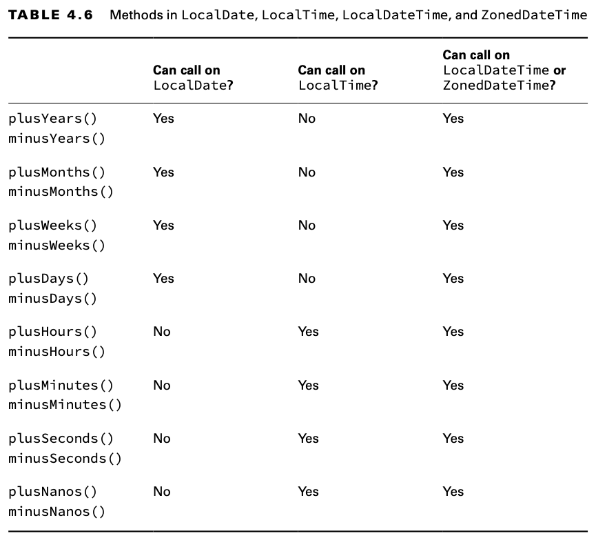

## Working with Periods

Şimdi, tarihlerle eğlenceli bir şeyler yapacak kadar bilgiye sahipsiniz! Hayvanat bahçemizde, hayvanlara eğlenceli bir
şeyler yapmaları için zenginleştirme aktiviteleri düzenleniyor. Başhayvan bakıcısı, oyuncakları her ay değiştirmeye
karar verdi. Bu sistem üç ay boyunca devam edecek ve nasıl çalıştığını görmek için izlenecek.

```
public static void main(String[] args) {
    var start = LocalDate.of(2022, Month.JANUARY, 1);
    var end = LocalDate.of(2022, Month.MARCH, 30);
    performAnimalEnrichment(start, end);
}

private static void performAnimalEnrichment(LocalDate start, LocalDate end) {
    var upTo = start;
    while(upTo.isBefore(end)){      //  son tarihe gelmişmi kontrol et
        System.out.println("give new toy: " + upTo); 
        upTo = upTo.plusMonths(1);      // upTo değişkenine 1 ay ekle
    }
}
```

Bu kod düzgün çalışır. Date'e bir ay ekler ve bu işlem, son tarihe ulaşana kadar devam eder. Ancak, bu methodun yeniden
kullanılamaması bir sorundur. Hayvan bakıcımız, hangi programın en iyi çalıştığını görmek için farklı schedules'ları
denemek istiyor.

| Note : |
|--------|

LocalDate ve LocalDateTime, kendilerini long'a dönüştürmek için bir methoda sahiptir. Bu değer, 1 Ocak 1970'ten (epoch
olarak adlandırılan tarih) bu yana geçen milisaniye sayısına eşdeğerdir. Peki, bu tarih neden özeldir? Bu, Unix'in tarih
standartları için kullanmaya başladığı tarihtir ve Java da bunu yeniden kullanmıştır.

Neyse ki, Java'da bir Period class'ı bulunmaktadır ve bunu kullanabiliriz. Bu kod, önceki örnekle aynı işlemi yapar:

```
public static void main(String[] args) {
    var start = LocalDate.of(2022, Month.JANUARY, 1);
    var end = LocalDate.of(2022, Month.MARCH, 30);
    var period = Period.ofMonths(1);
    performAnimalEnrichment(start, end,period);
}

private static void performAnimalEnrichment(LocalDate start, LocalDate end, Period period) {
    var upTo = start;
    while(upTo.isBefore(end)){
        System.out.println("give new toy: " + upTo);
        upTo = upTo.plus(period); 
    }
}
```

Method, geçirilen herhangi bir zaman periyodunu ekleyebilir. Bu, hayvan bakıcımız fikrini değiştirdikçe aynı methodu
farklı zaman periyotları için yeniden kullanmamıza olanak tanır.

Period sınıfını oluşturmanın beş yolu vardır:

```
var annually = Period.ofYears(1);           // every 1 year
var quarterly = Period.ofMonths(3);         // every 3 months
var everyThreeWeeks = Period.ofWeeks(3);    // every 3 weeks
var everyOtherDay = Period.ofDays(2);       // every 2 days
var everyYearAndAWeek = Period.of(1,0,7);   // every year and 7 days
```

Bir püf noktası var. Bir Period oluştururken methodları zincirleyemezsiniz. Aşağıdaki kod, everyYearAndAWeek örneğiyle
eşdeğer gibi görünüyor, ancak değildir. Çünkü sadece son method kullanılır. Bunun nedeni, Period.of methodlarının statik
olmasıdır.

```
var wrong = Period.ofYears(1).ofWeeks(1); // every week
```

Bu zor kod gerçekten aşağıdakileri yazmak gibidir:

```
var wrong = Period.ofYears(1);
wrong = Period.ofWeeks(1);
```

Bu, açıkça istediğiniz şey değil! Bu yüzden of() methodu, yıl, ay ve gün sayısını aynı anda geçirmenize olanak tanır.
Hepsi aynı döneme (period'a) dahil edilir. Bu tür bir kullanımda, compiler size bir uyarı verecektir. Compiler
uyarıları, compiler işlemi başarısız olmadan bir şeylerin yanlış veya şüpheli olduğunu size bildirir.

of() methodu yalnızca yıl, ay ve gün alır. Haftaları geçirmek için başka bir factory methodunu kullanma olanağı yalnızca
bir kolaylıktır. Tahmin edebileceğiniz gibi, period, yıllar, aylar ve günler cinsinden saklanır. Değeri yazdırdığınızda,
Java sıfır olmayan kısımları Figure 4.9'da gösterilen formatı kullanarak görüntüler.

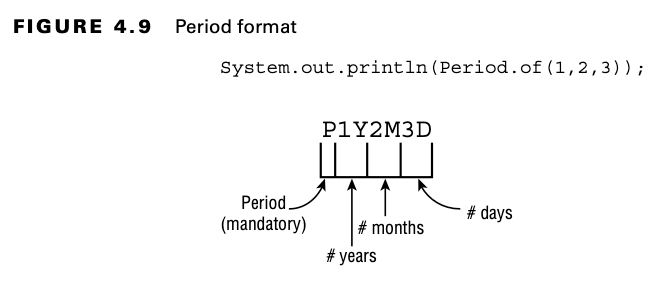

Gördüğünüz gibi, P her zaman bir dönemi (period) ifade ettiğini göstermek için String'in başında yer alır. Ardından yıl
sayısı, ay sayısı ve gün sayısı gelir. Eğer bunlardan herhangi biri sıfır ise, bu kısım atlanır.

Bu kodun ne çıktısı vereceğini tahmin edebilir misiniz?

```
System.out.println(Period.ofMonths(3)); // Output P3M
```

Çıktı P3M olacaktır. Java'nın sıfır olan ölçümleri atladığını unutmayın. Period hakkında bilmeniz gereken son şey, hangi
object'ler ile kullanılabileceğidir. Şimdi biraz koda bakalım:

```
3: var date = LocalDate.of(2022, 1, 20);
4: var time = LocalTime.of(6, 15);
5: var dateTime = LocalDateTime.of(date, time);
6: var period = Period.ofMonths(1);
7: System.out.println(date.plus(period)); // 2022–02–20
8: System.out.println(dateTime.plus(period)); // 2022–02–20T06:15
9: System.out.println(time.plus(period)); // EXCEPTION
```

Satırlar 7 ve 8 beklendiği gibi çalışır. 20 Ocak 2022'ye bir ay ekleriz ve bu da 20 Şubat 2022'yi verir. İlk satırda
yalnızca date, ikinci satırda ise hem date hem de time vardır. Satır 9, sadece time'i içeren bir nesneye bir ay eklemeyi
dener. Bu, çalışmaz. Java, bir UnsupportedTemporalTypeException fırlatır ve Months gibi desteklenmeyen bir birim
kullanmaya çalıştığınızı belirtir. Gördüğünüz gibi, her yerde date ve time nesnelerini gördüğünüzde, türlerine dikkat
etmeniz gerekmektedir.

## Working with Durations

Muhtemelen şimdiye kadar bir Period'ün bir gün veya daha büyük zaman dilimleri için olduğunu fark etmişsinizdir. Bununla
birlikte, Duration da vardır ve bu, daha küçük zaman birimleri için tasarlanmıştır. Duration ile gün, saat, dakika,
saniye veya nanosaniye sayısını belirtebilirsiniz. Evet, bir yıl için 365 gün geçirebilirsiniz, ancak bunu gerçekten
yapmamalısınız - bu, Period'un işidir.

Uygun bir şekilde, Duration, Period ile neredeyse aynı şekilde çalışır, ancak zamanı olan nesnelerle kullanılır.
Duration, PT ile başlayarak çıktı verir, bunu bir period of time olarak düşünebilirsiniz. Bir Duration, saat, dakika ve
saniye cinsinden saklanır. Saniye sayısı fractional (kesirli) saniyeleri içerir.

Farklı ayrıntı düzeylerini kullanarak bir Duration oluşturabiliriz:

```
var daily = Duration.ofDays(1);                 // PT24H
var hourly = Duration.ofHours(1);               // PT1H
var everyMinute = Duration.ofMinutes(1);        // PT1M
var everyTenSeconds = Duration.ofSeconds(10);   // PT10S
var everyMilli = Duration.ofMillis(1);          // PT0.001S
var everyNano = Duration.ofNanos(1);            // PT0.000000001S
```

Duration, Period gibi birden fazla birimi kabul eden bir factory methoduna sahip değildir. Eğer bir şeyin her bir buçuk
saatte bir olmasını istiyorsanız, 90 dakika belirtmeniz gerekir. Duration başka bir generic factory methoduna sahiptir.
Bir sayı ve bir TemporalUnit alır. Fikir, örneğin "5 saniye" gibi bir şeydir. Ancak, TemporalUnit bir interface'dir. Şu
anda, ChronoUnit adlı yalnızca bir implementation'ı vardır.

Önceki örnek şu şekilde yeniden yazılabilir:

```
var daily = Duration.of(1, ChronoUnit.DAYS);
var hourly = Duration.of(1, ChronoUnit.HOURS);
var everyMinute = Duration.of(1, ChronoUnit.MINUTES);
var everyTenSeconds = Duration.of(10, ChronoUnit.SECONDS);
var everyMilli = Duration.of(1, ChronoUnit.MILLIS);
var everyNano = Duration.of(1, ChronoUnit.NANOS);
```

ChronoUnit ayrıca 12 saati temsil etmek için ChronoUnit.HALF_DAYS gibi bazı kullanışlı birimler içerir.

| ChronoUnit for Differences : |
|------------------------------|

ChronoUnit, iki Temporal değeri arasındaki farkı belirlemenin harika bir yoludur. Temporal, LocalDate, LocalTime vb.'yi
içerir. ChronoUnit, java.time.temporal package'inde bulunur.

```
var one = LocalTime.of(5,15);
var two = LocalTime.of(6,30);
var date = LocalDate.of(2016,1,20);

System.out.println(ChronoUnit.HOURS.between(one,two));  // OUTPUT 1
System.out.println(ChronoUnit.MINUTES.between(one,two)); // OUTPUT 75
System.out.println(ChronoUnit.MINUTES.between(one,date)); // DateTimeException
```

İlk print statement'ı, between'ın round (yuvarlamadığını), truncate (kesme işlemi) yaptığını gösterir. İkincisi, farklı
birimlerde count'un ne kadar kolay olduğunu gösterir. Sadece ChronoUnit type'ını değiştirin. Sonuncusu, Java'nın date
ve time object'lerinde yapılabileceklerini karıştırırsak bir exception fırlatacağını hatırlatıyor. Alternatif olarak,
time öğesi olan herhangi bir object'i truncate edebilirsiniz. Örneğin:

```
LocalTime time = LocalTime.of(18,8,44);
System.out.println(time);   // 18:08:44
LocalTime truncated = time.truncatedTo(ChronoUnit.MINUTES);
System.out.println(truncated);  // 18:08
```

Bu örnek, dakika'dan küçük tüm alanları sıfırlar. Bizim durumumuzda, saniyeleri kaldırıyor.

Bir Duration kullanmak, bir Period kullanmakla aynı şekilde çalışır. Örneğin:

```
7: var date = LocalDate.of(2022, 1, 20);
8: var time = LocalTime.of(6, 15);
9: var dateTime = LocalDateTime.of(date, time);
10: var duration = Duration.ofHours(6);
11: System.out.println(dateTime.plus(duration)); // 2022–01–20T12:15
12: System.out.println(time.plus(duration)); // 12:15
13: System.out.println(
14:     date.plus(duration)); // UnsupportedTemporalTypeException
```

Satır 11, LocalDateTime'in bir time içerdiğinden saat ekleyebileceğimizi gösterir. 12. satır da çalışır, çünkü sadece
bir time vardır. 13. satır başarısız olur çünkü time içermeyen bir object'e time ekleyemeyiz.

Tekrar deneyelim ama bu sefer 23 saat ekleyelim.

```
7: var date = LocalDate.of(2022, 1, 20);
8: var time = LocalTime.of(6, 15);
9: var dateTime = LocalDateTime.of(date, time);
10: var duration = Duration.ofHours(23);
11: System.out.println(dateTime.plus(duration)); // 2022–01–21T05:15
12: System.out.println(time.plus(duration)); // 05:15
13: System.out.println(
14:     date.plus(duration)); // UnsupportedTemporalTypeException
```

Bu sefer Java'nın günün sonundan sonra ilerlediğini görüyoruz. 11. satır, gece yarısını geçtiğimiz için ertesi güne
gider. 12. satırda bir date yoktur, bu yüzden time gerçek bir saatteki gibi sadece döner.

## Period vs. Duration

Unutmayın ki Period ve Duration eşdeğer değildir. Bu örnek, aynı uzunluktaki bir Period ve Duration'ı gösterir:

```
var date = LocalDate.of(2022,5,25);

var period = Period.ofDays(1);
var duration = Duration.ofDays(1);

System.out.println(date.plus(period));      // 2022–05–26
System.out.println(date.plus(duration));    // Unsupported unit: Seconds
```

Bir LocalDate ile çalıştığımız için Period kullanmamız gerekir. Duration, görmesek bile time birimlerine sahiptir ve
sadece time içeren object'ler içindir. Hangi object'lerin Period ve Duration kullanabileceğini belirlemek için Table
4.7'yi doldurabileceğinizden emin olun.

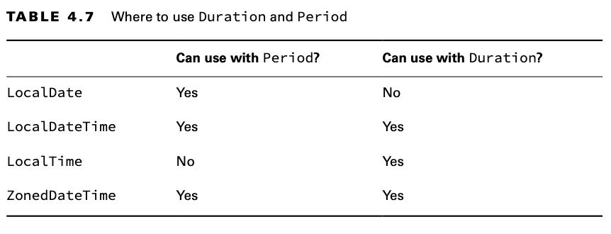

## Working with Instants

Instant sınıfı, GMT time zone'unda ki belirli bir anı temsil eder. Bir timer çalıştırmak istediğinizi varsayalım:

```
var now = Instant.now();
List<Integer> consumeTime = new ArrayList<>();
for (int i = 0; i<100000; i++){
    consumeTime.add(i);
}
var later = Instant.now();

var duration = Duration.between(now,later);
System.out.println(duration.toMillis());
```

Bizim durumumuzda, List<Integer> collection'ına 100000 eleman ekledik sadece 3 milisaniye sürdü

Bir ZonedDateTime'iniz varsa, onu bir Instant'a dönüştürebilirsiniz:

```
var date = LocalDate.of(2022,5,25);
var time = LocalTime.of(11,55,0);
var zone = ZoneId.of("US/Eastern");

var zonedDateTime = ZonedDateTime.of(date,time,zone);

var instant = zonedDateTime.toInstant();

System.out.println(instant);        // 2022-05-25T15:55:00Z
System.out.println(zonedDateTime);  // 2022-05-25T11:55-04:00[US/Eastern]
```

Son iki satır aynı moment'i temsil eder. ZonedDateTime bir time zone içerir. Instant, time zone'u kaldırır ve GMT'de
bir time'a dönüştürür.

LocalDateTime'ı bir Instant'a dönüştüremezsiniz. Unutmayın ki bir Instant point in time (bir zaman noktası) dır. Bir
LocalDateTime'ın bir time zone'u yoktur ve bu nedenle dünyanın her yerinde aynı moment'de time'da evrensel olarak
tanınmaz.

## Accounting for Daylight Saving Time

Bazı ülkeler, gün ışığından daha iyi yararlanmak için saatlerin yılda iki kez bir saat ayarlandığı yaz saati
uygulamasını uygular. Tüm ülkeler katılmaz ve katılanlar değişiklik için farklı hafta sonları kullanır. Sınavda yalnızca
ABD yaz saati uygulaması ile çalışmanız gerekir ve burada bunu açıklıyoruz.

Soruda belirtilen date/time, saatlerin değiştirilmesinin planlandığı bir hafta sonuna denk gelirse, size
bildirilecektir. Soruda belirtilmediği sürece, normal bir hafta sonu olduğunu varsayabilirsiniz. Saatlerin ileri veya
geri alınması işlemi, Pazar sabahı çok erken saat olan 2:00'da gerçekleşir.

Figure 4.10, saatlerin ne olduğunu göstermektedir. Mart ayında saatlerimizi değiştirdiğimizde, saat 1:59'dan 3:00'a
atlar. Kasım ayında saatlerimizi değiştirdiğimizde, saat geri alınır ve saat 1:00'dan 1:59'a kadar olan saati iki kez
yaşarız. Çocuklar bunu "İlkbaharda ileri atla, sonbaharda geri dön" olarak öğrenirler.

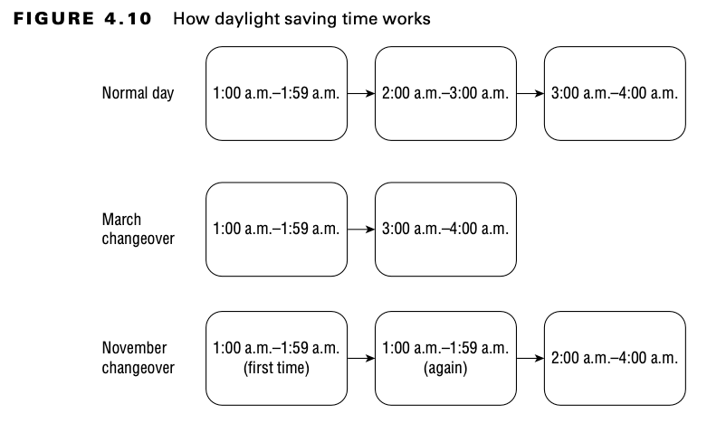

Örneğin, 13 Mart 2022'de saatlerimizi bir saat ileri alıyoruz ve saat 2:00'den 3:00'a atlıyoruz. Bu, o gün 2:30 olmadığı
anlamına gelir. 1:30'dan bir saat sonraki zamanı bilmek istersek, bu 3:30 olur.

```
var date = LocalDate.of(2022,Month.MARCH,13);
var time = LocalTime.of(1,30);
var zone = ZoneId.of("US/Eastern");

var zonedDateTime = ZonedDateTime.of(date,time,zone);

System.out.println(zonedDateTime);              // 2022-03-13T01:30-05:00[US/Eastern]
System.out.println(zonedDateTime.getHour());    // 1
System.out.println(zonedDateTime.getOffset());  // -05:00

zonedDateTime = zonedDateTime.plusHours(1);
System.out.println(zonedDateTime);              // 2022-03-13T03:30-04:00[US/Eastern]
System.out.println(zonedDateTime.getHour());    // 3
System.out.println(zonedDateTime.getOffset());  // -04:00
```

Bu örnekte iki şeyin değiştiğini unutmayın. Zaman 1:30'dan 3:30'a atlar. UTC offseti de değişir. GMT zamanını, saat
dilimini saatten çıkararak hesapladığımızı hatırlıyor musunuz?

* 6:30 GMT'den (1:30 eksi –5:00)

* 7:30 GMT'ye (3:30 - -4:00) geçtiğimizi görebilirsiniz.

Bu, time'in gerçekten GMT bakış açısına göre bir saat değiştiğini gösterir. Vurgu için hour ve offset alanlarını ayrı
ayrı yazdırdık.

Benzer şekilde, Kasım ayında, ilk 1:30 sabahından bir saat sonra da 1:30 sabahıdır çünkü saat 2:00'de saati tekrarlarız.
Bu sefer, gerçekten her seferinde sadece bir saat hareket ettiğimizi doğrulamak için tüm üç saatin GMT zamanını kendiniz
hesaplamaya çalışın.

```
var date = LocalDate.of(2022, Month.NOVEMBER, 6);
var time = LocalTime.of(1, 30);
var zone = ZoneId.of("US/Eastern");

var zonedDateTime = ZonedDateTime.of(date, time, zone);
System.out.println(zonedDateTime);              // 2022-11-06T01:30-04:00[US/Eastern]

zonedDateTime = zonedDateTime.plusHours(1);     // 2022-11-06T01:30-05:00[US/Eastern]
System.out.println(zonedDateTime);

zonedDateTime = zonedDateTime.plusHours(1);     // 2022-11-06T02:30-05:00[US/Eastern]
System.out.println(zonedDateTime);
```

Anladınız mı? 5:30 GMT'den 6:30 GMT'ye ve son olarak 7:30 GMT'ye geçtik.

Son olarak, mevcut olmayan bir time oluşturmaya çalışmak sadece ileri sarar:

```
var date = LocalDate.of(2022, Month.MARCH, 13);
var time = LocalTime.of(2,30);
var zone = ZoneId.of("US/Eastern");

var zonedDateTime = ZonedDateTime.of(date,time,zone);
System.out.println(zonedDateTime);  // 2022-03-13T03:30-04:00[US/Eastern]
```

Java, o gece 2:30 olmadığını biliyor ve uygun GMT offsetine geçiyor.

Evet, Oracle'ın bunu ABD'de olmasanız bile - veya daha doğrusu, yaz saati uygulamasını takip etmeyen bir ABD bölgesinde
olmasanız bile - bilmenizi beklemesi can sıkıcı. Sınav oluşturucuları ABD'de ve herkesin ABD saat dilimlerinin nasıl
çalıştığını bilmesi gerektiğine karar verdiler.

# Summary

Bu bölümde, bir String'in immutable bir sequence of characters (karakter dizisi) olduğunu öğrendiniz. Constructor'ı
açıkça çağırmak optional'dir. Concatenation (Birleştirme) operatörü (+), ilk String'in içeriği ve ikinci String'in
içeriğiyle birlikte yeni bir String oluşturur. + ifadesinde yer alan operandlardan biri String ise Concatenation
kullanılır; aksi takdirde toplama kullanılır. String literalleri String pool'da depolanır. String sınıfının birçok
methodu vardır.

Buna karşılık, StringBuilder mutable bir karakter dizisidir. Methodlarının çoğu, method chaining'e izin vermek için
geçerli object'e bir referans döndürür. StringBuilder sınıfının birçok methodu vardır.

String object'leri üzerinde == çağrısı, pool'da ki aynı nesneyi işaret edip etmediklerini kontrol eder. StringBuilder
referansları üzerinde == çağrısı, aynı StringBuilder nesnesini işaret edip etmediklerini kontrol eder. String
object'leri üzerinde equals() çağrısı, sequence of character'in aynı olup olmadığını kontrol eder. StringBuilder
object'leri üzerinde equals() çağrısı, içerideki değerlere bakmak yerine aynı object'i işaret edip etmediklerini kontrol
eder.

Array'ler, heap'de sabit boyutlu bir alan olup, primitive değerler veya object'lere işaret eden pointer'lar için yer
sağlar. Array'i oluştururken boyutunu belirtirsiniz. Örneğin, 'int[] a = new int[6];' Index'ler 0'dan başlar ve
elemanlara 'a[0]' kullanılarak erişilir. Arrays.sort() methodu bir array'i sıralar. Arrays.binarySearch() sıralanmış bir
array'de arama yapar ve eşleşmenin index'ini döndürür. Eşleşme bulunmazsa, öğenin eklenmesi gereken konumu negate
(olumsuzlar) ve 1 çıkarılır. Arrays.compare() ve Arrays.mismatch() iki array'in eşdeğer olup olmadığını kontrol
eder. (...) varargs ile geçirilen methodlar, normal bir array geçirilmiş gibi kullanılabilir. Multidimensional bir
array'de, ikinci ve sonraki seviye array'leri farklı boyutlarda olabilir.

Math sınıfı, matematiksel işlemler gerçekleştirmek için bir dizi statik method sağlar. Örneğin, minimum veya maksimum
değerler elde edebilirsiniz. Round (Yuvarlama) veya hatta Random sayı üretebilirsiniz. Bazı methodlar herhangi bir
numeric primitive türde çalışır, diğerleri yalnızca double üzerinde çalışır.

LocalDate yalnızca date'i, LocalTime yalnızca time'i ve LocalDateTime hem date hem de time içerir. Üçünün de
constructor'ları private'dir ve LocalDate.now() veya LocalDate.of() (veya o sınıf için eşdeğerleri) kullanılarak
oluşturulurlar. Tarih ve saatler plusXXX veya minusXXX methodları kullanılarak manipüle edilebilir. Period sınıfı, bir
LocalDate veya LocalDateTime'e eklenmesi veya çıkarılması gereken gün, ay veya yıl sayısını temsil eder. Tarih ve saat
sınıflarının tümü immutable'dir, yani dönüş değeri kullanılmalıdır.
